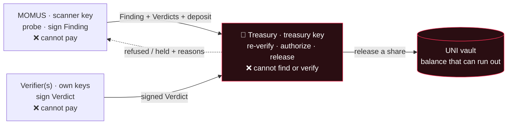

# Treasury

<!-- aicom-readme-badges -->
<p align="center">
  <a href="https://github.com/alexar76/treasury/actions/workflows/ci.yml"></a>
  <a href="https://github.com/alexar76/momus"></a>
  
  =3.11" />
  
  <a href="https://github.com/alexar76/treasury/blob/main/LICENSE"></a>
</p>
<!-- /aicom-readme-badges -->

<p align="center">
  <strong>La única clave que puede pagar una recompensa de equipo rojo — y no es la clave que encuentra el fallo.</strong>
</p>

<p align="center">
  <strong><a href="https://github.com/alexar76/momus">MOMUS (el escáner)</a></strong>
  ·
  <strong><a href="https://github.com/alexar76/momus/blob/main/docs/uni-chain.md">Cada transacción de la bóveda, explicada</a></strong>
  ·
  <strong><a href="https://github.com/alexar76/momus/blob/main/docs/first-cycle.md">El primer ciclo en vivo</a></strong>
  ·
  <strong><a href="https://momus.modelmarket.dev/treasury/health">Superficie de salud en vivo</a></strong>
</p>

> 🌐 [English](README.md) · [Русский](README.ru.md) · **Español** · [Français](README.fr.md) · [中文](README.zh.md)

## Qué es

[MOMUS](https://github.com/alexar76/momus) es el equipo rojo del ecosistema: sondea nuestros propios
servicios, encuentra incumplimientos de contrato y **firma la evidencia con Ed25519**. No puede
pagarse a sí mismo. Este servicio es la otra mitad de esa frase — **la Treasury tiene la única clave
que puede liberar una recompensa**, y vive en un proceso distinto, en un contenedor distinto, sobre un
volumen de claves distinto.

La separación no es una preferencia estilística. Un escáner que tuviera la bolsa podría pagarse a sí
mismo por sus propios hallazgos, así que «¿hemos encontrado un fallo?» y «¿cobra alguien?» deben
decidirlas actores distintos con claves distintas. `KeyRing` se niega directamente a arrancar si la
clave del escáner es igual a la clave de la tesorería — ni siquiera una demo en una sola máquina puede
fundir los dos roles por una mala configuración.

La Treasury tampoco se cree nada solo porque lo diga MOMUS. Recibe un hallazgo junto con sus
veredictos por HTTP y **vuelve a derivar la decisión desde cero**: reverifica cada firma, revisa de
nuevo el quórum de independencia, revisa de nuevo el requisito de verificador externo, recalcula la
identidad de deduplicación, revisa de nuevo el libro de registro — y solo entonces firma una decisión
de pago con su propia clave. En ninguna parte de la puerta existe una entrada del tipo «MOMUS dice que
está confirmado».



## Qué rechaza, y por qué

Cada rechazo de abajo existe porque el comportamiento contrario era una vía real para cobrar sin haber
hecho nada.

| Rechaza | Porque |
|---|---|
| **Un hallazgo cuya firma del escáner no se verifica** | La firma es la reclamación entera. Un documento manipulado —por ejemplo, `severity` cambiado de `high` a `critical` después de firmar— se rechaza sin más, no se repara. Cubierto por `test_authorize_refuses_tampered_finding`. |
| **Una identidad de deduplicación declarada por el propio reclamante** | `dedup_key` lo firma *el reclamante*, así que un escáner que quiera cobrar dos veces por un mismo fallo solo tiene que variar el campo y la guarda de reenvío nunca coincide. La Treasury **recalcula** la identidad a partir del contenido del hallazgo y rechaza cualquier discrepancia con la declarada. |
| **Un pago duplicado por un fallo ya pagado** | Un fallo paga una vez, y solo una. Únicamente una decisión `paid` consume la identidad de deduplicación — una `held` tiene que seguir siendo reintentable, porque de lo contrario una falta temporal de fondos quemaría para siempre una recompensa legítima (una prueba detectó exactamente eso en cuanto la bóveda pudo agotarse de verdad). |
| **Un hallazgo HIGH/CRITICAL con menos de dos verificadores distintos** | Una clave que confirma a su propio buscador no es verificación. Las acciones fuertes exigen ≥2 claves de verificador **distintas** que confirmen, y ninguna de ellas puede ser la clave del escáner ni la clave de la tesorería. |
| **…y, para esos, un quórum sin ningún verificador externo** | `did:key` distintos demuestran *claves* distintas, no *partes* distintas — un mismo operador puede tenerlas todas. Así que al menos una confirmación debe venir de un verificador externo registrado de antemano (`MOMUS_EXTERNAL_VERIFIERS`). En producción, un conjunto externo vacío es **fail-closed** (denegar por defecto); fuera de producción se permite, pero la decisión registra una advertencia de que el pago se apoya únicamente en la custodia de claves del operador. |
| **Una clave de verificador malformada o de orden pequeño** | Un punto de orden pequeño de Ed25519 se codifica como una cadena de clave pública *distinta* de la del escáner, así que una comparación ingenua de cadenas la contaría para el quórum de independencia. Nadie posee su mitad privada. Se rechaza antes de que pueda contar cualquier veredicto que haya firmado. |
| **Un veredicto que no está ligado al resumen criptográfico (digest) de este hallazgo** | De lo contrario, un veredicto de un hallazgo podría trasplantarse a otro. |
| **Una reclamación sin garantía anti-griefing** | Presentar una reclamación cuesta una garantía, proporcional a la recompensa. Una reclamación que los verificadores independientes **refutan** pierde la garantía *entera* — no un porcentaje, porque desangrarla de unos pocos puntos cada vez deja el spam casi gratis. Una reclamación honestamente inconclusa se reembolsa, así que un informe honesto pero no reproducible sigue siendo barato. |
| **Un hallazgo contra la propia infraestructura de seguridad del ecosistema** | Un fallo en el escáner, la tesorería, el verificador, la puerta o el depósito en garantía (escrow) es justo la palanca para desactivar los controles de pago. Esos nunca se pagan de forma automática; se enrutan a revisión humana. La comprobación es del lado del servidor y se hace contra el objetivo, sin confiar nunca en la etiqueta que trae la propia reclamación. |
| **Una petición de escritura sin token de cliente** | Véase más abajo — esta fue una vulnerabilidad real, en vivo. |
| **Un pago que la bóveda no puede cubrir** | Una tesorería sin fondos no inventa dinero. Todas las puertas superadas más un saldo vacío da `held`, no `paid`. |

### El defecto que hizo obligatorio el token

Las rutas de pago no tenían originalmente **ninguna autenticación**. Un agente de auditoría no
teorizó sobre ello — *reprodujo* el ataque, acuñando una decisión `paid` firmada por la tesorería
desde un proceso sin privilegios en la red Docker compartida. Las comprobaciones de firma demuestran
que los documentos son internamente consistentes; no dicen nada sobre si **quien llama** tiene derecho
a pedirlo.

Así que `/authorize`, `/deposit`, `/explain` y las rutas de escritura de la bóveda exigen ahora un
token de cliente (`x-treasury-client`), están limitadas por tasa para cada llamante y —cuando hay una
allowlist (lista blanca) configurada— el `scanner_pubkey` del hallazgo debe pertenecer a un reclamante
registrado, de modo que la clave de un desconocido no puede reclamar una recompensa ni siquiera con un
token válido. En producción, la ausencia de `TREASURY_CLIENT_TOKEN` devuelve `503` en lugar de quedar
abierto por defecto. `GET /health` informa de `write_gated`, así que la postura se puede comprobar
desde fuera. Las rutas de solo lectura `/health`, `/ledger`, `/vault` y `/vault/journal` siguen
abiertas a propósito: son la superficie de auditoría.

## La bóveda UNI

La bóveda vive aquí, con el dinero, porque un escáner que tuviera la bolsa echaría por tierra la
separación de funciones sobre la que se apoya todo el diseño.

Sin saldo, una tesorería simulada «paga» para siempre: toda recompensa sale bien, nada se agota y la
simulación no te enseña nada sobre si la economía funciona. Así que la bóveda es contabilidad real —
se financia, se reserva contra ella, se va consumiendo y **puede agotarse de verdad**. El estado
siempre se puede derivar del historial: el diario es de solo adición y se reproduce al arrancar.

- **balance** (saldo) — todo lo que la bóveda tiene.
- **reserved** (reservado) — la parte ya prometida a recompensas en curso.
- **available** (disponible) = balance − reserved — de lo que puede tirar una recompensa nueva.

Hay exactamente seis tipos de transacción, y el servicio informa de lo que significa cada uno en
`GET /vault` → `transaction_meanings`, así que una línea del diario nunca hay que interpretarla:

| tipo | qué significa |
|---|---|
| `fund` | un operador añadió presupuesto simulado — la única forma en que el dinero entra en la bóveda |
| `reserve` | una recompensa pasó la puerta de pago; su fondo queda apartado y ya no está disponible |
| `release` | la parte de un colaborador salió de la bóveda (buscador / reparador / director) |
| `unreserve` | se canceló una reserva sin pagar; los fondos vuelven a estar disponibles |
| `forfeit` | se decomisó la garantía de un reclamante refutado — el spam financia al lado honesto |
| `refund` | se devolvió la garantía de un reclamante porque su reclamación no fue refutada |

La reserva es lo que impide que dos reclamaciones simultáneas gasten el mismo dólar, y una liberación
mayor que lo reservado para ese hallazgo se rechaza en lugar de permitir un descubierto. Una parte que
la bóveda no puede cubrir vuelve como `UNI vault refused the release — insufficient available funds…`,
y la decisión es `held`.

Un fallo que merece nombrarse: la decisión base liquidaba el fondo **entero** como la parte del
buscador, y luego el reparto por roles volvía a liquidar el 50 % del buscador — dos registros de
liquidación y, en cuanto existió una bóveda real, un doble cargo genuino. Ahora el reparto decide sin
liquidar y liquida cada parte él mismo.

Narración completa de una ejecución real de principio a fin, transacción a transacción:
[**uni-chain.md**](https://github.com/alexar76/momus/blob/main/docs/uni-chain.md).

## El presupuesto de seguridad — una regla, no una aprobación

Una bóveda que puede agotarse es honesta, pero entonces alguien tiene que recargarla, y *quién decide*
es una cuestión de gobernanza con una respuesta de seguridad.

Lo financia el hub — ahí es donde aterrizan los ingresos del ecosistema, y la seguridad es un coste de
operar un marketplace en el que la gente confía, igual que la prevención del fraude se financia con
las comisiones de transacción. La parte crítica es que la recarga es una **regla permanente, nunca una
aprobación discrecional**: quien aprueba podría dejar sin recursos al auditor justo cuando el auditor
encuentra algo incómodo, que es exactamente la misma captura que la separación de claves existe para
evitar.

- **pull, no push** — la Treasury solicita una recarga cuando los fondos disponibles caen por debajo
  de un umbral;
- **una tasa permanente** — se atiende automáticamente hasta `rate_bps` del volumen de invocaciones
  (invokes) liquidadas del periodo, con el tope de `period_cap_usd`; dentro de la asignación no hace
  falta ninguna aprobación;
- **escalada por encima de ella** — una solicitud que supera la asignación se rechaza *con su
  aritmética* y se enruta a la gobernanza humana. Al auditor nunca se le retira la financiación en
  silencio; al financiador nunca se le vacía en silencio;
- **fail-closed** (denegar por defecto) — sin asignador, o con volumen liquidado cero, la bóveda
  simplemente se agota y las recompensas quedan como intenciones `held`. Un presupuesto agotado se
  informa, nunca se oculta;
- **procedencia honesta** — cada asignación registra si el volumen fue *medido desde el hub* o
  *declarado por el operador*, así que una recarga concedida nunca puede parecer anclada a actividad
  económica real cuando no lo estaba.

Las dos ramas (`granted` y `escalated`) se han ejecutado en vivo; véase `POST /vault/top-up` y el
[documento uni-chain](https://github.com/alexar76/momus/blob/main/docs/uni-chain.md).

## Escalera de liquidación

`UNI` (por defecto) → `HELD` → `BASE` / `SOLANA`. La escalera solo cae **hacia atrás**, nunca hacia
delante en dirección al pago.

| nivel | qué ocurre |
|---|---|
| **`UNI`** | Liquidación simulada dentro del universo. El bucle completo se ejecuta, cada parte se registra y se marca `simulated: true`, se carga realmente a la bóveda — y **no se mueve ningún valor a ninguna parte**. |
| **`HELD`** | La cripto está activada pero la liquidación on-chain de recompensas nunca se habilitó explícitamente, o su configuración está incompleta. Las decisiones se registran solo como intenciones. |
| **`BASE` / `SOLANA`** | Liquidación real, y exige una **segunda activación explícita, aparte, por encima del interruptor maestro de la cripto**: `AIFACTORY_CRYPTO_ENABLED=1` **y** `MOMUS_BOUNTY_ONCHAIN=1` **y** `MOMUS_BOUNTY_CHAIN` **y** una dirección `MOMUS_BOUNTY_SPLITTER` desplegada. Cualquier cosa que falte o esté malformada acaba en `HELD`. |

> ### ⚠️ Aviso
>
> **Por defecto no se paga nada.** Las cifras UNI son contabilidad **simulada** — un importe en el
> diario no es una transferencia, y no se mueve ningún valor.
>
> **Activar la cripto no hace que empiecen a pagarse recompensas.** Por eso el interruptor de
> recompensas on-chain está aparte: habilitar la cripto del ecosistema (canales, depósito en garantía
> (escrow), liquidación del hub) no debe empezar también, en silencio, a liberar dinero del equipo
> rojo. Riesgos separados llevan interruptores separados.
>
> **Nunca se difunde nada automáticamente.** Incluso completamente habilitado, el nivel `BASE` solo
> *prepara* una llamada `releaseShare(...)` sin firmar para que el operador de la Treasury la firme y
> la envíe; MOMUS nunca difunde su propio pago. Un agente capaz de difundir sus propios pagos echaría
> por tierra la separación de funciones sobre la que se apoya todo el diseño.
>
> **Un contrato desplegado no es un pago habilitado.** `BountySplitter` está desplegado en la mainnet
> de Base, y el nivel por defecto sigue siendo UNI.
>
> Nada de esto es un producto financiero, una inversión ni una promesa de pago. La tabla de
> recompensas es un parámetro de demo configurable, no una oferta.

## Superficie de API

| ruta | autenticación | qué hace |
|---|---|---|
| `GET /health` | abierta | vitalidad, la clave **pública** de la tesorería (nunca la privada), `write_gated`, número de reclamantes registrados, conjunto de verificadores externos, postura de cripto/producción |
| `GET /ledger?limit=` | abierta | la cola de solo adición de decisiones/reclamaciones — la superficie de auditoría |
| `GET /vault` | abierta | balance / reserved / available, la regla de asignación permanente, el modo de liquidación y qué significa cada tipo de transacción |
| `GET /vault/journal?limit=` | abierta | el diario de transacciones, donde cada entrada lleva su propio significado en lenguaje claro |
| `POST /authorize` | token | reverificar todo y devolver un `Decision` **firmado por la tesorería** (`paid` / `held` / `refused`, con motivos) |
| `POST /deposit` | token | resolver sobre la garantía de una reclamación — `refund` (devolver) frente a `forfeit` (decomisar) |
| `POST /vault/fund` | token | el operador añade presupuesto simulado |
| `POST /vault/reserve` | token | apartar el fondo de una recompensa antes de que se liberen sus partes |
| `POST /vault/top-up` | token | solicitar una recarga bajo la regla permanente (concede dentro de la asignación, escala por encima de ella) |
| `POST /explain` | token | primero autoriza, luego narra la decisión ya tomada — solo consultivo |

### El explicador consultivo nunca está en la ruta del dinero

El dinero nunca debe depender de la salida de un modelo, así que la autorización es completamente
determinista y no contiene ningún LLM. El explicador (DeepSeek V4 Pro por defecto) tiene exactamente
un trabajo: **después** de que la decisión ya esté tomada, escribir la nota de auditoría. Recibe la
decisión terminada —estado, importe, severidad, número de verificadores, motivos— y nunca el hallazgo
en bruto, así que no hay ningún sumidero de contenido no confiable por el que inyectar. No puede
cambiar el resultado, su salida se etiqueta con `advisory: true` y, si el modelo no está configurado o
falla, se usa en su lugar una frase determinista. Un pago nunca se queda bloqueado esperando a un
modelo.

## Cómo ejecutarlo

Docker es la forma prevista, porque la separación es una propiedad de *dónde vive la clave*. Construye
desde la **raíz del monorepo** (la imagen necesita `oracles/core` y `momus` en el contexto):

```bash
docker compose -f treasury/docker-compose.yml up -d --build   # → 127.0.0.1:9401
```

O toda la pila — MOMUS + Treasury + panel, con volúmenes de claves separados:

```bash
docker compose -f momus/docker-compose.yml up -d --build
```

Sin Docker:

```bash
cd treasury && pip install -e ../oracles/core -e ../momus -e ".[dev]" && python -m treasury.service
```

**Puertos:** `9401` en local · `9411` en producción (en el host de oráculos, `:9400` pertenece a la
familia de oráculos, así que MOMUS se desplaza a `:9410` y la Treasury a `:9411`). Allí la Treasury
escucha solo en loopback y se sitúa detrás del borde
`momus.modelmarket.dev`, que sirve la superficie de solo lectura —
[`/treasury/health`](https://momus.modelmarket.dev/treasury/health)— y **no** expone
públicamente `/treasury/authorize`, `/deposit` ni `/vault/fund`. Eso lo afirma el script de
verificación de producción, no está solo configurado.

### Las variables de entorno que importan

| variable | significado | por defecto |
|---|---|---|
| `TREASURY_KEY_PATH` | la clave de firma de la tesorería — la única clave que puede liberar una recompensa | `data/treasury_signing_key` |
| `TREASURY_CLIENT_TOKEN` | token del llamante para toda ruta de escritura; **sin definir en producción ⇒ `503`, fail-closed** | sin definir |
| `TREASURY_SCANNER_PUBKEYS` | allowlist (lista blanca) de claves de escáner de reclamantes, separadas por comas | sin definir = cualquiera |
| `MOMUS_EXTERNAL_VERIFIERS` | claves públicas de verificadores operados de forma independiente; obligatorias para high/critical en producción | sin definir |
| `TREASURY_LEDGER_PATH` | libro de registro de solo adición de decisiones/reclamaciones | `data/bounty_ledger.jsonl` |
| `TREASURY_VAULT_PATH` | el diario de solo adición de la bóveda | `<data>/uni_vault.jsonl` |
| `TREASURY_PORT` | puerto de escucha | `9401` |
| `TREASURY_WRITE_RATE_LIMIT` | límite de tasa por llamante en las rutas de escritura | `30` |
| `TREASURY_CORS_ORIGINS` | orígenes permitidos | `*` |
| `AIFACTORY_PROD` | arma las ramas fail-closed | sin definir |
| `AIFACTORY_CRYPTO_ENABLED` | interruptor maestro de la cripto para todo el ecosistema — **no** basta para pagar on-chain | `0` |
| `MOMUS_BOUNTY_ONCHAIN` · `MOMUS_BOUNTY_CHAIN` · `MOMUS_BOUNTY_SPLITTER` | la activación on-chain aparte, su cadena y la dirección del splitter desplegado | sin definir |
| `MOMUS_BUDGET_RATE_BPS` · `MOMUS_BUDGET_PERIOD_CAP_USD` · `MOMUS_BUDGET_THRESHOLD_USD` · `MOMUS_BUDGET_TARGET_USD` | la regla de asignación permanente | véase [uni-chain.md](https://github.com/alexar76/momus/blob/main/docs/uni-chain.md#configuration) |
| `MOMUS_BUDGET_HUB_URL` · `MOMUS_BUDGET_DECLARED_VOLUME_USD` | volumen del hub medido, o la cifra declarada por el operador que se usa en la simulación | sin definir · `0` |
| `TREASURY_LLM_PROVIDER` | solo el explicador consultivo, nunca la ruta de pago | `deepseek` |

Ten en cuenta que `TREASURY_SCANNER_KEY_PATH` es una ranura de *referencia*, no custodia: la
comprobación de independencia solo necesita la clave **pública** del escáner, que viaja dentro de cada
hallazgo. La Treasury nunca tiene una clave privada de escáner, y la guarda `KeyRing` rechaza
`scanner == treasury` en cualquier caso.

## Pruebas

```bash
cd treasury && pytest -q      # 5 tests
```

La suite ejercita las propiedades, no la fontanería: `/health` expone la clave pública de la tesorería
y nada secreto; una reclamación HIGH válida queda **held** en una bóveda sin fondos y solo paga
después de que su fondo se financie y se reserve (con el dinero saliendo realmente de la bóveda); un
hallazgo manipulado se rechaza; una reclamación refutada pierde su garantía; y toda decisión acaba en
el libro de registro. `aimarket-momus` y `aimarket-oracle-core` deben ser importables; el espejo
autónomo incluye ambos.

## Licencia

MIT · parte del ecosistema [AICOM / AIMarket](https://magic-ai-factory.com/).
