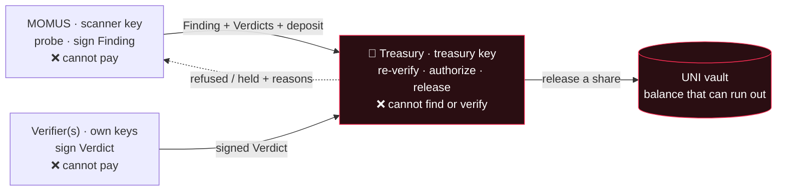

# Treasury

<!-- aicom-readme-badges -->
<p align="center">
  <a href="https://github.com/alexar76/treasury/actions/workflows/ci.yml"></a>
  <a href="https://github.com/alexar76/momus"></a>
  
  =3.11" />
  
  <a href="https://github.com/alexar76/treasury/blob/main/LICENSE"></a>
</p>
<!-- /aicom-readme-badges -->

<p align="center">
  <strong>La seule clé qui peut payer une prime d'équipe rouge — et ce n'est pas la clé qui trouve le bug.</strong>
</p>

<p align="center">
  <strong><a href="https://github.com/alexar76/momus">MOMUS (le scanner)</a></strong>
  ·
  <strong><a href="https://github.com/alexar76/momus/blob/main/docs/uni-chain.md">Chaque transaction du coffre expliquée</a></strong>
  ·
  <strong><a href="https://github.com/alexar76/momus/blob/main/docs/first-cycle.md">Le premier cycle en direct</a></strong>
  ·
  <strong><a href="https://momus.modelmarket.dev/treasury/health">Surface de santé en direct</a></strong>
</p>

> 🌐 [English](README.md) · [Русский](README.ru.md) · [Español](README.es.md) · **Français** · [中文](README.zh.md)

## Ce que c'est

[MOMUS](https://github.com/alexar76/momus) est l'équipe rouge de l'écosystème : il sonde nos propres
services, trouve des violations de contrat et **signe la preuve avec Ed25519**. Il ne peut pas se
payer lui-même. Ce service est l'autre moitié de cette phrase — **la Treasury détient la seule clé
qui puisse libérer une prime**, et elle vit dans un autre processus, dans un autre conteneur, sur un
autre volume de clés.

Cette séparation n'est pas une préférence stylistique. Un scanner qui tiendrait la bourse pourrait se
payer pour ses propres constats ; « avons-nous trouvé un bug » et « quelqu'un touche-t-il de
l'argent » doivent donc être décidés par des principaux différents, avec des clés différentes.
`KeyRing` refuse tout bonnement de démarrer si la clé du scanner est égale à la clé de trésorerie —
même une démonstration sur une seule machine ne peut pas fusionner les deux rôles par erreur de
configuration.

La Treasury ne croit pas non plus MOMUS sur parole. Elle reçoit un constat et ses verdicts par HTTP
et **redérive la décision de zéro** : elle revérifie chaque signature, revérifie le quorum
d'indépendance, revérifie l'exigence de vérificateur externe, recalcule l'identité de déduplication,
revérifie le registre — et ce n'est qu'ensuite qu'elle signe une décision de versement avec sa propre
clé. Nulle part dans la porte de versement il n'existe une entrée « MOMUS dit que c'est confirmé ».



## Ce qu'elle refuse, et pourquoi

Chaque refus ci-dessous existe parce que le comportement inverse était un vrai moyen d'être payé pour
rien.

| Elle refuse | Parce que |
|---|---|
| **Un constat dont la signature du scanner ne se vérifie pas** | La signature est toute la revendication. Un document falsifié — p. ex. `severity` passé de `high` à `critical` après la signature — est refusé d'emblée, et non réparé. Couvert par `test_authorize_refuses_tampered_finding`. |
| **L'identité de déduplication autodéclarée par un réclamant** | `dedup_key` est signé *par le réclamant* : un scanner qui veut être payé deux fois pour un seul bug n'a qu'à faire varier le champ, et la protection anti-rejeu ne correspond jamais. La Treasury **recalcule** l'identité à partir du contenu du constat et refuse toute divergence avec la valeur déclarée. |
| **Un versement en double pour un bug déjà payé** | Un bug paie une seule fois, à jamais. Seule une décision `paid` consomme l'identité de déduplication — une décision `held` doit rester réessayable, car sinon un manque de financement temporaire brûlerait définitivement une prime légitime (un test a attrapé exactement cela dès que le coffre a pu réellement se vider). |
| **Un constat HIGH/CRITICAL avec moins de deux vérificateurs distincts** | Une clé qui confirme son propre chercheur, ce n'est pas de la vérification. Les actions fortes exigent ≥2 clés de vérificateur confirmantes **distinctes**, dont aucune ne peut être la clé du scanner ni la clé de trésorerie. |
| **…et, pour ceux-là, un quorum sans vérificateur externe** | Des `did:key` distinctes prouvent des *clés* distinctes, pas des *parties* distinctes — un seul opérateur peut les détenir toutes. Au moins une confirmation doit donc venir d'un vérificateur externe préenregistré (`MOMUS_EXTERNAL_VERIFIERS`). En production, un ensemble externe vide échoue en **fail-closed** (refus par défaut) ; hors production c'est autorisé, mais la décision consigne un avertissement précisant que le versement ne repose que sur la garde des clés par l'opérateur. |
| **Une clé de vérificateur malformée ou d'ordre faible** | Un point Ed25519 d'ordre faible s'encode en une chaîne de clé publique *différente* de celle du scanner : une naïve inégalité de chaînes la compterait donc dans le quorum d'indépendance. Personne ne détient sa moitié privée. Elle est rejetée avant que tout verdict qu'elle a signé puisse compter. |
| **Un verdict qui ne se lie pas à l'empreinte (digest) de ce constat** | Sinon, un verdict portant sur un constat pourrait être transplanté sur un autre. |
| **Une réclamation sans caution anti-griefing** | Déposer une réclamation coûte une garantie, proportionnelle à la prime. Une réclamation que des vérificateurs indépendants **réfutent** perd la caution *entière* — pas un pourcentage, car la saigner de quelques pour cent à la fois rend le spam quasi gratuit. Une réclamation honnêtement non concluante est remboursée, de sorte qu'un rapport honnête mais irreproductible reste peu coûteux. |
| **Un constat visant l'infrastructure de sécurité propre de l'écosystème** | Un bug dans le scanner, la trésorerie, le vérificateur, la porte ou le séquestre (escrow) est le levier exact pour désactiver les contrôles de versement. Ceux-là ne paient jamais automatiquement ; ils sont acheminés vers une revue humaine. Le contrôle se fait côté serveur sur la cible, sans jamais faire confiance à l'étiquette que la réclamation se donne elle-même. |
| **Une requête d'écriture sans jeton client** | Voir plus bas — celle-ci était une vulnérabilité réelle. |
| **Un versement que le coffre ne peut pas couvrir** | Une trésorerie non financée n'invente pas d'argent. Toutes les portes franchies plus un solde vide donnent `held`, pas `paid`. |

### Le défaut qui a rendu le jeton obligatoire

Les routes de versement n'avaient à l'origine **aucune authentification du tout**. Un agent d'audit
n'a pas théorisé là-dessus — il a *reproduit* l'attaque, en frappant une décision `paid` signée par
la trésorerie depuis un processus non privilégié sur le réseau Docker partagé. Les contrôles de
signature prouvent que les documents sont cohérents entre eux ; ils ne disent rien sur le fait que
l'**appelant** ait le droit de demander.

Ainsi, `/authorize`, `/deposit`, `/explain` et les routes d'écriture du coffre exigent désormais un
jeton client (`x-treasury-client`), sont limitées en débit par appelant et — lorsqu'une allowlist
(liste blanche) est configurée — le `scanner_pubkey` du constat doit appartenir à un réclamant
enregistré, de sorte que la clé d'un inconnu ne puisse pas réclamer une prime même en détenant un
jeton valide. En production, un `TREASURY_CLIENT_TOKEN` absent renvoie `503` au lieu de basculer par
défaut en mode ouvert. `GET /health` expose `write_gated`, si bien que la posture est vérifiable
depuis l'extérieur. Les routes en lecture seule `/health`, `/ledger`, `/vault` et `/vault/journal`
restent ouvertes à dessein : elles constituent la surface d'audit.

## Le coffre UNI

Le coffre vit ici, avec l'argent, parce qu'un scanner qui tiendrait la bourse anéantirait la
séparation sur laquelle repose tout le design.

Sans solde, une trésorerie simulée « paie » indéfiniment : chaque prime aboutit, rien ne s'épuise, et
la simulation ne vous apprend rien sur la viabilité de l'économie. Le coffre est donc une véritable
comptabilité — il est financé, on y réserve des fonds, on les prélève, et il **peut réellement se
vider**. L'état est toujours dérivable de l'historique : le journal est en ajout seul (append-only)
et rejoué au démarrage.

- **balance** — tout ce que le coffre détient.
- **reserved** — la part déjà promise à des primes en cours.
- **available** = balance − reserved — ce sur quoi une nouvelle prime peut tirer.

Il existe exactement six sortes de transactions, et le service indique ce que chacune signifie à
`GET /vault` → `transaction_meanings`, si bien qu'une ligne du journal n'a jamais besoin d'être
interprétée :

| sorte | ce que cela signifie |
|---|---|
| `fund` | un opérateur a ajouté du budget simulé — la seule façon dont l'argent entre dans le coffre |
| `reserve` | une prime a franchi la porte de versement ; sa cagnotte est mise de côté et n'est plus disponible |
| `release` | la part d'un contributeur a quitté le coffre (chercheur / réparateur / chef d'orchestre) |
| `unreserve` | une réservation a été annulée sans paiement ; les fonds sont de nouveau disponibles |
| `forfeit` | la caution d'un réclamant réfuté a été confisquée — le spam finance le camp honnête |
| `refund` | la caution d'un réclamant a été rendue parce que sa réclamation n'a pas été réfutée |

La réservation est ce qui empêche deux réclamations concurrentes de dépenser le même dollar, et une
libération supérieure à ce qui est réservé pour ce constat est refusée plutôt qu'autorisée à créer un
découvert. Une part que le coffre ne peut pas couvrir revient sous la forme `UNI vault refused the
release — insufficient available funds…`, et la décision est `held`.

Un bug mérite d'être nommé : la décision de base réglait auparavant la cagnotte **entière** comme
part du chercheur, puis la répartition par rôle réglait de nouveau les 50 % du chercheur — deux
enregistrements de règlement et, dès qu'un vrai coffre a existé, un véritable double débit. La
répartition décide désormais sans régler, et règle elle-même chaque part.

Narration complète d'une exécution réelle de bout en bout, transaction par transaction :
[**uni-chain.md**](https://github.com/alexar76/momus/blob/main/docs/uni-chain.md).

## Le budget de sécurité — une règle, pas une approbation

Un coffre qui peut se vider est honnête, mais il faut alors que quelqu'un le remplisse, et *qui
décide* est une question de gouvernance dont la réponse relève de la sécurité.

C'est le hub qui le finance — c'est là qu'atterrissent les revenus de l'écosystème, et la sécurité
est un coût d'exploitation d'une place de marché à laquelle les gens font confiance, de la même
façon que la prévention de la fraude est financée par les frais de transaction. Le point critique est
que le réapprovisionnement est une **règle permanente, jamais une approbation discrétionnaire** : un
approbateur pourrait affamer l'auditeur précisément au moment où celui-ci trouve quelque chose de
gênant, ce qui est la capture même que la séparation des clés existe pour empêcher.

- **tirer, pas pousser** (pull, not push) — la Treasury demande un réapprovisionnement lorsque les
  fonds disponibles tombent sous un seuil ;
- **un taux permanent** — honoré automatiquement jusqu'à `rate_bps` du volume d'invocations réglé sur
  la période, plafonné par `period_cap_usd` ; aucune approbation nécessaire à l'intérieur de
  l'allocation ;
- **escalade au-dessus** — une demande dépassant l'allocation est refusée *avec son arithmétique* et
  acheminée vers la gouvernance humaine. L'auditeur n'est jamais silencieusement définancé ; le
  financeur n'est jamais silencieusement vidé ;
- **fail-closed** — pas d'allocateur, ou un volume réglé nul, et le coffre se vide simplement : les
  primes deviennent des intentions `held`. Un budget épuisé est signalé, jamais caché ;
- **provenance honnête** — chaque allocation consigne si le volume a été *mesuré depuis le hub* ou
  *déclaré par l'opérateur*, de sorte qu'un réapprovisionnement accordé ne puisse jamais paraître
  ancré dans une activité économique réelle quand il ne l'était pas.

Les deux branches (`granted` et `escalated`) ont tourné en direct ; voir `POST /vault/top-up` et le
[document uni-chain](https://github.com/alexar76/momus/blob/main/docs/uni-chain.md).

## Échelle de règlement

`UNI` (par défaut) → `HELD` → `BASE` / `SOLANA`. L'échelle ne fait jamais que retomber **en
arrière**, jamais avancer vers le paiement.

| palier | ce qui se passe |
|---|---|
| **`UNI`** | Règlement simulé à l'intérieur de l'univers. Toute la boucle s'exécute, chaque part est enregistrée et marquée `simulated: true`, le coffre est réellement débité — et **aucune valeur ne se déplace où que ce soit**. |
| **`HELD`** | La crypto est active, mais le règlement on-chain des primes n'a jamais été activé explicitement, ou sa configuration est incomplète. Les décisions ne sont enregistrées que comme des intentions. |
| **`BASE` / `SOLANA`** | Règlement réel, et cela exige un **second consentement explicite, distinct, en plus de l'interrupteur crypto principal** : `AIFACTORY_CRYPTO_ENABLED=1` **et** `MOMUS_BOUNTY_ONCHAIN=1` **et** `MOMUS_BOUNTY_CHAIN` **et** une adresse `MOMUS_BOUNTY_SPLITTER` déployée. Tout élément manquant ou malformé retombe sur `HELD`. |

> ### ⚠️ Avertissement
>
> **Par défaut, rien n'est payé.** Les chiffres UNI sont une comptabilité **simulée** — un montant
> dans le journal n'est pas un transfert, et aucune valeur ne se déplace.
>
> **Activer la crypto ne déclenche pas le paiement des primes.** C'est pourquoi l'interrupteur des
> primes on-chain est distinct : activer la crypto de l'écosystème (canaux, séquestre, règlement du
> hub) ne doit pas mettre aussi en route, silencieusement, la libération de l'argent de l'équipe
> rouge. Des risques distincts obtiennent des interrupteurs distincts.
>
> **Rien n'est jamais diffusé automatiquement sur le réseau.** Même entièrement activé, le palier
> `BASE` ne fait que *préparer* un appel `releaseShare(...)` non signé, que l'opérateur de la
> Treasury doit signer et envoyer ; MOMUS ne diffuse jamais son propre versement. Un agent capable de
> diffuser ses propres versements anéantirait la séparation des tâches sur laquelle repose tout le
> design.
>
> **Un contrat déployé n'est pas un versement activé.** `BountySplitter` est déployé sur Base
> mainnet, et le palier par défaut reste UNI.
>
> Rien ici n'est un produit financier, un investissement ou une promesse de paiement. Le barème des
> primes est un paramètre de démonstration configurable, pas une offre.

## Surface d'API

| route | auth | ce qu'elle fait |
|---|---|---|
| `GET /health` | ouverte | vivacité, la clé **publique** de la trésorerie (jamais la privée), `write_gated`, le nombre de réclamants enregistrés, l'ensemble des vérificateurs externes, la posture crypto/production |
| `GET /ledger?limit=` | ouverte | la fin du registre en ajout seul des décisions/réclamations — la surface d'audit |
| `GET /vault` | ouverte | balance / reserved / available, la règle d'allocation permanente, le mode de règlement, et ce que signifie chaque sorte de transaction |
| `GET /vault/journal?limit=` | ouverte | le journal des transactions, chaque entrée portant sa propre signification en langage clair |
| `POST /authorize` | jeton | revérifier tout et renvoyer une `Decision` **signée par la trésorerie** (`paid` / `held` / `refused`, avec les raisons) |
| `POST /deposit` | jeton | statuer sur la caution d'une réclamation — remboursement ou confiscation |
| `POST /vault/fund` | jeton | l'opérateur ajoute du budget simulé |
| `POST /vault/reserve` | jeton | mettre de côté la cagnotte d'une prime avant que ses parts soient libérées |
| `POST /vault/top-up` | jeton | demander un réapprovisionnement au titre de la règle permanente (accorde à l'intérieur de l'allocation, escalade au-dessus) |
| `POST /explain` | jeton | autoriser d'abord, puis narrer la décision finalisée — à titre consultatif uniquement |

### L'explicateur consultatif n'est jamais dans le chemin de l'argent

L'argent ne doit jamais dépendre de la sortie d'un modèle : l'autorisation est donc entièrement
déterministe et ne contient aucun LLM. L'explicateur (DeepSeek V4 Pro par défaut) n'a qu'une seule
tâche : **après** qu'une décision a déjà été prise, rédiger la note d'audit. Il reçoit la décision
finalisée — état, montant, gravité, nombre de vérificateurs, raisons — et jamais le constat brut, de
sorte qu'il n'existe aucun puits de contenu non fiable par lequel injecter. Il ne peut pas changer le
résultat, sa sortie est étiquetée `advisory: true`, et si le modèle n'est pas configuré ou échoue,
une phrase déterministe est utilisée à la place. Un versement ne se bloque jamais sur un modèle.

## Lancez-le

Docker est la forme prévue, car la séparation est une propriété du *lieu où vit la clé*. Compilez
depuis la **racine du monorepo** (l'image a besoin de `oracles/core` et `momus` dans le contexte) :

```bash
docker compose -f treasury/docker-compose.yml up -d --build   # → 127.0.0.1:9401
```

Ou toute la stack — MOMUS + Treasury + panneau, avec des volumes de clés séparés :

```bash
docker compose -f momus/docker-compose.yml up -d --build
```

Sans Docker :

```bash
cd treasury && pip install -e ../oracles/core -e ../momus -e ".[dev]" && python -m treasury.service
```

**Ports :** `9401` en local · `9411` en production (sur l'hôte oracle, `:9400` appartient à la
famille d'oracles, donc MOMUS se décale vers `:9410` et la Treasury vers `:9411`). Là, la Treasury
n'écoute que sur la loopback et se trouve derrière l'edge
`momus.modelmarket.dev`, qui sert la surface en lecture seule —
[`/treasury/health`](https://momus.modelmarket.dev/treasury/health) — et n'expose **pas**
publiquement `/treasury/authorize`, `/deposit` ni `/vault/fund`. C'est affirmé par le script de
vérification de production, pas seulement configuré.

### Les variables d'environnement qui comptent

| variable | signification | par défaut |
|---|---|---|
| `TREASURY_KEY_PATH` | la clé de signature de la trésorerie — la seule clé qui puisse libérer une prime | `data/treasury_signing_key` |
| `TREASURY_CLIENT_TOKEN` | jeton de l'appelant pour chaque route d'écriture ; **non défini en prod ⇒ `503`, fail-closed** | non défini |
| `TREASURY_SCANNER_PUBKEYS` | allowlist, séparée par des virgules, des clés de scanner réclamantes | non défini = n'importe laquelle |
| `MOMUS_EXTERNAL_VERIFIERS` | clés publiques de vérificateurs exploités indépendamment ; requises pour high/critical en prod | non défini |
| `TREASURY_LEDGER_PATH` | registre en ajout seul des décisions/réclamations | `data/bounty_ledger.jsonl` |
| `TREASURY_VAULT_PATH` | le journal en ajout seul du coffre | `<data>/uni_vault.jsonl` |
| `TREASURY_PORT` | port d'écoute | `9401` |
| `TREASURY_WRITE_RATE_LIMIT` | limite de débit par appelant sur les routes d'écriture | `30` |
| `TREASURY_CORS_ORIGINS` | origines autorisées | `*` |
| `AIFACTORY_PROD` | arme les branches fail-closed | non défini |
| `AIFACTORY_CRYPTO_ENABLED` | interrupteur crypto principal de tout l'écosystème — **pas** suffisant pour payer on-chain | `0` |
| `MOMUS_BOUNTY_ONCHAIN` · `MOMUS_BOUNTY_CHAIN` · `MOMUS_BOUNTY_SPLITTER` | le consentement on-chain distinct, sa chaîne, et l'adresse du splitter déployé | non défini |
| `MOMUS_BUDGET_RATE_BPS` · `MOMUS_BUDGET_PERIOD_CAP_USD` · `MOMUS_BUDGET_THRESHOLD_USD` · `MOMUS_BUDGET_TARGET_USD` | la règle d'allocation permanente | voir [uni-chain.md](https://github.com/alexar76/momus/blob/main/docs/uni-chain.md#configuration) |
| `MOMUS_BUDGET_HUB_URL` · `MOMUS_BUDGET_DECLARED_VOLUME_USD` | le volume du hub mesuré, ou le chiffre déclaré par l'opérateur utilisé en simulation | non défini · `0` |
| `TREASURY_LLM_PROVIDER` | explicateur consultatif uniquement, jamais le chemin de versement | `deepseek` |

Notez que `TREASURY_SCANNER_KEY_PATH` est un emplacement de *référence*, pas une garde de clé : le
contrôle d'indépendance n'a besoin que de la clé **publique** du scanner, qui voyage à l'intérieur de
chaque constat. La Treasury ne détient jamais de clé privée de scanner, et le garde-fou `KeyRing`
refuse `scanner == treasury` dans tous les cas.

## Tests

```bash
cd treasury && pytest -q      # 5 tests
```

La suite éprouve les propriétés, pas la plomberie : `/health` expose la clé publique de la trésorerie
et rien de secret, une réclamation HIGH valide est **held** sur un coffre non financé et ne paie
qu'après que la cagnotte a été financée et réservée (l'argent quittant réellement le coffre), un
constat falsifié est refusé, une réclamation réfutée perd sa caution, et chaque décision atterrit
dans le registre. `aimarket-momus` et `aimarket-oracle-core` doivent être importables ; le miroir
autonome embarque les deux.

## Licence

MIT · fait partie de l'écosystème [AICOM / AIMarket](https://magic-ai-factory.com/).
