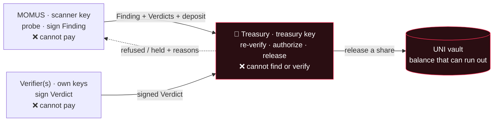

<!-- aicom-mirror-notice -->
> **📖 Read-only mirror.** `treasury` is published from the canonical AI-Factory monorepo.
> **Pull requests are not accepted** — any commit pushed here is overwritten by
> `scripts/mirror_satellites.sh` on the next sync.
> 🐞 Found a bug or have a request? Please **[open an issue](https://github.com/alexar76/treasury/issues)**.

# Treasury

<!-- aicom-readme-badges -->
<p align="center">
  <a href="https://github.com/alexar76/treasury/actions/workflows/ci.yml"></a>
  <a href="https://alexar76.github.io/treasury/"></a>
  <a href="https://github.com/alexar76/momus"></a>
  =3.11" />
  
  
  <a href="https://github.com/alexar76/treasury/blob/main/LICENSE"></a>
</p>
<!-- /aicom-readme-badges -->

<p align="center">
  <strong>The only key that can pay a red-team bounty — and it is not the key that finds the bug.</strong>
</p>

<p align="center">
  <strong><a href="https://github.com/alexar76/momus">MOMUS (the scanner)</a></strong>
  ·
  <strong><a href="https://github.com/alexar76/momus/blob/main/docs/uni-chain.md">Every vault transaction explained</a></strong>
  ·
  <strong><a href="https://github.com/alexar76/momus/blob/main/docs/first-cycle.md">The first live cycle</a></strong>
  ·
  <strong><a href="https://momus.modelmarket.dev/treasury/health">Live health surface</a></strong>
</p>

> 🌐 **English** · [Русский](README.ru.md) · [Español](README.es.md) · [Français](README.fr.md) · [中文](README.zh.md)

## What it is

[MOMUS](https://github.com/alexar76/momus) is the ecosystem's red team: it probes our own services,
finds contract violations, and **Ed25519-signs** the evidence. It cannot pay itself. This service is
the other half of that sentence — **the Treasury holds the one key that can release a bounty**, and
it lives in a different process, in a different container, on a different key volume.

The split is not a stylistic preference. A scanner that held the purse could pay itself for its own
findings, so "did we find a bug" and "does anyone get money" must be decided by different principals
with different keys. `KeyRing` refuses to start at all if the scanner key equals the treasury key —
even a single-box demo cannot collapse the two roles by misconfiguration.

The Treasury also does not take MOMUS's word for anything. It receives a finding plus its verdicts
over HTTP and **re-derives the decision from scratch**: re-verifies every signature, re-checks the
independence quorum, re-checks the external-verifier requirement, recomputes the dedup identity,
re-checks the ledger — and only then signs a payout decision with its own key. There is no
"MOMUS says it is confirmed" input anywhere in the gate.



## What it refuses, and why

Every refusal below exists because the opposite behaviour was a real way to get paid for nothing.

| It refuses | Because |
|---|---|
| **A finding whose scanner signature does not verify** | The signature is the whole claim. A tampered document — e.g. `severity` edited from `high` to `critical` after signing — is refused outright, not repaired. Covered by `test_authorize_refuses_tampered_finding`. |
| **A claimant's self-declared dedup identity** | `dedup_key` is signed *by the claimant*, so a scanner that wants to be paid twice for one bug just varies the field and the replay guard never matches. The Treasury **recomputes** the identity from the finding's content and refuses any declared mismatch. |
| **A duplicate payout for a bug already paid** | A bug pays once, ever. Only a `paid` decision consumes the dedup identity — a `held` one must stay retryable, because otherwise a temporary funding shortfall would permanently burn a legitimate bounty (a test caught exactly that once the vault could genuinely run out). |
| **A HIGH/CRITICAL finding with fewer than two distinct verifiers** | One key confirming its own finder is not verification. Strong actions need ≥2 **distinct** confirming verifier keys, none of which may be the scanner key or the treasury key. |
| **…and, for those, a quorum with no external verifier** | Distinct `did:key`s prove distinct *keys*, not distinct *parties* — one operator can hold them all. So at least one confirmation must come from a pre-registered external verifier (`MOMUS_EXTERNAL_VERIFIERS`). In production, an empty external set fails **closed**; outside production it is allowed but the decision records a warning that the payout rests on operator key custody alone. |
| **A malformed or small-order verifier key** | An Ed25519 small-order point encodes to a pubkey string that *differs* from the scanner's, so naive string inequality would count it toward the independence quorum. Nobody holds its private half. Rejected before any verdict it signed can count. |
| **A verdict that does not bind to this finding's digest** | Otherwise a verdict for one finding could be transplanted onto another. |
| **A claim with no anti-griefing deposit** | Filing a claim costs collateral, proportional to the bounty. A claim that independent verifiers **refute** forfeits the *whole* deposit — not a percentage, because bleeding it a few percent at a time makes spamming near-free. An honestly inconclusive claim is refunded, so an unreproducible-but-honest report stays cheap. |
| **A finding against the ecosystem's own security infrastructure** | A bug in the scanner, the treasury, the verifier, the gate or the escrow is the exact lever for disabling the payout controls. Those never auto-pay; they route to human review. The check is server-side against the target, never trusting the claim's own label. |
| **A write request with no client token** | See below — this one was a live vulnerability. |
| **A payout the vault cannot cover** | An unfunded treasury does not invent money. All gates passing plus an empty balance is `held`, not `paid`. |

### The defect that made the token mandatory

The payout routes originally had **no authentication at all**. An audit agent did not theorise about
it — it *reproduced* the attack, minting a treasury-signed `paid` decision from an unprivileged
process on the shared Docker network. Signature checks prove the documents are internally
consistent; they say nothing about whether the **caller** is entitled to ask.

So `/authorize`, `/deposit`, `/explain` and the vault write routes now require a client token
(`x-treasury-client`), are rate-limited per caller, and — when an allowlist is configured — the
finding's `scanner_pubkey` must belong to a registered claimant, so a stranger's key cannot claim a
bounty even holding a valid token. In production a missing `TREASURY_CLIENT_TOKEN` returns `503`
rather than defaulting to open. `GET /health` reports `write_gated` so the posture is checkable from
outside. Read-only `/health`, `/ledger`, `/vault` and `/vault/journal` stay open on purpose: they
are the audit surface.

## The UNI vault

The vault lives here, with the money, because a scanner holding the purse would defeat the
separation the whole design rests on.

Without a balance a simulated treasury "pays" forever: every bounty succeeds, nothing depletes, and
the simulation teaches you nothing about whether the economics work. So the vault is real
bookkeeping — it is funded, reserved against, drawn down, and **can genuinely run out**. State is
always derivable from history: the journal is append-only and replayed on start.

- **balance** — everything the vault holds.
- **reserved** — the part already promised to in-flight bounties.
- **available** = balance − reserved — what a new bounty may draw on.

There are exactly six transaction kinds, and the service reports what each one means at
`GET /vault` → `transaction_meanings`, so a line in the journal never needs interpreting:

| kind | what it means |
|---|---|
| `fund` | an operator added simulated budget — the only way money enters the vault |
| `reserve` | a bounty cleared the payout gate; its pool is set aside and no longer available |
| `release` | a contributor's share left the vault (finder / fixer / conductor) |
| `unreserve` | a reservation was cancelled without paying; the funds are available again |
| `forfeit` | a refuted claimant's deposit was taken — spam funds the honest side |
| `refund` | a claimant's deposit returned because their claim was not refuted |

Reservation is what stops two concurrent claims spending the same dollar, and a release larger than
what is reserved for that finding is refused rather than allowed to over-draw. A share the vault
cannot cover comes back as `UNI vault refused the release — insufficient available funds…`, and the
decision is `held`.

One bug worth naming: the base decision used to settle the **full** pool as the finder's share, and
then the per-role split settled the finder's 50% again — two settlement records and, once a real
vault existed, a genuine double debit. The split now decides without settling and settles each share
itself.

Full narration of a real end-to-end run, transaction by transaction:
[**uni-chain.md**](https://github.com/alexar76/momus/blob/main/docs/uni-chain.md).

## The security budget — a rule, not an approval

A vault that can run out is honest, but then someone has to refill it, and *who decides* is a
governance question with a security answer.

The hub funds it — that is where the ecosystem's revenue lands, and security is a cost of running a
marketplace people trust, the same way fraud prevention is funded out of transaction fees. The
critical part is that the refill is a **standing rule, never a discretionary approval**: an approver
could starve the auditor exactly when the auditor finds something embarrassing, which is the same
capture the key separation exists to prevent.

- **pull, not push** — the Treasury requests a top-up when available funds fall below a threshold;
- **a standing rate** — honoured automatically up to `rate_bps` of settled invoke volume in the
  period, capped by `period_cap_usd`; no approval needed inside the allowance;
- **escalate above it** — a request beyond the allowance is refused *with its arithmetic* and routed
  to human governance. The auditor is never silently defunded; the funder is never silently drained;
- **fail-closed** — no allocator, or zero settled volume, and the vault simply runs out and bounties
  become `held` intents. An exhausted budget is reported, never hidden;
- **honest provenance** — every allocation records whether the volume was *measured from the hub* or
  *operator-declared*, so a granted top-up can never look anchored to real economic activity when it
  was not.

Both branches (`granted` and `escalated`) have run live; see `POST /vault/top-up` and the
[uni-chain doc](https://github.com/alexar76/momus/blob/main/docs/uni-chain.md).

## Settlement ladder

`UNI` (default) → `HELD` → `BASE` / `SOLANA`. The ladder only ever falls **back**, never forward
into paying.

| tier | what happens |
|---|---|
| **`UNI`** | Simulated settlement inside the universe. The whole loop runs, every share is recorded and marked `simulated: true`, the vault is really debited — and **no value moves anywhere**. |
| **`HELD`** | Crypto is on but on-chain bounty settlement was never explicitly enabled, or its config is incomplete. Decisions are recorded as intents only. |
| **`BASE` / `SOLANA`** | Real settlement, and it needs a **second, separate opt-in on top of the crypto master switch**: `AIFACTORY_CRYPTO_ENABLED=1` **and** `MOMUS_BOUNTY_ONCHAIN=1` **and** `MOMUS_BOUNTY_CHAIN` **and** a deployed `MOMUS_BOUNTY_SPLITTER` address. Anything missing or malformed lands on `HELD`. |

> ### ⚠️ Disclaimer
>
> **By default nothing is paid.** UNI figures are **simulated** bookkeeping — an amount in the
> journal is not a transfer, and no value moves.
>
> **Turning crypto on does not start paying bounties.** That is why the on-chain bounty switch is
> separate: enabling the ecosystem's crypto (channels, escrow, hub settlement) must not silently
> also start releasing red-team money. Separate risks get separate switches.
>
> **Nothing is ever auto-broadcast.** Even fully enabled, the `BASE` tier only *prepares* an
> unsigned `releaseShare(...)` call for the Treasury operator to sign and send; MOMUS never
> broadcasts its own payout. An agent able to broadcast its own payouts would defeat the separation
> of duties the whole design rests on.
>
> **A deployed contract is not an enabled payout.** `BountySplitter` is deployed on Base mainnet,
> and the default tier is still UNI.
>
> Nothing here is a financial product, an investment, or a promise of payment. The bounty schedule
> is a configurable demo parameter, not an offer.

## API surface

| route | auth | what it does |
|---|---|---|
| `GET /health` | open | liveness, the treasury **public** key (never the private one), `write_gated`, registered claimant count, external verifier set, crypto/prod posture |
| `GET /ledger?limit=` | open | the append-only decision/claim tail — the audit surface |
| `GET /vault` | open | balance / reserved / available, the standing allocation rule, the settlement mode, and what every transaction kind means |
| `GET /vault/journal?limit=` | open | the transaction journal, each entry carrying its own plain-language meaning |
| `POST /authorize` | token | re-verify everything and return a **treasury-signed** `Decision` (`paid` / `held` / `refused`, with reasons) |
| `POST /deposit` | token | rule on a claim's deposit — refund vs forfeit |
| `POST /vault/fund` | token | operator adds simulated budget |
| `POST /vault/reserve` | token | set a bounty's pool aside before its shares are released |
| `POST /vault/top-up` | token | request a refill under the standing rule (grants inside the allowance, escalates above it) |
| `POST /explain` | token | authorize first, then narrate the finished decision — advisory only |

### The advisory explainer is never in the money path

Money must never depend on model output, so authorization is entirely deterministic and contains no
LLM. The explainer (DeepSeek V4 Pro by default) gets exactly one job: **after** a decision has
already been made, write the audit note. It receives the finished decision — state, amount,
severity, verifier count, reasons — and never the raw finding, so there is no untrusted-content sink
to inject through. It cannot change the outcome, its output is tagged `advisory: true`, and if the
model is unconfigured or fails, a deterministic sentence is used instead. A payout never blocks on a
model.

## Run it

Docker is the intended shape, because the separation is a property of *where the key lives*. Build
from the **monorepo root** (the image needs `oracles/core` and `momus` in context):

```bash
docker compose -f treasury/docker-compose.yml up -d --build   # → 127.0.0.1:9401
```

Or the whole stack — MOMUS + Treasury + panel, with separate key volumes:

```bash
docker compose -f momus/docker-compose.yml up -d --build
```

Without Docker:

```bash
cd treasury && pip install -e ../oracles/core -e ../momus -e ".[dev]" && python -m treasury.service
```

**Ports:** `9401` locally · `9411` in production (on the oracle host `:9400` belongs to the oracle
family, so MOMUS shifts to `:9410` and the Treasury to `:9411`). There the Treasury binds loopback
only and sits behind the
`momus.modelmarket.dev` edge, which serves the read-only surface —
[`/treasury/health`](https://momus.modelmarket.dev/treasury/health) — and does **not** expose
`/treasury/authorize`, `/deposit` or `/vault/fund` publicly. That is asserted by the production
verification script, not just configured.

### The env vars that matter

| variable | meaning | default |
|---|---|---|
| `TREASURY_KEY_PATH` | the treasury signing key — the one key that can release a bounty | `data/treasury_signing_key` |
| `TREASURY_CLIENT_TOKEN` | caller token for every write route; **unset in prod ⇒ `503`, fail-closed** | unset |
| `TREASURY_SCANNER_PUBKEYS` | comma-separated allowlist of claimant scanner keys | unset = any |
| `MOMUS_EXTERNAL_VERIFIERS` | pubkeys of independently-operated verifiers; required for high/critical in prod | unset |
| `TREASURY_LEDGER_PATH` | append-only decision/claim ledger | `data/bounty_ledger.jsonl` |
| `TREASURY_VAULT_PATH` | the vault's append-only journal | `<data>/uni_vault.jsonl` |
| `TREASURY_PORT` | listen port | `9401` |
| `TREASURY_WRITE_RATE_LIMIT` | per-caller rate limit on write routes | `30` |
| `TREASURY_CORS_ORIGINS` | allowed origins | `*` |
| `AIFACTORY_PROD` | arms the fail-closed branches | unset |
| `AIFACTORY_CRYPTO_ENABLED` | ecosystem-wide crypto master switch — **not** enough to pay on-chain | `0` |
| `MOMUS_BOUNTY_ONCHAIN` · `MOMUS_BOUNTY_CHAIN` · `MOMUS_BOUNTY_SPLITTER` | the separate on-chain opt-in, its chain, and the deployed splitter address | unset |
| `MOMUS_BUDGET_RATE_BPS` · `MOMUS_BUDGET_PERIOD_CAP_USD` · `MOMUS_BUDGET_THRESHOLD_USD` · `MOMUS_BUDGET_TARGET_USD` | the standing allocation rule | see [uni-chain.md](https://github.com/alexar76/momus/blob/main/docs/uni-chain.md#configuration) |
| `MOMUS_BUDGET_HUB_URL` · `MOMUS_BUDGET_DECLARED_VOLUME_USD` | measured hub volume, or the operator-declared figure used in simulation | unset · `0` |
| `TREASURY_LLM_PROVIDER` | advisory explainer only, never the payout path | `deepseek` |

Note that `TREASURY_SCANNER_KEY_PATH` is a *reference* slot, not custody: the independence check
only needs the scanner's **public** key, which travels inside each finding. The Treasury never holds
a scanner private key, and the `KeyRing` guard refuses `scanner == treasury` regardless.

## Tests

```bash
cd treasury && pytest -q      # 5 tests
```

The suite exercises the properties, not the plumbing: `/health` exposes the treasury public key and
nothing secret, a valid HIGH claim is **held** on an unfunded vault and only pays after the pool is
funded and reserved (with the money actually leaving the vault), a tampered finding is refused, a
refuted claim forfeits its deposit, and every decision lands in the ledger. `aimarket-momus` and
`aimarket-oracle-core` must be importable; the standalone mirror vendors both.

## License

MIT · part of the [AICOM / AIMarket](https://magic-ai-factory.com/) ecosystem.
