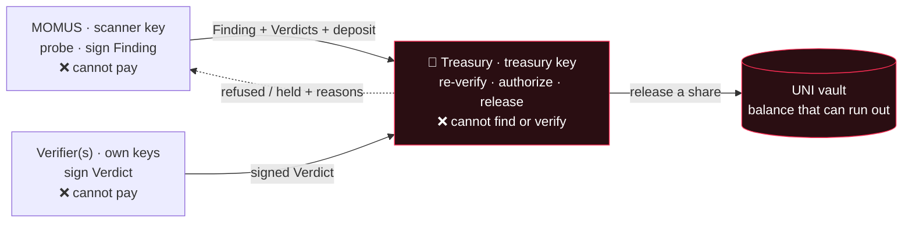

# Treasury

<!-- aicom-readme-badges -->
<p align="center">
  <a href="https://github.com/alexar76/treasury/actions/workflows/ci.yml"></a>
  <a href="https://github.com/alexar76/momus"></a>
  
  =3.11" />
  
  <a href="https://github.com/alexar76/treasury/blob/main/LICENSE"></a>
</p>
<!-- /aicom-readme-badges -->

<p align="center">
  <strong>Единственный ключ, которым можно выплатить вознаграждение красной команде, — и это не тот ключ, что находит баг.</strong>
</p>

<p align="center">
  <strong><a href="https://github.com/alexar76/momus">MOMUS (сканер)</a></strong>
  ·
  <strong><a href="https://github.com/alexar76/momus/blob/main/docs/uni-chain.md">Разбор каждой транзакции хранилища</a></strong>
  ·
  <strong><a href="https://github.com/alexar76/momus/blob/main/docs/first-cycle.md">Первый живой цикл</a></strong>
  ·
  <strong><a href="https://momus.modelmarket.dev/treasury/health">Живая поверхность состояния</a></strong>
</p>

> 🌐 [English](README.md) · **Русский** · [Español](README.es.md) · [Français](README.fr.md) · [中文](README.zh.md)

## Что это

[MOMUS](https://github.com/alexar76/momus) — красная команда экосистемы: он зондирует наши
собственные сервисы, находит нарушения контрактов и **подписывает** доказательства **ключом
Ed25519**. Заплатить самому себе он не может. Этот сервис — вторая половина той же фразы:
**Treasury (казначейство) держит единственный ключ, которым можно выдать вознаграждение**, и живёт
он в другом процессе, в другом контейнере, на другом томе с ключами.

Это разделение — не вопрос стиля. Сканер, у которого в руках касса, мог бы платить сам себе за
собственные находки, поэтому «нашли ли мы баг» и «получает ли кто-нибудь деньги» должны решать
разные принципалы разными ключами. `KeyRing` вообще отказывается запускаться, если ключ сканера
совпадает с ключом казначейства, — даже демо на одной машине не может свести две роли в одну из-за
ошибки конфигурации.

Treasury также не принимает слова MOMUS ни по одному пункту. Он получает находку вместе с её
вердиктами по HTTP и **выводит решение заново, с нуля**: перепроверяет каждую подпись, заново
проверяет кворум независимости, заново проверяет требование внешнего верификатора, пересчитывает
идентичность дедупликации, заново сверяется с реестром — и только затем подписывает решение о
выплате своим собственным ключом. Входа «MOMUS говорит, что подтверждено» в этом шлюзе нет нигде.



## Что он отвергает и почему

Каждый отказ ниже существует потому, что противоположное поведение было настоящим способом получить
деньги ни за что.

| Он отвергает | Потому что |
|---|---|
| **Находку, чья подпись сканера не проходит проверку** | Подпись — это и есть всё заявление. Подделанный документ — например, `severity`, изменённая с `high` на `critical` после подписания, — отвергается сразу, а не ремонтируется. Покрыто тестом `test_authorize_refuses_tampered_finding`. |
| **Идентичность дедупликации, объявленную заявителем самостоятельно** | `dedup_key` подписывается *самим заявителем*, поэтому сканеру, который хочет получить оплату дважды за один баг, достаточно варьировать это поле — и защита от повтора никогда не совпадёт. Treasury **пересчитывает** идентичность из содержимого находки и отвергает любое расхождение с объявленным значением. |
| **Повторную выплату за баг, за который уже заплатили** | Баг оплачивается один раз, навсегда. Идентичность дедупликации расходует только решение `paid` — решение `held` должно оставаться повторяемым, потому что иначе временная нехватка средств навсегда сожгла бы законное вознаграждение (тест поймал именно это, как только хранилище получило возможность действительно опустеть). |
| **Находку HIGH/CRITICAL, у которой меньше двух различных верификаторов** | Один ключ, подтверждающий собственного искателя, — это не верификация. Строгим действиям нужно ≥2 **различных** подтверждающих ключей верификаторов, и ни один из них не может быть ключом сканера или ключом казначейства. |
| **…и для них — кворум без внешнего верификатора** | Различные `did:key` доказывают различие *ключей*, а не различие *сторон*: все они могут быть у одного оператора. Поэтому хотя бы одно подтверждение должно прийти от заранее зарегистрированного внешнего верификатора (`MOMUS_EXTERNAL_VERIFIERS`). В продакшене пустое множество внешних верификаторов срабатывает **fail-closed (отказ по умолчанию)**; вне продакшена это допускается, но в решении фиксируется предупреждение, что выплата держится лишь на том, что ключи хранит оператор. |
| **Некорректный ключ верификатора или ключ малого порядка** | Точка малого порядка Ed25519 кодируется в строку публичного ключа, которая *отличается* от строки сканера, поэтому наивное сравнение строк на неравенство зачло бы её в кворум независимости. Приватной половины к ней нет ни у кого. Отклоняется до того, как любой подписанный ею вердикт может быть засчитан. |
| **Вердикт, не привязанный к дайджесту этой находки** | Иначе вердикт для одной находки можно было бы пересадить на другую. |
| **Заявление без залога против злоупотреблений (anti-griefing)** | Подача заявления стоит залога, пропорционального вознаграждению. Заявление, которое независимые верификаторы **опровергают**, теряет *весь* залог — не процент, потому что при списании по несколько процентов спам становится почти бесплатным. Залог по честно неопределённому заявлению возвращается, так что невоспроизводимый, но честный отчёт остаётся дешёвым. |
| **Находку против собственной инфраструктуры безопасности экосистемы** | Баг в сканере, казначействе, верификаторе, шлюзе или эскроу — это ровно тот рычаг, которым отключают контроль выплат. Такие находки никогда не оплачиваются автоматически: они направляются на проверку человеком. Проверка выполняется на стороне сервера по самой цели и никогда не доверяет метке, которую заявление ставит себе само. |
| **Запрос на запись без клиентского токена** | См. ниже — это была живая уязвимость. |
| **Выплату, которую хранилище не может покрыть** | Непополненное казначейство не изобретает деньги. Все шлюзы пройдены плюс пустой баланс — это `held`, а не `paid`. |

### Дефект, из-за которого токен стал обязательным

Изначально на маршрутах выплат **не было вообще никакой аутентификации**. Агент-аудитор не рассуждал
об этом теоретически — он *воспроизвёл* атаку, выпустив подписанное казначейством решение `paid` из
непривилегированного процесса в общей сети Docker. Проверки подписей доказывают, что документы
внутренне согласованы; о том, вправе ли **вызывающая сторона** вообще о чём-то просить, они не
говорят ничего.

Поэтому `/authorize`, `/deposit`, `/explain` и маршруты записи в хранилище теперь требуют
клиентский токен (`x-treasury-client`), ограничены по частоте запросов для каждой вызывающей стороны
и — если настроен allowlist (белый список) — `scanner_pubkey` из находки должен принадлежать
зарегистрированному заявителю, так что чужой ключ не может претендовать на вознаграждение, даже имея
действительный токен. В продакшене отсутствующий `TREASURY_CLIENT_TOKEN` даёт `503`, а не открывает
доступ по умолчанию. `GET /health` сообщает `write_gated`, чтобы эту конфигурацию можно было
проверить извне. Маршруты только на чтение — `/health`, `/ledger`, `/vault` и `/vault/journal` —
намеренно оставлены открытыми: это и есть поверхность аудита.

## Хранилище UNI

Хранилище живёт здесь, вместе с деньгами, потому что сканер с кассой в руках разрушил бы разделение,
на котором держится весь дизайн.

Без баланса симулированное казначейство «платит» бесконечно: любое вознаграждение выдаётся успешно,
ничто не исчерпывается, и такая симуляция ничему не учит насчёт того, работает ли экономика. Поэтому
хранилище — это настоящий учёт: его пополняют, из него резервируют, его расходуют, и он
**действительно может опустеть**. Состояние всегда выводится из истории: журнал только дописывается
и переигрывается при запуске.

- **balance** — всё, что держит хранилище.
- **reserved** — часть, уже обещанная вознаграждениям в работе.
- **available** = balance − reserved — то, из чего может черпать новое вознаграждение.

Видов транзакций ровно шесть, и сервис сам сообщает, что означает каждый, по `GET /vault` →
`transaction_meanings`, так что строку журнала никогда не нужно истолковывать:

| kind | что это значит |
|---|---|
| `fund` | оператор добавил симулированный бюджет — единственный способ, которым деньги попадают в хранилище |
| `reserve` | вознаграждение прошло шлюз выплаты; его пул отложен и больше не доступен |
| `release` | доля участника покинула хранилище (искатель / фиксер / дирижёр) |
| `unreserve` | резервирование отменено без выплаты; средства снова доступны |
| `forfeit` | залог опровергнутого заявителя удержан — спам финансирует честную сторону |
| `refund` | залог заявителя возвращён, потому что его заявление не было опровергнуто |

Резервирование — это то, что не даёт двум одновременным заявлениям потратить один и тот же доллар, а
выдача доли на сумму больше зарезервированной под эту находку отвергается, а не пропускается в
перерасход. Доля, которую хранилище не может покрыть, возвращается как `UNI vault refused the
release — insufficient available funds…`, а решение — `held`.

Один баг стоит назвать: базовое решение раньше рассчитывало **весь** пул как долю искателя, а затем
разделение по ролям рассчитывало 50% искателя ещё раз — две записи расчёта и, как только появилось
настоящее хранилище, настоящее двойное списание. Теперь разделение принимает решение, ничего не
рассчитывая, и само рассчитывает каждую долю.

Полное описание настоящего сквозного прогона, транзакция за транзакцией:
[**uni-chain.md**](https://github.com/alexar76/momus/blob/main/docs/uni-chain.md).

## Бюджет безопасности — правило, а не согласование

Хранилище, которое может опустеть, — это честно, но тогда кто-то должен его пополнять, и вопрос
*кто решает* — это вопрос управления с ответом из области безопасности.

Пополняет его хаб — именно туда приходит выручка экосистемы, а безопасность — это издержка
содержания маркетплейса, которому доверяют, точно так же как борьба с мошенничеством финансируется
из комиссий за транзакции. Критично здесь то, что пополнение — это **постоянно действующее правило,
а никогда не решение по усмотрению**: тот, кто согласует, мог бы перекрыть аудитору кислород ровно в
тот момент, когда аудитор находит что-то неудобное, — а это тот же самый захват, ради
предотвращения которого и существует разделение ключей.

- **вытягивание, а не выталкивание (pull, not push)** — Treasury сам запрашивает пополнение, когда
  доступные средства падают ниже порога;
- **постоянно действующая ставка** — исполняется автоматически в пределах `rate_bps` от объёма
  рассчитанных вызовов (invoke) за период, с потолком `period_cap_usd`; внутри этого лимита
  согласование не нужно;
- **эскалация выше него** — запрос сверх лимита отвергается *вместе со своей арифметикой* и
  направляется в управление людьми. Аудитора никогда не лишают финансирования молча; из
  финансирующей стороны никогда молча не вытягивают средства;
- **fail-closed (отказ по умолчанию)** — нет распределителя или нулевой рассчитанный объём — и
  хранилище просто опустеет, а вознаграждения станут намерениями `held`. Об исчерпанном бюджете
  сообщается, он никогда не скрывается;
- **честное происхождение** — каждое выделение фиксирует, был ли объём *измерен по хабу* или
  *объявлен оператором*, так что выданное пополнение никогда не сможет выглядеть привязанным к
  реальной экономической активности, если это не так.

Обе ветки (`granted` и `escalated`) уже отработали живьём; см. `POST /vault/top-up` и
[документ uni-chain](https://github.com/alexar76/momus/blob/main/docs/uni-chain.md).

## Лестница расчёта

`UNI` (по умолчанию) → `HELD` → `BASE` / `SOLANA`. Лестница всегда сдвигается только **назад** и
никогда — вперёд, к оплате.

| уровень | что происходит |
|---|---|
| **`UNI`** | Симулированный расчёт внутри вселенной. Весь цикл выполняется, каждая доля записывается и помечается `simulated: true`, хранилище действительно списывается — и **никакая ценность никуда не перемещается**. |
| **`HELD`** | Крипта включена, но ончейн-расчёт вознаграждений так и не был включён явно, либо его конфигурация неполна. Решения записываются только как намерения. |
| **`BASE` / `SOLANA`** | Настоящий расчёт, и для него нужно **второе, отдельное согласие поверх главного крипто-переключателя**: `AIFACTORY_CRYPTO_ENABLED=1` **и** `MOMUS_BOUNTY_ONCHAIN=1` **и** `MOMUS_BOUNTY_CHAIN` **и** развёрнутый адрес `MOMUS_BOUNTY_SPLITTER`. Всё, что отсутствует или некорректно, приводит на `HELD`. |

> ### ⚠️ Дисклеймер
>
> **По умолчанию не выплачивается ничего.** Цифры UNI — это **симулированный** учёт: сумма в
> журнале не является переводом, и никакая ценность не перемещается.
>
> **Включение крипты не начинает выплачивать вознаграждения.** Именно поэтому переключатель
> ончейн-вознаграждений отдельный: включение крипты экосистемы (каналы, эскроу, расчёты хаба) не
> должно молча начать ещё и выдавать деньги красной команде. Отдельные риски получают отдельные
> переключатели.
>
> **Ничто никогда не транслируется в сеть автоматически.** Даже при полностью включённых настройках
> уровень `BASE` лишь *готовит* неподписанный вызов `releaseShare(...)`, который оператор Treasury
> должен подписать и отправить; MOMUS никогда не транслирует собственную выплату. Агент, способный
> сам транслировать свои выплаты, разрушил бы разделение обязанностей, на котором держится весь
> дизайн.
>
> **Развёрнутый контракт — это ещё не включённая выплата.** `BountySplitter` развёрнут в Base
> mainnet, а уровень по умолчанию по-прежнему UNI.
>
> Ничто здесь не является финансовым продуктом, инвестицией или обещанием выплаты. Сетка
> вознаграждений — настраиваемый демонстрационный параметр, а не предложение.

## Поверхность API

| маршрут | доступ | что делает |
|---|---|---|
| `GET /health` | открыт | живость сервиса, **публичный** ключ казначейства (никогда не приватный), `write_gated`, число зарегистрированных заявителей, множество внешних верификаторов, состояние крипты/прода |
| `GET /ledger?limit=` | открыт | хвост реестра решений/заявлений, только на дозапись, — поверхность аудита |
| `GET /vault` | открыт | balance / reserved / available, постоянно действующее правило выделения, режим расчёта и что означает каждый вид транзакции |
| `GET /vault/journal?limit=` | открыт | журнал транзакций, где каждая запись несёт собственное объяснение простыми словами |
| `POST /authorize` | токен | перепроверить всё заново и вернуть `Decision`, **подписанное казначейством** (`paid` / `held` / `refused`, с причинами) |
| `POST /deposit` | токен | вынести решение по залогу заявления — возврат или удержание |
| `POST /vault/fund` | токен | оператор добавляет симулированный бюджет |
| `POST /vault/reserve` | токен | отложить пул вознаграждения до того, как его доли будут выданы |
| `POST /vault/top-up` | токен | запросить пополнение по постоянно действующему правилу (выдаёт внутри лимита, эскалирует выше него) |
| `POST /explain` | токен | сначала авторизовать, затем описать готовое решение словами — только рекомендательно |

### Рекомендательный пояснитель никогда не находится на пути денег

Деньги никогда не должны зависеть от вывода модели, поэтому авторизация полностью детерминирована и
не содержит LLM. У пояснителя (по умолчанию DeepSeek V4 Pro) ровно одна работа: **после** того как
решение уже принято, написать заметку для аудита. Он получает готовое решение — состояние, сумму,
серьёзность, число верификаторов, причины — и никогда не получает саму находку, так что приёмника
недоверенного содержимого, через который можно было бы внедрить инъекцию, здесь просто нет. Изменить
исход он не может, его вывод помечается `advisory: true`, а если модель не настроена или отказала,
вместо неё используется детерминированная фраза. Выплата никогда не ждёт модель.

## Запуск

Docker — предполагаемая форма запуска, потому что разделение — это свойство того, *где живёт ключ*.
Собирайте из **корня монорепозитория** (образу нужны `oracles/core` и `momus` в контексте):

```bash
docker compose -f treasury/docker-compose.yml up -d --build   # → 127.0.0.1:9401
```

Или весь стек — MOMUS + Treasury + панель, с отдельными томами для ключей:

```bash
docker compose -f momus/docker-compose.yml up -d --build
```

Без Docker:

```bash
cd treasury && pip install -e ../oracles/core -e ../momus -e ".[dev]" && python -m treasury.service
```

**Порты:** `9401` локально · `9411` в продакшене (на хосте оракулов `:9400` занят семейством
оракулов, поэтому MOMUS сдвигается на `:9410`, а Treasury — на `:9411`). Там Treasury слушает только
loopback и стоит за периметром
`momus.modelmarket.dev`, который отдаёт поверхность только на чтение —
[`/treasury/health`](https://momus.modelmarket.dev/treasury/health) — и **не** публикует наружу
`/treasury/authorize`, `/deposit` и `/vault/fund`. Это утверждается скриптом проверки продакшена, а
не просто настроено.

### Переменные окружения, которые важны

| переменная | что означает | по умолчанию |
|---|---|---|
| `TREASURY_KEY_PATH` | ключ подписи казначейства — единственный ключ, которым можно выдать вознаграждение | `data/treasury_signing_key` |
| `TREASURY_CLIENT_TOKEN` | токен вызывающей стороны для каждого маршрута записи; **не задан в проде ⇒ `503`, fail-closed** | не задана |
| `TREASURY_SCANNER_PUBKEYS` | allowlist (белый список) ключей сканеров-заявителей, через запятую | не задана = любой |
| `MOMUS_EXTERNAL_VERIFIERS` | публичные ключи независимо управляемых верификаторов; обязательны для high/critical в проде | не задана |
| `TREASURY_LEDGER_PATH` | реестр решений/заявлений, только на дозапись | `data/bounty_ledger.jsonl` |
| `TREASURY_VAULT_PATH` | журнал хранилища, только на дозапись | `<data>/uni_vault.jsonl` |
| `TREASURY_PORT` | порт прослушивания | `9401` |
| `TREASURY_WRITE_RATE_LIMIT` | ограничение частоты запросов на маршрутах записи для каждой вызывающей стороны | `30` |
| `TREASURY_CORS_ORIGINS` | разрешённые источники | `*` |
| `AIFACTORY_PROD` | включает ветки fail-closed | не задана |
| `AIFACTORY_CRYPTO_ENABLED` | главный крипто-переключатель всей экосистемы — **недостаточен** для ончейн-выплаты | `0` |
| `MOMUS_BOUNTY_ONCHAIN` · `MOMUS_BOUNTY_CHAIN` · `MOMUS_BOUNTY_SPLITTER` | отдельное согласие на ончейн, его сеть и адрес развёрнутого сплиттера | не задана |
| `MOMUS_BUDGET_RATE_BPS` · `MOMUS_BUDGET_PERIOD_CAP_USD` · `MOMUS_BUDGET_THRESHOLD_USD` · `MOMUS_BUDGET_TARGET_USD` | постоянно действующее правило выделения | см. [uni-chain.md](https://github.com/alexar76/momus/blob/main/docs/uni-chain.md#configuration) |
| `MOMUS_BUDGET_HUB_URL` · `MOMUS_BUDGET_DECLARED_VOLUME_USD` | измеренный объём хаба или объявленная оператором цифра, используемая в симуляции | не задана · `0` |
| `TREASURY_LLM_PROVIDER` | только рекомендательный пояснитель, никогда не путь выплаты | `deepseek` |

Обратите внимание: `TREASURY_SCANNER_KEY_PATH` — это слот для *ссылки*, а не хранение ключа:
проверке независимости нужен только **публичный** ключ сканера, который едет внутри каждой находки.
Treasury никогда не держит приватный ключ сканера, а защита `KeyRing` отвергает
`scanner == treasury` в любом случае.

## Тесты

```bash
cd treasury && pytest -q      # 5 tests
```

Набор проверяет свойства, а не обвязку: `/health` отдаёт публичный ключ казначейства и ничего
секретного; действительное заявление HIGH получает **`held`** на непополненном хранилище и
оплачивается только после того, как пул пополнен и зарезервирован (причём деньги действительно
уходят из хранилища); подделанная находка отвергается; опровергнутое заявление теряет свой залог; и
каждое решение попадает в реестр. `aimarket-momus` и `aimarket-oracle-core` должны быть импортируемы;
автономное зеркало включает оба в свою поставку.

## Лицензия

MIT · часть экосистемы [AICOM / AIMarket](https://magic-ai-factory.com/).
