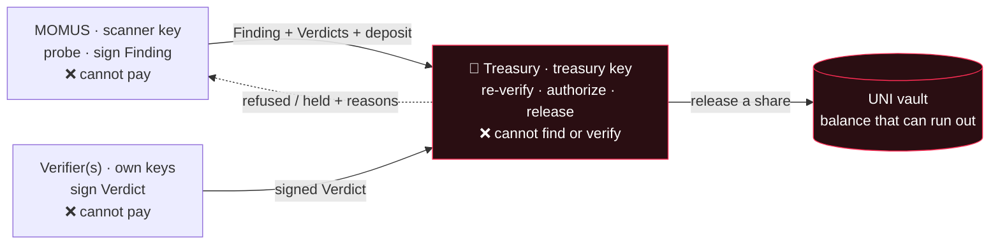

# Treasury

<!-- aicom-readme-badges -->
<p align="center">
  <a href="https://github.com/alexar76/treasury/actions/workflows/ci.yml"></a>
  <a href="https://github.com/alexar76/momus"></a>
  
  =3.11" />
  
  <a href="https://github.com/alexar76/treasury/blob/main/LICENSE"></a>
</p>
<!-- /aicom-readme-badges -->

<p align="center">
  <strong>唯一能够支付红队赏金的密钥 —— 而它并不是那把发现缺陷的密钥。</strong>
</p>

<p align="center">
  <strong><a href="https://github.com/alexar76/momus">MOMUS（扫描器）</a></strong>
  ·
  <strong><a href="https://github.com/alexar76/momus/blob/main/docs/uni-chain.md">每一笔资金库交易的解释</a></strong>
  ·
  <strong><a href="https://github.com/alexar76/momus/blob/main/docs/first-cycle.md">首个线上周期</a></strong>
  ·
  <strong><a href="https://momus.modelmarket.dev/treasury/health">在线健康接口</a></strong>
</p>

> 🌐 [English](README.md) · [Русский](README.ru.md) · [Español](README.es.md) · [Français](README.fr.md) · **中文**

## 这是什么

[MOMUS](https://github.com/alexar76/momus) 是本生态系统的红队：它对我们自己的服务发起探测，找出契约违规，
并用 **Ed25519 为证据签名**。它不能给自己付款。本服务就是这句话的另一半 —— **Treasury（金库）持有唯一
能够释放赏金的那把密钥** —— 而它运行在另一个进程、另一个容器、另一个密钥卷之上。

这种拆分不是风格上的偏好。掌管钱袋的扫描器可以为自己的发现给自己付款，因此「我们是否发现了缺陷」与
「是否有人拿到钱」必须由持有不同密钥的不同主体来裁定。如果扫描器密钥等于金库密钥，`KeyRing` 会**根本
拒绝启动** —— 即便是单机演示，也不可能因为配置失误而把这两个角色合并成一个。

Treasury 也绝不采信 MOMUS 的任何说法。它通过 HTTP 接收一份发现及其裁定，然后**从零重新推导出这个决定**：
重新验证每一个签名，重新检查独立性法定数量，重新检查外部验证方要求，重新计算去重身份，重新检查账本 ——
只有在这之后，才用自己的密钥为一份支付决定签名。整个关卡里的任何位置都不存在「MOMUS 说它已确认」这样的输入。



## 它拒绝什么，以及为什么

下面每一条拒绝之所以存在，都是因为相反的行为曾是一条「不干活也能拿钱」的真实途径。

| 它拒绝 | 原因 |
|---|---|
| **扫描器签名验证不通过的发现** | 签名就是主张的全部。被篡改的文档 —— 例如签名之后把 `severity` 从 `high` 改成 `critical` —— 会被直接拒绝，而不是被修补。由 `test_authorize_refuses_tampered_finding` 覆盖。 |
| **主张方自行声明的去重身份** | `dedup_key` 是*由主张方*签名的，所以想为同一个缺陷拿两次钱的扫描器只需改动这个字段，重放防护就永远匹配不上。Treasury 会**根据发现的内容重新计算**该身份，并拒绝任何与声明值不一致的情况。 |
| **对已付款缺陷的重复支付** | 一个缺陷永远只付一次钱。只有 `paid` 决定才会消耗去重身份 —— `held` 决定必须保持可重试，否则一次临时的资金短缺就会永久烧掉一笔正当的赏金（一旦资金库真的可能耗尽，一个测试恰好抓到了这一点）。 |
| **互不相同的验证方少于两个的 HIGH/CRITICAL 发现** | 一把密钥去确认它自己的发现者，那不是验证。强动作需要 **≥2 把互不相同的**确认验证方密钥，其中任何一把都不得是扫描器密钥或金库密钥。 |
| **……以及，对上述发现而言，没有外部验证方的法定数量** | 互不相同的 `did:key` 只能证明**密钥**不同，不能证明**主体**不同 —— 一个运营者可以把它们全部握在手里。因此至少有一份确认必须来自预先注册的外部验证方（`MOMUS_EXTERNAL_VERIFIERS`）。在生产环境中，外部集合为空会 **fail-closed（默认拒绝）**；在非生产环境中允许，但决定中会记录一条警告：这笔支付仅仅依赖运营者对密钥的保管。 |
| **格式错误或小阶（small-order）的验证方密钥** | 一个 Ed25519 小阶点编码出的公钥字符串与扫描器的**并不相同**，因此朴素的字符串不等比较会把它算进独立性法定数量。没有人持有它的私钥那一半。在它签名的任何裁定能够计入之前，它就被拒绝。 |
| **未绑定到本发现摘要的裁定** | 否则，针对某个发现的裁定就可以被移植到另一个发现上。 |
| **没有反捣乱（anti-griefing）保证金的主张** | 提交一份主张需要付出保证金，其金额与赏金成比例。被独立验证方**驳回**的主张会被没收**全部**保证金 —— 不是按百分比扣，因为一次只放掉几个百分点会让刷量几乎免费。诚实而**不确定**的主张会被退还，因此一份无法复现但诚实的报告成本依然很低。 |
| **针对本生态系统自身安全基础设施的发现** | 扫描器、金库、验证方、关卡或托管中的缺陷，正是用来关掉支付控制的那根杠杆。这类发现永不自动付款，而是转入人工评审。该检查在服务端针对目标进行，绝不采信主张自带的标签。 |
| **没有客户端令牌的写请求** | 见下文 —— 这一条曾是一个真实存在的漏洞。 |
| **资金库无法覆盖的支付** | 没有注资的金库不会凭空造钱。所有关卡都通过但余额为空，结果是 `held`，而不是 `paid`。 |

### 让令牌成为强制项的那个缺陷

支付路由最初**完全没有任何身份验证**。一个审计智能体并没有停留在理论推演上 —— 它**复现**了这次攻击：
从共享 Docker 网络上的一个无特权进程里，铸造出了一份由金库签名的 `paid` 决定。签名检查只能证明文档
在内部是自洽的；它对**调用方**是否有权提出请求一言不发。

因此，`/authorize`、`/deposit`、`/explain` 以及资金库的写路由现在都要求一个客户端令牌
（`x-treasury-client`），按调用方限流，并且 —— 在配置了 allowlist（白名单）时 —— 发现中的
`scanner_pubkey` 必须属于一个已注册的主张方，这样即便持有有效令牌，陌生人的密钥也无法索取赏金。
在生产环境中，缺失 `TREASURY_CLIENT_TOKEN` 会返回 `503`，而不是默认开放。`GET /health` 会报告
`write_gated`，因此这一安全姿态可以从外部检查。只读的 `/health`、`/ledger`、`/vault` 和
`/vault/journal` 有意保持开放：它们就是审计接口。

## UNI 资金库

资金库和钱一起放在这里，因为掌管钱袋的扫描器会摧毁整套设计所依赖的那种职责分离。

如果没有余额，一个模拟的金库就会永远「付款」下去：每一笔赏金都成功，什么都不会耗尽，而这样的模拟对
经济模型能否成立毫无启示。所以资金库是真实的记账 —— 它会被注资、被预留、被提取，而且**真的可能耗尽**。
状态始终可以从历史中推导出来：日志是只追加的，并在启动时重放。

- **balance** —— 资金库持有的全部。
- **reserved** —— 已经承诺给进行中赏金的那一部分。
- **available** = balance − reserved —— 一笔新的赏金可以动用的部分。

交易种类**恰好有六种**，而服务会在 `GET /vault` → `transaction_meanings` 中报告每一种的含义，
因此日志里的一行永远不需要人去解读：

| kind | 含义 |
|---|---|
| `fund` | 运营者添加了模拟预算 —— 资金进入资金库的唯一途径 |
| `reserve` | 一笔赏金通过了支付关卡；它的资金池被预留出来，不再属于可用部分 |
| `release` | 某位贡献者的份额离开了资金库（发现者 / 修复者 / 指挥者） |
| `unreserve` | 一次预留在未付款的情况下被取消；这笔资金重新变为可用 |
| `forfeit` | 一位被驳回的主张方的保证金被没收 —— 垃圾提交为诚实的一方出资 |
| `refund` | 一位主张方的保证金被退还，因为其主张没有被驳回 |

预留机制阻止两个并发的主张花掉同一笔钱；而超出该发现已预留额度的 `release` 会被拒绝，而不是被允许透支。
资金库无法覆盖的份额会以 `UNI vault refused the release — insufficient available funds…` 返回，
而该决定是 `held`。

有一个缺陷值得点名：基础决定过去会把**整个**资金池当作发现者的份额来结算，随后按角色划分时又把发现者的
50% 结算了一次 —— 于是产生了两条结算记录，而一旦存在真实的资金库，那就是一次真正的重复扣款。现在划分
逻辑只作决定而不作结算，并由它自己结算每一份份额。

一次真实端到端运行的完整叙述，逐笔交易：
[**uni-chain.md**](https://github.com/alexar76/momus/blob/main/docs/uni-chain.md)。

## 安全预算 —— 一条规则，而不是一次审批

一个可能耗尽的资金库是诚实的，但接下来总得有人给它续上，而**由谁来决定**是一个治理问题，却有一个
安全上的答案。

由枢纽（Hub）出资 —— 生态系统的收入落在那里，而安全是运营一个受人信任的交易市场的成本，就像反欺诈的
开销出自交易手续费一样。关键之处在于，这笔续注是一条**常设规则，绝不是一次自由裁量的审批**：审批人
可以恰好在审计方发现某件难堪的事情时把它饿死，而这正是密钥分离所要防止的那种俘获。

- **拉取，而不是推送** —— 当可用资金低于阈值时，由 Treasury 请求续注；
- **一个常设费率** —— 在该周期内已结算调用额的 `rate_bps` 以内自动兑现，并受 `period_cap_usd`
  上限约束；额度以内无需任何审批；
- **超出则上报** —— 超过额度的请求会被拒绝，*并附上其算式*，转交人工治理。审计方绝不会被悄悄断供；
  出资方也绝不会被悄悄抽干；
- **fail-closed（默认拒绝）** —— 没有分配器，或已结算额为零，那么资金库就是会耗尽，赏金变成 `held`
  意向。预算耗尽会被上报，绝不隐藏；
- **诚实的来源（provenance）** —— 每一次分配都会记录该交易额是*从枢纽实测得到*还是*由运营者声明*，
  因此一次已批准的续注绝不可能在事实并非如此时，看起来锚定于真实的经济活动。

两条分支（`granted` 与 `escalated`）都已在线上跑过；见 `POST /vault/top-up` 与
[uni-chain 文档](https://github.com/alexar76/momus/blob/main/docs/uni-chain.md)。

## 结算阶梯

`UNI`（默认）→ `HELD` → `BASE` / `SOLANA`。这个阶梯只会向**后**退，绝不会向前迈进到真的付款。

| 层级 | 会发生什么 |
|---|---|
| **`UNI`** | 宇宙内部的模拟结算。整个闭环都会跑，每一份份额都会被记录并标记 `simulated: true`，资金库确实会被扣款 —— 而且**没有任何价值发生转移**。 |
| **`HELD`** | 加密已开启，但链上赏金结算从未被显式启用，或者其配置不完整。决定仅作为意向被记录。 |
| **`BASE` / `SOLANA`** | 真实结算，而且它需要在加密总开关**之上再来一次独立的显式启用**：`AIFACTORY_CRYPTO_ENABLED=1` **且** `MOMUS_BOUNTY_ONCHAIN=1` **且** `MOMUS_BOUNTY_CHAIN` **且**一个已部署的 `MOMUS_BOUNTY_SPLITTER` 地址。任何一项缺失或格式错误，都会落到 `HELD`。 |

> ### ⚠️ 免责声明
>
> **默认情况下不会支付任何款项。** UNI 的数字是**模拟的**记账 —— 日志里的一个金额并不是一次转账，
> 也没有任何价值发生转移。
>
> **打开加密并不会开始支付赏金。** 这正是链上赏金开关要单独存在的原因：启用生态系统的加密功能
> （支付通道、托管、枢纽结算）绝不能同时悄悄开始释放红队的资金。不同的风险配不同的开关。
>
> **任何东西都绝不会被自动广播。** 即使全部启用，`BASE` 层级也只是*准备*一个未签名的
> `releaseShare(...)` 调用，交由 Treasury 运营者签名并发送；MOMUS 永不广播自己的付款。一个能够
> 广播自己付款的智能体，会摧毁整套设计所依赖的职责分离。
>
> **已部署的合约并不等于已启用支付。** `BountySplitter` 已部署在 Base mainnet 上，而默认层级
> 仍然是 UNI。
>
> 这里的任何内容都不构成金融产品、投资，或付款承诺。赏金表是一个可配置的演示参数，不是一项要约。

## API 接口

| 路由 | 鉴权 | 它做什么 |
|---|---|---|
| `GET /health` | 开放 | 存活性、金库**公**钥（绝不含私钥）、`write_gated`、已注册主张方数量、外部验证方集合、加密/生产环境姿态 |
| `GET /ledger?limit=` | 开放 | 只追加的决定/主张尾部记录 —— 审计接口 |
| `GET /vault` | 开放 | balance / reserved / available、常设分配规则、结算模式，以及每一种交易种类的含义 |
| `GET /vault/journal?limit=` | 开放 | 交易日志，每一条记录都自带其通俗语言的含义 |
| `POST /authorize` | 令牌 | 重新验证一切，并返回一份**由金库签名的** `Decision`（`paid` / `held` / `refused`，并附原因） |
| `POST /deposit` | 令牌 | 对一份主张的保证金作出裁定 —— 退还还是没收 |
| `POST /vault/fund` | 令牌 | 运营者添加模拟预算 |
| `POST /vault/reserve` | 令牌 | 在一笔赏金的各份额被释放之前，先把它的资金池预留出来 |
| `POST /vault/top-up` | 令牌 | 按常设规则请求续注（额度以内批准，超出则上报） |
| `POST /explain` | 令牌 | 先做授权，再叙述这份已完成的决定 —— 仅供参考 |

### 参考性解释器永远不在资金路径上

资金绝不能依赖模型输出，因此授权是完全确定性的，其中不含任何 LLM。解释器（默认 DeepSeek V4 Pro）
只有一项工作：在一个决定**已经**作出**之后**，写下审计备注。它收到的是这份已完成的决定 —— 状态、
金额、严重程度、验证方数量、原因 —— 而绝不会收到原始发现，因此不存在可供注入的不可信内容落点。
它无法改变结果，其输出被标记为 `advisory: true`；如果模型未配置或调用失败，就改用一句确定性的句子。
支付永远不会因为一个模型而阻塞。

## 运行

Docker 是预期的形态，因为这种分离是*密钥存放在哪里*所带来的属性。请从**单体仓库根目录**构建
（镜像需要在上下文中包含 `oracles/core` 与 `momus`）：

```bash
docker compose -f treasury/docker-compose.yml up -d --build   # → 127.0.0.1:9401
```

或者启动整套栈 —— MOMUS + Treasury + 面板，使用彼此分离的密钥卷：

```bash
docker compose -f momus/docker-compose.yml up -d --build
```

不使用 Docker：

```bash
cd treasury && pip install -e ../oracles/core -e ../momus -e ".[dev]" && python -m treasury.service
```

**端口：** 本地 `9401` · 生产环境 `9411`（在预言机主机上 `:9400` 属于 oracle family，所以 MOMUS
移到 `:9410`，Treasury 移到 `:9411`）。在那里 Treasury 只绑定回环地址，并位于
`momus.modelmarket.dev` 边缘之后 —— 该边缘只提供只读接口 ——
[`/treasury/health`](https://momus.modelmarket.dev/treasury/health) —— 并且**不会**公开暴露
`/treasury/authorize`、`/deposit` 或 `/vault/fund`。这一点由生产环境验证脚本断言，而不只是配置了而已。

### 重要的环境变量

| 变量 | 含义 | 默认值 |
|---|---|---|
| `TREASURY_KEY_PATH` | 金库签名密钥 —— 唯一能够释放赏金的那把密钥 | `data/treasury_signing_key` |
| `TREASURY_CLIENT_TOKEN` | 每一个写路由的调用方令牌；**在生产环境中未设置 ⇒ `503`，fail-closed（默认拒绝）** | 未设置 |
| `TREASURY_SCANNER_PUBKEYS` | 主张方扫描器密钥的逗号分隔 allowlist（白名单） | 未设置 = 任意 |
| `MOMUS_EXTERNAL_VERIFIERS` | 独立运营的验证方公钥；生产环境中 high/critical 必需 | 未设置 |
| `TREASURY_LEDGER_PATH` | 只追加的决定/主张账本 | `data/bounty_ledger.jsonl` |
| `TREASURY_VAULT_PATH` | 资金库的只追加日志 | `<data>/uni_vault.jsonl` |
| `TREASURY_PORT` | 监听端口 | `9401` |
| `TREASURY_WRITE_RATE_LIMIT` | 写路由上按调用方计的限流 | `30` |
| `TREASURY_CORS_ORIGINS` | 允许的来源 | `*` |
| `AIFACTORY_PROD` | 启用 fail-closed 分支 | 未设置 |
| `AIFACTORY_CRYPTO_ENABLED` | 全生态加密总开关 —— **不**足以在链上付款 | `0` |
| `MOMUS_BOUNTY_ONCHAIN` · `MOMUS_BOUNTY_CHAIN` · `MOMUS_BOUNTY_SPLITTER` | 独立的链上启用开关、它的链，以及已部署的 splitter 地址 | 未设置 |
| `MOMUS_BUDGET_RATE_BPS` · `MOMUS_BUDGET_PERIOD_CAP_USD` · `MOMUS_BUDGET_THRESHOLD_USD` · `MOMUS_BUDGET_TARGET_USD` | 常设分配规则 | 见 [uni-chain.md](https://github.com/alexar76/momus/blob/main/docs/uni-chain.md#configuration) |
| `MOMUS_BUDGET_HUB_URL` · `MOMUS_BUDGET_DECLARED_VOLUME_USD` | 实测得到的枢纽交易额，或模拟中使用的运营者声明数值 | 未设置 · `0` |
| `TREASURY_LLM_PROVIDER` | 仅用于参考性解释器，绝不在支付路径上 | `deepseek` |

请注意 `TREASURY_SCANNER_KEY_PATH` 是一个*引用*槽位，而不是保管：独立性检查只需要扫描器的**公**钥，
而它随每一份发现一起传递。Treasury 从不持有扫描器私钥，而且无论如何 `KeyRing` 守卫都会拒绝
`scanner == treasury`。

## 测试

```bash
cd treasury && pytest -q      # 5 tests
```

这套测试检验的是各项性质，而不是管道：`/health` 暴露金库公钥而不暴露任何机密；一份有效的 HIGH 主张
在未注资的资金库上是 **held**，只有在资金池被注资并预留之后才会付款（而且资金确实离开了资金库）；
被篡改的发现会被拒绝；被驳回的主张会没收其保证金；每一个决定都会落入账本。`aimarket-momus` 与
`aimarket-oracle-core` 必须可导入；独立镜像内置了这两者。

## 许可证

MIT · 属于 [AICOM / AIMarket](https://magic-ai-factory.com/) 生态系统的一部分。
