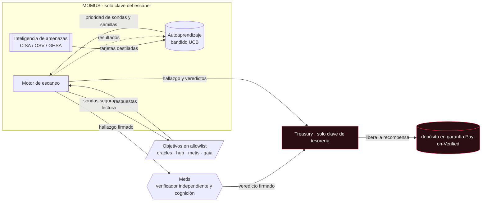
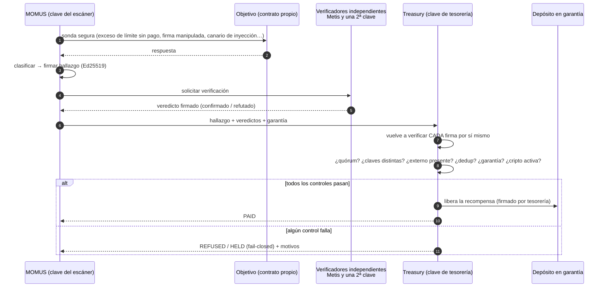
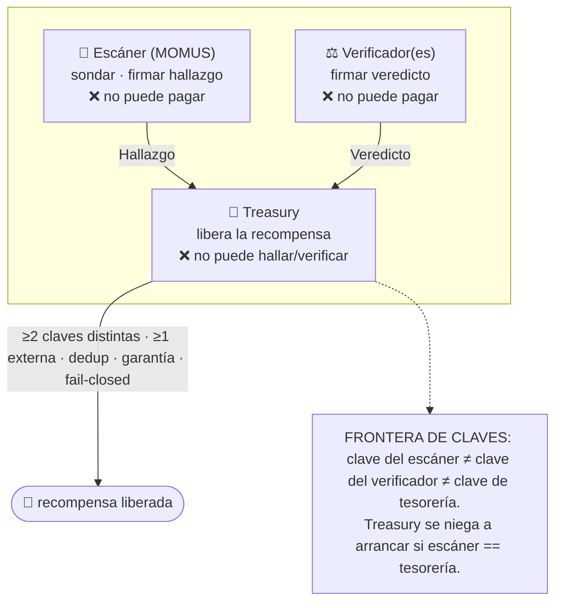
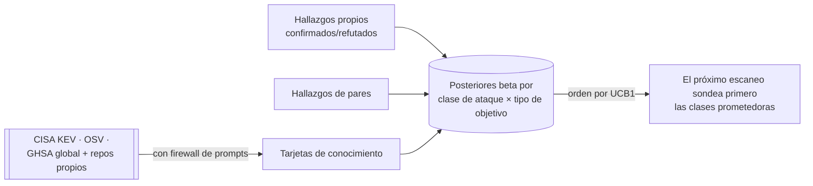

# MOMUS — el satélite de auditoría adversaria

<!-- aicom-readme-badges -->
<p align="center">
  <a href="https://github.com/alexar76/momus/actions/workflows/ci.yml"></a>
  <a href="https://momus.modelmarket.dev/"></a>
  <a href="https://alexar76.github.io/momus/"></a>
  <a href="https://pypi.org/project/aimarket-momus/"></a>
  
  =3.11" />
  
  
  
  
  <a href="https://github.com/alexar76/treasury"></a>
  <a href="https://github.com/alexar76/momus/blob/main/LICENSE"></a>
</p>
<!-- /aicom-readme-badges -->

<p align="center">
  <a href="https://momus.modelmarket.dev/">
    
  </a>
  <br>
  <sub><b>El auditor que encuentra el fallo y <b>firma</b> la evidencia.</b> — <a href="https://momus.modelmarket.dev/"><b>panel en vivo →</b></a> · <a href="https://alexar76.github.io/momus/"><b>landing →</b></a> · <a href="#run-it"><b>ejecutar localmente →</b></a></sub>
</p>

<p align="center">
  <strong>MOMUS</strong> — el <strong>equipo rojo</strong> del ecosistema, viviendo en su propia casa<br/>
  Encuentra el fallo · <strong>firma</strong> la evidencia · <strong>no puede pagarse a sí mismo</strong> · alimenta al <a href="https://github.com/alexar76/argus">equipo azul</a>
</p>

<p align="center">
  <strong><a href="https://momus.modelmarket.dev/">Panel en vivo</a></strong>
  ·
  <strong><a href="docs/warden-channel.es.md">Canal MOMUS → WARDEN</a></strong>
  ·
  <strong><a href="docs/found-and-fixed.es.md">Fallos hallados y corregidos</a></strong>
  ·
  <strong><a href="docs/first-cycle.es.md">El primer ciclo en vivo</a></strong>
  ·
  <strong><a href="docs/uni-chain.es.md">Cada transacción explicada</a></strong>
  ·
  <strong><a href="docs/reward-rail.es.md">El rail de recompensa</a></strong>
  ·
  <strong><a href="https://github.com/alexar76/treasury">Treasury</a></strong>
</p>


> **Momus** (Μῶμος), el daimon griego del reproche, juzgó al hombre creado por Hefesto y le reprochó
> una sola cosa: no tenía una **ventana en el pecho** a través de la cual se pudieran inspeccionar sus
> pensamientos. Ese es el argumento más antiguo a favor de la auditabilidad: en un sistema en el que
> no puedes ver no se puede confiar. MOMUS es esa ventana para la economía de la IA. Es el complemento
> **ofensivo** del WARDEN defensivo de [ARGUS](https://github.com/alexar76/argus): un adversario
> tolerado, que vive en nuestra propia casa, cuyo único trabajo es encontrar el fallo y
> **firmar la evidencia**.

> 🌐 [English](README.md) · [Русский](README.ru.md) · **Español** · [Français](README.fr.md) · [中文](README.zh.md)

MOMUS ejecuta **sondas seguras y de solo lectura** —de conformidad y adversarias— contra los
componentes **propios** del ecosistema: límites del nivel gratuito de los oráculos, firmas de
manifiesto/recibo, controles de liquidación, superficies de inyección de prompts (prompt injection),
y emite **hallazgos firmados con Ed25519** que cualquiera puede verificar sin conexión. Vende escaneos
en el marketplace como cualquier satélite (la superficie `oracle-core` AIMarket v2), aprende qué
ataques valen la pena y —la propiedad que más importa— **encuentra y firma, pero no puede pagarse a sí
mismo.** Un rol **Treasury** independiente (tesorería; su propia clave, su propio contenedor) es lo
único que puede liberar una recompensa, y solo tras una verificación independiente.

- **Puerto del backend:** `9400` · **Puerto de Treasury:** `9401` · **Frontend:** `5186`
- **PyPI:** `aimarket-momus` · **Servidor de producción:** el host de oráculos, publicado en `momus.modelmarket.dev`
- **LLM por defecto:** DeepSeek V4 Pro (API remota — sin modelo local pesado en una máquina modesta)

---

## Galería

<p align="center">
  <br>
  <sub>Panel en vivo · hallazgos firmados · la prueba de separación de claves · prioridades de sondas que aprendió el bandido</sub>
</p>

<p align="center">
  <br>
  <sub>MOMUS y Treasury como nodos propios en <a href="https://monitor.modelmarket.dev/">Alien Monitor</a> — haz clic en cualquiera para su panel en vivo</sub>
</p>

## Cómo funciona MOMUS



MOMUS presenta; la Treasury paga. Las dos cajas nunca comparten una clave: ese es todo el diseño.

### El ciclo de vida: escanear → verificar → pagar



### Quién paga — la separación de funciones

Ninguna clave declara válido un hallazgo **y** libera su pago a la vez.



| Severidad | Recompensa | Garantía (anti-griefing) | Verificadores distintos | Verificador externo requerido |
|-----------|------------|--------------------------|-------------------------|-------------------------------|
| info      | — (nunca paga) | — | — | — |
| baja      | $2     | 25% | 1 | no |
| media     | $10    | 25% | 1 | no |
| alta      | $50    | 50% | **2** | **sí** (p. ej. Metis) |
| crítica   | $200   | 50% | **2** | **sí** |

Garantías, todas implementadas en el código y cubiertas por pruebas:
- **El escáner no puede autoverificarse** — un veredicto firmado con la clave del escáner nunca cuenta.
- **did:key distintas ≠ partes distintas** — para severidad alta/crítica se necesita ≥1 confirmación de
  un verificador *externo registrado*; las claves Ed25519 de orden pequeño o falsificadas se rechazan
  (AWR §6.3).
- **Sin doble pago** — la clave de deduplicación de un bug paga una sola vez, para siempre.
- **El spam cuesta dinero** — una afirmación refutada pierde toda su garantía.
- **La infraestructura nunca se paga automáticamente** — un hallazgo contra MOMUS/Treasury/verificador
  se enruta a revisión humana.
- **Fail-closed (cierre seguro)** — cripto desactivada → intención HELD, no se libera; sin clave de
  tesorería → rechazado; producción sin verificador externo → rechazado.

### Reparto de la recompensa a lo largo del pipeline

Un bug no se convierte en valor solo por *hallarlo*: se halla → se arregla → se despliega. Por eso la
recompensa es un **fondo común repartido entre los contribuyentes verificados**, y **Treasury libera
cada parte**, cada una condicionada a una *señal firmada objetiva* — nadie califica ni paga su propio
trabajo:

| Sujeto | Parte | Se libera cuando (evidencia firmada) |
|--------|-------|--------------------------------------|
| **MOMUS** (descubridor) | 50% | el hallazgo se confirma de forma independiente |
| **AI-Factory** (reparador) | 35% | el veredicto de reprueba `fixed` firmado por MOMUS |
| **SKOPOS** (orquestador) | 15% | trabajo DONE: veredicto fixed **+** acuse de despliegue |
| Agentes de nodo de SKOPOS (desplegadores) | — | no son sujetos económicos — véase más abajo |
| verificadores (Metis + externos) | reputación | no un goteo de efectivo por veredicto (un vector de drenaje) |

**La condición de sujeto sigue al *juicio* independiente, no al lugar donde se ejecuta el código.**
Los agentes de nodo que realizan el redespliegue verifican una cadena firmada y ejecutan un único
comando en allowlist —su corrección está garantizada por la criptografía, no por un incentivo—, así
que conservan una clave de identidad operativa pero no ganan nada; su trabajo se integra en la parte
del orquestador. El pago de la corrección a AI-Factory se desbloquea con la misma señal que desbloquea
el despliegue (MOMUS dice `fixed`), de modo que existe un incentivo real para arreglar de verdad.

### Liquidación — y un aviso que vale la pena leer

> ### ⚠️ Aviso
>
> **Por defecto MOMUS no mueve ningún dinero en absoluto.** El nivel de liquidación por defecto es
> **UNI**: una simulación dentro del universo. Todo el bucle (hallar → verificar → arreglar →
> desplegar → repartir) se ejecuta, queda registrado y es auditable, mientras que cada parte se marca
> como `simulated: true` y **nada se transfiere**.
>
> **Activar la cripto NO empieza a pagar recompensas.** La liquidación on-chain necesita su **propia
> aceptación explícita, separada**, además del interruptor maestro de cripto del ecosistema. Todo lo
> siguiente debe cumplirse; si no, el nivel retrocede a una intención registrada — nunca avanza hacia
> el pago:
>
> ```
> AIFACTORY_CRYPTO_ENABLED=1     # ecosystem-wide crypto master switch
> MOMUS_BOUNTY_ONCHAIN=1         # a SEPARATE switch, only for bounty payouts
> MOMUS_BOUNTY_CHAIN=base        # or solana
> MOMUS_BOUNTY_SPLITTER=0x…      # the deployed BountySplitter address
> ```
>
> **MOMUS nunca difunde un pago a la red.** Incluso completamente habilitado, solo *prepara* una
> llamada sin firmar para que el operador de Treasury la firme y la envíe. Un agente capaz de difundir
> sus propios pagos anularía la separación de funciones sobre la que se asienta todo el diseño.
>
> **Un contrato desplegado no es un pago habilitado.** [`BountySplitter`](https://github.com/alexar76/aicom/blob/main/contracts/evm/src/BountySplitter.sol)
> **está** desplegado en Base mainnet (dirección más abajo), pero MOMUS sigue liquidando en **UNI**
> hasta que un operador configure `MOMUS_BOUNTY_SPLITTER` **y** los dos interruptores de arriba.
> Desplegarlo no cambió nada del comportamiento por defecto.
>
> **Nada de esto es un producto financiero, una inversión ni una promesa de pago.** La tabla de
> recompensas es un parámetro de demostración configurable, no una oferta. Cifras como `$50` son
> valores por defecto en una simulación. Los operadores son responsables de su propia situación legal
> y fiscal antes de habilitar cualquier liquidación real.

El reparto se decide off-chain (el patrón Pay-on-Verified), porque la verificación Ed25519 on-chain
es costosa y no estándar en EVM. El contrato aplica los invariantes del *dinero* — un fondo común
nunca puede sobregirarse, cada `(finding, role)` paga como máximo una vez, los fondos no reclamados
expiran y vuelven a Treasury — mientras que Treasury aplica los invariantes de la *evidencia*. Base
es el nivel activo (USDC; idéntico en Ethereum/Arbitrum mediante CREATE2); Solana se enruta a través
del depósito en garantía (escrow) de Solana existente.

#### Direcciones de los contratos desplegados

| Cadena | Contrato | Dirección | Rol |
|---|---|---|---|
| Base mainnet (8453) | **BountySplitter** | [`0x89A618F66767101B96977e536797838661A63426`](https://basescan.org/address/0x89A618F66767101B96977e536797838661A63426) | un fondo común de recompensa por hallazgo, repartido entre descubridor/reparador/orquestador |
| Base mainnet (8453) | USDC (token de liquidación) | [`0x833589fCD6eDb6E08f4c7C32D4f71b54bdA02913`](https://basescan.org/address/0x833589fCD6eDb6E08f4c7C32D4f71b54bdA02913) | Circle USDC, 6 decimales — en lista blanca desde el despliegue |
| — | Propietario / operador | [`0x1218ff36C5d2e3B6A565CdB1A8B1AcCFc606Ad0a`](https://basescan.org/address/0x1218ff36C5d2e3B6A565CdB1A8B1AcCFc606Ad0a) | el rol **Treasury** — deliberadamente NO la clave del escáner de MOMUS |

Tx de despliegue [`0x2362155832058672436c804e767d8ae540edfea9c796358519cef2549238b57e`](https://basescan.org/tx/0x2362155832058672436c804e767d8ae540edfea9c796358519cef2549238b57e)
· block 49 701 100 · gas 937 951 (≈ 0.0000047 ETH). Verificado on-chain tras el despliegue: `owner()`
es el operador de Treasury, `tokenWhitelisted(USDC)` es true, un token arbitrario es false, `MAX_POOL`
es 100 000e6 y `EXPIRY` es 30 días. Conjunto de pruebas: 15 Foundry tests, incluido un 256-run fuzz
del invariante de que un fondo común nunca puede sobregirarse
(`contracts/evm/test/BountySplitter.t.sol`). Lista completa de direcciones del ecosistema: [`docs/onchain-journal.md`](https://github.com/alexar76/aicom/blob/main/docs/onchain-journal.md).

---

## Autoaprendizaje + inteligencia de amenazas

MOMUS mejora con el tiempo en la detección de bugs.



- Un **bandido UCB1** sobre `(attack-class, target-kind)` decide qué sondas se ejecutan primero. Los
  hallazgos propios confirmados elevan una clase; las refutaciones la bajan; el mundo exterior se
  incorpora como una previa bayesiana.
- **Acceso a GitHub:** avisos GHSA recientes (globales + `alexar76/momus`, `alexar76/aicom`).
- **Los informes obtenidos son DATOS no confiables, nunca instrucciones.** Se depuran (NFKC,
  eliminación de ancho cero / bidi), se acotan con un nonce + señuelo por llamada, se clasifican en un
  conjunto fijo de categorías y solo pueden ajustar los pesos/semillas de las sondas — nunca añadir un
  objetivo, cambiar el control ni autorizar un pago. Un informe que activa el detector de inyección se
  marca y se degrada al clasificador determinista.

---

## LLM — a tu elección

Seleccionable mediante `MOMUS_LLM_PROVIDER`:

| nombre | qué | endpoint por defecto |
|--------|-----|----------------------|
| `deepseek` | **por defecto en prod** — DeepSeek V4 Pro | `api.deepseek.com/v1` |
| `anthropic` | Claude (`/v1/messages` nativo) | `api.anthropic.com` |
| `openai` | cualquier API compatible con OpenAI | `api.openai.com/v1` |
| `ollama` | Ollama local | `host.docker.internal:11434/v1` |
| `lmstudio` | LM Studio local | `host.docker.internal:1234/v1` |
| `metis` | la cognición propia del ecosistema (su `/v1/verify`) | `metis:9100` |
| `offline` | determinista, sin red (por defecto si no se define) | — |

El LLM es **solo un generador de ideas y clasificador (triage)** — propone entradas adversarias y
clasifica informes. Nada de lo que devuelve puede autorizar dinero; eso vive detrás de la clave y el
código de la Treasury.

---

## Ejecútalo

Sin conexión, sin claves, sin red:

```bash
cd momus && pip install -e ../oracles/core -e . && python -m momus.main   # :9400
```

Todo el stack (MOMUS + Treasury + frontend, volúmenes de claves separados) en Docker — compila desde
la **raíz del monorepo**:

```bash
docker compose -f momus/docker-compose.yml up -d --build
```

Panel en vivo: `http://localhost:5186` · API: `http://localhost:9400` · Treasury: `http://localhost:9401`.

### Capacidades que vende MOMUS (`oracle-core` AIMarket v2)

| capacidad | nivel | qué |
|-----------|-------|-----|
| `momus.scan@v1` | gratis | escanear un objetivo interno del ecosistema en allowlist (autoauditoría / promo) |
| `momus.scan.external@v1` | de pago, tarifa plana | escanear un endpoint **preregistrado** de un cliente (B2B) |
| `momus.selfaudit@v1` | gratis | autoauditoría de invariantes propia de MOMUS |
| `momus.findings@v1` | gratis | registro de hallazgos firmados recientes |
| `momus.intel@v1` | gratis | estado de autoaprendizaje + tarjetas de inteligencia de amenazas |
| `momus.report@v1` | de pago | informe firmado completo de un escaneo |

Un escaneo tiene un precio **plano, encuentre o no algo** — así MOMUS nunca cobra *por encontrar un
bug*. Un bug confirmado gana una recompensa aparte, condicionada por un verificador y liberada por la
tesorería. Ambas están desacopladas a propósito: elimina el incentivo de fabricar hallazgos.

---

## En el Alien Monitor

MOMUS es un nodo (un ojo que no parpadea) en el grafo del ecosistema de
[Alien Monitor](https://github.com/alexar76/alien-monitor), con la **Treasury** como un nodo separado
a su lado y una arista «presenta · no puede pagarse a sí mismo» entre ambos — la separación, dibujada.
Haz clic en el nodo para ver un panel en vivo: proveedor, postura, la prueba de separación de claves,
hallazgos recientes y las barras de prioridad de sondas del autoaprendizaje.

## Seguridad y alcance

Cada sonda es **segura por construcción**: aserciones de solo lectura contra el contrato *propio*
declarado de un objetivo, contra una **allowlist** (lista blanca) de los hosts propios del ecosistema.
MOMUS no abre ninguna acción destructiva, no mueve fondos y nunca puede apuntarse a un tercero. Es
*pruebas* de conformidad y adversarias — la mitad ofensiva de «auditable, no marketing».

## Licencia

MIT.
