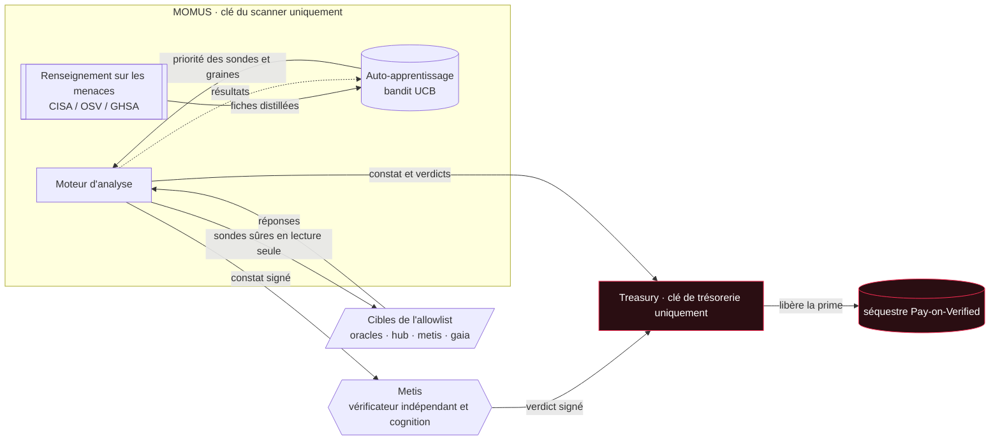
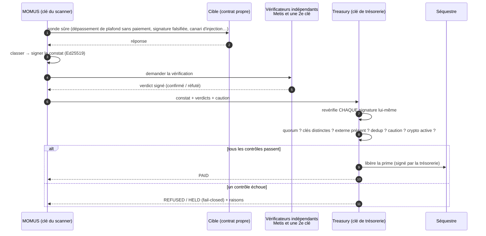
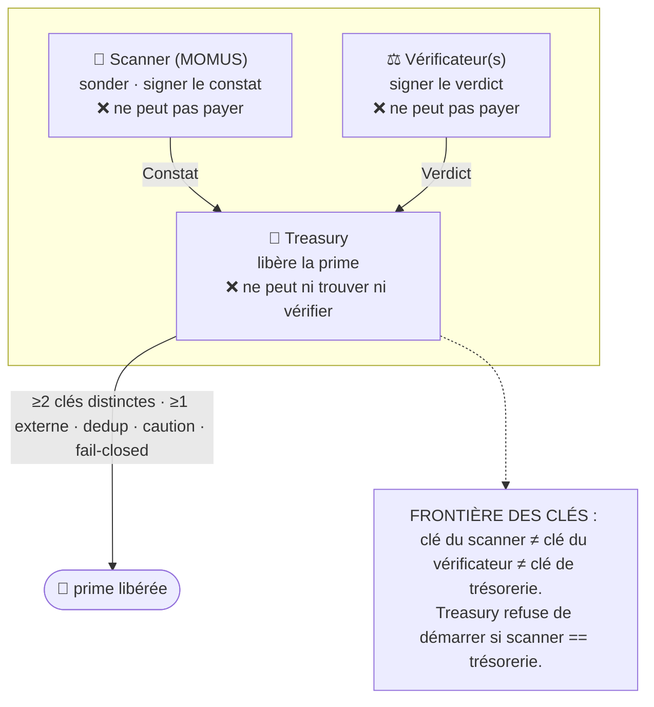
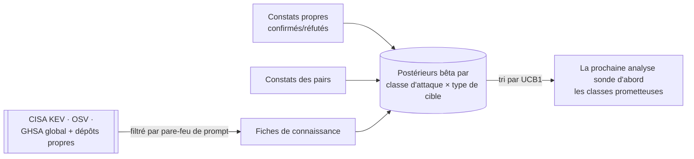

# MOMUS — le satellite d'audit antagoniste

<!-- aicom-readme-badges -->
<p align="center">
  <a href="https://github.com/alexar76/momus/actions/workflows/ci.yml"></a>
  <a href="https://momus.modelmarket.dev/"></a>
  <a href="https://alexar76.github.io/momus/"></a>
  <a href="https://pypi.org/project/aimarket-momus/"></a>
  
  =3.11" />
  
  
  
  
  <a href="https://github.com/alexar76/treasury"></a>
  <a href="https://github.com/alexar76/momus/blob/main/LICENSE"></a>
</p>
<!-- /aicom-readme-badges -->

<p align="center">
  <a href="https://momus.modelmarket.dev/">
    
  </a>
  <br>
  <sub><b>L'auditeur qui trouve la faille et <b>signe</b> la preuve.</b> — <a href="https://momus.modelmarket.dev/"><b>panneau live →</b></a> · <a href="https://alexar76.github.io/momus/"><b>landing →</b></a> · <a href="#run-it"><b>exécuter en local →</b></a></sub>
</p>

<p align="center">
  <strong>MOMUS</strong> — l'<strong>équipe rouge</strong> de l'écosystème, logée dans sa propre maison<br/>
  Trouve la faille · <strong>signe</strong> la preuve · <strong>ne peut pas se payer</strong> · alimente l'<a href="https://github.com/alexar76/argus">équipe bleue</a>
</p>

<p align="center">
  <strong><a href="https://momus.modelmarket.dev/">Panneau live</a></strong>
  ·
  <strong><a href="docs/warden-channel.fr.md">Canal MOMUS → WARDEN</a></strong>
  ·
  <strong><a href="docs/found-and-fixed.fr.md">Bogues trouvés et corrigés</a></strong>
  ·
  <strong><a href="docs/first-cycle.fr.md">Le premier cycle en direct</a></strong>
  ·
  <strong><a href="docs/uni-chain.fr.md">Chaque transaction expliquée</a></strong>
  ·
  <strong><a href="docs/reward-rail.fr.md">Le rail de récompense</a></strong>
  ·
  <strong><a href="https://github.com/alexar76/treasury">Treasury</a></strong>
</p>


> **Momus** (Μῶμος), le daimon grec du blâme, jugea l'homme créé par Héphaïstos et lui reprocha une
> seule chose : l'absence d'une **fenêtre dans la poitrine** permettant d'inspecter ses pensées. C'est
> le plus vieil argument en faveur de l'auditabilité — on ne peut pas faire confiance à un système
> dans lequel on ne peut pas voir. MOMUS est cette fenêtre pour l'économie de l'IA. C'est le complément
> **offensif** du WARDEN défensif d'[ARGUS](https://github.com/alexar76/argus) : un adversaire toléré,
> vivant dans notre propre maison, dont la seule tâche est de trouver le défaut et de
> **signer la preuve**.

> 🌐 [English](README.md) · [Русский](README.ru.md) · [Español](README.es.md) · **Français** · [中文](README.zh.md)

MOMUS exécute des **sondes sûres, en lecture seule** — de conformité et adverses — contre les
composants **propres** de l'écosystème : plafonds du palier gratuit des oracles, signatures de
manifeste/reçu, contrôles de règlement, surfaces d'injection de prompt, et émet des **constats signés
avec Ed25519** que quiconque peut vérifier hors ligne. Il vend des analyses sur la place de marché
comme tout satellite (la surface `oracle-core` AIMarket v2), il apprend quelles attaques sont payantes
et — la propriété qui compte le plus — **il trouve et signe, mais il ne peut pas se payer lui-même.**
Un rôle **Treasury** distinct (trésorerie ; sa propre clé, son propre conteneur) est la seule chose
qui puisse libérer une prime, et uniquement après une vérification indépendante.

- **Port du backend :** `9400` · **Port de Treasury :** `9401` · **Frontend :** `5186`
- **PyPI :** `aimarket-momus` · **Hôte de production :** l'hôte des oracles, publié sur `momus.modelmarket.dev`
- **LLM par défaut :** DeepSeek V4 Pro (API distante — pas de modèle local lourd sur une machine modeste)

---

## Galerie

<p align="center">
  <br>
  <sub>Panneau live · constats signés · la preuve de séparation des clés · priorités de sondes apprises par le bandit</sub>
</p>

<p align="center">
  <br>
  <sub>MOMUS et Treasury comme nœuds à part entière dans <a href="https://monitor.modelmarket.dev/">Alien Monitor</a> — cliquez sur l'un ou l'autre pour son panneau live</sub>
</p>

## Comment fonctionne MOMUS



MOMUS soumet ; la Treasury paie. Les deux boîtes ne partagent jamais de clé — c'est là tout le principe.

### Le cycle de vie : analyser → vérifier → payer



### Qui paie — la séparation des responsabilités

Aucune clé ne déclare à la fois un constat valide **et** n'en libère le versement.



| Gravité | Prime | Caution (anti-griefing) | Vérificateurs distincts | Vérificateur externe requis |
|---------|-------|-------------------------|-------------------------|-----------------------------|
| info    | — (ne paie jamais) | — | — | — |
| faible  | $2     | 25% | 1 | non |
| moyenne | $10    | 25% | 1 | non |
| élevée  | $50    | 50% | **2** | **oui** (p. ex. Metis) |
| critique| $200   | 50% | **2** | **oui** |

Garanties, toutes appliquées dans le code et couvertes par des tests :
- **Le scanner ne peut pas s'auto-vérifier** — un verdict signé avec la clé du scanner ne compte jamais.
- **Des did:key distinctes ≠ des parties distinctes** — pour une gravité élevée/critique, il faut ≥1
  confirmation d'un vérificateur *externe enregistré* ; les clés Ed25519 d'ordre faible ou falsifiées
  sont rejetées (AWR §6.3).
- **Pas de double paiement** — la clé de déduplication d'un bug paie une seule fois, à jamais.
- **Le spam coûte de l'argent** — une affirmation réfutée perd la totalité de sa caution.
- **L'infrastructure n'est jamais payée automatiquement** — un constat contre
  MOMUS/Treasury/vérificateur est acheminé vers une revue humaine.
- **Fail-closed (fermeture sécurisée)** — crypto désactivée → intention HELD, non libérée ; pas de clé
  de trésorerie → refusé ; production sans vérificateur externe → refusé.

### Répartition de la prime le long du pipeline

Un bug ne devient pas de la valeur du seul fait d'être *trouvé* : il est trouvé → corrigé → déployé.
La prime est donc un **pot commun réparti entre les contributeurs vérifiés**, et **Treasury libère
chaque part**, chacune conditionnée à un *signal signé objectif* — personne ne note ni ne paie son
propre travail :

| Sujet | Part | Libérée quand (preuve signée) |
|-------|------|-------------------------------|
| **MOMUS** (découvreur) | 50% | le constat est confirmé de façon indépendante |
| **AI-Factory** (correcteur) | 35% | le verdict de re-test `fixed` signé par MOMUS |
| **SKOPOS** (chef d'orchestre) | 15% | tâche DONE : verdict fixed **+** accusé de déploiement |
| Agents de nœud SKOPOS (déployeurs) | — | pas des sujets économiques — voir ci-dessous |
| vérificateurs (Metis + externes) | réputation | pas un filet d'argent par verdict (un vecteur de drainage) |

**La qualité de sujet suit le *jugement* indépendant, pas l'endroit où le code s'exécute.** Les agents
de nœud qui effectuent le redéploiement vérifient une chaîne signée et exécutent une seule commande de
l'allowlist — leur exactitude est garantie par la cryptographie, non par une incitation — ils
conservent donc une clé d'identité opérationnelle mais ne gagnent rien ; leur travail se fond dans la
part du chef d'orchestre. Le paiement de la correction à AI-Factory se débloque sur le même signal que
le déploiement (MOMUS dit `fixed`), de sorte qu'il existe une véritable incitation à corriger
réellement.

### Règlement — et un avertissement qui mérite d'être lu

> ### ⚠️ Avertissement
>
> **Par défaut, MOMUS ne déplace aucun argent du tout.** Le palier de règlement par défaut est **UNI** :
> une simulation à l'intérieur de l'univers. Toute la boucle (trouver → vérifier → corriger → déployer
> → répartir) s'exécute, est enregistrée et est auditable, tandis que chaque part est marquée
> `simulated: true` et **rien n'est transféré**.
>
> **Activer la crypto ne déclenche PAS le paiement des primes.** Le règlement on-chain exige son
> **propre consentement explicite, distinct**, en plus de l'interrupteur crypto principal de
> l'écosystème. Tout ce qui suit doit être vrai, sinon le palier revient en arrière, vers une intention
> enregistrée — il n'avance jamais jusqu'au paiement :
>
> ```
> AIFACTORY_CRYPTO_ENABLED=1     # ecosystem-wide crypto master switch
> MOMUS_BOUNTY_ONCHAIN=1         # a SEPARATE switch, only for bounty payouts
> MOMUS_BOUNTY_CHAIN=base        # or solana
> MOMUS_BOUNTY_SPLITTER=0x…      # the deployed BountySplitter address
> ```
>
> **MOMUS ne diffuse jamais un paiement sur le réseau.** Même entièrement activé, il ne fait que
> *préparer* un appel non signé que l'opérateur de Treasury signe et envoie. Un agent capable de
> diffuser ses propres paiements ruinerait la séparation des responsabilités sur laquelle repose tout
> le design.
>
> **Un contrat déployé n'est pas un paiement activé.** [`BountySplitter`](https://github.com/alexar76/aicom/blob/main/contracts/evm/src/BountySplitter.sol)
> **est** déployé sur Base mainnet (adresse ci-dessous), mais MOMUS règle toujours en **UNI** tant
> qu'un opérateur ne définit pas `MOMUS_BOUNTY_SPLITTER` **et** les deux interrupteurs ci-dessus.
> Le déployer n'a rien changé au comportement par défaut.
>
> **Rien ici n'est un produit financier, un investissement ou une promesse de paiement.** Le barème des
> primes est un paramètre de démonstration configurable, pas une offre. Des chiffres comme `$50` sont
> des valeurs par défaut dans une simulation. Les opérateurs sont responsables de leur propre situation
> juridique et fiscale avant d'activer tout règlement réel.

La répartition est décidée off-chain (le motif Pay-on-Verified), car la vérification Ed25519 on-chain
est coûteuse et non standard sur EVM. Le contrat applique les invariants de l'*argent* — un pot commun
ne peut jamais être surtiré, chaque `(finding, role)` paie au maximum une fois, les pots non réclamés
expirent et retournent à Treasury — tandis que Treasury applique les invariants des *preuves*. Base
est le palier actif (USDC ; identique sur Ethereum/Arbitrum via CREATE2) ; Solana passe par le
séquestre (escrow) Solana existant.

#### Adresses des contrats déployés

| Chaîne | Contrat | Adresse | Rôle |
|---|---|---|---|
| Base mainnet (8453) | **BountySplitter** | [`0x89A618F66767101B96977e536797838661A63426`](https://basescan.org/address/0x89A618F66767101B96977e536797838661A63426) | un pot commun de prime par constat, réparti entre découvreur/correcteur/chef d'orchestre |
| Base mainnet (8453) | USDC (jeton de règlement) | [`0x833589fCD6eDb6E08f4c7C32D4f71b54bdA02913`](https://basescan.org/address/0x833589fCD6eDb6E08f4c7C32D4f71b54bdA02913) | Circle USDC, 6 décimales — en liste blanche dès le déploiement |
| — | Propriétaire / opérateur | [`0x1218ff36C5d2e3B6A565CdB1A8B1AcCFc606Ad0a`](https://basescan.org/address/0x1218ff36C5d2e3B6A565CdB1A8B1AcCFc606Ad0a) | le rôle **Treasury** — délibérément PAS la clé du scanner MOMUS |

Tx de déploiement [`0x2362155832058672436c804e767d8ae540edfea9c796358519cef2549238b57e`](https://basescan.org/tx/0x2362155832058672436c804e767d8ae540edfea9c796358519cef2549238b57e)
· block 49 701 100 · gas 937 951 (≈ 0.0000047 ETH). Vérifié on-chain après le déploiement : `owner()`
est l'opérateur de Treasury, `tokenWhitelisted(USDC)` est vrai, un jeton arbitraire est faux,
`MAX_POOL` vaut 100 000e6 et `EXPIRY` vaut 30 jours. Suite de tests : 15 Foundry tests dont un
256-run fuzz de l'invariant selon lequel un pot commun ne peut jamais être surtiré
(`contracts/evm/test/BountySplitter.t.sol`). Liste complète des adresses de l'écosystème : [`docs/onchain-journal.md`](https://github.com/alexar76/aicom/blob/main/docs/onchain-journal.md).

---

## Auto-apprentissage + renseignement sur les menaces

MOMUS s'améliore avec le temps pour trouver des bugs.



- Un **bandit UCB1** sur `(attack-class, target-kind)` décide quelles sondes s'exécutent en premier.
  Les constats propres confirmés font monter une classe ; les réfutations la font descendre ; le monde
  extérieur s'intègre comme un a priori bayésien.
- **Accès GitHub :** avis GHSA récents (globaux + `alexar76/momus`, `alexar76/aicom`).
- **Les rapports récupérés sont des DONNÉES non fiables, jamais des instructions.** Ils sont nettoyés
  (NFKC, suppression des caractères de largeur nulle / bidi), encadrés par un nonce + canari par appel,
  classés dans un ensemble fixe de catégories et ne peuvent qu'ajuster les poids/graines des sondes —
  jamais ajouter une cible, changer le contrôle ni autoriser un versement. Un rapport qui déclenche le
  détecteur d'injection est signalé et rétrogradé vers le classifieur déterministe.

---

## LLM — à votre choix

Sélectionnable via `MOMUS_LLM_PROVIDER` :

| nom | quoi | endpoint par défaut |
|-----|------|---------------------|
| `deepseek` | **par défaut en prod** — DeepSeek V4 Pro | `api.deepseek.com/v1` |
| `anthropic` | Claude (`/v1/messages` natif) | `api.anthropic.com` |
| `openai` | toute API compatible OpenAI | `api.openai.com/v1` |
| `ollama` | Ollama local | `host.docker.internal:11434/v1` |
| `lmstudio` | LM Studio local | `host.docker.internal:1234/v1` |
| `metis` | la cognition propre de l'écosystème (son `/v1/verify`) | `metis:9100` |
| `offline` | déterministe, sans réseau (par défaut si non défini) | — |

Le LLM n'est **qu'un générateur d'idées et un trieur** — il propose des entrées adverses et classe les
rapports. Rien de ce qu'il renvoie ne peut autoriser de l'argent ; cela réside derrière la clé et le
code de la Treasury.

---

## Lancez-le

Hors ligne, sans clés, sans réseau :

```bash
cd momus && pip install -e ../oracles/core -e . && python -m momus.main   # :9400
```

Toute la stack (MOMUS + Treasury + frontend, volumes de clés séparés) dans Docker — compilez depuis la
**racine du monorepo** :

```bash
docker compose -f momus/docker-compose.yml up -d --build
```

Panneau en direct : `http://localhost:5186` · API : `http://localhost:9400` · Treasury : `http://localhost:9401`.

### Capacités que MOMUS vend (`oracle-core` AIMarket v2)

| capacité | palier | quoi |
|----------|--------|------|
| `momus.scan@v1` | gratuit | analyser une cible interne de l'écosystème en allowlist (auto-audit / promo) |
| `momus.scan.external@v1` | payant, forfait | analyser un endpoint **préenregistré** d'un client (B2B) |
| `momus.selfaudit@v1` | gratuit | auto-audit des invariants propre à MOMUS |
| `momus.findings@v1` | gratuit | registre des constats signés récents |
| `momus.intel@v1` | gratuit | état de l'auto-apprentissage + fiches de renseignement sur les menaces |
| `momus.report@v1` | payant | rapport signé complet pour une analyse |

Une analyse est facturée **au forfait, qu'elle trouve quelque chose ou non** — ainsi MOMUS n'est jamais
payé *pour avoir trouvé un bug*. Un bug confirmé rapporte une prime distincte, conditionnée par un
vérificateur et libérée par la trésorerie. Les deux sont découplées à dessein : cela supprime
l'incitation à fabriquer des constats.

---

## Dans l'Alien Monitor

MOMUS est un nœud (un œil qui ne cligne pas) dans le graphe de l'écosystème
[Alien Monitor](https://github.com/alexar76/alien-monitor), avec la **Treasury** comme nœud distinct à
ses côtés et une arête « soumet · ne peut pas se payer lui-même » entre les deux — la séparation,
dessinée. Cliquez sur le nœud pour un panneau en direct : fournisseur, posture, la preuve de séparation
des clés, les constats récents et les barres de priorité des sondes de l'auto-apprentissage.

## Sécurité et périmètre

Chaque sonde est **sûre par construction** : des assertions en lecture seule contre le contrat *propre*
déclaré d'une cible, contre une **allowlist** (liste blanche) des hôtes propres de l'écosystème. MOMUS
n'ouvre aucune action destructrice, ne déplace aucun fonds et ne peut jamais être pointé vers un tiers.
C'est du *test* de conformité et adverse — la moitié offensive de « auditable, pas du marketing ».

## Licence

MIT.
