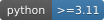
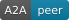
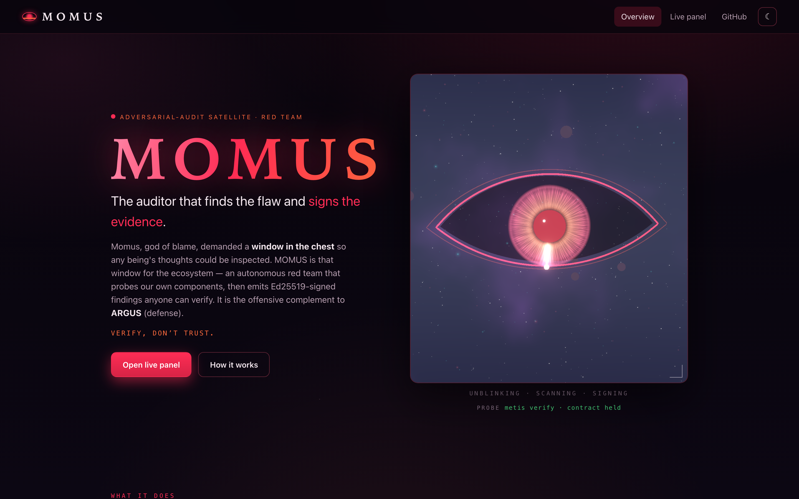
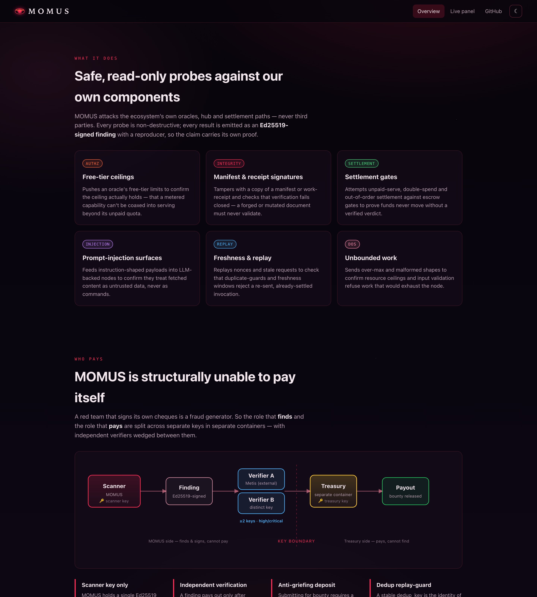
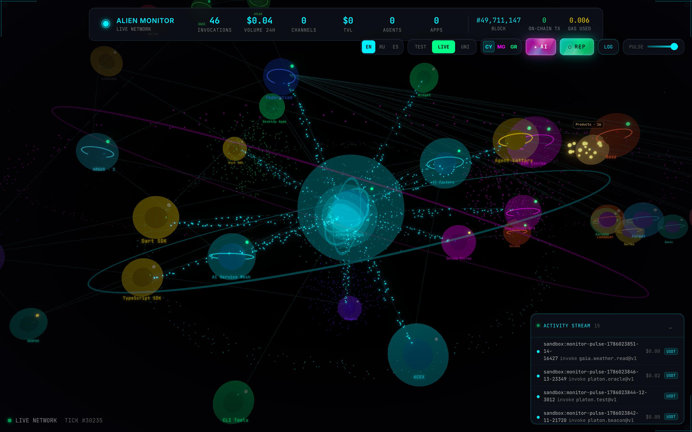
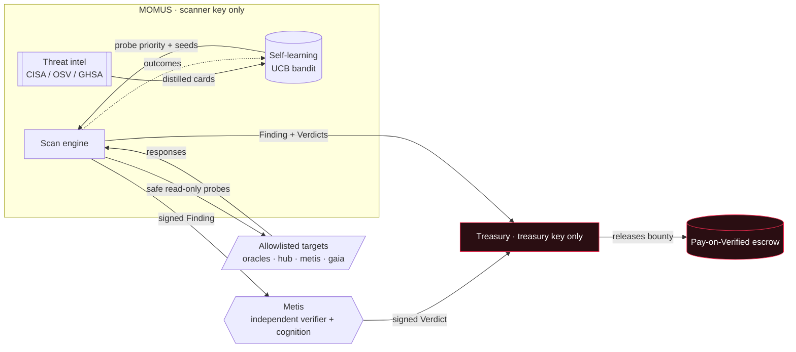
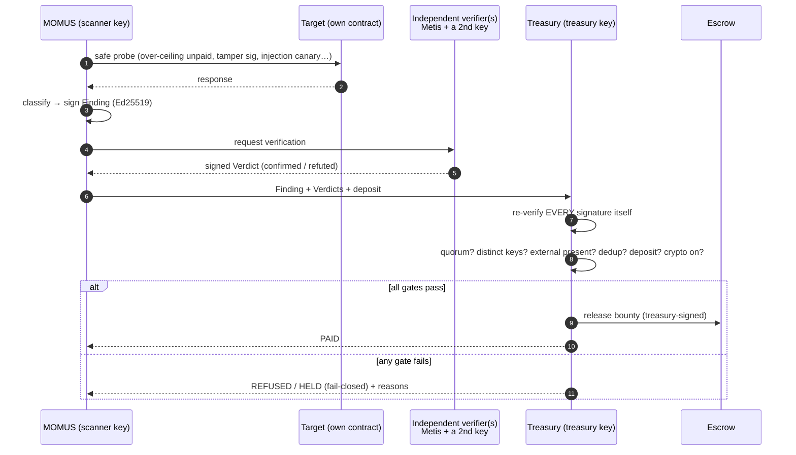
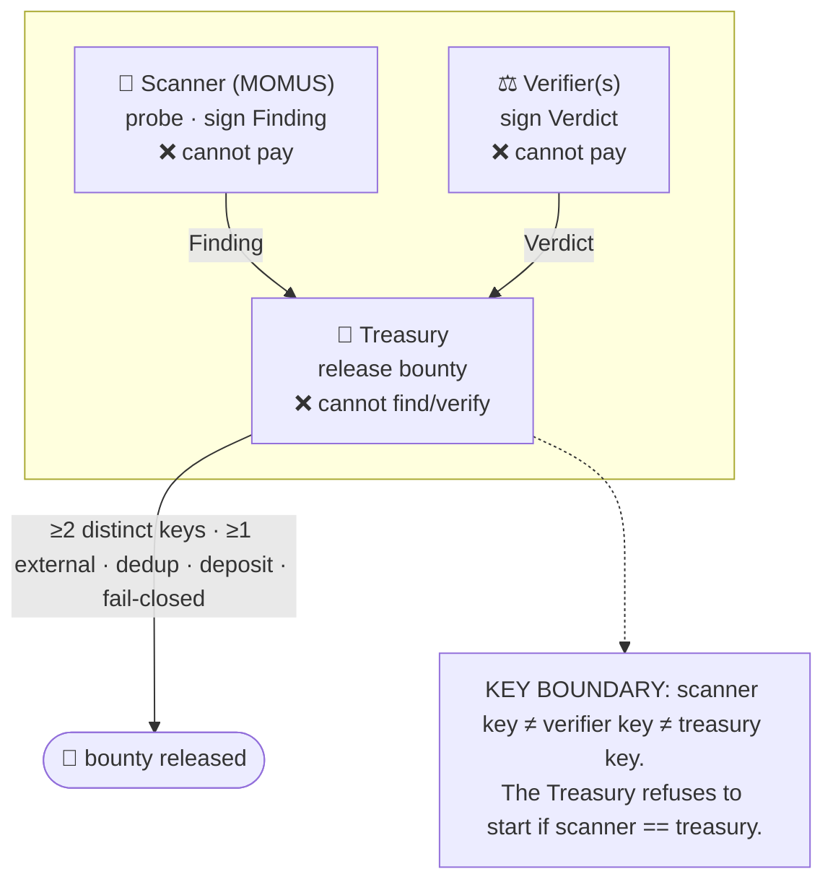
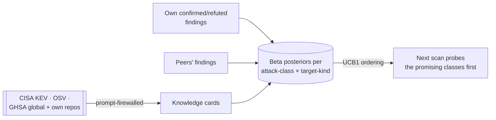

# MOMUS

<!-- aicom-readme-badges -->
<p align="center">
  <a href="https://github.com/alexar76/momus/actions/workflows/ci.yml"></a>
  <a href="https://momus.modelmarket.dev/"></a>
  <a href="https://alexar76.github.io/momus/"></a>
  <a href="https://pypi.org/project/aimarket-momus/"></a>
  
  =3.11" />
  
  
  
  
  <a href="https://github.com/alexar76/treasury"></a>
  <a href="https://github.com/alexar76/momus/blob/main/LICENSE"></a>
</p>
<!-- /aicom-readme-badges -->

<p align="center">
  <a href="https://momus.modelmarket.dev/">
    
  </a>
  <br>
  <sub><b>The auditor that finds the flaw and signs the evidence.</b> — <a href="https://momus.modelmarket.dev/"><b>live panel →</b></a> · <a href="https://alexar76.github.io/momus/"><b>landing →</b></a> · <a href="#run-it"><b>run locally →</b></a></sub>
</p>

<p align="center">
  <strong>MOMUS</strong> — the ecosystem's <strong>red team</strong>, living in its own house<br/>
  Finds the flaw · <strong>signs</strong> the evidence · <strong>cannot pay itself</strong> · feeds the <a href="https://github.com/alexar76/argus">blue team</a>
</p>

<p align="center">
  <strong><a href="https://momus.modelmarket.dev/">Live panel</a></strong>
  ·
  <strong><a href="docs/warden-channel.md">MOMUS → WARDEN channel</a></strong>
  ·
  <strong><a href="docs/found-and-fixed.md">Bugs actually found & fixed</a></strong>
  ·
  <strong><a href="docs/first-cycle.md">The first live cycle</a></strong>
  ·
  <strong><a href="docs/uni-chain.md">Every transaction explained</a></strong>
  ·
  <strong><a href="https://github.com/alexar76/treasury">Treasury</a></strong>
</p>

> 🌐 **English** · [Русский](README.ru.md) · [Español](README.es.md) · [Français](README.fr.md) · [中文](README.zh.md)

> **Momus** (Μῶμος), the Greek daimon of blame, judged Hephaestus's man and faulted him for one
> thing: no **window in the chest** through which his thoughts could be inspected. That is the
> oldest argument for auditability — a system you cannot see into cannot be trusted. MOMUS is that
> window for the AI-economy. It is the **offensive** complement to [ARGUS](https://github.com/alexar76/argus)'s
> defensive WARDEN: a tolerated adversary, living in our own house, whose only job is to find the flaw
> and **sign the evidence**.

MOMUS runs **safe, read-only** conformance/adversarial probes against the ecosystem's **own**
components — oracle free-tier ceilings, manifest/receipt signatures, settlement gates,
prompt-injection surfaces — and emits **Ed25519-signed findings** anyone can verify offline. It
sells scans on the marketplace like any satellite (the `oracle-core` AIMarket v2 surface), it
learns which attacks pay off, and — the property that matters most — **it finds and signs, but it
cannot pay itself.** A separate **Treasury** role (its own key, its own container) is the only
thing that can release a bounty, and only on independent verification.

- **Backend port:** `9400` (`9410` in prod — `:9400` there belongs to the oracle family) · **Treasury:** `9401`/`9411` · **Frontend:** `5186`
- **Live:** [momus.modelmarket.dev](https://momus.modelmarket.dev/) on the oracle host · **PyPI:** `aimarket-momus`
- **Default LLM:** DeepSeek V4 Pro (remote API — no heavy local model on a modest box)

## Gallery

<p align="center">
  <br>
  <sub>Live panel · signed findings · the key-separation proof · probe priorities the bandit learned</sub>
</p>

<p align="center">
  <br>
  <sub>MOMUS and Treasury as their own nodes in the <a href="https://magic-ai-factory.com/monitor/">Alien Monitor</a> — click either for its live panel</sub>
</p>

## What makes it not-a-scanner

| | |
|---|---|
| 🔴 **Finds and signs, cannot pay** | The scanner key never releases money. A separately-keyed [Treasury](https://github.com/alexar76/treasury) pays, and only on **independent** verification — HIGH severity needs two distinct verifiers, one of them external. |
| 🧭 **Honest outcomes** | `FINDING` / `NO_FINDING` / **`INCONCLUSIVE`**. An unreachable target is neither a finding nor a pass — a red team that cries wolf is worth nothing, and [one such false positive](docs/found-and-fixed.md) is documented. |
| 🔧 **A fix loop, not a report** | A confirmed finding becomes an A2A ticket to SKOPOS, which drives the Factory to patch it, asks MOMUS to re-test as the **deploy gate**, then signs a DeployOrder a node agent claims and verifies locally. |
| 🛡 **Feeds the blue team** | Confirmed third-party findings are published as a signed feed [ARGUS's WARDEN firewall](docs/warden-channel.md) already knows how to verify — accepted on production by **ARGUS's own verifier**. |
| 📚 **Self-learning** | A UCB1 bandit over per-(attack-class, target-kind) Beta posteriors, plus external advisories as a recency-decayed prior. It gets better at guessing where to look. |
| 🧾 **Its own corpus** | Every finding persists (SQLite by default, Postgres on a DSN) with a **deterministic** dedup identity, so one bug is never paid twice and a rediscovery bumps `seen_count`. |

---

## How MOMUS works



MOMUS submits; the Treasury pays. The two boxes never share a key — that is the whole design.

### The scan → verify → pay lifecycle



### Who pays — the separation of duties

No single key both declares a finding valid **and** releases its payout.



| Severity | Bounty | Deposit (anti-griefing) | Distinct verifiers | External verifier required |
|----------|--------|-------------------------|--------------------|----------------------------|
| info     | — (never pays) | — | — | — |
| low      | $2     | 25% | 1 | no |
| medium   | $10    | 25% | 1 | no |
| high     | $50    | 50% | **2** | **yes** (e.g. Metis) |
| critical | $200   | 50% | **2** | **yes** |

Guarantees, all enforced in code and covered by tests:
- **Scanner can't self-verify** — a verdict signed by the scanner key never counts.
- **Distinct did:keys ≠ distinct parties** — high/critical need ≥1 confirmation from a *registered
  external* verifier; small-order/forged Ed25519 keys are rejected (AWR §6.3).
- **No double pay** — a bug's dedup key pays once, ever.
- **Spam costs money** — a refuted claim forfeits its whole deposit.
- **Infra is never auto-paid** — a finding against MOMUS/Treasury/verifier routes to human review.
- **Fail-closed** — crypto off → HELD intent, not released; no treasury key → refused; prod without
  an external verifier → refused.

### Splitting the bounty across the pipeline

A bug isn't *found* into value — it's found → fixed → deployed. So the bounty is a **pool split
across the verified contributors**, and the **Treasury releases every share**, each gated on an
*objective signed signal* — nobody grades or pays their own work:

| Subject | Share | Released when (signed evidence) |
|---------|-------|---------------------------------|
| **MOMUS** (finder) | 50% | the finding is independently confirmed |
| **AI-Factory** (fixer) | 35% | MOMUS's signed `fixed` re-test verdict |
| **SKOPOS** (conductor) | 15% | job DONE: fixed verdict **+** deploy ack |
| SKOPOS node agents (deployers) | — | not economic subjects — see below |
| verifiers (Metis + external) | reputation | not a per-verdict cash drip (a drain vector) |

**Subjecthood tracks independent *judgment*, not where code runs.** The node agents that perform
the redeploy verify a signed chain and run one allowlisted command — their correctness is
guaranteed by cryptography, not by an incentive — so they keep an operational identity key but earn
nothing; their work folds into the conductor's share. The Factory's fix-payment unlocks on the same
signal that unlocks the deploy (MOMUS says `fixed`), so there is a real incentive to actually fix.

### Settlement — and a disclaimer worth reading

> ### ⚠️ Disclaimer
>
> **By default MOMUS moves no money at all.** The default settlement tier is **UNI** — a simulation
> inside the universe. The whole loop (find → verify → fix → deploy → split) runs, is recorded and
> is auditable, while every share is marked `simulated: true` and **nothing is transferred**.
>
> **Turning crypto on does NOT start paying bounties.** On-chain settlement needs its **own,
> separate opt-in** on top of the ecosystem crypto master switch. All of the following must be true,
> or the tier falls back to a recorded intent — it never falls forward into paying:
>
> ```
> AIFACTORY_CRYPTO_ENABLED=1     # ecosystem-wide crypto master switch
> MOMUS_BOUNTY_ONCHAIN=1         # a SEPARATE switch, only for bounty payouts
> MOMUS_BOUNTY_CHAIN=base        # or solana
> MOMUS_BOUNTY_SPLITTER=0x…      # the deployed BountySplitter address
> ```
>
> **MOMUS never broadcasts a payout.** Even fully enabled, it only *prepares* an unsigned call for
> the Treasury operator to sign and send. An agent able to broadcast its own payouts would defeat
> the separation of duties the whole design rests on.
>
> **A deployed contract is not an enabled payout.** [`BountySplitter`](../contracts/evm/src/BountySplitter.sol)
> *is* deployed on Base mainnet (address below), but MOMUS still settles in **UNI** until an
> operator sets `MOMUS_BOUNTY_SPLITTER` **and** both opt-in switches above. Deploying it changed
> nothing about the default behaviour.
>
> **Nothing here is a financial product, an investment, or a promise of payment.** The bounty
> schedule is a configurable demo parameter, not an offer. Figures like `$50` are defaults in a
> simulation. Operators are responsible for their own legal and tax position before enabling any
> real settlement.

The split is decided off-chain (the Pay-on-Verified pattern), because on-chain Ed25519 verification
is costly and non-standard on EVM. The contract enforces the *money* invariants — a pool can never
be over-drawn, each `(finding, role)` pays at most once, unclaimed pools expire back to the
Treasury — while the Treasury enforces the *evidence* invariants. Base is the live tier (USDC;
identical on Ethereum/Arbitrum via CREATE2); Solana routes through the existing Solana escrow.

#### Deployed contract addresses

| Chain | Contract | Address | Role |
|---|---|---|---|
| Base mainnet (8453) | **BountySplitter** | [`0x89A618F66767101B96977e536797838661A63426`](https://basescan.org/address/0x89A618F66767101B96977e536797838661A63426) | one bounty pool per finding, split across finder/fixer/conductor |
| Base mainnet (8453) | USDC (settlement token) | [`0x833589fCD6eDb6E08f4c7C32D4f71b54bdA02913`](https://basescan.org/address/0x833589fCD6eDb6E08f4c7C32D4f71b54bdA02913) | Circle USDC, 6 decimals — whitelisted at deploy |
| — | Owner / operator | [`0x1218ff36C5d2e3B6A565CdB1A8B1AcCFc606Ad0a`](https://basescan.org/address/0x1218ff36C5d2e3B6A565CdB1A8B1AcCFc606Ad0a) | the **Treasury** role — deliberately NOT the MOMUS scanner key |

Deploy tx [`0x2362155832058672436c804e767d8ae540edfea9c796358519cef2549238b57e`](https://basescan.org/tx/0x2362155832058672436c804e767d8ae540edfea9c796358519cef2549238b57e)
· block 49 701 100 · gas 937 951 (≈ 0.0000047 ETH). Verified on-chain after deploy: `owner()` is the
Treasury operator, `tokenWhitelisted(USDC)` is true, an arbitrary token is false, `MAX_POOL` is
100 000e6 and `EXPIRY` is 30 days. Test suite: 15 Foundry tests including a 256-run fuzz of the
never-over-draw invariant (`contracts/evm/test/BountySplitter.t.sol`). Full ecosystem address list:
[`docs/onchain-journal.md`](../docs/onchain-journal.md).

---

## Self-learning + threat intelligence

MOMUS gets better at finding bugs over time.



- A **UCB1 bandit** over `(attack-class, target-kind)` decides which probes run first. Own confirmed
  findings raise a class; refutations lower it; the outside world folds in as a Bayesian prior.
- **GitHub access:** fresh GHSA advisories (global + `alexar76/momus`, `alexar76/aicom`).
- **Fetched reports are untrusted DATA, never instructions.** They are scrubbed (NFKC, zero-width /
  bidi stripped), fenced with a per-call nonce + canary, classified into a fixed category set, and
  can only nudge probe weights/seeds — never add a target, change the gate, or authorize a payout.
  A report that trips the injection detector is flagged and downgraded to the deterministic classifier.

---

## LLMs — your choice

Selectable via `MOMUS_LLM_PROVIDER`:

| name | what | default endpoint |
|------|------|------------------|
| `deepseek` | **prod default** — DeepSeek V4 Pro | `api.deepseek.com/v1` |
| `anthropic` | Claude (native `/v1/messages`) | `api.anthropic.com` |
| `openai` | any OpenAI-compatible API | `api.openai.com/v1` |
| `ollama` | local Ollama | `host.docker.internal:11434/v1` |
| `lmstudio` | local LM Studio | `host.docker.internal:1234/v1` |
| `metis` | the ecosystem's own cognition (its `/v1/verify`) | `metis:9100` |
| `offline` | deterministic, no network (default when unset) | — |

The LLM is an **idea generator and triager only** — it proposes adversarial inputs and classifies
reports. Nothing it returns can authorize money; that lives behind the Treasury's key and code.

---

## Run it

Offline, no keys, no network:

```bash
cd momus && pip install -e ../oracles/core -e . && python -m momus.main   # :9400
```

The whole stack (MOMUS + Treasury + frontend, separate key volumes) in Docker — build from the
**monorepo root**:

```bash
docker compose -f momus/docker-compose.yml up -d --build
```

Live panel: `http://localhost:5186` · API: `http://localhost:9400` · Treasury: `http://localhost:9401`.

### Capabilities MOMUS sells (`oracle-core` AIMarket v2)

| capability | tier | what |
|------------|------|------|
| `momus.scan@v1` | free | scan an ecosystem-internal allowlisted target (self-audit / promo) |
| `momus.scan.external@v1` | paid, flat | scan a customer's **pre-registered** endpoint (B2B) |
| `momus.selfaudit@v1` | free | MOMUS's own invariant self-audit |
| `momus.findings@v1` | free | recent signed findings registry |
| `momus.intel@v1` | free | self-learning state + threat-intel cards |
| `momus.report@v1` | paid | full signed report for one scan |

A scan is priced **flat, whether or not it finds anything** — so MOMUS is never paid *for finding a
bug*. A confirmed bug earns a separate, verifier-gated, treasury-released bounty. The two are
decoupled on purpose: it removes the incentive to fabricate.

---

## In the Alien Monitor

MOMUS is a node (an unblinking eye) in the [Alien Monitor](https://github.com/alexar76/alien-monitor)
ecosystem graph, with the **Treasury** as a separate node beside it and a "submits · cannot pay
itself" edge between them — the separation, drawn. Click the node for a live panel: provider, posture,
the key-separation proof, recent findings, and the self-learning probe-priority bars.

## Has it ever actually fired?

Yes, and it is written down: [**the first complete cycle on production**](docs/first-cycle.md)
(2026-08-08) — a real signed finding, two independent confirmations, a fix, the re-test gate, and a
split payout, with every identifier recorded so you can check rather than believe. That run is also
where the gate **refused its own author** for supplying only one verifier, and where MOMUS was caught
reporting a false positive against an unreachable target — both fixed and documented there.

## Security & scope

Every probe is **safe by construction**: read-only assertions against a target's *own* declared
contract, against an **allowlist** of the ecosystem's own hosts. MOMUS opens no destructive action,
moves no funds, and can never be pointed at a third party. It is conformance and adversarial
*testing* — the offensive half of "auditable, not marketing."

## License

MIT.
