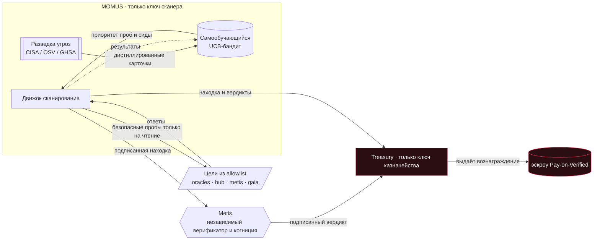
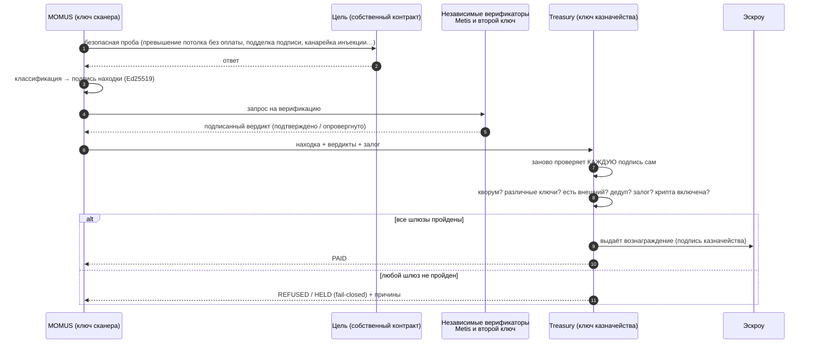
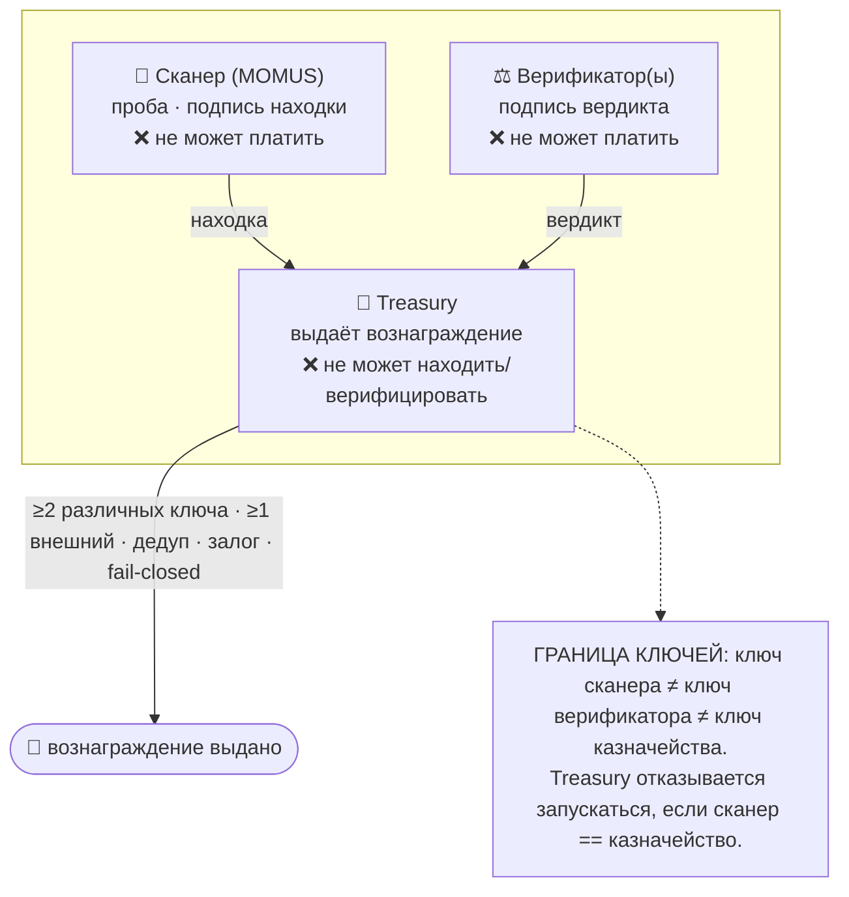
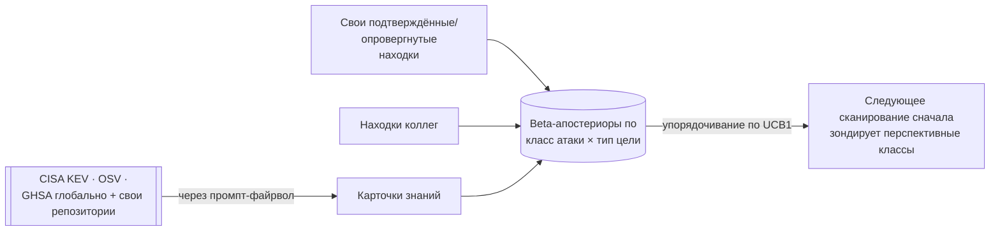

# MOMUS — спутник состязательного аудита

> **Momus** (Μῶμος), греческий даймон порицания, судил человека, созданного Гефестом, и поставил
> ему в вину лишь одно: у него не было **окна в груди**, через которое можно было бы осмотреть его
> мысли. Это древнейший аргумент в пользу проверяемости (auditability) — системе, внутрь которой
> нельзя заглянуть, нельзя доверять. MOMUS — это такое окно для ИИ-экономики. Он — **наступательное**
> дополнение к оборонительному WARDEN из [ARGUS](https://github.com/alexar76/argus): терпимый
> противник, живущий в нашем собственном доме, единственная задача которого — найти изъян и
> **подписать доказательство**.

> 🌐 [English](README.md) · **Русский** · [Español](README.es.md) · [Français](README.fr.md) · [中文](README.zh.md)

MOMUS запускает **безопасные пробы только на чтение** — на соответствие и состязательные — против
**собственных** компонентов экосистемы: потолки бесплатного тарифа оракулов, подписи
манифестов/квитанций, шлюзы расчёта, поверхности промпт-инъекций (prompt injection) — и выдаёт
**находки, подписанные Ed25519**, которые любой может проверить офлайн. Он продаёт сканирования на
маркетплейсе, как любой спутник (поверхность `oracle-core` AIMarket v2), он учится тому, какие атаки
окупаются, и — самое важное свойство — **он находит и подписывает, но не может заплатить сам себе.**
Отдельная роль **Treasury** (казначейство; свой ключ, свой контейнер) — единственное, что может
выдать вознаграждение (bounty), и только по независимой верификации.

- **Порт бэкенда:** `9400` · **Порт Treasury:** `9401` · **Фронтенд:** `5186`
- **PyPI:** `aimarket-momus` · **Прод-хост:** сервер 2 (`modeldev`), опубликован на `redteam.modelmarket.dev`
- **LLM по умолчанию:** DeepSeek V4 Pro (удалённый API — никакой тяжёлой локальной модели на скромной машине)

---

## Как работает MOMUS



MOMUS подаёт заявку; платит Treasury. Эти два блока никогда не разделяют один ключ — в этом весь замысел.

### Жизненный цикл: сканирование → верификация → оплата



### Кто платит — разделение обязанностей

Ни один ключ не может одновременно и объявить находку действительной, **и** выдать по ней выплату.



| Серьёзность | Вознаграждение | Залог (anti-griefing) | Различные верификаторы | Требуется внешний верификатор |
|-------------|----------------|-----------------------|------------------------|-------------------------------|
| инфо        | — (никогда не платит) | — | — | — |
| низкая      | $2     | 25% | 1 | нет |
| средняя     | $10    | 25% | 1 | нет |
| высокая     | $50    | 50% | **2** | **да** (напр. Metis) |
| критическая | $200   | 50% | **2** | **да** |

Гарантии — все реализованы в коде и покрыты тестами:
- **Сканер не может верифицировать сам себя** — вердикт, подписанный ключом сканера, никогда не засчитывается.
- **Различные did:key ≠ различные стороны** — для серьёзности «высокая»/«критическая» требуется ≥1
  подтверждение от *зарегистрированного внешнего* верификатора; ключи Ed25519 малого порядка или
  поддельные отклоняются (AWR §6.3).
- **Никаких двойных выплат** — ключ дедупликации бага оплачивается ровно один раз, навсегда.
- **Спам стоит денег** — опровергнутое заявление теряет весь свой залог.
- **Инфраструктура никогда не оплачивается автоматически** — находка против
  MOMUS/Treasury/верификатора направляется на ручную проверку человеком.
- **Fail-closed (отказ в безопасную сторону)** — крипта выключена → намерение HELD, не выдаётся; нет
  ключа казначейства → отказ; прод без внешнего верификатора → отказ.

### Разделение вознаграждения по конвейеру

Баг не превращается в ценность одним лишь *нахождением* — он проходит путь: найден → исправлен →
развёрнут. Поэтому вознаграждение — это **пул, разделяемый между верифицированными участниками**, и
**каждую долю выдаёт Treasury**, причём каждая привязана к *объективному подписанному сигналу* —
никто не оценивает и не оплачивает собственную работу:

| Субъект | Доля | Выдаётся, когда (подписанное доказательство) |
|---------|------|----------------------------------------------|
| **MOMUS** (нашедший) | 50% | находка независимо подтверждена |
| **AI-Factory** (исправляющий) | 35% | подписанный MOMUS вердикт повторной проверки `fixed` |
| **SKOPOS** (дирижёр) | 15% | задача DONE: вердикт fixed **+** подтверждение развёртывания |
| Узловые агенты SKOPOS (развёртывающие) | — | не экономические субъекты — см. ниже |
| верификаторы (Metis + внешние) | репутация | не денежный ручеёк за каждый вердикт (вектор утечки средств) |

**Субъектность определяется независимостью *суждения*, а не тем, где выполняется код.** Узловые
агенты, выполняющие повторное развёртывание, проверяют подписанную цепочку и запускают одну команду
из allowlist — их корректность гарантирована криптографией, а не стимулом, — поэтому они сохраняют
операционный ключ идентичности, но не зарабатывают ничего; их работа сворачивается в долю дирижёра.
Выплата AI-Factory за исправление разблокируется тем же сигналом, что разблокирует развёртывание
(MOMUS говорит `fixed`), так что стимул действительно исправлять — настоящий.

### Расчёт — и дисклеймер, который стоит прочитать

> ### ⚠️ Дисклеймер
>
> **По умолчанию MOMUS не перемещает никаких денег вообще.** Уровень расчёта по умолчанию — **UNI**,
> симуляция внутри вселенной. Весь цикл (найти → верифицировать → исправить → развернуть →
> разделить) выполняется, записывается и поддаётся аудиту, при этом каждая доля помечена как
> `simulated: true`, и **ничего не переводится**.
>
> **Включение крипты НЕ начинает выплачивать вознаграждения.** Ончейн-расчёт требует **собственного,
> отдельного явного включения** поверх главного крипто-переключателя экосистемы. Всё перечисленное
> ниже должно быть выполнено, иначе уровень откатывается назад — к записанному намерению; вперёд, к
> оплате, он не смещается никогда:
>
> ```
> AIFACTORY_CRYPTO_ENABLED=1     # ecosystem-wide crypto master switch
> MOMUS_BOUNTY_ONCHAIN=1         # a SEPARATE switch, only for bounty payouts
> MOMUS_BOUNTY_CHAIN=base        # or solana
> MOMUS_BOUNTY_SPLITTER=0x…      # the deployed BountySplitter address
> ```
>
> **MOMUS никогда не транслирует выплату в сеть.** Даже при полностью включённых настройках он лишь
> *готовит* неподписанный вызов, который оператор Treasury подписывает и отправляет. Агент,
> способный сам транслировать свои выплаты, разрушил бы разделение обязанностей, на котором держится
> весь дизайн.
>
> **Развёрнутый контракт — это ещё не включённые выплаты.** [`BountySplitter`](../contracts/evm/src/BountySplitter.sol)
> **развёрнут** в Base mainnet (адрес ниже), но MOMUS по-прежнему рассчитывается в **UNI**, пока
> оператор не задаст `MOMUS_BOUNTY_SPLITTER` **и** оба тумблера выше. Сам факт развёртывания ничего
> не изменил в поведении по умолчанию.
>
> **Ничто здесь не является финансовым продуктом, инвестицией или обещанием выплаты.** Сетка
> вознаграждений — настраиваемый демонстрационный параметр, а не предложение. Числа вроде `$50` —
> значения по умолчанию в симуляции. Операторы сами отвечают за своё юридическое и налоговое
> положение, прежде чем включать какой-либо реальный расчёт.

Разделение долей решается офчейн (паттерн Pay-on-Verified), потому что ончейн-проверка Ed25519
дорога и нестандартна на EVM. Контракт обеспечивает инварианты *денег* — пул нельзя перерасходовать,
каждая пара `(finding, role)` оплачивается максимум один раз, невостребованные пулы по истечении
срока возвращаются в Treasury, — а Treasury обеспечивает инварианты *доказательств*. Base — рабочий
уровень (USDC; идентично на Ethereum/Arbitrum через CREATE2); Solana проходит через существующий
эскроу Solana.

#### Адреса развёрнутых контрактов

| Сеть | Контракт | Адрес | Роль |
|---|---|---|---|
| Base mainnet (8453) | **BountySplitter** | [`0x89A618F66767101B96977e536797838661A63426`](https://basescan.org/address/0x89A618F66767101B96977e536797838661A63426) | один пул вознаграждения на находку, разделяемый между нашедшим/исправляющим/дирижёром |
| Base mainnet (8453) | USDC (токен расчёта) | [`0x833589fCD6eDb6E08f4c7C32D4f71b54bdA02913`](https://basescan.org/address/0x833589fCD6eDb6E08f4c7C32D4f71b54bdA02913) | Circle USDC, 6 десятичных знаков — в белом списке с момента развёртывания |
| — | Владелец / оператор | [`0x1218ff36C5d2e3B6A565CdB1A8B1AcCFc606Ad0a`](https://basescan.org/address/0x1218ff36C5d2e3B6A565CdB1A8B1AcCFc606Ad0a) | роль **Treasury** — намеренно НЕ ключ сканера MOMUS |

Транзакция развёртывания [`0x2362155832058672436c804e767d8ae540edfea9c796358519cef2549238b57e`](https://basescan.org/tx/0x2362155832058672436c804e767d8ae540edfea9c796358519cef2549238b57e)
· block 49 701 100 · gas 937 951 (≈ 0.0000047 ETH). Проверено ончейн после развёртывания: `owner()` —
оператор Treasury, `tokenWhitelisted(USDC)` — true, произвольный токен — false, `MAX_POOL` равен
100 000e6, а `EXPIRY` — 30 дней. Набор тестов: 15 Foundry tests, включая 256-run fuzz инварианта
«пул нельзя перерасходовать» (`contracts/evm/test/BountySplitter.t.sol`). Полный список адресов
экосистемы: [`docs/onchain-journal.md`](../docs/onchain-journal.md).

---

## Самообучение + разведка угроз

Со временем MOMUS всё лучше находит баги.



- **UCB1-бандит** над `(attack-class, target-kind)` решает, какие пробы запускать первыми. Свои
  подтверждённые находки повышают класс; опровержения понижают его; внешний мир включается как
  байесовский приор.
- **Доступ к GitHub:** свежие бюллетени GHSA (глобальные + `alexar76/momus`, `alexar76/aicom`).
- **Загруженные отчёты — это недоверенные ДАННЫЕ, а не инструкции.** Они очищаются (NFKC, удаление
  символов нулевой ширины / bidi), ограждаются nonce + канарейкой на каждый вызов, классифицируются
  по фиксированному набору категорий и могут лишь корректировать веса/сиды проб — но не добавить
  цель, изменить шлюз или авторизовать выплату. Отчёт, срабатывающий на детекторе инъекций,
  помечается и понижается до детерминированного классификатора.

---

## LLM — на ваш выбор

Выбирается через `MOMUS_LLM_PROVIDER`:

| имя | что это | эндпоинт по умолчанию |
|-----|---------|-----------------------|
| `deepseek` | **прод по умолчанию** — DeepSeek V4 Pro | `api.deepseek.com/v1` |
| `anthropic` | Claude (нативный `/v1/messages`) | `api.anthropic.com` |
| `openai` | любой OpenAI-совместимый API | `api.openai.com/v1` |
| `ollama` | локальный Ollama | `host.docker.internal:11434/v1` |
| `lmstudio` | локальный LM Studio | `host.docker.internal:1234/v1` |
| `metis` | собственная когниция экосистемы (её `/v1/verify`) | `metis:9100` |
| `offline` | детерминированный, без сети (по умолчанию, если не задано) | — |

LLM — это **только генератор идей и сортировщик (triage)** — он предлагает состязательные входные
данные и классифицирует отчёты. Ничто из того, что он возвращает, не может авторизовать деньги; это
находится за ключом и кодом Treasury.

---

## Запуск

Офлайн, без ключей, без сети:

```bash
cd momus && pip install -e ../oracles/core -e . && python -m momus.main   # :9400
```

Весь стек (MOMUS + Treasury + фронтенд, отдельные тома для ключей) в Docker — сборка из
**корня монорепозитория**:

```bash
docker compose -f momus/docker-compose.yml up -d --build
```

Живая панель: `http://localhost:5186` · API: `http://localhost:9400` · Treasury: `http://localhost:9401`.

### Возможности, которые продаёт MOMUS (`oracle-core` AIMarket v2)

| возможность | тариф | что это |
|-------------|-------|---------|
| `momus.scan@v1` | бесплатно | сканирование внутренней цели экосистемы из allowlist (самоаудит / промо) |
| `momus.scan.external@v1` | платно, фикс. | сканирование **заранее зарегистрированного** эндпоинта клиента (B2B) |
| `momus.selfaudit@v1` | бесплатно | собственный самоаудит инвариантов MOMUS |
| `momus.findings@v1` | бесплатно | реестр недавних подписанных находок |
| `momus.intel@v1` | бесплатно | состояние самообучения + карточки разведки угроз |
| `momus.report@v1` | платно | полный подписанный отчёт по одному сканированию |

Сканирование стоит **фиксированную сумму, независимо от того, находит оно что-либо или нет** — так
что MOMUS никогда не получает деньги *за нахождение бага*. Подтверждённый баг приносит отдельное
вознаграждение, проходящее через верификатора и выдаваемое казначейством. Эти два потока намеренно
разделены: это убирает стимул фабриковать находки.

---

## В Alien Monitor

MOMUS — это узел (немигающий глаз) в графе экосистемы
[Alien Monitor](https://github.com/alexar76/alien-monitor); рядом с ним **Treasury** как отдельный
узел, а между ними — ребро «подаёт заявку · не может платить сам себе»: разделение, изображённое
наглядно. Кликните по узлу, чтобы открыть живую панель: провайдер, состояние, доказательство
разделения ключей, недавние находки и столбцы приоритета проб самообучения.

## Безопасность и область действия

Каждая проба **безопасна по построению**: проверки только на чтение против *собственного* объявленного
контракта цели, в пределах **allowlist** (белого списка хостов) собственных хостов экосистемы. MOMUS
не запускает никаких разрушительных действий, не перемещает средства и никогда не может быть нацелен
на третью сторону. Это *тестирование* на соответствие и состязательное тестирование — наступательная
половина принципа «проверяемо, а не маркетинг».

## Лицензия

MIT.
