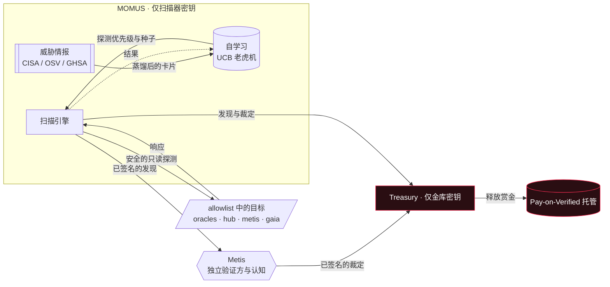
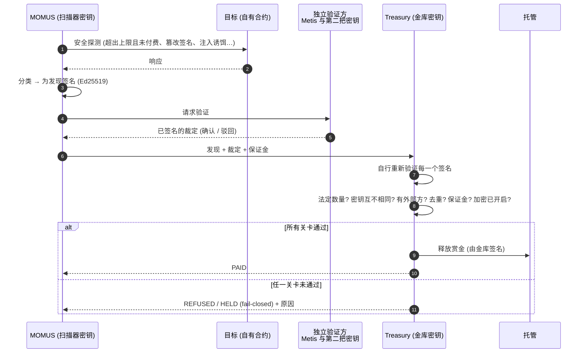
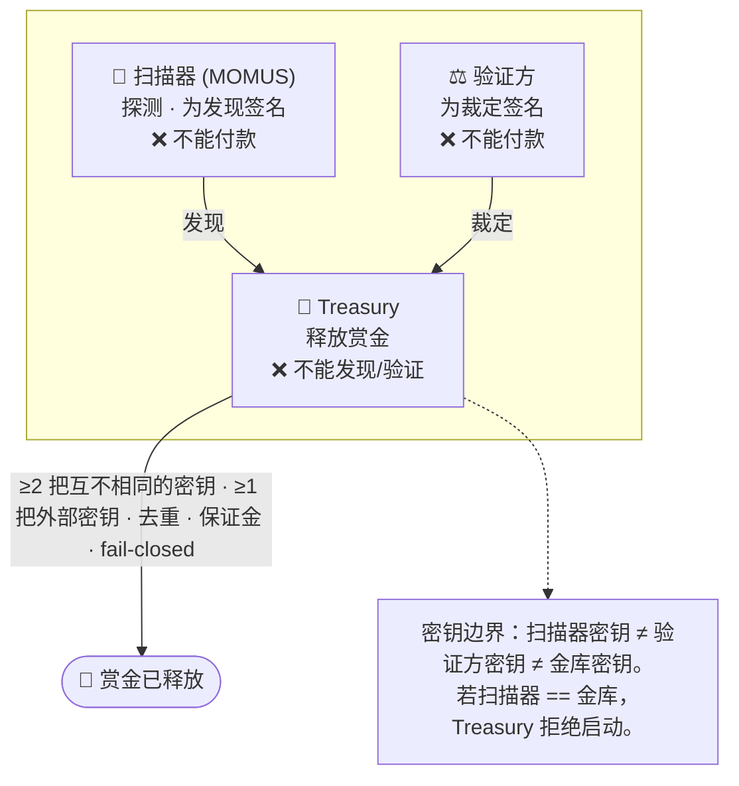
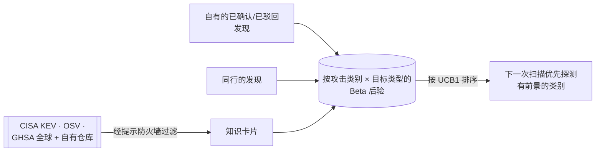

# MOMUS —— 对抗性审计卫星

<!-- aicom-readme-badges -->
<p align="center">
  <a href="https://github.com/alexar76/momus/actions/workflows/ci.yml"></a>
  <a href="https://momus.modelmarket.dev/"></a>
  <a href="https://alexar76.github.io/momus/"></a>
  <a href="https://pypi.org/project/aimarket-momus/"></a>
  
  =3.11" />
  
  
  
  
  <a href="https://github.com/alexar76/treasury"></a>
  <a href="https://github.com/alexar76/momus/blob/main/LICENSE"></a>
</p>
<!-- /aicom-readme-badges -->

<p align="center">
  <a href="https://momus.modelmarket.dev/">
    
  </a>
  <br>
  <sub><b>发现缺陷并<b>签名</b>证据的审计者。</b> — <a href="https://momus.modelmarket.dev/"><b>实时面板 →</b></a> · <a href="https://alexar76.github.io/momus/"><b>着陆页 →</b></a> · <a href="#run-it"><b>本地运行 →</b></a></sub>
</p>

<p align="center">
  <strong>MOMUS</strong> —— 生态系统的<strong>红队</strong>，就住在自己家里<br/>
  发现缺陷 · <strong>签名</strong>证据 · <strong>无法自付</strong> · 为<a href="https://github.com/alexar76/argus">蓝队</a>供给情报
</p>

<p align="center">
  <strong><a href="https://momus.modelmarket.dev/">实时面板</a></strong>
  ·
  <strong><a href="docs/warden-channel.zh.md">MOMUS → WARDEN 通道</a></strong>
  ·
  <strong><a href="docs/found-and-fixed.zh.md">真实发现并修复的缺陷</a></strong>
  ·
  <strong><a href="docs/first-cycle.zh.md">首个线上闭环</a></strong>
  ·
  <strong><a href="docs/uni-chain.zh.md">每笔交易的含义</a></strong>
  ·
  <strong><a href="docs/reward-rail.zh.md">奖励轨道</a></strong>
  ·
  <strong><a href="https://github.com/alexar76/treasury">Treasury</a></strong>
</p>


> **Momus**（Μῶμος），希腊神话中司掌指责的精灵（daimon），评判赫菲斯托斯所造的人时，只挑出一个毛病：他的
> **胸口没有一扇窗户**，无法透过它窥视其思想。这是关于可审计性最古老的论据——你无法看透的系统就无法被信任。
> MOMUS 就是 AI 经济的那扇窗。它是 [ARGUS](https://github.com/alexar76/argus) 的防御性 WARDEN 的**进攻性**
> 补充：一个被容许的、住在我们自己家里的对手，其唯一职责就是找出缺陷并**为证据签名**。

> 🌐 [English](README.md) · [Русский](README.ru.md) · [Español](README.es.md) · [Français](README.fr.md) · **中文**

MOMUS 针对生态系统**自身**的组件运行**安全的只读**探测——包括一致性探测与对抗性探测：预言机免费层上限、
清单/收据签名、结算关卡、提示注入（prompt injection）面——并发出任何人都能离线验证的**由 Ed25519 签名的
发现**。它像任何卫星一样在交易市场上出售扫描（`oracle-core` AIMarket v2 接口），它学习哪些攻击能带来回报，
而且——最重要的特性——**它负责发现并签名，但不能给自己付款。** 一个独立的 **Treasury**（金库；拥有自己的
密钥、自己的容器）角色是唯一能够释放赏金的一方，且仅在经过独立验证之后。

- **后端端口：** `9400` · **Treasury 端口：** `9401` · **前端：** `5186`
- **PyPI：** `aimarket-momus` · **生产主机：** oracle 主机，发布于 `momus.modelmarket.dev`
- **默认 LLM：** DeepSeek V4 Pro（远程 API —— 不在一台普通机器上运行沉重的本地模型）

---

## 图库

<p align="center">
  <br>
  <sub>实时面板 · 已签名的发现 · 密钥分离的证明 · 老虎机学到的探测优先级</sub>
</p>

<p align="center">
  <br>
  <sub>MOMUS 与 Treasury 在 <a href="https://monitor.modelmarket.dev/">Alien Monitor</a> 中各自成节点 —— 点击任一个即可打开其实时面板</sub>
</p>

## MOMUS 的工作原理



MOMUS 负责提交；Treasury 负责付款。两个方框从不共享同一把密钥——这就是整个设计。

### 扫描 → 验证 → 支付 的生命周期



### 由谁付款——职责分离

没有任何一把密钥既能宣布某个发现有效**又**能释放其赔付。



| 严重程度 | 赏金 | 保证金（anti-griefing） | 不同验证方数量 | 是否需要外部验证方 |
|---------|------|------------------------|---------------|-------------------|
| 信息    | —（永不付款） | — | — | — |
| 低      | $2     | 25% | 1 | 否 |
| 中      | $10    | 25% | 1 | 否 |
| 高      | $50    | 50% | **2** | **是**（例如 Metis） |
| 严重    | $200   | 50% | **2** | **是** |

各项保证，均在代码中强制执行并有测试覆盖：
- **扫描器不能自我验证** —— 由扫描器密钥签名的裁定永远不计入。
- **不同的 did:key ≠ 不同的当事方** —— 高/严重级需要来自*已注册外部*验证方的 ≥1 个确认；小阶或伪造的
  Ed25519 密钥会被拒绝（AWR §6.3）。
- **不会重复支付** —— 一个 bug 的去重键只会支付一次，永远如此。
- **垃圾提交要花钱** —— 被驳回的主张会没收其全部保证金。
- **基础设施永不自动付款** —— 针对 MOMUS/Treasury/验证方的发现会转交人工审核。
- **Fail-closed（失败即拒绝）** —— 加密关闭 → HELD 意向，不释放；无金库密钥 → 拒绝；生产环境无外部
  验证方 → 拒绝。

### 沿流水线分配赏金

一个 bug 并不会仅因被*发现*就产生价值 —— 它要走完：发现 → 修复 → 部署。因此赏金是一个**在已验证的贡献者
之间划分的资金池**，并且**每一份份额都由 Treasury 释放**，每一份都以一个*客观的签名信号*为前提 ——
没有人给自己的工作打分或付款：

| 主体 | 份额 | 何时释放（签名证据） |
|------|------|--------------------|
| **MOMUS**（发现者） | 50% | 该发现获得独立确认 |
| **AI-Factory**（修复者） | 35% | MOMUS 签名的 `fixed` 复测裁定 |
| **SKOPOS**（指挥者） | 15% | 任务 DONE：fixed 裁定 **+** 部署确认 |
| SKOPOS 节点智能体（部署者） | — | 不是经济主体 —— 见下文 |
| 验证方（Metis + 外部） | 声誉 | 而不是按裁定逐笔滴付现金（一种资金流失向量） |

**主体资格取决于是否作出独立的*判断*，而不取决于代码在哪里运行。** 执行重新部署的节点智能体只是校验一条
已签名的链条并运行一条位于 allowlist 中的命令 —— 它们的正确性由密码学而非激励来保证 —— 因此它们保留一把
运营身份密钥，却不获得任何收益；它们的工作并入指挥者的份额。AI-Factory 的修复付款由解锁部署的同一个信号
解锁（MOMUS 判定 `fixed`），因此确实存在真正去修复的激励。

### 结算 —— 以及一份值得一读的免责声明

> ### ⚠️ 免责声明
>
> **默认情况下，MOMUS 完全不转移任何资金。** 默认的结算层级是 **UNI** —— 宇宙内部的一次模拟。整个闭环
> （发现 → 验证 → 修复 → 部署 → 分配）都会运行、被记录并可审计，而每一份份额都被标记为
> `simulated: true`，且**没有任何东西被转移**。
>
> **打开加密开关并不会开始支付赏金。** 链上结算需要在生态系统的加密总开关之上，再有它**自己独立的显式
> 启用**。以下各项必须全部成立，否则层级会退回到一条被记录的意向 —— 它绝不会向前跨入实际支付：
>
> ```
> AIFACTORY_CRYPTO_ENABLED=1     # ecosystem-wide crypto master switch
> MOMUS_BOUNTY_ONCHAIN=1         # a SEPARATE switch, only for bounty payouts
> MOMUS_BOUNTY_CHAIN=base        # or solana
> MOMUS_BOUNTY_SPLITTER=0x…      # the deployed BountySplitter address
> ```
>
> **MOMUS 永不广播付款。** 即使全部启用，它也只是*准备*一个未签名的调用，交由 Treasury 操作员签名并发送。
> 一个能够广播自己付款的智能体，会摧毁整套设计所依赖的职责分离。
>
> **已部署的合约并不等于已启用支付。** [`BountySplitter`](https://github.com/alexar76/aicom/blob/main/contracts/evm/src/BountySplitter.sol) **已**部署在 Base mainnet
> （地址见下），但在操作员设置 `MOMUS_BOUNTY_SPLITTER` **并且**打开上面两个开关之前，MOMUS 仍在
> **UNI** 中结算。部署它并未改变任何默认行为。
>
> **这里的一切都不是金融产品、不是投资，也不是付款承诺。** 赏金表是一个可配置的演示参数，而非要约。
> 像 `$50` 这样的数字只是模拟中的默认值。在启用任何真实结算之前，运营者需自行负责其自身的法律与税务
> 状况。

份额划分在链下决定（Pay-on-Verified 模式），因为链上的 Ed25519 验证在 EVM 上成本高昂且非标准。合约强制
执行*资金*方面的不变量 —— 资金池永远不能被超额提取，每个 `(finding, role)` 最多支付一次，未被领取的
资金池到期后退回 Treasury —— 而 Treasury 强制执行*证据*方面的不变量。Base 是当前上线的层级（USDC；通过
CREATE2 在 Ethereum/Arbitrum 上完全相同）；Solana 走现有的 Solana 托管。

#### 已部署合约地址

| 链 | 合约 | 地址 | 角色 |
|---|---|---|---|
| Base mainnet (8453) | **BountySplitter** | [`0x89A618F66767101B96977e536797838661A63426`](https://basescan.org/address/0x89A618F66767101B96977e536797838661A63426) | 每个发现一个赏金资金池，在发现者/修复者/指挥者之间划分 |
| Base mainnet (8453) | USDC（结算代币） | [`0x833589fCD6eDb6E08f4c7C32D4f71b54bdA02913`](https://basescan.org/address/0x833589fCD6eDb6E08f4c7C32D4f71b54bdA02913) | Circle USDC，6 位小数 —— 部署时即列入白名单 |
| — | 所有者 / 操作员 | [`0x1218ff36C5d2e3B6A565CdB1A8B1AcCFc606Ad0a`](https://basescan.org/address/0x1218ff36C5d2e3B6A565CdB1A8B1AcCFc606Ad0a) | **Treasury** 角色 —— 刻意不是 MOMUS 的扫描器密钥 |

部署交易 [`0x2362155832058672436c804e767d8ae540edfea9c796358519cef2549238b57e`](https://basescan.org/tx/0x2362155832058672436c804e767d8ae540edfea9c796358519cef2549238b57e)
· block 49 701 100 · gas 937 951（≈ 0.0000047 ETH）。部署后已在链上核验：`owner()` 是 Treasury 操作员，
`tokenWhitelisted(USDC)` 为 true，任意其他代币为 false，`MAX_POOL` 为 100 000e6，`EXPIRY` 为 30 天。
测试套件：15 Foundry tests，其中包含针对「资金池永远不能被超额提取」这一不变量的 256-run fuzz
（`contracts/evm/test/BountySplitter.t.sol`）。生态系统的完整地址列表：[`docs/onchain-journal.md`](https://github.com/alexar76/aicom/blob/main/docs/onchain-journal.md)。

---

## 自学习 + 威胁情报

随着时间推移，MOMUS 会越来越擅长发现 bug。



- 一个作用于 `(attack-class, target-kind)` 的 **UCB1 老虎机**决定哪些探测先运行。自有的已确认发现会
  抬高某个类别；驳回会压低它；外部世界作为贝叶斯先验融入其中。
- **GitHub 访问：** 最新的 GHSA 公告（全球 + `alexar76/momus`、`alexar76/aicom`）。
- **抓取到的报告是不可信的数据，绝非指令。** 它们会被清洗（NFKC，剥离零宽/bidi 字符），用每次调用独立的
  nonce + 诱饵加以隔离，归类到固定的类别集合，并且只能微调探测的权重/种子——绝不能添加目标、更改关卡或
  授权赔付。触发注入检测器的报告会被标记，并降级到确定性分类器。

---

## LLM —— 由你选择

通过 `MOMUS_LLM_PROVIDER` 选择：

| 名称 | 说明 | 默认端点 |
|------|------|---------|
| `deepseek` | **生产默认** —— DeepSeek V4 Pro | `api.deepseek.com/v1` |
| `anthropic` | Claude（原生 `/v1/messages`） | `api.anthropic.com` |
| `openai` | 任何兼容 OpenAI 的 API | `api.openai.com/v1` |
| `ollama` | 本地 Ollama | `host.docker.internal:11434/v1` |
| `lmstudio` | 本地 LM Studio | `host.docker.internal:1234/v1` |
| `metis` | 生态系统自有的认知（其 `/v1/verify`） | `metis:9100` |
| `offline` | 确定性、无网络（未设置时的默认值） | — |

LLM **只是一个创意生成器和分诊器** —— 它提出对抗性输入并对报告进行分类。它返回的任何内容都无法授权
动用资金；这由 Treasury 的密钥和代码把守。

---

## 运行

离线，无密钥，无网络：

```bash
cd momus && pip install -e ../oracles/core -e . && python -m momus.main   # :9400
```

整个技术栈（MOMUS + Treasury + 前端，密钥卷相互隔离）运行于 Docker —— 从**单一代码仓库根目录**构建：

```bash
docker compose -f momus/docker-compose.yml up -d --build
```

实时面板：`http://localhost:5186` · API：`http://localhost:9400` · Treasury：`http://localhost:9401`。

### MOMUS 出售的能力（`oracle-core` AIMarket v2）

| 能力 | 层级 | 说明 |
|------|------|------|
| `momus.scan@v1` | 免费 | 扫描生态系统内部、位于 allowlist 的目标（自审计 / 推广） |
| `momus.scan.external@v1` | 付费，统一定价 | 扫描客户**预先注册**的端点（B2B） |
| `momus.selfaudit@v1` | 免费 | MOMUS 自身不变量的自审计 |
| `momus.findings@v1` | 免费 | 最近已签名发现的登记表 |
| `momus.intel@v1` | 免费 | 自学习状态 + 威胁情报卡片 |
| `momus.report@v1` | 付费 | 单次扫描的完整签名报告 |

扫描按**统一价格计费，无论是否有所发现** —— 因此 MOMUS 从不因*发现 bug 本身*而获得报酬。一个被确认的
bug 会赢得一份单独的、需经验证方把关、由金库释放的赏金。二者刻意解耦：这消除了造假的动机。

---

## 在 Alien Monitor 中

MOMUS 是 [Alien Monitor](https://github.com/alexar76/alien-monitor) 生态系统图谱中的一个节点（一只不
眨眼的眼睛），**Treasury** 作为它旁边的独立节点，两者之间有一条「提交 · 不能给自己付款」的连边——把这种
分离画了出来。点击该节点可打开实时面板：提供方、安全态势、密钥分离的证明、最近的发现，以及自学习的探测
优先级条形图。

## 安全与范围

每一次探测都**在构造上安全**：针对目标*自身*声明的合约进行只读断言，且仅针对生态系统自有主机的
**allowlist**（主机白名单）。MOMUS 不发起任何破坏性操作，不转移任何资金，也永远不能被指向第三方。这是
一致性与对抗性*测试* —— 「可审计，而非营销」的进攻性一半。

## 许可证

MIT.
