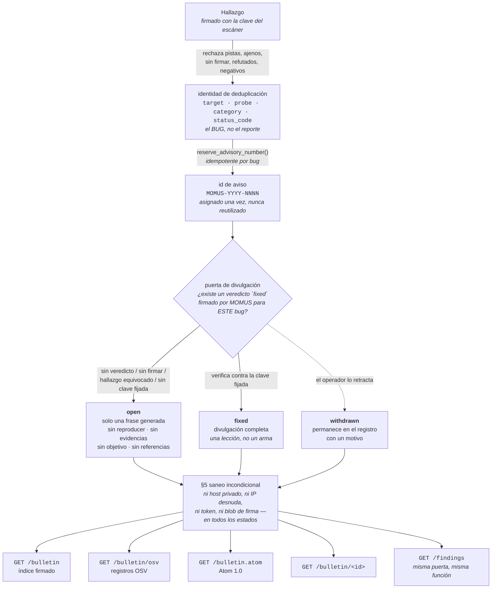

# El boletín de seguridad de MOMUS — publicamos con la misma forma que consumimos

> 🌐 [English](bulletin.md) · [Русский](bulletin.ru.md) · **Español** · [Français](bulletin.fr.md) · [中文](bulletin.zh.md)

MOMUS ingiere CISA KEV, NVD, OSV y GHSA (`momus/intel/sources.py`) y, hasta esta funcionalidad, no
publicaba nada propio. Esa asimetría no es neutral. Un equipo rojo que solo *lee* los avisos de
seguridad de los demás pide que se confíe en él a base de documentos que nunca tiene que escribir —
sin identificadores estables, sin una política de divulgación que nadie le pueda exigir, sin un
registro que sobreviva a un reescaneo. El boletín cierra esa asimetría, y exporta **OSV** — el mismo
esquema que consumimos — para que las herramientas que leen al resto del mundo nos lean también a
nosotros.

El boletín es el registro que MOMUS lleva de los agujeros en **servicios que nosotros operamos**. Ese
único hecho decide casi todas las reglas de abajo: un aviso aquí no es una advertencia sobre el
software de otro, es una confesión sobre el nuestro, publicada por la parte que a la vez lo encontró
y opera el host.



Cuatro rutas de solo lectura, todas públicas, todas sirviendo el mismo registro expurgado:

| Ruta | Para qué |
|---|---|
| `GET /bulletin` | el índice firmado — `{advisories, timestamp, signature}` |
| `GET /bulletin/osv` | registros OSV, para las herramientas que ya leen KEV/OSV/GHSA |
| `GET /bulletin.atom` | Atom 1.0, para lectores que consultan periódicamente |
| `GET /bulletin/MOMUS-2026-0001` | un solo aviso, por el número que se cita |

Más la propia página `#/bulletin` de la SPA, que lee el índice y tiene cuidado de decir **cuál** de
las dos cosas está viendo: «aquí no hay boletín» o «no se ha podido preguntar» — un 404 es la
respuesta documentada para un despliegue que nunca se dio de alta, y fundir eso en un error genérico
informaría de una política como si fuera una caída.

## §1 Un número por BUG, no por reporte

`MOMUS-YYYY-NNNN`, asignado una sola vez por `Finding.dedup_key`.

Un «id estable» que cambia cuando el mismo bug se encuentra dos veces no es más que un id de reporte
con un formato más bonito. Por eso el número se indexa por la **identidad de deduplicación** — la
identidad determinista del fallo — y no por `finding_id`, que es un UUID nuevo en cada escaneo. Si el
mismo agujero se redescubre la semana que viene, vuelve como el mismo aviso, con un `finding_id`
nuevo añadido y `modified` actualizado.

La identidad de deduplicación son solo hechos de nivel de contrato (`findings.py`):

| dentro de la identidad | fuera de ella, a propósito |
|---|---|
| `target`, `probe`, `category`, el `status_code` observado | el resumen criptográfico (digest) de la respuesta, el timestamp, la latencia, quién lo reportó |

Esa exclusión no es pulcritud teórica. El digest de la respuesta *estaba* en la base, y el cuerpo de
un objetivo lleva un nonce nuevo en cada llamada, así que el mismo bug real producía una clave nueva
en cada reescaneo — lo que significaba que no había deduplicación en absoluto, y una recompensa que
se podía cobrar una y otra vez. **Todo lo que varía de una observación a otra tiene que quedar fuera
de una identidad.** La misma lección que rehízo la clave de recepción de WARDEN y la clave de
reclamante de la Treasury.

Alrededor de eso:

* **Monótono por año**, a partir de un contador de marca máxima (`advisory_counter`) que se
  incrementa con un upsert atómico, no con un leer-y-luego-escribir — a dos publicaciones
  concurrentes no se les puede entregar el mismo número de secuencia.
* **Nunca se reutiliza, los huecos nunca se rellenan.** Un aviso retirado conserva su número para
  siempre. `max(seq)` le entregaría el número de una entrada retractada a un bug distinto, y un
  número que significa dos cosas es peor que un hueco en la secuencia.
* **Se asigna solo al publicar.** La mayoría de los hallazgos nunca llegan a ser avisos, y reservarles
  números por adelantado filtraría cuánto tenemos guardado.
* **Se ensancha más allá de los cuatro dígitos en lugar de dar la vuelta.** El aviso número 10 000 de
  un año no debe colisionar con el primero; un id feo es mejor que un id duplicado.
* **Inmutable** (`AdvisoryId` es una dataclass congelada), porque un número de aviso es una promesa.

## §2 Divulgación coordinada — la regla sobre la que se apoya toda la funcionalidad

MOMUS audita nuestros propios servicios desplegados. Así que una entrada del boletín con un
`reproducer` que funciona (los pasos exactos que reproducen el fallo) contra un componente **sin
corregir** no es una divulgación. Es un script de ataque, publicado bajo nuestra propia firma, contra
un host que nosotros operamos, para un público que incluye a quien sea que quiera entrar — y lo
publicamos con la autoridad de un auditor de seguridad diciendo «esto funciona».

| estado | qué obtiene quien lo lee |
|---|---|
| **`open`** | id, `published`/`modified`, componente, categoría, severidad y una frase de una línea **generada** y no accionable. Sin `reproducer`, sin resúmenes criptográficos (digests) de las evidencias, sin parámetros de la sonda, sin fragmentos de petición/respuesta, sin URL del objetivo, **sin referencia alguna**. |
| **`fixed`** | todo, `reproducer` incluido. Ahora es una lección, no un arma. |
| **`withdrawn`** | la entrada **permanece**, con su motivo. Las partes accionables se vuelven a retener. |

Cada aviso declara su estado *y* su `disclosure` en su propio cuerpo. Quien lo lee nunca debe tener
que deducir si un agujero sigue abierto, y el documento tiene que llevar consigo sus propios límites
a través de rutas, capturas de pantalla y copias que llegan sin ningún otro contexto — la misma
costumbre que el descargo de responsabilidad de la cola de triaje de WARDEN.

Tres detalles que parecen sobreingeniería y no lo son:

**El resumen de un `open` se genera, no es el título del escáner.** A partir de
`(severity, category, component)` y de nada más. Un título escrito por una persona o por un LLM —
*«free tier serves 1000 calls unpaid when n>100»* — es en sí mismo una receta, y ningún proceso de
revisión puede prometer que una frase escrita para informar no sea también accionable.

**Ninguna referencia mientras el agujero esté abierto.** Todos los enlaces que tenemos apuntan o bien
al servicio afectado o bien a herramientas internas, así que «qué enlaces son seguros» todavía no
tiene una respuesta honesta.

**Un estado desconocido se trata como `open`.** Todo lo que no podamos identificar afirmativamente
como `fixed` es un agujero abierto. Fail-closed (denegar por defecto).

### Qué desbloquea la divulgación completa

Exactamente una cosa: un **veredicto `fixed` firmado por MOMUS** para este bug, comprobado contra una
clave fijada (`gate_says_fixed`). Es lo más apetecible de falsificar de todo el módulo, así que un
simple `{"fixed": true}` no debe convertir un agujero abierto en un exploit publicado. Cada una de
estas condiciones deja el aviso en `open`:

| condición | por qué es fatal por sí sola |
|---|---|
| no hay veredicto registrado | el estado por defecto de todo aviso |
| `fixed` es falso | la sonda sigue reproduciendo el fallo |
| el veredicto nombra un `finding_id` distinto | un veredicto no es transferible entre bugs |
| no hay clave de verificador fijada | **sin clave fijada, no hay divulgación** — una clave fijada vacía no se puede satisfacer jamás |
| el veredicto no está firmado | la palabra `fixed` no es un veredicto |
| la firma no verifica contra la clave fijada | no contra la clave que el veredicto diga tener |

La misma forma fail-closed que `economics._fix_verdict_ok`, que una vez liberó dinero real con un
dict sin firmar. Comprobar contra una **clave fijada** en lugar de contra la clave que el propio
veredicto declara es justamente el objetivo: si no, quien falsifica sencillamente envía su propia
clave junto a su propia firma.

### El expurgo es lo predeterminado, y se comprueba tres veces

1. `Advisory.to_dict()` — la forma **expurgada** (se omiten las partes sensibles). Esta es la ruta por
   defecto a propósito: quien llama y se olvida de pensar en la divulgación obtiene la respuesta
   segura, no el exploit.
2. `Advisory.raw_dict()` — la forma sin expurgar, con un nombre deliberadamente incómodo para que
   servirla sea una decisión visible en el código que llama. Es la ruta del operador y el formato de
   almacenamiento, nunca el cuerpo de una respuesta.
3. `_ensure_public()` — la última puerta antes de que se firme ningún byte. Redundante con (1) por
   construcción, y aun así se conserva: el fallo del que protege no es un bug en
   `redact_for_disclosure`, es un futuro llamante que le pase a `signed_index()` dicts crudos venidos
   de otro sitio. También rechaza una entrada que afirme estar `fixed` sin llevar veredicto de
   corrección, porque a esas alturas el estado no es más que una cadena dentro de un dict. **Un
   exploit firmado no se puede retirar una vez que alguien lo ha descargado.**

`redact_for_disclosure` es deliberadamente aburrida: pura, idempotente, sin configuración, sin
política suministrada por quien llama, sin modo «verbose». Decide el estado, y solo el estado.

### El saneo incondicional (§5), en todos los estados

Ni siquiera un aviso `fixed` divulgado por completo publica nunca un host privado, una IP desnuda,
una credencial o un blob de firma completo. Nuestras sondas construyen los `reproducer` a partir de
`target.base_url`, que en producción es un nombre de servicio interno del clúster — así que publicar
uno tal cual publicaría nuestra topología.

| pasada | comportamiento |
|---|---|
| URLs | la **ruta sobrevive** (esa es la lección), la parte de autoridad pasa a ser `<target-host>` salvo que el host esté en la lista pública — que se deriva de `warden_feed._FIRST_PARTY`, no se reescribe a mano |
| `host:port` desnudo | así es como aparece en prosa una dirección interna del clúster, invisible para la pasada de URLs |
| IPv4 | `[ip-redacted]` |
| `Bearer …`, `token=…`, `api_key: …` | **el valor lo consume la propia coincidencia** — una versión anterior sustituía solo la clave y dejaba el secreto ahí sentado junto a la palabra `[redacted]` |
| blobs base64 de ≥ 80 caracteres | una firma Ed25519 tiene 88 caracteres; un digest sha-256 en hex tiene 64, y los digests *sí* son evidencia publicable. El umbral se sitúa entre ambos a propósito. |

El orden importa: primero las URLs, para que una URL alojada en una IP pierda su host antes de que la
pasada de IPs desnudas la vea.

Una cicatriz que vale la pena dejar a la vista: `2026-08-08T19:36:19Z` se publicaba como
`<target-host>:19Z`, porque el patrón de host exige una letra y la `T` se la daba. Se encontró en un
aviso `fixed` real, corrompiendo la propia línea del módulo *«Re-tested by MOMUS on …»*. El caso de
solo hora (`12:30`) había sido seguro y estaba cubierto por tests desde el principio; es la forma con
fecha y hora la que lleva una letra dentro.

### La misma regla en el libro de hallazgos en vivo, no solo aquí

`GET /findings` es público y devolvía documentos de hallazgo enteros directamente desde el corpus —
`evidence.reproducer` y la URL interna del objetivo incluidos, para hallazgos que seguían abiertos.
**Retener un `reproducer` en el boletín mientras se sirve ese mismo `reproducer` una ruta más allá no
es divulgación coordinada, es papeleo.** Ahora las dos superficies responden desde una sola regla y
una sola función (`public_finding`), indexada por la misma identidad de deduplicación, de modo que un
bug divulgado en el boletín queda divulgado en el libro de hallazgos, y ningún otro lo está.

Dos consecuencias que conviene nombrar en vez de pasar por encima:

* **Una firma presente en un hallazgo público verifica.** Un documento expurgado no puede verificar
  bajo la firma que cubría el original, y servir una que falla se lee como manipulación — así que en
  su lugar se retiene con una nota. La comparación se hace sobre `signed_body()`, cuya lista de
  campos se deriva de la dataclass `Finding` en vez de mantenerse como lista de exclusión, porque el
  corpus añade `seen_count` / `first_seen_at` / `last_seen_at`, los escaneos añaden `known_before` y
  la ruta añade `disclosure`. Quien calculaba el hash del documento entero menos `signature` obtenía
  `False` siempre; la firma estaba bien, lo que faltaban eran las instrucciones.
* **El libro de hallazgos conserva el `title` y el `detail` del escáner, allí donde el boletín los
  sustituiría.** Las dos superficies no son el mismo objeto: el boletín es un registro permanente y
  citable, el libro de hallazgos está vivo. Así que la prosa de un hallazgo sin corregir en el libro
  sí puede describir la *forma* de un bug («devolvió 200 en la llamada n+1 sin pagar»), que es más de
  lo que el boletín publica sobre ese mismo agujero. Lo que nunca puede llevar es la parte copiable y
  pegable — el `reproducer`, los payloads y el host al que apuntarlos.

## El índice firmado, verificado con el mismo código que verifica el feed de WARDEN

```
GET https://momus.modelmarket.dev/bulletin

{ "advisories": [ {id, status, disclosure, component, severity, …}, … ],
  "timestamp": 1786223680673,      // epoch ms, integer
  "signature": "ab837d7e…"         // hex Ed25519 over the RFC 8785 canonical
                                   // form of {advisories, timestamp}
}
```

Este es el sobre que [WARDEN ya verifica](warden-channel.md), reutilizado (`bulletin.py` §4). `jcs()`
y `spki_hex()` se **importan** de `momus/warden_feed.py`, nunca se reimplementan: ese canonicalizador
está verificado byte a byte contra el JCS en TypeScript de ARGUS y contra la implementación de
referencia de AWR, y una segunda implementación no es más que una segunda cosa que puede discrepar de
la primera. La clave que hay que fijar es la clave del escáner de MOMUS — la que `/health` ya publica
como `scanner_pubkey`, y que `/warden/threat-feed/summary` publica en SPKI-hex como
`feed_public_key_spki_hex`. Una sola clave, no un tercer formato en el que un operador se pueda
equivocar.

Las entradas se **ordenan por id** antes de firmar, para que el mismo conjunto de avisos produzca
siempre bytes idénticos: un índice cuya firma cambia según el orden de iteración no se puede cachear,
ni comparar, ni comprobar frente a un reenvío (replay). La ruta **no acepta `limit`** — el boletín
*es* el registro, y un registro paginado y firmado página a página le daría a dos lectores dos
documentos distintos que citar. Está topado en 500 para que una respuesta no pueda crecer sin límite,
y **no se cachea**: firmar cuesta microsegundos y `timestamp` es una afirmación de frescura, así que
un documento cacheado acabaría publicando una caducada.

Verificándolo con el propio canonicalizador de ARGUS y `node:crypto` — exactamente la misma ruta de
código que WARDEN usa con el feed de amenazas:

```js
const { canonicalize } = await import('@aimarket/warden/jcs');
const payload = canonicalize({ advisories: doc.advisories, timestamp: doc.timestamp });
const pub = createPublicKey({ key: Buffer.from(spkiHex, 'hex'), format: 'der', type: 'spki' });
verify(null, Buffer.from(payload, 'utf8'), pub, Buffer.from(doc.signature, 'hex'));
```

Ejecutado contra un índice generado en local — dos avisos de un `BulletinStore` real, una clave de
escáner real y `@aimarket/warden/jcs` para los bytes (un arnés de pruebas desechable, no un
script versionado: `verify_warden_channel.mjs` solo cubre el feed de amenazas, y todavía no hay un
boletín en vivo al que apuntarlo):

```
signature accepted by ARGUS's canonicalizer: true
tampered severity accepted:                  false
shifted timestamp accepted:                  false
timestamp is an integer:                     true
signature is 128 hex chars:                  true
```

**Dos salvedades honestas.** La clave del payload es `advisories`, no `records` — el sobre, el
canonicalizador, la codificación y la clave son idénticos, pero
[`scripts/verify_warden_channel.mjs`](../scripts/verify_warden_channel.mjs) no se puede apuntar a
`/bulletin` sin modificarlo; un consumidor canonicaliza `{advisories, timestamp}`. Y a diferencia del
feed de amenazas, cuya ventana de frescura ARGUS sí impone de verdad, **hoy nada consume el índice
del boletín**: el `timestamp` es una afirmación de frescura que hacemos nosotros, no una que ningún
verificador desplegado esté comprobando. La ejecución de arriba es local, no la prueba en producción
que sí tiene el canal de WARDEN.

## Exportación a OSV, con el desajuste dicho en voz alta

`GET /bulletin/osv` devuelve el array pelado que espera un consumidor de OSV, un registro por aviso,
construido a partir de la forma **expurgada** (`bulletin.py` §3) — el §2 se aplica a todas las
exportaciones.

OSV describe **versiones de paquetes** vulnerables. Un aviso de MOMUS describe un **servicio
desplegado**, que no tiene eje de versiones en absoluto. Podríamos haberlo disimulado; en vez de eso,
cada registro lleva el desajuste en `database_specific.note`:

| campo OSV | qué ponemos ahí | el problema honesto |
|---|---|---|
| `affected[].package.ecosystem` | `"AIMarket"` | es nuestro, y **no es un ecosistema registrado en OSV** |
| `affected[].package.name` | el id del servicio (`hub`, `metis`, …) | no es un paquete que nadie pueda instalar |
| `affected[].ranges` | **ausente** | un consumidor de OSV lee un `ranges` ausente como *«todas las versiones afectadas»*. No se comprobó ningún rango de versiones, porque no hay nada que comprobar. |
| `severity` | `[]` | tenemos una severidad cualitativa, no un vector CVSS. Inventar un vector para rellenar un campo que parece obligatorio es la forma en que los datos malos entran en un feed; el valor cualitativo está en `database_specific.severity`. |
| `withdrawn` | `modified`, para un aviso retirado | el campo propio de OSV: un consumidor que lo respeta deja de actuar sobre el registro sin que nosotros borremos nada |
| `references[].type` | se fuerza a `WEB` cuando queda fuera del enum de OSV | un tipo desconocido hace fallar la validación del registro *entero*, y un consumidor que rechaza nuestro documento no aprende nada de él |

`credits` nombra a MOMUS como `FINDER` y, además, como `REMEDIATION_VERIFIER` en un aviso `fixed` —
lo cual es exactamente tan independiente como suena; véase *qué todavía no es cierto*.

## El feed Atom

`GET /bulletin.atom` sirve el mismo registro como Atom 1.0, para lectores que consultan
periódicamente en lugar de parsear JSON. Está construido con `ElementTree`, no con una plantilla de
f-string, y eso es una decisión de seguridad más que de estilo: el resumen de un aviso es texto que
salió de una sonda o del motivo de retirada escrito por un operador, así que una plantilla hecha a
mano publica un `&` o un `<` desnudos directamente en el documento — en el mejor caso el feed deja de
parsearse para todos los lectores, en el peor inyecta marcado en lo que sea que lo renderice.

* **Los caracteres de control se eliminan, no se escapan.** XML 1.0 no tiene escape para la mayoría
  de ellos; un solo `0x00` en crudo dentro de un fragmento de respuesta capturado deja **todo el
  feed** imparseable, no solo su propia entrada.
* **`<id>` es estable** — el del feed es `{base}/bulletin`, el de una entrada es
  `{base}/bulletin/{id}`. Los lectores deduplican por él, así que un id que cambia sin parar vuelve a
  publicar el boletín entero como no leído en cada consulta. El número de aviso ya es el identificador
  permanente del bug.
* **`<updated>` es el `modified` del aviso**, para que una republicación, una corrección o una
  retirada aparezcan como una actualización — por eso el registro guarda `published` y `modified` por
  separado.
* **Los timestamps se validan como RFC 3339**, con `now` solo como último recurso: Atom exige
  `<updated>`, y un lector estricto rechaza un documento que lo tenga malformado.
* **`type="text"`, no `html`**, en summary y content: declarar que la prosa es HTML le pide a cada
  lector que renderice marcado que no hemos escrito nosotros.
* La respuesta es `application/atom+xml; charset=utf-8` — un lector de feeds despacha según el media
  type, y el charset es explícito porque el documento puede llevar prosa no ASCII. El atributo `type`
  de un `<link>` de Atom no lleva charset (RFC 4287), de ahí las dos grafías en el código.

El renderizador consume **dicts ya expurgados**, nunca objetos `Advisory`, así que no puede ampliar la
divulgación ni siquiera por error: el `reproducer` de una entrada `open` es la cadena vacía mucho
antes de llegar hasta él.

## Retirada — las entradas nunca desaparecen

`withdraw(advisory_id, reason)` pone el estado en `withdrawn` y conserva la fila. El motivo es
**obligatorio**: una entrada que pasa a `withdrawn` sin explicación supone la misma pérdida de
información que borrarla.

El borrado silencioso es la forma en que un registro público deja de ser fiable. Si un aviso puede
desaparecer, entonces todos los avisos *restantes* son inverificables — quien lee no tiene manera de
distinguir un boletín que nunca tuvo una entrada de otro que la quitó sin decir nada, y cualquier
recuento que publiquemos pasa a ser una afirmación en vez de un hecho. Así que: el número queda
retirado, la entrada sigue listada (`list()` incluye las entradas retiradas — el registro es
justamente el objetivo) y los consumidores de OSV ven el campo estándar `withdrawn`.

Al retirarse, las partes accionables se retienen **otra vez**, incluso si el aviso había estado en
`fixed`: un registro que MOMUS ya no respalda no debe llevar un `reproducer` que funcione bajo la
firma de MOMUS.

Y una retirada sobrevive a un reescaneo. Cuando `publish()` vuelve a publicar el mismo bug, conserva
el estado retirado y el motivo, traiga lo que traiga el escaneo, porque la retirada es el juicio de
un operador sobre el registro y una vía automática que pudiera resucitar en silencio una entrada
retractada haría que la retirada fuese poco fiable exactamente igual que lo es un borrado. Volver a
listarla es un acto deliberado del operador.

La regla especular del otro lado: una republicación posterior **no** devuelve en silencio a `open` un
aviso publicado como `fixed`. El `reproducer` ya está fuera, así que volver a esconderlo no protege a
nadie, y un estado que oscila es un registro que nadie puede citar. Una regresión aparece como un
`finding_id` nuevo y un `modified` actualizado; el operador que quiera que el registro diga más que
eso lo retira con un motivo.

## Configuración

| Variable | Por defecto | Significado |
|---|---|---|
| `MOMUS_BULLETIN` | **desactivado** | publicar el boletín o no. Desactivado significa que todas las rutas responden **404, no 403** — un operador que no se ha dado de alta *no tiene* boletín, y «prohibido» le diría a quien lee que existe uno detrás de un permiso. |
| `MOMUS_PUBLIC_URL` | `http://localhost:9400` | el origen que aparece en los ids de Atom, en los enlaces y en `summary().bulletin_url`. Tiene que ser estable entre reinicios, o cada lector volverá a notificarlo todo. |
| `MOMUS_SIGNING_KEY_PATH` | `data/momus_signing_key` | la clave del escáner. Firma los hallazgos, el feed de WARDEN **y** el índice del boletín — una sola identidad que fijar. |
| `MOMUS_DATA_DIR` | `data` | el corpus. Los avisos viven en el mismo almacén que los hallazgos, en una tabla `advisories` con índices únicos sobre `dedup_key` y sobre `(year, seq)`. |
| `MOMUS_OPERATOR_TOKEN` | — | no tiene nada que ver con leer el boletín, que es público. Es lo que le consigue a un operador los originales **sin expurgar** desde `GET /findings`. |

Publicar es voluntario y viene desactivado por defecto: convertirse en publicador público de avisos
es una decisión que toma un operador, no un efecto colateral de levantar el contenedor. No hay
configuración del lado de ARGUS — todavía no hay nada que consuma este feed.

Dos propiedades de contención que son estructurales y no configuradas:

* `BulletinStore` **no tiene ninguna clave**. Firmar un índice es una llamada que recibe un firmante,
  así que un boletín que solo se lee jamás puede producir un documento firmado.
* **Nada de lo que asigna números, publica o retira está expuesto por HTTP.** Las cuatro rutas son de
  solo lectura.

## Lo que esto NO es

**No es un canal de acusaciones contra terceros.** Un aviso sobre el servicio de otro nunca aparece
aquí — para eso está el [feed de amenazas de WARDEN](warden-channel.md), que tiene sus propios
controles, y se trata de la reputación de otra persona, no de nuestro registro. La guarda es
literalmente la misma función leída en sentido contrario: `warden_feed.check_pattern()` rechaza un
patrón de denegación *porque* coincide con una de nuestras identidades, así que «rechazado por ser
identidad propia» es exactamente «esto es nuestro». El feed publica solo lo que **no** es nuestro; el
boletín, solo lo que **sí** lo es. Una sola lista, para que los dos nunca puedan derivar hasta
solaparse ni hasta estar ambos equivocados.

**No es una cola de pistas.** Una pista sin verificar de `warden_reports` no puede convertirse jamás
en un aviso. Las pistas llevan `is_momus_finding: false`, `verified: false` y un descargo de
responsabilidad por construcción — adheridos a los datos mismos precisamente para que este rechazo
sea posible — y cada marcador es un rechazo por sí solo. Publicar la reclamación anónima de un
extraño bajo nuestra numeración de avisos pondría nuestro nombre en una acusación que no hemos
comprobado. Y un hallazgo tampoco basta por sí mismo: un hallazgo sin firmar o manipulado, un negativo
honesto (`no_finding` — valioso en el corpus, ruido en un feed de seguridad) y un hallazgo que un
verificador independiente ha **refutado** se rechazan todos.

**No es una superficie de marketing.** Un aviso `open` es deliberadamente imposible de citar: una
frase generada de una línea y un estado. Aquí no hay inflación de severidad que sacar, ni narrativa
de «divulgado responsablemente por» — somos el auditor *y* el operador, lo que es una afirmación más
débil que cualquiera de las dos por separado.

## Qué todavía no es cierto

* **Las rutas no son alcanzables en producción.** El allowlist (lista blanca) del nginx del frontend
  (`momus/frontend/nginx.conf`) hace de proxy para `/health`, `/providers`, `/findings`, `/intel` y
  las rutas de WARDEN; `/bulletin*` no está en él. Por eso una petición del mismo origen cae hasta la
  SPA y recibe `index.html` con un **200** — que el cliente no puede parsear como JSON y que tampoco
  reportará como «desactivado», porque esa vía se apoya en un 404. Publicar significa añadir las
  cuatro rutas de solo lectura a ese allowlist en el mismo cambio.
* **`MOMUS_BULLETIN` no está definida en el compose desplegado**, así que el despliegue en vivo no
  tiene boletín. Todo lo de arriba es código y tests, no una observación de producción — a diferencia
  del canal de WARDEN, que se demostró contra el host en vivo con el verificador del propio
  consumidor.
* **Nada publica de forma automática.** Ninguna ruta, ninguna CLI y ningún paso del bucle de
  remediación llama a `BulletinStore.publish()` — hoy un aviso se asigna cuando un operador lo invoca
  directamente. Las reglas de divulgación sí se imponen; la decisión *editorial* no tiene ninguna
  herramienta a su alrededor.
* **El veredicto `fixed` lo firma la propia clave del escáner de MOMUS.** `Retester` está cableado con
  `runtime.signer`, y el boletín fija esa misma clave. Así que la clave fijada demuestra que el
  veredicto vino de MOMUS y que no lo falsificó quien llamaba — que es para lo que sirve — pero **no**
  convierte la corrección en verificada de forma independiente. La separación escáner ≠ Treasury que
  rige los pagos no se aplica al interruptor de la divulgación, y `credits[].REMEDIATION_VERIFIER` en
  la exportación OSV debe leerse teniendo eso en cuenta.
* **El ecosistema OSV `AIMarket` no está registrado en OSV.** Los consumidores que validen el
  ecosistema contra la lista publicada rechazarán nuestros registros; la nota explica por qué, que es
  lo máximo que podemos hacer honestamente desde aquí.
* **Ningún consumidor consulta nada de esto.** Nadie nos impone ninguna ventana de frescura, y el feed
  Atom no tiene suscriptores.

## Tests

| Suite | Qué cubre |
|---|---|
| `momus/tests/test_bulletin.py` (42) | ids estables a través de redescubrimientos y reinicios, números que nunca se reutilizan, el §2 campo a campo **y** sobre el blob serializado entero, un veredicto de corrección falsificado, sin clave fijada ⇒ nunca `fixed`, la retirada, los rechazos del §5, el saneador, el determinismo del índice y la detección de manipulación, OSV |
| `momus/tests/test_bulletin_disclosure.py` (12) | la misma regla en `GET /findings` y en la ruta de invocación (invoke) `momus.findings@v1`, indexada por el bug y no por el reporte; la ruta del operador; «una firma presente en un hallazgo público verifica»; la regresión del saneo del timestamp ISO |
| `momus/tests/test_bulletin_routes.py` (9) | el cable: 404 cuando la publicación está desactivada, el sobre reverificado a partir de los bytes **servidos**, un aviso `open` que no lleva `reproducer` en las **cuatro** superficies, Atom parseándose como XML y sobreviviendo a texto hostil dentro de un aviso, los campos de OSV |

```
cd momus && PYTHONPATH=.:../skopos ../oracles/.venv/bin/python -m pytest -q \
    tests/test_bulletin.py tests/test_bulletin_disclosure.py tests/test_bulletin_routes.py
63 passed
```

El que carga con el peso es `test_an_open_advisory_served_over_http_carries_no_reproducer`: pide
todas las superficies del boletín para un aviso `open` y comprueba que el `reproducer` está ausente
de los cuatro cuerpos — incluido el feed Atom, donde una fuga llegaría como prosa y no como campo, y
por lo tanto sobreviviría a cualquier aserción a nivel de campo del archivo.
