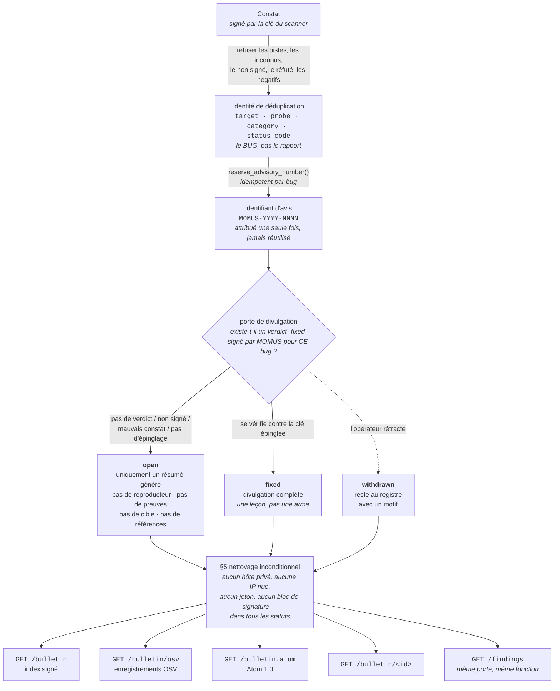

# Le bulletin de sécurité de MOMUS — publier dans la forme que nous consommons

> 🌐 [English](bulletin.md) · [Русский](bulletin.ru.md) · [Español](bulletin.es.md) · **Français** · [中文](bulletin.zh.md)

MOMUS ingère CISA KEV, NVD, OSV et GHSA (`momus/intel/sources.py`) et, jusqu'à cette fonctionnalité,
ne publiait rien de son cru. Cette asymétrie n'est pas neutre. Une équipe rouge qui se contente de
*lire* les avis de sécurité des autres demande qu'on lui fasse confiance sur la foi de documents
qu'elle n'a jamais à écrire — pas d'identifiants stables, pas de politique de divulgation qu'on
puisse lui opposer, aucun registre qui survive à un nouveau scan. Le bulletin comble ce manque, et il
exporte de l'**OSV** — le schéma même que nous consommons — afin que l'outillage qui lit le reste du
monde nous lise aussi.

Le bulletin est le registre que MOMUS tient des failles des **services que nous exploitons**. Ce seul
fait décide de presque toutes les règles ci-dessous : un avis publié ici n'est pas une mise en garde
au sujet du logiciel de quelqu'un d'autre, c'est un aveu au sujet du nôtre, publié par la partie qui
l'a trouvé et qui exploite l'hôte.



Quatre routes en lecture seule, toutes publiques, servant toutes le même registre expurgé :

| Route | Pour |
|---|---|
| `GET /bulletin` | l'index signé — `{advisories, timestamp, signature}` |
| `GET /bulletin/osv` | des enregistrements OSV, pour l'outillage qui lit déjà KEV/OSV/GHSA |
| `GET /bulletin.atom` | Atom 1.0, pour les lecteurs qui interrogent périodiquement |
| `GET /bulletin/MOMUS-2026-0001` | un seul avis, par le numéro que vous citez |

S'y ajoute la page `#/bulletin` de la SPA elle-même, qui lit l'index et prend soin de dire **laquelle**
des deux situations elle a devant elle : « pas de bulletin ici » ou « impossible de demander » — un 404
est la réponse documentée pour un déploiement qui n'y a jamais adhéré, et fondre les deux en une erreur
générique ferait passer une politique pour une panne.

## §1 Un numéro par BUG, pas par rapport

`MOMUS-YYYY-NNNN`, attribué une seule fois par `Finding.dedup_key`.

Un « identifiant stable » qui change quand le même bug est trouvé deux fois n'est qu'un identifiant
de rapport dans un plus joli format. Le numéro est donc indexé sur l'**identité de déduplication** —
l'identité déterministe de la faille — et non sur `finding_id`, qui est un UUID neuf à chaque scan.
Redécouvrez la même faille la semaine prochaine et elle revient sous le même avis, avec un nouveau
`finding_id` ajouté et `modified` mis à jour.

L'identité de déduplication ne retient que des faits de niveau contrat (`findings.py`) :

| dans l'identité | hors de l'identité, délibérément |
|---|---|
| `target`, `probe`, `category`, le `status_code` observé | l'empreinte (digest) de la réponse, l'horodatage, la latence, le rapporteur |

Cette exclusion n'est pas un souci d'élégance théorique. L'empreinte de la réponse *était* dans la
base de calcul, et le corps renvoyé par une cible porte un nonce neuf à chaque appel : le même bug
réel produisait donc une nouvelle clé à chaque nouveau scan — c'est-à-dire aucune déduplication du
tout, et une prime payable encore et encore. **Tout ce qui varie d'une observation à l'autre doit
rester hors d'une identité.** La même leçon que celle qui a remodelé la clé de réception de WARDEN et
la clé de réclamant de la Treasury.

Autour de cela :

* **Monotone par année**, à partir d'un compteur de plus haute valeur atteinte (`advisory_counter`)
  incrémenté par un upsert atomique, et non par un lire-puis-écrire — deux publications concurrentes
  ne peuvent pas recevoir le même numéro de séquence.
* **Jamais réutilisé, les trous jamais comblés.** Un avis retiré garde son numéro pour toujours.
  `max(seq)` attribuerait le numéro d'une entrée rétractée à un bug différent, et un numéro qui
  désigne deux choses est pire qu'un trou dans la séquence.
* **Attribué uniquement à la publication.** La plupart des constats ne deviennent jamais des avis, et
  pré-allouer des numéros pour eux révélerait combien nous en gardons sous le coude.
* **S'élargit au-delà de quatre chiffres plutôt que de boucler.** Le 10 000e avis d'une année ne doit
  pas entrer en collision avec le premier ; un identifiant laid vaut mieux qu'un identifiant en
  double.
* **Immuable** (`AdvisoryId` est une dataclass figée), parce qu'un numéro d'avis est une promesse.

## §2 Divulgation coordonnée — la règle sur laquelle repose toute la fonctionnalité

MOMUS audite nos propres services déployés. Une entrée de bulletin comportant un reproducteur
fonctionnel contre un composant **non corrigé** n'est donc pas une divulgation. C'est un script
d'attaque, publié sous notre propre signature, contre un hôte que nous exploitons, pour un public qui
inclut quiconque veut entrer — et nous l'avons publié avec l'autorité d'un auditeur de sécurité
affirmant « ça marche ».

| statut | ce que reçoit un lecteur |
|---|---|
| **`open`** | l'identifiant, `published`/`modified`, le composant, la catégorie, la gravité, et un résumé d'une ligne **généré** et non actionnable. Pas de reproducteur, pas d'empreintes de preuves, pas de paramètres de sonde, pas d'extraits de requête/réponse, pas d'URL de cible, **aucune référence du tout**. |
| **`fixed`** | tout, reproducteur compris. C'est une leçon désormais, pas une arme. |
| **`withdrawn`** | l'entrée **reste**, avec son motif. Les parties actionnables sont de nouveau retenues. |

Chaque avis énonce son statut *et* sa `disclosure` dans son propre corps. Un lecteur ne doit jamais
avoir à *déduire* si une faille est encore ouverte, et le document doit porter ses propres limites à
travers les routes, les captures d'écran et les copies qui arrivent sans aucun autre contexte — la
même habitude que la clause de non-responsabilité de la file de triage de WARDEN.

Trois détails qui ressemblent à de la sur-ingénierie et n'en sont pas :

**Le résumé d'un avis `open` est généré, ce n'est pas le titre du scanner.** À partir de
`(severity, category, component)` et de rien d'autre. Un titre écrit par un humain ou par un LLM —
*« le palier gratuit sert 1000 appels non payés quand n>100 »* — est lui-même une recette, et aucun
processus de relecture ne peut promettre qu'une phrase écrite pour être informative n'est pas aussi
actionnable.

**Aucune référence tant que la faille est ouverte.** Chaque lien que nous détenons pointe soit vers
le service affecté, soit vers de l'outillage interne : « quels liens sont sans danger » n'a donc pas
encore de réponse honnête.

**Un statut inconnu est traité comme `open`.** Tout ce que nous ne pouvons pas identifier
positivement comme `fixed` est une faille ouverte. Fail-closed (refus par défaut).

### Ce qui déverrouille la divulgation complète

Exactement une chose : un **verdict `fixed` signé par MOMUS** pour ce bug, vérifié contre une clé
épinglée (`gate_says_fixed`). C'est la chose la plus attrayante à forger dans tout le module : un
simple `{"fixed": true}` ne doit pas transformer une faille ouverte en exploit publié. Chacune des
conditions suivantes laisse l'avis en `open` :

| condition | pourquoi elle est fatale à elle seule |
|---|---|
| aucun verdict au dossier | l'état par défaut de tout avis |
| `fixed` est faux | la sonde reproduit toujours le problème |
| le verdict nomme un autre `finding_id` | un verdict n'est pas transférable d'un bug à l'autre |
| aucune clé de vérificateur épinglée | **pas d'épinglage, pas de divulgation** — un épinglage vide ne peut jamais être satisfait |
| le verdict n'est pas signé | le mot `fixed` n'est pas un verdict |
| la signature ne se vérifie pas contre la clé épinglée | et non contre la clé que le verdict s'attribue lui-même |

La même forme fail-closed que `economics._fix_verdict_ok`, qui a un jour libéré de l'argent réel sur
la foi d'un dict non signé. Vérifier contre une **clé épinglée** plutôt que contre la clé
auto-déclarée du verdict est tout l'enjeu : sinon un faussaire livre simplement sa propre clé à côté
de sa propre signature.

### L'expurgation est le comportement par défaut, et elle est vérifiée trois fois

1. `Advisory.to_dict()` — la forme **expurgée**. C'est le chemin par défaut à dessein : un appelant
   qui oublie de réfléchir à la divulgation obtient la réponse sûre, pas l'exploit.
2. `Advisory.raw_dict()` — la forme non expurgée, nommée de façon délibérément peu commode pour que
   la servir soit une décision visible dans le code appelant. C'est le chemin de l'opérateur et le
   format de stockage, jamais un corps de réponse.
3. `_ensure_public()` — la dernière porte avant que le moindre octet ne soit signé. Redondante avec
   (1) par construction, et conservée quand même : la défaillance contre laquelle elle protège n'est
   pas un bug dans `redact_for_disclosure`, c'est un futur appelant qui passerait à `signed_index()`
   des dicts bruts venus d'ailleurs. Elle refuse aussi une entrée qui se déclare `fixed` sans porter
   de verdict de correction, car à ce stade le statut n'est qu'une chaîne dans un dict. **Un exploit
   signé ne peut plus être rappelé une fois que quelqu'un l'a récupéré.**

`redact_for_disclosure` est délibérément ennuyeuse : pure, idempotente, sans configuration, sans
politique fournie par l'appelant, sans mode « verbeux ». C'est le statut qui décide, et lui seul.

### Le nettoyage inconditionnel (§5), dans tous les statuts

Même un avis `fixed` intégralement divulgué ne publie jamais un hôte privé, une IP nue, un identifiant
secret ou un bloc de signature complet. Nos sondes construisent leurs reproducteurs à partir de
`target.base_url`, qui en production est un nom de service interne au cluster — le publier tel quel
publierait donc notre topologie.

| passe | comportement |
|---|---|
| URL | le **chemin survit** (c'est là qu'est la leçon), l'autorité devient `<target-host>` sauf si l'hôte figure sur la liste publique — laquelle est dérivée de `warden_feed._FIRST_PARTY`, et non ressaisie |
| `host:port` nu | la façon dont une adresse interne au cluster apparaît en prose, invisible pour la passe sur les URL |
| IPv4 | `[ip-redacted]` |
| `Bearer …`, `token=…`, `api_key: …` | la **valeur est consommée par la correspondance** — une version antérieure ne remplaçait que la clé et laissait le secret posé juste à côté du mot `[redacted]` |
| blocs base64 ≥ 80 caractères | une signature Ed25519 fait 88 caractères ; une empreinte sha-256 en hexadécimal en fait 64, et les empreintes *sont* des preuves publiables. Le seuil se situe entre les deux à dessein. |

L'ordre compte : les URL d'abord, pour qu'une URL hébergée sur une IP perde son hôte avant que la
passe sur les IP nues ne la voie.

Une cicatrice qui mérite de rester visible : `2026-08-08T19:36:19Z` était autrefois publié sous la
forme `<target-host>:19Z`, parce que le motif d'hôte exige une lettre et que le `T` en fournissait
une. Le cas a été trouvé dans un vrai avis `fixed`, où il corrompait la ligne *« Re-tested by MOMUS
on … »* écrite par le module lui-même. Le cas de l'heure seule (`12:30`) était sûr et testé depuis
toujours ; c'est la forme date-et-heure qui contient une lettre.

### La même règle sur le registre vivant, pas seulement ici

`GET /findings` est public et renvoyait des documents de constat entiers directement issus du corpus
— `evidence.reproducer` et l'URL de cible interne au cluster compris, pour des constats encore
ouverts. **Retenir un reproducteur dans le bulletin tout en servant le même reproducteur une route
plus loin, ce n'est pas de la divulgation coordonnée, c'est de la paperasse.** Les deux surfaces
répondent désormais à partir d'une seule règle et d'une seule fonction (`public_finding`), indexée sur
la même identité de déduplication : un bug divulgué dans le bulletin est divulgué dans le registre, et
rien d'autre n'est divulgué nulle part.

Deux conséquences qu'il vaut mieux nommer que passer sous silence :

* **Une signature présente dans un constat public se vérifie.** Un document expurgé ne peut pas se
  vérifier sous la signature qui couvrait l'original, et en servir une qui échoue se lit comme une
  altération — elle est donc retenue, avec une note, plutôt que servie cassée. La comparaison porte
  sur `signed_body()`, dont la liste de champs est dérivée de la dataclass `Finding` plutôt que
  constituée en liste d'exclusion, parce que le corpus ajoute `seen_count` / `first_seen_at` /
  `last_seen_at`, les scans ajoutent `known_before` et la route ajoute `disclosure`. Un appelant qui
  hachait le document entier moins `signature` obtenait `False` à chaque fois ; la signature allait
  bien, c'est le mode d'emploi qui manquait.
* **Le registre conserve le `title` et le `detail` du scanner, là où le bulletin les remplacerait.**
  Les deux surfaces ne sont pas le même objet : le bulletin est un registre permanent et citable, le
  registre des constats est vivant. La prose d'un constat non corrigé peut donc y décrire encore la
  *forme* d'un bug (« a renvoyé 200 au n+1-ième appel non payé »), ce qui est plus que ce que le
  bulletin publie pour la même faille. Ce qu'elle ne peut jamais porter, c'est la partie
  copiable-collable — le reproducteur, les charges utiles, et l'hôte vers lequel les pointer.

## L'index signé, vérifié avec le code même qui vérifie le flux WARDEN

```
GET https://momus.modelmarket.dev/bulletin

{ "advisories": [ {id, status, disclosure, component, severity, …}, … ],
  "timestamp": 1786223680673,      // epoch ms, integer
  "signature": "ab837d7e…"         // hex Ed25519 over the RFC 8785 canonical
                                   // form of {advisories, timestamp}
}
```

C'est l'enveloppe [que WARDEN vérifie déjà](warden-channel.fr.md), réutilisée (`bulletin.py` §4).
`jcs()` et `spki_hex()` sont **importées** depuis `momus/warden_feed.py`, jamais ré-implémentées : ce
canonicaliseur est vérifié octet par octet contre le JCS TypeScript d'ARGUS et contre
l'implémentation de référence AWR, et une seconde implémentation n'est jamais qu'une seconde chose
susceptible de contredire la première. La clé à épingler est la clé de scanner de MOMUS — celle que
`/health` publie déjà sous le nom `scanner_pubkey`, et que `/warden/threat-feed/summary` publie en
SPKI hexadécimal sous le nom `feed_public_key_spki_hex`. Une seule clé, pas un troisième format qu'un
opérateur pourrait mal saisir.

Les entrées sont **triées par identifiant** avant signature, pour que le même ensemble d'avis
produise toujours des octets identiques : un index dont la signature change au gré de l'ordre
d'itération ne peut être ni mis en cache, ni comparé, ni contrôlé contre le rejeu. La route ne prend
**aucun `limit`** — le bulletin *est* le registre, et un registre paginé signé page par page donnerait
à deux lecteurs deux documents différents à citer. Il est plafonné à 500 pour qu'une réponse ne puisse
pas croître sans limite, et il n'est **pas mis en cache** : signer coûte des microsecondes, et
`timestamp` est une affirmation de fraîcheur, si bien qu'un document mis en cache finirait par en
publier une périmée.

Le vérifier avec le canonicaliseur d'ARGUS lui-même et `node:crypto` — le chemin de code exact que
WARDEN emprunte sur le flux de menaces :

```js
const { canonicalize } = await import('@aimarket/warden/jcs');
const payload = canonicalize({ advisories: doc.advisories, timestamp: doc.timestamp });
const pub = createPublicKey({ key: Buffer.from(spkiHex, 'hex'), format: 'der', type: 'spki' });
verify(null, Buffer.from(payload, 'utf8'), pub, Buffer.from(doc.signature, 'hex'));
```

Exécuté contre un index généré localement — deux avis issus d'un vrai `BulletinStore`, une vraie clé
de scanner, et `@aimarket/warden/jcs` pour les octets (un harnais jetable, et non un script
versionné : `verify_warden_channel.mjs` ne couvre que le flux de menaces, et il n'existe pas encore de
bulletin en service vers lequel le pointer) :

```
signature accepted by ARGUS's canonicalizer: true
tampered severity accepted:                  false
shifted timestamp accepted:                  false
timestamp is an integer:                     true
signature is 128 hex chars:                  true
```

**Deux réserves honnêtes.** La clé de la charge utile est `advisories`, et non `records` — l'enveloppe,
le canonicaliseur, l'encodage et la clé sont identiques, mais
[`scripts/verify_warden_channel.mjs`](../scripts/verify_warden_channel.mjs) ne peut pas être pointé
sur `/bulletin` sans modification ; un consommateur canonicalise `{advisories, timestamp}`. Et
contrairement au flux de menaces, dont ARGUS applique réellement la fenêtre de fraîcheur, **rien ne
consomme l'index du bulletin aujourd'hui** : le `timestamp` est une affirmation de fraîcheur que nous
faisons, pas une affirmation qu'un vérificateur déployé contrôle actuellement. L'exécution ci-dessus
est locale, ce n'est pas la preuve en production dont dispose le canal WARDEN.

## L'export OSV, avec le décalage dit à voix haute

`GET /bulletin/osv` renvoie le tableau nu qu'attend un consommateur OSV, un enregistrement par avis,
construit à partir de la forme **expurgée** (`bulletin.py` §3) — le §2 s'applique à chaque export.

OSV décrit des **versions de paquet** vulnérables. Un avis MOMUS décrit un **service déployé**, qui
n'a aucun axe de version. Nous aurions pu masquer ce décalage ; au lieu de quoi chaque enregistrement
le porte dans `database_specific.note` :

| champ OSV | ce que nous y mettons | le problème honnête |
|---|---|---|
| `affected[].package.ecosystem` | `"AIMarket"` | le nôtre, et **pas un écosystème enregistré auprès d'OSV** |
| `affected[].package.name` | l'identifiant du service (`hub`, `metis`, …) | ce n'est pas un paquet que quiconque peut installer |
| `affected[].ranges` | **absent** | un consommateur OSV lit un `ranges` manquant comme *« toutes les versions sont affectées »*. Aucune plage de versions n'a été vérifiée, parce qu'il n'y a rien à vérifier. |
| `severity` | `[]` | nous détenons une gravité qualitative, pas un vecteur CVSS. Inventer un vecteur pour remplir un champ qui a l'air obligatoire, c'est ainsi que de mauvaises données entrent dans un flux ; la valeur qualitative est dans `database_specific.severity`. |
| `withdrawn` | `modified`, pour un avis retiré | le champ prévu par OSV : un consommateur qui l'honore cesse d'agir sur l'enregistrement sans que nous supprimions quoi que ce soit |
| `references[].type` | ramené à `WEB` hors de l'énumération OSV | un type inconnu fait échouer la validation de l'enregistrement *entier*, et un consommateur qui rejette notre document n'en apprend rien |

`credits` désigne MOMUS comme `FINDER`, et en outre comme `REMEDIATION_VERIFIER` sur un avis `fixed`
— ce qui est exactement aussi indépendant que cela en a l'air ; voir *ce qui n'est pas encore vrai*.

## Le flux Atom

`GET /bulletin.atom` sert le même registre en Atom 1.0, pour les lecteurs qui interrogent
périodiquement plutôt que d'analyser du JSON. Il est construit avec `ElementTree`, et non avec un
gabarit en f-string, et c'est un choix de sécurité plutôt qu'un choix de style : le résumé d'un avis
est du texte issu d'une sonde ou du motif de retrait rédigé par un opérateur, si bien qu'un gabarit
écrit à la main publie un `&` ou un `<` nu directement dans le document — dans le meilleur des cas le
flux cesse d'être analysable pour tous les lecteurs, dans le pire il injecte du balisage dans ce qui
l'affiche.

* **Les caractères de contrôle sont supprimés, pas échappés.** XML 1.0 n'offre aucune séquence
  d'échappement pour la plupart d'entre eux ; un seul `0x00` brut dans un extrait de réponse capturé
  rend le **flux entier** inanalysable, et pas seulement l'entrée concernée.
* **`<id>` est stable** — celui du flux est `{base}/bulletin`, celui d'une entrée est
  `{base}/bulletin/{id}`. Les lecteurs dédupliquent dessus : un id changeant republierait donc tout
  le bulletin comme non lu à chaque interrogation. Le numéro d'avis est déjà la poignée permanente du
  bug.
* **`<updated>` est le `modified` de l'avis**, de sorte qu'une republication, une correction ou un
  retrait apparaît comme une mise à jour — c'est pourquoi le registre conserve `published` et
  `modified` séparément.
* **Les horodatages sont validés comme RFC 3339**, avec `now` seulement en dernier recours : Atom
  exige `<updated>`, et un lecteur strict rejette un document dont l'horodatage est malformé.
* **`type="text"`, pas `html`**, sur le résumé et le contenu : déclarer que de la prose est du HTML
  demande à chaque lecteur d'afficher un balisage que nous n'avons pas écrit.
* La réponse est `application/atom+xml; charset=utf-8` — un lecteur de flux s'aiguille sur le type de
  média, et le charset est explicite parce que le document peut porter de la prose non ASCII.
  L'attribut `type` d'un `<link>` Atom ne porte pas de charset (RFC 4287), d'où les deux orthographes
  dans le code.

Le moteur de rendu consomme des dicts **déjà expurgés**, jamais des objets `Advisory` : il ne peut
donc pas élargir la divulgation, même par erreur — le reproducteur d'une entrée `open` est la chaîne
vide bien avant d'arriver jusqu'à lui.

## Le retrait — les entrées ne disparaissent jamais

`withdraw(advisory_id, reason)` passe le statut à `withdrawn` et conserve la ligne. Un motif est
**obligatoire** : une entrée qui bascule en `withdrawn` sans explication représente la même perte
d'information que sa suppression.

La suppression silencieuse est la façon dont un registre public cesse d'être digne de confiance. Si un
avis peut disparaître, alors tous les avis *restants* deviennent invérifiables — un lecteur n'a aucun
moyen de distinguer un bulletin qui n'a jamais eu telle entrée d'un bulletin qui l'a discrètement
retirée, et tout décompte que nous publions devient une affirmation plutôt qu'un fait. Donc : le
numéro reste retiré de la circulation, l'entrée reste listée (`list()` inclut les entrées retirées —
le registre est précisément le but), et les consommateurs OSV voient le champ standard `withdrawn`.

Les parties actionnables sont **de nouveau** retenues au moment du retrait, même si l'avis avait été
`fixed` : une entrée dont MOMUS ne se porte plus garant ne doit pas porter un reproducteur
fonctionnel sous la signature de MOMUS.

Et un retrait survit à un nouveau scan. Lorsque `publish()` republie le même bug, il conserve le
statut retiré et son motif, quoi qu'apporte le scan, parce que le retrait est un jugement de
l'opérateur sur le registre et qu'un chemin automatisé capable de ressusciter discrètement une entrée
rétractée rendrait le retrait aussi peu fiable qu'une suppression le rendrait. Re-lister est un acte
délibéré de l'opérateur.

La règle miroir de l'autre côté : un avis publié en `fixed` n'est **pas** discrètement ramené à `open`
par une republication ultérieure. Le reproducteur est déjà sorti, le re-cacher ne protège donc
personne, et un statut qui oscille est un registre que personne ne peut citer. Une régression se
manifeste par un nouveau `finding_id` et un `modified` mis à jour ; un opérateur qui veut que le
registre en dise davantage le retire avec un motif.

## Configuration

| Variable | Par défaut | Signification |
|---|---|---|
| `MOMUS_BULLETIN` | **désactivé** | publier le bulletin, purement et simplement. Désactivé signifie que chaque route répond **404, et non 403** — un opérateur qui n'y a pas adhéré n'*a* pas de bulletin, et « interdit » indiquerait à un lecteur qu'il en existe un derrière une permission. |
| `MOMUS_PUBLIC_URL` | `http://localhost:9400` | l'origine utilisée dans les ids Atom, les liens et `summary().bulletin_url`. Doit rester stable d'un redémarrage à l'autre, sinon chaque lecteur re-notifie tout. |
| `MOMUS_SIGNING_KEY_PATH` | `data/momus_signing_key` | la clé du scanner. Elle signe les constats, le flux WARDEN **et** l'index du bulletin — une seule identité à épingler. |
| `MOMUS_DATA_DIR` | `data` | le corpus. Les avis vivent dans le même magasin que les constats, dans une table `advisories` avec des index uniques sur `dedup_key` et sur `(year, seq)`. |
| `MOMUS_OPERATOR_TOKEN` | — | sans rapport avec la lecture du bulletin, qui est publique. C'est ce qui donne à un opérateur les originaux **non expurgés** depuis `GET /findings`. |

La publication se fait sur adhésion explicite et est désactivée par défaut : devenir un publieur
public d'avis de sécurité est une décision que prend un opérateur, pas un effet de bord de
l'exécution du conteneur. Il n'y a aucune configuration côté ARGUS — rien ne consomme ce flux pour
l'instant.

Deux propriétés de confinement qui sont structurelles plutôt que configurées :

* `BulletinStore` **ne détient aucune clé**. Signer un index est un appel qui prend un signataire en
  paramètre : un bulletin qui n'est jamais que lu ne peut donc pas produire de document signé.
* **Rien de ce qui attribue un numéro, publie ou retire n'est exposé en HTTP.** Les quatre routes sont
  en lecture seule.

## Ce que ceci n'est PAS

**Ce n'est pas un canal d'accusation contre des tiers.** Un avis portant sur le service de quelqu'un
d'autre n'apparaît jamais ici — c'est l'affaire du [flux de menaces WARDEN](warden-channel.fr.md), qui
a son propre contrôle d'accès, et il s'agit de la réputation d'autrui plutôt que de notre registre. La
garde est littéralement la même fonction lue dans l'autre sens : `warden_feed.check_pattern()` refuse
un motif de refus *parce qu'*il correspond à l'une de nos identités, si bien que « refusé pour cause
de première partie » signifie précisément « ceci est à nous ». Le flux ne publie que ce qui **n'est
pas** à nous, le bulletin uniquement ce qui **l'est**. Une seule liste, pour que les deux ne puissent
jamais dériver vers un recouvrement, ni vers une double erreur.

**Ce n'est pas une file de pistes.** Une piste `warden_reports` non vérifiée ne peut jamais devenir un
avis. Les pistes portent `is_momus_finding: false`, `verified: false` et une clause de
non-responsabilité par construction — attachées à la donnée elle-même précisément pour rendre ce refus
possible — et chaque marqueur est un refus à lui seul. Publier l'affirmation anonyme d'un inconnu sous
notre numérotation d'avis mettrait notre nom sur une accusation que nous n'avons pas vérifiée. Un
constat ne suffit pas non plus à lui seul : un constat non signé ou altéré, un négatif honnête
(`no_finding` — précieux dans le corpus, du bruit dans un flux de sécurité) et un constat qu'un
vérificateur indépendant a **réfuté** sont tous refusés.

**Ce n'est pas une surface marketing.** Un avis `open` est délibérément impossible à citer : un résumé
généré et un statut. Il n'y a ici aucune inflation de gravité à obtenir, et aucun récit du type
« divulgué de façon responsable par » — nous sommes l'auditeur *et* l'exploitant, ce qui est une
affirmation plus faible que l'une ou l'autre prise isolément.

## Ce qui n'est pas encore vrai

* **Les routes ne sont pas joignables en production.** L'allowlist (liste blanche) du nginx frontal
  (`momus/frontend/nginx.conf`) relaie `/health`, `/providers`, `/findings`, `/intel` et les routes
  WARDEN ; `/bulletin*` n'y figure pas. Une requête de même origine retombe donc sur la SPA et reçoit
  `index.html` avec un **200** — que le client ne peut pas analyser comme du JSON et ne signalera pas
  non plus comme « désactivé », parce que ce chemin-là se déclenche sur un 404. Publier suppose
  d'ajouter les quatre chemins en lecture seule à cette allowlist dans le même changement.
* **`MOMUS_BULLETIN` n'est pas défini dans le compose déployé**, si bien que le déploiement en
  production n'a aucun bulletin. Tout ce qui précède est du code et des tests, pas une observation de
  production — contrairement au canal WARDEN, qui a été prouvé contre l'hôte en production avec le
  vérificateur du consommateur lui-même.
* **Rien ne publie automatiquement.** Aucune route, aucune CLI et aucune étape de la boucle de
  remédiation n'appelle `BulletinStore.publish()` — aujourd'hui un avis est créé par un opérateur qui
  l'appelle directement. Les règles de divulgation sont appliquées ; la décision *éditoriale*, elle,
  n'a aucun outillage autour d'elle.
* **Le verdict `fixed` est signé par la propre clé de scanner de MOMUS.** `Retester` est câblé avec
  `runtime.signer`, et le bulletin épingle cette même clé. L'épinglage prouve donc que le verdict
  vient bien de MOMUS et n'a pas été forgé par un appelant — ce à quoi il sert — mais il ne rend
  **pas** la correction vérifiée de façon indépendante. La séparation scanner ≠ Treasury qui gouverne
  les paiements ne s'applique pas à l'interrupteur de divulgation, et `credits[].REMEDIATION_VERIFIER`
  dans l'export OSV doit être lu en gardant cela à l'esprit.
* **L'écosystème OSV `AIMarket` n'est pas enregistré auprès d'OSV.** Les consommateurs qui valident
  l'écosystème contre la liste publiée rejetteront nos enregistrements ; la note explique pourquoi, et
  c'est le maximum que nous puissions honnêtement faire d'ici.
* **Aucun consommateur n'interroge tout ceci.** Aucune fenêtre de fraîcheur ne nous est imposée par
  qui que ce soit, et le flux Atom n'a aucun abonné.

## Tests

| Suite | Ce qu'elle couvre |
|---|---|
| `momus/tests/test_bulletin.py` (42) | identifiants stables au travers des redécouvertes et des redémarrages, numéros jamais réutilisés, le §2 champ par champ **et** sur le blob sérialisé entier, un verdict de correction forgé, pas d'épinglage ⇒ jamais `fixed`, le retrait, les refus du §5, le nettoyeur, le déterminisme de l'index et la détection d'altération, OSV |
| `momus/tests/test_bulletin_disclosure.py` (12) | la même règle sur `GET /findings` et sur le chemin d'invocation `momus.findings@v1`, indexée sur le bug et non sur le rapport ; le chemin opérateur ; « une signature présente dans un constat public se vérifie » ; la régression du nettoyage des horodatages ISO |
| `momus/tests/test_bulletin_routes.py` (9) | le fil : 404 quand la publication est désactivée, l'enveloppe re-vérifiée à partir des octets **servis**, un avis `open` ne portant aucun reproducteur sur les **quatre** surfaces, l'analyse Atom en XML et sa survie à un texte d'avis hostile, les champs OSV |

```
cd momus && PYTHONPATH=.:../skopos ../oracles/.venv/bin/python -m pytest -q \
    tests/test_bulletin.py tests/test_bulletin_disclosure.py tests/test_bulletin_routes.py
63 passed
```

Le test porteur est `test_an_open_advisory_served_over_http_carries_no_reproducer` : il récupère
chaque surface du bulletin pour un avis `open` et vérifie que le reproducteur est absent des quatre
corps de réponse — y compris du flux Atom, où une fuite arriverait sous forme de prose plutôt que de
champ, et survivrait donc à toutes les assertions au niveau des champs présentes dans le fichier.
