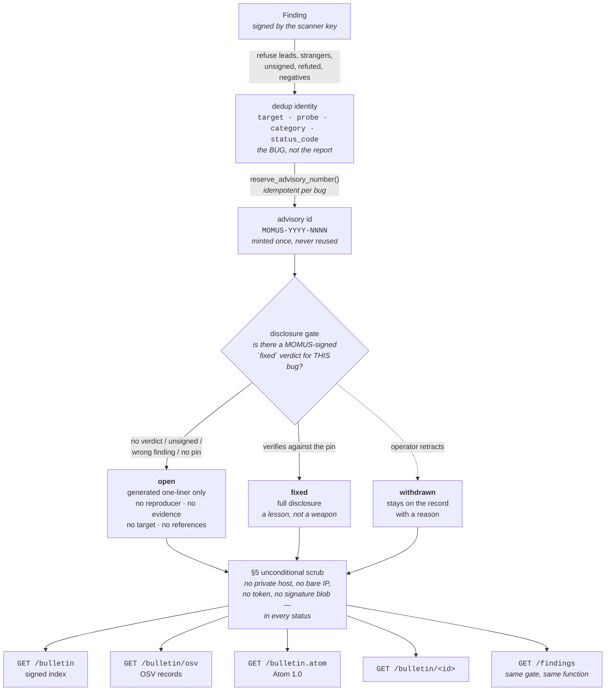

# The MOMUS security bulletin — publishing in the shape we consume

> 🌐 **English** · [Русский](bulletin.ru.md) · [Español](bulletin.es.md) · [Français](bulletin.fr.md) · [中文](bulletin.zh.md)

MOMUS ingests CISA KEV, NVD, OSV and GHSA (`momus/intel/sources.py`) and, until this feature, published
nothing of its own. That asymmetry is not neutral. A red team that only *reads* other people's
advisories is asking to be trusted on the strength of documents it never has to write — no stable
identifiers, no disclosure policy anyone can hold it to, no record that survives a rescan. The
bulletin closes it, and it exports **OSV** — the same schema we consume — so the tooling that reads
the rest of the world reads us too.

The bulletin is MOMUS's record of holes in **services we operate**. That single fact decides almost
every rule below: an advisory here is not a warning about someone else's software, it is an
admission about our own, published by the party that both found it and runs the host.



Four read-only routes, all public, all serving the same redacted record:

| Route | For |
|---|---|
| `GET /bulletin` | the signed index — `{advisories, timestamp, signature}` |
| `GET /bulletin/osv` | OSV records, for the tooling that already reads KEV/OSV/GHSA |
| `GET /bulletin.atom` | Atom 1.0, for readers that poll |
| `GET /bulletin/MOMUS-2026-0001` | one advisory, by the number you cite |

Plus the SPA's own `#/bulletin` page, which reads the index and is careful to say **which** of "no
bulletin here" and "could not ask" it is looking at — a 404 is the documented answer for a deployment
that never opted in, and collapsing it into a generic error would misreport policy as an outage.

## §1 One number per BUG, not per report

`MOMUS-YYYY-NNNN`, assigned once per `Finding.dedup_key`.

A "stable id" that changes when the same bug is found twice is just a report id with a prettier
format. So the number is keyed on the **dedup identity** — the deterministic identity of the flaw —
and not on `finding_id`, which is a fresh UUID on every scan. Rediscover the same hole next week and
it comes back as the same advisory, with a new `finding_id` appended and `modified` bumped.

The dedup identity is contract-level facts only (`findings.py`):

| in the identity | out of it, deliberately |
|---|---|
| `target`, `probe`, `category`, observed `status_code` | the response digest, the timestamp, the latency, the reporter |

That exclusion is not theoretical tidiness. The response digest *was* in the basis, and a target's
body carries a fresh nonce on every call, so the same real bug produced a new key on every rescan —
which meant no dedup at all, and a bounty that was payable again and again. **Anything that varies
per observation must stay out of an identity.** The same lesson that reshaped the WARDEN intake key
and the Treasury's claimant key.

Around that:

* **Monotonic per year**, from a high-water counter (`advisory_counter`) bumped with an atomic
  upsert, not a read-then-write — two concurrent publishes cannot be handed the same sequence.
* **Never reused, gaps never filled.** A withdrawn advisory keeps its number forever. `max(seq)`
  would hand a retracted entry's number to a different bug, and a number that means two things is
  worse than a gap in the sequence.
* **Minted only on publish.** Most findings never become advisories, and pre-allocating numbers for
  them would leak how much we are sitting on.
* **Widens past four digits rather than wrapping.** The 10 000th advisory of a year must not collide
  with the first; an ugly id beats a duplicate one.
* **Immutable** (`AdvisoryId` is a frozen dataclass), because an advisory number is a promise.

## §2 Coordinated disclosure — the rule the whole feature rests on

MOMUS audits our own deployed services. So a bulletin entry with a working reproducer against an
**unfixed** component is not a disclosure. It is an attack script, published under our own signature,
against a host we operate, for an audience that includes whoever wants in — and we published it with
the authority of a security auditor saying "this works."

| status | what a reader gets |
|---|---|
| **`open`** | id, `published`/`modified`, component, category, severity, and a **generated** non-actionable one-liner. No reproducer, no evidence digests, no probe parameters, no request/response snippets, no target URL, **no references at all**. |
| **`fixed`** | everything, reproducer included. It is a lesson now, not a weapon. |
| **`withdrawn`** | the entry **stays**, with its reason. The actionable parts are withheld again. |

Every advisory states its status *and* its `disclosure` in its own body. A reader must never have to
infer whether a hole is still open, and the document must carry its own limits through routes,
screenshots and copies that arrive with no other context — the same habit as the WARDEN triage
queue's disclaimer.

Three details that look like over-engineering and are not:

**The `open` summary is generated, not the scanner's title.** From `(severity, category, component)`
and nothing else. A human- or LLM-written title — *"free tier serves 1000 calls unpaid when n>100"* —
is itself a recipe, and no review process can promise that a sentence written to be informative is
not also actionable.

**No references while the hole is open.** Every link we hold points either at the affected service or
at internal tooling, so "which links are safe" has no honest answer yet.

**An unknown status is treated as `open`.** Anything we cannot positively identify as `fixed` is an
open hole. Fail closed.

### What unlocks full disclosure

Exactly one thing: a **MOMUS-signed `fixed` verdict** for this bug, checked against a pinned key
(`gate_says_fixed`). This is the most attractive thing in the module to forge, so a bare
`{"fixed": true}` must not turn an open hole into a published exploit. Every one of these leaves the
advisory `open`:

| condition | why it is fatal on its own |
|---|---|
| no verdict on record | the default state of every advisory |
| `fixed` is false | the probe still reproduces |
| the verdict names a different `finding_id` | a verdict is not transferable between bugs |
| no verifier key pinned | **no pin, no disclosure** — an empty pin can never be satisfied |
| the verdict is unsigned | the word `fixed` is not a verdict |
| the signature does not verify against the pin | not against whatever key the verdict claims |

The same fail-closed shape as `economics._fix_verdict_ok`, which once released real money on an
unsigned dict. Checking against a **pin** rather than the verdict's self-declared key is the whole
point: otherwise a forger simply ships their own key alongside their own signature.

### Redaction is the default, and it is checked three times

1. `Advisory.to_dict()` — the **redacted** form. This is the default path on purpose: a caller who
   forgets to think about disclosure gets the safe answer, not the exploit.
2. `Advisory.raw_dict()` — the unredacted form, named awkwardly so that serving it is a visible
   decision in the calling code. It is the operator path and the storage format, never a response
   body.
3. `_ensure_public()` — the last gate before any bytes are signed. Redundant with (1) by
   construction, and kept anyway: the failure it guards against is not a bug in
   `redact_for_disclosure`, it is a future caller who hands `signed_index()` raw dicts from somewhere
   else. It also refuses an entry that claims `fixed` while carrying no fix verdict, because at that
   point the status is just a string in a dict. **A signed exploit cannot be recalled once somebody
   has fetched it.**

`redact_for_disclosure` is deliberately boring: pure, idempotent, no configuration, no caller-supplied
policy, no "verbose" mode. The status decides, and only the status.

### The unconditional scrub (§5), in every status

Even a fully disclosed `fixed` advisory never publishes a private host, a bare IP, a credential or a
full signature blob. Our probes build reproducers from `target.base_url`, which in production is an
in-cluster service name — so publishing one verbatim would publish our topology.

| pass | behaviour |
|---|---|
| URLs | the **path survives** (that is the lesson), the authority becomes `<target-host>` unless the host is on the public list — which is derived from `warden_feed._FIRST_PARTY`, not retyped |
| bare `host:port` | how an in-cluster address appears in prose, invisible to the URL pass |
| IPv4 | `[ip-redacted]` |
| `Bearer …`, `token=…`, `api_key: …` | the **value is consumed by the match** — an earlier form replaced only the key and left the secret sitting next to the word `[redacted]` |
| base64 blobs ≥ 80 chars | an Ed25519 signature is 88 characters; a sha-256 hex digest is 64 and digests *are* publishable evidence. The threshold sits between them on purpose. |

Order matters: URLs first, so an IP-hosted URL loses its host before the bare-IP pass sees it.

One scar worth keeping visible: `2026-08-08T19:36:19Z` used to be published as `<target-host>:19Z`,
because the host pattern requires a letter and the `T` supplied one. It was found in a real `fixed`
advisory, corrupting the module's own *"Re-tested by MOMUS on …"* line. The clock-only case (`12:30`)
had been safe and tested all along; it is the date-and-time form that has a letter in it.

### The same rule on the live ledger, not just here

`GET /findings` is public and returned whole finding documents straight from the corpus —
`evidence.reproducer` and the in-cluster target URL included, for findings that were still open.
**Withholding a reproducer in the bulletin while serving the same reproducer one route over is not
coordinated disclosure, it is paperwork.** Both surfaces now answer from one rule and one function
(`public_finding`), keyed on the same dedup identity: a bug disclosed in the bulletin is disclosed in
the ledger, and nothing else is disclosed anywhere.

Two consequences worth naming rather than glossing:

* **A signature present in a public finding verifies.** A redacted document cannot verify under the
  signature that covered the original, and serving one that fails reads as tampering — so it is
  withheld with a note instead. The comparison runs over `signed_body()`, whose field list is derived
  from the `Finding` dataclass rather than denylisted, because the corpus adds `seen_count` /
  `first_seen_at` / `last_seen_at`, scans add `known_before`, and the route adds `disclosure`. A
  caller who hashed the whole document minus `signature` got `False` every time; the signature was
  fine, the instructions were missing.
* **The ledger keeps the scanner's `title` and `detail`, where the bulletin would replace them.** The
  two surfaces are not the same object: the bulletin is a permanent citable record, the ledger is
  live. So an unfixed finding's prose in the ledger can still describe the *shape* of a bug
  ("returned 200 on the n+1th unpaid call"), which is more than the bulletin publishes for the same
  hole. What it can never carry is the copy-pasteable part — the reproducer, the payloads, and the
  host to aim them at.

## The signed index, verified with the same code that verifies the WARDEN feed

```
GET https://momus.modelmarket.dev/bulletin

{ "advisories": [ {id, status, disclosure, component, severity, …}, … ],
  "timestamp": 1786223680673,      // epoch ms, integer
  "signature": "ab837d7e…"         // hex Ed25519 over the RFC 8785 canonical
                                   // form of {advisories, timestamp}
}
```

This is the envelope [WARDEN already verifies](warden-channel.md), reused (`bulletin.py` §4).
`jcs()` and `spki_hex()` are **imported** from `momus/warden_feed.py`, never re-implemented: that
canonicalizer is cross-verified byte-for-byte against ARGUS's TypeScript JCS and the AWR reference
implementation, and a second implementation is simply a second thing that can disagree with the
first. The key to pin is
MOMUS's scanner key — the one `/health` already publishes as `scanner_pubkey`, and
`/warden/threat-feed/summary` publishes in SPKI-hex as `feed_public_key_spki_hex`. One key, not a
third format for an operator to get wrong.

Entries are **sorted by id** before signing, so the same set of advisories always produces identical
bytes: an index whose signature churns on iteration order cannot be cached, diffed, or checked for
replay. The route takes **no `limit`** — the bulletin *is* the record, and a paginated record signed
per page would hand two readers two different documents to cite. It is capped at 500 so a response
cannot grow unbounded, and it is **not cached**: signing costs microseconds, and `timestamp` is a
freshness claim, so a cached document would eventually publish a stale one.

Verifying it with ARGUS's own canonicalizer and `node:crypto` — the exact code path WARDEN uses on
the threat feed:

```js
const { canonicalize } = await import('@aimarket/warden/jcs');
const payload = canonicalize({ advisories: doc.advisories, timestamp: doc.timestamp });
const pub = createPublicKey({ key: Buffer.from(spkiHex, 'hex'), format: 'der', type: 'spki' });
verify(null, Buffer.from(payload, 'utf8'), pub, Buffer.from(doc.signature, 'hex'));
```

Run against a locally generated index — two advisories from a real `BulletinStore`, a real scanner
key, and `@aimarket/warden/jcs` for the bytes (a throwaway harness, not a committed script:
`verify_warden_channel.mjs` covers the threat feed only, and there is no live bulletin to point it
at yet):

```
signature accepted by ARGUS's canonicalizer: true
tampered severity accepted:                  false
shifted timestamp accepted:                  false
timestamp is an integer:                     true
signature is 128 hex chars:                  true
```

**Two honest caveats.** The payload key is `advisories`, not `records` — the envelope, the
canonicalizer, the encoding and the key are identical, but
[`scripts/verify_warden_channel.mjs`](../scripts/verify_warden_channel.mjs) cannot be pointed at
`/bulletin` unmodified; a consumer canonicalizes `{advisories, timestamp}`. And unlike the threat
feed, whose freshness window ARGUS actually enforces, **nothing consumes the bulletin index today**:
the `timestamp` is a freshness claim we make, not one a deployed verifier currently checks. The run
above is local, not the production proof the WARDEN channel has.

## OSV export, with the mismatch said out loud

`GET /bulletin/osv` returns the bare array an OSV consumer expects, one record per advisory, built
from the **redacted** form (`bulletin.py` §3) — §2 applies to every export.

OSV describes vulnerable **package versions**. A MOMUS advisory describes a **deployed service**,
which has no version axis at all. We could have papered over that; instead every record carries the
mismatch in `database_specific.note`:

| OSV field | what we put there | the honest problem |
|---|---|---|
| `affected[].package.ecosystem` | `"AIMarket"` | ours, and **not an OSV-registered ecosystem** |
| `affected[].package.name` | the service id (`hub`, `metis`, …) | not a package anyone can install |
| `affected[].ranges` | **absent** | an OSV consumer reads a missing `ranges` as *"all versions affected"*. No version range was checked, because there is nothing to check. |
| `severity` | `[]` | we hold a qualitative severity, not a CVSS vector. Inventing a vector to fill a required-looking field is how bad data enters a feed; the qualitative value is in `database_specific.severity`. |
| `withdrawn` | `modified`, for a withdrawn advisory | OSV's own field: a consumer that honours it stops acting on the record without us deleting anything |
| `references[].type` | coerced to `WEB` when outside OSV's enum | an unknown type fails validation for the *whole* record, and a consumer that rejects our document learns nothing from it |

`credits` names MOMUS as `FINDER`, and additionally as `REMEDIATION_VERIFIER` on a `fixed` advisory —
which is exactly as independent as it sounds; see *what is not true yet*.

## The Atom feed

`GET /bulletin.atom` serves the same record as Atom 1.0, for readers that poll rather than parse
JSON. It is built with `ElementTree`, not an f-string template, and that is a security choice rather
than a style one: an advisory summary is text that came out of a probe or an operator's withdrawal
reason, so a hand-written template publishes a bare `&` or `<` straight into the document — in the
best case the feed stops parsing for every reader, in the worst it injects markup into whatever
renders it.

* **Control characters are stripped, not escaped.** XML 1.0 has no escape for most of them; a single
  raw `0x00` in a captured response snippet makes the **whole feed** unparseable, not just its own
  entry.
* **`<id>` is stable** — the feed's is `{base}/bulletin`, an entry's is `{base}/bulletin/{id}`.
  Readers dedupe on it, so a churning id republishes the entire bulletin as unread on every poll.
  The advisory number is already the permanent handle for the bug.
* **`<updated>` is the advisory's `modified`**, so a re-publication, a fix or a withdrawal surfaces
  as an update — which is why the record keeps `published` and `modified` separately.
* **Timestamps are validated as RFC 3339**, with `now` only as a last resort: Atom requires
  `<updated>`, and a strict reader rejects a document with a malformed one.
* **`type="text"`, not `html`**, on summary and content: declaring prose to be HTML asks every reader
  to render markup we did not author.
* The response is `application/atom+xml; charset=utf-8` — a feed reader dispatches on the media type,
  and the charset is explicit because the document can carry non-ASCII prose. The `type` attribute on
  an Atom `<link>` carries no charset (RFC 4287), hence the two spellings in the code.

The renderer consumes **already-redacted dicts**, never `Advisory` objects, so it cannot widen
disclosure even by mistake: an `open` entry's reproducer is the empty string long before it arrives.

## Withdrawal — entries never vanish

`withdraw(advisory_id, reason)` sets the status to `withdrawn` and keeps the row. A reason is
**mandatory**: an entry that flips to `withdrawn` with no explanation is the same information loss as
deleting it.

Silent deletion is how a public record stops being trustworthy. If an advisory can disappear, then
every *remaining* advisory is unverifiable — a reader has no way to tell a bulletin that never had an
entry from one that quietly dropped it, and any count we publish becomes a claim rather than a fact.
So: the number stays retired, the entry stays listed (`list()` includes withdrawn entries — the record
is the point), and OSV consumers see the standard `withdrawn` field.

The actionable parts are withheld **again** on withdrawal, even if the advisory had been `fixed`: a
record MOMUS no longer stands behind must not carry a working reproducer under MOMUS's signature.

And a withdrawal survives a rescan. `publish()` re-publishing the same bug keeps the withdrawn status
and reason, whatever the scan brings, because withdrawal is an operator's judgement about the record
and an automated path that could quietly resurrect a retracted entry would make withdrawal unreliable
in exactly the way a deletion is. Re-listing is a deliberate operator act.

The mirror-image rule on the other side: a published `fixed` advisory is **not** silently walked back
to `open` by a later re-publication. The reproducer is already out, so re-hiding it protects nobody,
and a status that oscillates is a record nobody can cite. A regression shows up as a new `finding_id`
and a bumped `modified`; an operator who wants the record to say more than that withdraws it with a
reason.

## Configuration

| Variable | Default | Meaning |
|---|---|---|
| `MOMUS_BULLETIN` | **off** | publish the bulletin at all. Off means every route answers **404, not 403** — an operator who did not opt in *has* no bulletin, and "forbidden" would tell a reader one exists behind a permission. |
| `MOMUS_PUBLIC_URL` | `http://localhost:9400` | the origin in Atom ids, links and `summary().bulletin_url`. Must be stable across restarts, or every reader re-notifies. |
| `MOMUS_SIGNING_KEY_PATH` | `data/momus_signing_key` | the scanner key. Signs findings, the WARDEN feed **and** the bulletin index — one identity to pin. |
| `MOMUS_DATA_DIR` | `data` | the corpus. Advisories live in the same store as findings, in an `advisories` table with unique indexes on `dedup_key` and on `(year, seq)`. |
| `MOMUS_OPERATOR_TOKEN` | — | unrelated to reading the bulletin, which is public. It is what gets an operator the **unredacted** originals from `GET /findings`. |

Publishing is opt-in and off by default: becoming a public advisory publisher is a decision an
operator makes, not a side effect of running the container. There is no ARGUS-side configuration —
nothing consumes this feed yet.

Two containment properties that are structural rather than configured:

* `BulletinStore` **holds no key**. Signing an index is a call that takes a signer, so a bulletin
  that is only ever read cannot produce a signed document.
* **Nothing that mints, publishes or withdraws is exposed over HTTP.** All four routes are read-only.

## What this is NOT

**Not a third-party accusation channel.** An advisory about somebody else's service never appears
here — that is the [WARDEN threat feed](warden-channel.md), which has its own gating, and it is
somebody else's reputation rather than our record. The guard is literally the same function read in
the opposite direction: `warden_feed.check_pattern()` refuses a deny pattern *because* it matches one
of our identities, so "refused for first-party" is precisely "this is ours". The feed publishes only
what is **not** ours, the bulletin only what **is**. One list, so the two can never drift into
overlapping or into both being wrong.

**Not a lead queue.** An unverified `warden_reports` lead can never become an advisory. Leads carry
`is_momus_finding: false`, `verified: false` and a disclaimer by construction — attached to the data
itself precisely so this refusal is possible — and each marker is a refusal on its own. Publishing a
stranger's anonymous claim under our advisory numbering would put our name on an accusation we have
not checked. Nor is a finding enough by itself: an unsigned or tampered finding, an honest negative
(`no_finding` — valuable in the corpus, noise in a security feed), and a finding an independent
verifier **refuted** are all refused.

**Not a marketing surface.** An `open` advisory is deliberately unquotable: a generated one-liner and
a status. There is no severity inflation to be had here, and no "responsibly disclosed by" narrative —
we are the auditor *and* the operator, which is a weaker claim than either alone.

## What is not true yet

* **The routes are not reachable in production.** The frontend nginx allowlist
  (`momus/frontend/nginx.conf`) proxies `/health`, `/providers`, `/findings`, `/intel` and the WARDEN
  routes; `/bulletin*` is not in it. A same-origin fetch therefore falls through to the SPA and gets
  `index.html` with a **200** — which the client cannot parse as JSON and will not report as
  "disabled" either, because that path keys on a 404. Publishing means adding the four read-only
  paths to that allowlist in the same change.
* **`MOMUS_BULLETIN` is not set in the deployed compose**, so the live deployment has no bulletin.
  Everything above is code and tests, not a production observation — unlike the WARDEN channel,
  which was proven against the live host with the consumer's own verifier.
* **Nothing publishes automatically.** No route, no CLI, and no step of the remediation loop calls
  `BulletinStore.publish()` — today an advisory is minted by an operator calling it directly. The
  disclosure rules are enforced; the *editorial* decision has no tooling around it.
* **The `fixed` verdict is signed by MOMUS's own scanner key.** `Retester` is wired with
  `runtime.signer`, and the bulletin pins that same key. So the pin proves the verdict came from
  MOMUS and was not forged by a caller — which is what it is for — but it does **not** make the fix
  independently verified. The scanner ≠ treasury separation that governs payouts does not apply to
  the disclosure switch, and `credits[].REMEDIATION_VERIFIER` in the OSV export should be read with
  that in mind.
* **The OSV ecosystem `AIMarket` is not registered with OSV.** Consumers that validate the ecosystem
  against the published list will reject our records; the note explains why, which is the most we can
  honestly do from here.
* **No consumer polls any of this.** No freshness window is enforced against us by anybody, and the
  Atom feed has no subscribers.

## Tests

| Suite | What it covers |
|---|---|
| `momus/tests/test_bulletin.py` (42) | stable ids across rediscovery and restart, numbers never reused, §2 field-by-field **and** on the whole serialized blob, a forged fix verdict, no pin ⇒ never `fixed`, withdrawal, §5 refusals, the scrubber, index determinism and tamper-detection, OSV |
| `momus/tests/test_bulletin_disclosure.py` (12) | the same rule on `GET /findings` and on the `momus.findings@v1` invoke path, keyed on the bug and not the report; the operator path; "a signature present in a public finding verifies"; the ISO-timestamp scrub regression |
| `momus/tests/test_bulletin_routes.py` (9) | the wire: 404 when publishing is off, the envelope re-verified from the **served** bytes, an `open` advisory carrying no reproducer on **all four** surfaces, Atom parsing as XML and surviving hostile advisory text, the OSV fields |

```
cd momus && PYTHONPATH=.:../skopos ../oracles/.venv/bin/python -m pytest -q \
    tests/test_bulletin.py tests/test_bulletin_disclosure.py tests/test_bulletin_routes.py
63 passed
```

The load-bearing one is `test_an_open_advisory_served_over_http_carries_no_reproducer`: it fetches
every bulletin surface for an `open` advisory and asserts the reproducer is absent from all four
bodies — including the Atom feed, where a leak would arrive as prose rather than as a field, and
therefore survive every field-level assertion in the file.
