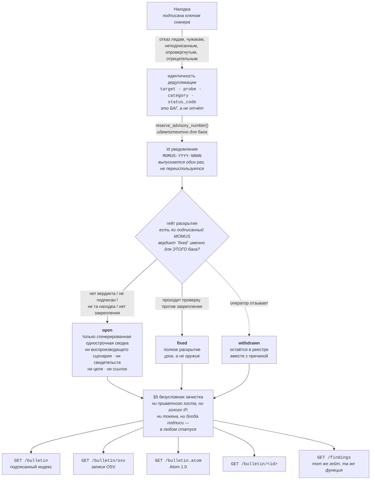

# Бюллетень безопасности MOMUS — публикуем в той же форме, в какой потребляем

> 🌐 [English](bulletin.md) · **Русский** · [Español](bulletin.es.md) · [Français](bulletin.fr.md) · [中文](bulletin.zh.md)

MOMUS принимает CISA KEV, NVD, OSV и GHSA (`momus/intel/sources.py`), а до этой возможности не
публиковал ничего своего. Такая асимметрия не нейтральна. Красная команда, которая чужие уведомления
только *читает*, просит доверия на основании документов, которые ей самой писать не приходится: ни
стабильных идентификаторов, ни политики раскрытия, за которую с неё можно спросить, ни реестра,
переживающего пересканирование. Бюллетень закрывает этот перекос и экспортирует **OSV** — ту самую
схему, которую мы потребляем, — чтобы инструменты, читающие весь остальной мир, читали и нас.

Бюллетень — это реестр MOMUS по дырам в **сервисах, которые мы сами эксплуатируем**. Один этот факт
определяет почти каждое правило ниже: уведомление (advisory) здесь — не предупреждение о чужом ПО, а
признание о своём собственном, опубликованное стороной, которая и нашла дыру, и держит хост.



Четыре маршрута только на чтение, все публичные, все отдают один и тот же вымаранный реестр:

| Маршрут | Для чего |
|---|---|
| `GET /bulletin` | подписанный индекс — `{advisories, timestamp, signature}` |
| `GET /bulletin/osv` | записи OSV — для инструментов, которые уже читают KEV/OSV/GHSA |
| `GET /bulletin.atom` | Atom 1.0 — для читателей, которые опрашивают |
| `GET /bulletin/MOMUS-2026-0001` | одно уведомление, по тому номеру, который вы цитируете |

Плюс собственная страница SPA `#/bulletin`, которая читает индекс и аккуратно проговаривает,
**какой именно** из двух случаев она видит: «бюллетеня здесь нет» или «не удалось спросить». 404 —
это документированный ответ для развёртывания, которое публикацию так и не включило, и схлопывание
его в общую ошибку выдавало бы политику за аварию.

## §1 Один номер на БАГ, а не на отчёт

`MOMUS-YYYY-NNNN`, назначается один раз на `Finding.dedup_key`.

«Стабильный id», который меняется, когда тот же баг находят второй раз, — это просто id отчёта в
более красивом формате. Поэтому номер завязан на **идентичность дедупликации** — детерминированную
идентичность самого дефекта, — а не на `finding_id`, который на каждом скане новый UUID. Найдите ту
же дыру снова через неделю — она вернётся тем же уведомлением, с добавленным новым `finding_id` и
поднятым `modified`.

Идентичность дедупликации — это только факты уровня контракта (`findings.py`):

| в идентичности | намеренно вне её |
|---|---|
| `target`, `probe`, `category`, наблюдаемый `status_code` | дайджест ответа, метка времени, задержка, отправитель отчёта |

Это исключение — не теоретическая опрятность. Дайджест ответа *был* в основе, а тело цели на каждый
вызов несёт свежий нонс, поэтому один и тот же настоящий баг давал новый ключ на каждом
пересканировании — то есть дедупликации не было вовсе, а вознаграждение можно было получать снова и
снова. **Всё, что меняется от наблюдения к наблюдению, должно оставаться вне идентичности.** Тот же
урок, который переделал ключ приёма WARDEN и ключ заявителя в Treasury.

Вокруг этого:

* **Монотонность в пределах года** — от счётчика-максимума (`advisory_counter`), поднимаемого
  атомарным upsert, а не чтением-с-последующей-записью: двум одновременным публикациям невозможно
  выдать одну и ту же последовательность.
* **Номера не переиспользуются, пропуски не заполняются.** Отозванное уведомление навсегда сохраняет
  свой номер. `max(seq)` отдал бы номер отозванной записи другому багу, а номер, означающий две вещи,
  хуже, чем пропуск в нумерации.
* **Выпускается только при публикации.** Большинство находок уведомлениями так и не становятся, а
  предварительное резервирование номеров под них выдавало бы, сколько мы держим на руках.
* **Расширяется за пределы четырёх цифр, а не переполняется.** Десятитысячное уведомление года не
  должно столкнуться с первым; уродливый id лучше дублирующегося.
* **Неизменяемость** (`AdvisoryId` — замороженный dataclass), потому что номер уведомления — это
  обещание.

## §2 Скоординированное раскрытие — правило, на котором держится вся эта возможность

MOMUS аудирует наши собственные развёрнутые сервисы. Поэтому запись бюллетеня с работающим
воспроизводящим сценарием (reproducer) против **непочиненного** компонента — это не раскрытие. Это
скрипт атаки, опубликованный под нашей же подписью, против хоста, который мы сами эксплуатируем, для
аудитории, куда входит любой желающий влезть, — и опубликовали мы его с авторитетом аудитора
безопасности, говорящего «это работает».

| статус | что получает читатель |
|---|---|
| **`open`** | id, `published`/`modified`, компонент, категория, критичность и **сгенерированная** однострочная сводка, непригодная для атаки. Ни воспроизводящего сценария, ни дайджестов свидетельств, ни параметров пробы, ни фрагментов запроса/ответа, ни URL цели, **вообще никаких ссылок**. |
| **`fixed`** | всё, включая воспроизводящий сценарий. Теперь это урок, а не оружие. |
| **`withdrawn`** | запись **остаётся**, вместе со своей причиной. Пригодные для атаки части снова не раскрываются. |

Каждое уведомление указывает свой статус *и* своё `disclosure` в собственном теле. Читателю никогда
не должно приходиться догадываться, открыта ли ещё дыра, а документ обязан нести свои ограничения
через маршруты, скриншоты и копии, которые приходят без всякого другого контекста, — та же привычка,
что и дисклеймер очереди разбора WARDEN.

Три детали, которые выглядят оверинжинирингом, но им не являются:

**Сводка для `open` генерируется, а не берётся из заголовка сканера.** Из
`(severity, category, component)` и ничего больше. Заголовок, написанный человеком или LLM, —
*«free tier serves 1000 calls unpaid when n>100»* — сам по себе рецепт, и никакой процесс ревью не
может пообещать, что фраза, написанная быть информативной, не окажется заодно и пригодной для атаки.

**Никаких ссылок, пока дыра открыта.** Каждая имеющаяся у нас ссылка ведёт либо на затронутый сервис,
либо на внутренний инструментарий, так что у вопроса «какие ссылки безопасны» пока нет честного
ответа.

**Неизвестный статус трактуется как `open`.** Всё, что мы не можем уверенно опознать как `fixed`, —
открытая дыра. Fail-closed (отказ по умолчанию).

### Что открывает полное раскрытие

Ровно одна вещь: **подписанный MOMUS вердикт `fixed`** для этого бага, проверенный против
закреплённого ключа (`gate_says_fixed`). Это самое привлекательное для подделки место во всём модуле,
поэтому голое `{"fixed": true}` не должно превращать открытую дыру в опубликованный эксплойт. Каждое
из перечисленного оставляет уведомление в `open`:

| условие | почему само по себе фатально |
|---|---|
| вердикта в реестре нет | состояние по умолчанию для любого уведомления |
| `fixed` равно false | проба всё ещё воспроизводится |
| вердикт называет другой `finding_id` | вердикт не переносится между багами |
| ключ верификатора не закреплён | **нет закрепления — нет раскрытия**: пустое закрепление невозможно удовлетворить |
| вердикт не подписан | слово `fixed` — это не вердикт |
| подпись не проходит проверку против закрепления | а не против того ключа, который вердикт объявляет своим |

Та же fail-closed форма, что и у `economics._fix_verdict_ok`, который однажды выпустил настоящие
деньги по неподписанному словарю. Проверка против **закрепления**, а не против самопровозглашённого
ключа вердикта, — в этом весь смысл: иначе подделыватель просто приложит собственный ключ к
собственной подписи.

### Вымарывание — это поведение по умолчанию, и проверяется оно трижды

1. `Advisory.to_dict()` — **вымаранная** форма. Это путь по умолчанию намеренно: вызывающий, забывший
   подумать о раскрытии, получает безопасный ответ, а не эксплойт.
2. `Advisory.raw_dict()` — невымаранная форма, названная нарочно неудобно, чтобы её отдача была
   видимым решением в коде вызывающего. Это операторский путь и формат хранения, но никогда не тело
   ответа.
3. `_ensure_public()` — последний гейт перед тем, как будет подписан хоть один байт. По построению
   избыточен относительно (1) и оставлен всё равно: он защищает не от бага в `redact_for_disclosure`,
   а от будущего вызывающего, который передаст в `signed_index()` сырые словари откуда-то ещё. Он же
   отказывает записи, объявляющей `fixed` и не несущей вердикта об исправлении, — потому что в этот
   момент статус всего лишь строка в словаре. **Подписанный эксплойт нельзя отозвать после того, как
   его кто-то забрал.**

`redact_for_disclosure` намеренно скучна: чистая, идемпотентная, без конфигурации, без политики от
вызывающего, без режима «подробнее». Решает статус, и только статус.

### Безусловная зачистка (§5) — в любом статусе

Даже полностью раскрытое уведомление в статусе `fixed` никогда не публикует приватный хост, голый IP,
учётные данные или полный блоб подписи. Наши пробы строят воспроизводящие сценарии из
`target.base_url`, а в проде это внутрикластерное имя сервиса — так что публикация такого сценария
дословно опубликовала бы нашу топологию.

| проход | поведение |
|---|---|
| URL | **путь выживает** (в нём и есть урок), authority превращается в `<target-host>`, если только хост не в публичном списке — а тот выведен из `warden_feed._FIRST_PARTY`, а не перепечатан |
| голый `host:port` | так внутрикластерный адрес выглядит в прозе, и проходу по URL он не виден |
| IPv4 | `[ip-redacted]` |
| `Bearer …`, `token=…`, `api_key: …` | **значение поглощается совпадением** — более ранняя форма заменяла только ключ и оставляла секрет лежать рядом со словом `[redacted]` |
| base64-блобы ≥ 80 символов | подпись Ed25519 — 88 символов; hex-дайджест sha-256 — 64, и дайджесты *являются* публикуемым свидетельством. Порог стоит между ними намеренно. |

Порядок важен: URL первыми, чтобы URL на IP потерял свой хост раньше, чем его увидит проход по голым
IP.

Один шрам, который стоит держать на виду: `2026-08-08T19:36:19Z` публиковался как
`<target-host>:19Z`, потому что паттерн хоста требует букву, а `T` её и предоставил. Нашли это в
настоящем уведомлении со статусом `fixed`, где портилась собственная строка модуля *«Re-tested by
MOMUS on …»*. Случай с одним временем (`12:30`) был безопасен и покрыт тестом с самого начала; буква
есть именно в форме «дата и время».

### То же правило на живом журнале, а не только здесь

`GET /findings` публичен и отдавал целые документы находок прямо из корпуса — вместе с
`evidence.reproducer` и внутрикластерным URL цели, в том числе для находок, которые всё ещё были
открыты. **Не раскрывать воспроизводящий сценарий в бюллетене, отдавая тот же сценарий одним
маршрутом рядом, — это не скоординированное раскрытие, а бумажная работа.** Теперь обе поверхности
отвечают по одному правилу и из одной функции (`public_finding`), завязанной на ту же идентичность
дедупликации: баг, раскрытый в бюллетене, раскрыт и в журнале, и больше нигде не раскрыто ничего.

Два следствия, которые стоит назвать, а не замять:

* **Подпись, присутствующая в публичной находке, проходит проверку.** Вымаранный документ не может
  пройти проверку по подписи, покрывавшей оригинал, а отдача заведомо неверной подписи читается как
  подделка — поэтому подпись не отдаётся, а заменяется примечанием. Сравнение идёт по
  `signed_body()`, список полей которой выведен из dataclass `Finding`, а не составлен как список
  запрещённых: корпус добавляет `seen_count` / `first_seen_at` / `last_seen_at`, сканы добавляют
  `known_before`, а маршрут добавляет `disclosure`. Вызывающий, который хешировал весь документ за
  вычетом `signature`, получал `False` каждый раз; подпись была в порядке — не хватало инструкции.
* **Журнал сохраняет `title` и `detail` сканера там, где бюллетень их заменил бы.** Две поверхности —
  не один и тот же объект: бюллетень — постоянный цитируемый реестр, журнал — живой. Поэтому проза
  непочиненной находки в журнале всё ещё может описывать *форму* бага («вернул 200 на n+1-м
  неоплаченном вызове»), а это больше, чем бюллетень публикует о той же дыре. Чего она нести не может
  никогда — так это копипастящейся части: воспроизводящего сценария, полезных нагрузок и хоста, в
  который ими целиться.

## Подписанный индекс, проверяемый тем же кодом, что проверяет фид WARDEN

```
GET https://momus.modelmarket.dev/bulletin

{ "advisories": [ {id, status, disclosure, component, severity, …}, … ],
  "timestamp": 1786223680673,      // epoch ms, integer
  "signature": "ab837d7e…"         // hex Ed25519 over the RFC 8785 canonical
                                   // form of {advisories, timestamp}
}
```

Это переиспользованный конверт, [который WARDEN уже проверяет](warden-channel.ru.md) (`bulletin.py`
§4). `jcs()` и `spki_hex()` **импортируются** из `momus/warden_feed.py` и никогда не реализуются
заново: этот канонизатор побайтово сверен с TypeScript-JCS из ARGUS и с эталонной реализацией AWR, а
вторая реализация — это просто вторая вещь, способная разойтись с первой. Закреплять нужно ключ
сканера MOMUS — тот самый, который `/health` уже публикует как `scanner_pubkey`, а
`/warden/threat-feed/summary` — в SPKI DER hex как `feed_public_key_spki_hex`. Один ключ, а не третий
формат, в котором оператор может ошибиться.

Записи перед подписанием **сортируются по id**, так что один и тот же набор уведомлений всегда даёт
одинаковые байты: индекс, чья подпись пляшет от порядка обхода, нельзя ни закэшировать, ни
продиффить, ни проверить на повтор. Маршрут **не принимает `limit`** — бюллетень *и есть* реестр, а
постранично подписанный реестр выдал бы двум читателям два разных документа для цитирования. Он
ограничен 500 записями, чтобы ответ не мог расти бесконечно, и **не кэшируется**: подписание стоит
микросекунды, а `timestamp` — это заявление о свежести, так что кэшированный документ рано или поздно
опубликовал бы устаревшее.

Проверка собственным канонизатором ARGUS и `node:crypto` — ровно тот путь кода, которым WARDEN идёт
по фиду угроз:

```js
const { canonicalize } = await import('@aimarket/warden/jcs');
const payload = canonicalize({ advisories: doc.advisories, timestamp: doc.timestamp });
const pub = createPublicKey({ key: Buffer.from(spkiHex, 'hex'), format: 'der', type: 'spki' });
verify(null, Buffer.from(payload, 'utf8'), pub, Buffer.from(doc.signature, 'hex'));
```

Прогон против локально сгенерированного индекса — два уведомления из настоящего `BulletinStore`,
настоящий ключ сканера и `@aimarket/warden/jcs` для байтов (одноразовая обвязка, а не
закоммиченный скрипт: `verify_warden_channel.mjs` покрывает только фид угроз, а живого бюллетеня, на
который его можно навести, пока нет):

```
signature accepted by ARGUS's canonicalizer: true
tampered severity accepted:                  false
shifted timestamp accepted:                  false
timestamp is an integer:                     true
signature is 128 hex chars:                  true
```

**Две честные оговорки.** Ключ полезной нагрузки — `advisories`, а не `records`: конверт,
канонизатор, кодирование и ключ идентичны, но
[`scripts/verify_warden_channel.mjs`](../scripts/verify_warden_channel.mjs) нельзя без правок навести
на `/bulletin`; потребитель канонизирует `{advisories, timestamp}`. И в отличие от фида угроз, чьё
окно свежести ARGUS действительно проверяет, **индекс бюллетеня сегодня не потребляет никто**:
`timestamp` — это заявление о свежести, которое делаем мы, а не то, что сейчас проверяет
развёрнутый верификатор. Прогон выше локальный, а не продовое доказательство, какое есть у канала
WARDEN.

## Экспорт в OSV — с прямо проговорённым несоответствием

`GET /bulletin/osv` возвращает голый массив, которого ждёт потребитель OSV: по одной записи на
уведомление, построенной из **вымаранной** формы (`bulletin.py` §3) — §2 применяется к каждому
экспорту.

OSV описывает уязвимые **версии пакетов**. Уведомление MOMUS описывает **развёрнутый сервис**, у
которого оси версий нет вовсе. Мы могли бы это замять; вместо этого каждая запись несёт
несоответствие в `database_specific.note`:

| поле OSV | что мы туда кладём | честная проблема |
|---|---|---|
| `affected[].package.ecosystem` | `"AIMarket"` | наша, и **не зарегистрирована в OSV** |
| `affected[].package.name` | id сервиса (`hub`, `metis`, …) | не пакет, который кто-то может установить |
| `affected[].ranges` | **отсутствует** | потребитель OSV читает отсутствующий `ranges` как *«затронуты все версии»*. Никакой диапазон версий не проверялся, потому что проверять нечего. |
| `severity` | `[]` | у нас качественная критичность, а не вектор CVSS. Выдумать вектор, чтобы заполнить поле, выглядящее обязательным, — это способ занести в фид плохие данные; качественное значение лежит в `database_specific.severity`. |
| `withdrawn` | `modified`, для отозванного уведомления | собственное поле OSV: потребитель, который его уважает, перестаёт действовать по записи, а нам ничего удалять не надо |
| `references[].type` | приводится к `WEB`, если оказался вне перечисления OSV | неизвестный тип валит валидацию *всей* записи, а потребитель, отвергший наш документ, не узнаёт из него ничего |

`credits` называет MOMUS как `FINDER`, а для уведомления со статусом `fixed` — дополнительно как
`REMEDIATION_VERIFIER`, что ровно настолько независимо, насколько звучит; см. *что пока неправда*.

## Фид Atom

`GET /bulletin.atom` отдаёт тот же реестр в виде Atom 1.0 — для читателей, которые опрашивают, а не
разбирают JSON. Он строится через `ElementTree`, а не через f-строковый шаблон, и это решение по
безопасности, а не по стилю: сводка уведомления — это текст, вышедший из пробы или из причины отзыва,
написанной оператором, так что рукописный шаблон опубликует голый `&` или `<` прямо в документ — в
лучшем случае фид перестанет разбираться у каждого читателя, в худшем внедрит разметку в то, что его
рендерит.

* **Управляющие символы вырезаются, а не экранируются.** В XML 1.0 для большинства из них
  escape-последовательности нет; один сырой `0x00` в захваченном фрагменте ответа делает нечитаемым
  **весь фид**, а не только свою запись.
* **`<id>` стабилен** — у фида это `{base}/bulletin`, у записи `{base}/bulletin/{id}`. Читалки
  дедуплицируют по нему, так что скачущий id перепубликует весь бюллетень как непрочитанный на каждом
  опросе. Номер уведомления и так является постоянной ручкой для бага.
* **`<updated>` — это `modified` уведомления**, поэтому перепубликация, исправление или отзыв
  всплывают как обновление; ради этого реестр и хранит `published` и `modified` раздельно.
* **Метки времени валидируются как RFC 3339**, а `now` берётся только как последнее средство: Atom
  требует `<updated>`, а строгий читатель отвергнет документ с некорректной меткой.
* **`type="text"`, а не `html`** — на summary и content: объявить прозу HTML-ом значит попросить
  каждого читателя отрендерить разметку, которую писали не мы.
* Ответ идёт как `application/atom+xml; charset=utf-8` — агрегатор фидов диспетчеризует по
  медиатипу, а charset указан явно, потому что документ может нести не-ASCII прозу. Атрибут `type` у
  Atom-элемента `<link>` charset не несёт (RFC 4287) — отсюда два написания в коде.

Рендерер потребляет **уже вымаранные словари**, а не объекты `Advisory`, поэтому расширить раскрытие
даже по ошибке он не может: у записи в статусе `open` воспроизводящий сценарий становится пустой
строкой задолго до того, как она до него дойдёт.

## Отзыв — записи никогда не исчезают

`withdraw(advisory_id, reason)` ставит статус `withdrawn` и оставляет строку на месте. Причина
**обязательна**: запись, перешедшая в `withdrawn` без объяснения, — это ровно такая же потеря
информации, как её удаление.

Тихое удаление — это то, как публичный реестр перестаёт заслуживать доверия. Если уведомление может
исчезнуть, то непроверяемым становится каждое *оставшееся*: читатель никак не отличит бюллетень, в
котором такой записи никогда не было, от того, из которого её тихо выбросили, и любое опубликованное
нами число превращается из факта в заявление. Поэтому: номер остаётся выведенным из обращения, запись
остаётся в списке (`list()` включает отозванные — в реестре весь смысл), а потребители OSV видят
стандартное поле `withdrawn`.

При отзыве пригодные для атаки части скрываются **снова**, даже если уведомление было `fixed`:
запись, за которую MOMUS больше не ручается, не должна нести работающий воспроизводящий сценарий под
подписью MOMUS.

И отзыв переживает пересканирование. `publish()`, перепубликуя тот же баг, сохраняет статус
`withdrawn` и причину, что бы ни принёс скан, потому что отзыв — это суждение оператора о реестре, а
автоматический путь, способный тихо воскресить отозванную запись, сделал бы отзыв ненадёжным ровно
так же, как это делает удаление. Возвращение в список — сознательное действие оператора.

Зеркальное правило с другой стороны: опубликованное уведомление со статусом `fixed` **не**
откатывается тихо в `open` при более поздней перепубликации. Воспроизводящий сценарий уже наружу
вышел, так что прятать его обратно никого не защищает, а колеблющийся статус — это реестр, который
никто не может цитировать. Регрессия проявляется как новый `finding_id` и поднятый `modified`;
оператор, который хочет, чтобы реестр сказал больше, отзывает запись с причиной.

## Конфигурация

| Переменная | По умолчанию | Значение |
|---|---|---|
| `MOMUS_BULLETIN` | **выкл** | публиковать бюллетень вообще. Выключено означает, что каждый маршрут отвечает **404, а не 403**: у оператора, который не включил публикацию, бюллетеня *нет*, а «запрещено» сказало бы читателю, что он существует за разрешением. |
| `MOMUS_PUBLIC_URL` | `http://localhost:9400` | origin в id и ссылках Atom и в `summary().bulletin_url`. Должен быть стабилен между перезапусками, иначе каждый читатель получит уведомления заново. |
| `MOMUS_SIGNING_KEY_PATH` | `data/momus_signing_key` | ключ сканера. Подписывает находки, фид WARDEN **и** индекс бюллетеня — одна личность для закрепления. |
| `MOMUS_DATA_DIR` | `data` | корпус. Уведомления живут в том же хранилище, что и находки, в таблице `advisories` с уникальными индексами по `dedup_key` и по `(year, seq)`. |
| `MOMUS_OPERATOR_TOKEN` | — | к чтению бюллетеня отношения не имеет — оно публично. Этот токен даёт оператору **невымаранные** оригиналы из `GET /findings`. |

Публикация включается явно и по умолчанию выключена: стать публичным издателем уведомлений — решение
оператора, а не побочный эффект запуска контейнера. Конфигурации на стороне ARGUS нет — этот фид пока
никто не потребляет.

Два свойства сдерживания, структурные, а не настраиваемые:

* `BulletinStore` **не держит ключа**. Подписание индекса — это вызов, принимающий подписанта, так
  что бюллетень, который только читают, подписанный документ произвести не может.
* **Ничто из того, что выпускает номера, публикует или отзывает, не выставлено по HTTP.** Все четыре
  маршрута — только на чтение.

## Чем это НЕ является

**Это не канал обвинений в адрес третьих лиц.** Уведомление о чужом сервисе здесь не появляется
никогда — для этого есть [фид угроз WARDEN](warden-channel.ru.md) со своим гейтингом, и это чужая
репутация, а не наш реестр. Страж здесь буквально та же функция, прочитанная в обратную сторону:
`warden_feed.check_pattern()` отказывает запрещающему паттерну *потому что* он совпадает с одной из
наших идентичностей, значит «отказано за первопартийность» — это ровно «это наше». Фид публикует
только то, что **не** наше, бюллетень — только то, что наше. Один список, поэтому эти двое не могут
ни начать пересекаться, ни оба оказаться неверными.

**Это не очередь лидов.** Непроверенный лид из `warden_reports` уведомлением стать не может никогда.
Лиды по построению несут `is_momus_finding: false`, `verified: false` и дисклеймер — прикреплённые к
самим данным именно ради того, чтобы этот отказ был возможен, — и каждый маркер сам по себе является
отказом. Публикация анонимного заявления незнакомца под нашей нумерацией уведомлений поставила бы
наше имя под обвинение, которого мы не проверяли. И одной находки самой по себе тоже мало:
неподписанная или изменённая находка, честный отрицательный результат (`no_finding` — ценный в
корпусе, шум в фиде безопасности) и находка, которую независимый верификатор **опроверг**, — все
получают отказ.

**Это не маркетинговая поверхность.** Уведомление в статусе `open` намеренно нецитируемо:
сгенерированная однострочная сводка и статус. Раздувать критичность тут не на чем, и нарратива
«ответственно раскрыто силами такого-то» тоже нет — мы одновременно аудитор *и* оператор, а это более
слабое заявление, чем каждое из них по отдельности.

## Что пока неправда

* **Маршруты недостижимы в проде.** Allowlist фронтового nginx (`momus/frontend/nginx.conf`)
  проксирует `/health`, `/providers`, `/findings`, `/intel` и маршруты WARDEN; `/bulletin*` в нём
  нет. Поэтому запрос с того же origin проваливается в SPA и получает `index.html` с кодом **200** —
  клиент не может разобрать его как JSON и «выключено» тоже не сообщит, потому что этот путь завязан
  на 404. Публикация означает добавление этих четырёх маршрутов только на чтение в тот же allowlist
  в рамках того же изменения.
* **`MOMUS_BULLETIN` не задан в развёрнутом compose**, поэтому у живого развёртывания бюллетеня нет.
  Всё, что выше, — это код и тесты, а не наблюдение на проде, в отличие от канала WARDEN, который был
  подтверждён на живом хосте верификатором самого потребителя.
* **Автоматически ничего не публикуется.** Ни маршрут, ни CLI, ни один шаг цикла устранения не
  вызывает `BulletinStore.publish()` — сегодня уведомление выпускает оператор, вызывая этот метод
  напрямую.
  Правила раскрытия соблюдаются; *редакционное* решение никаким инструментарием не обвязано.
* **Вердикт `fixed` подписан собственным ключом сканера MOMUS.** `Retester` подключён к
  `runtime.signer`, и бюллетень закрепляет тот же ключ. То есть закрепление доказывает, что вердикт
  пришёл от MOMUS и не подделан вызывающим — для этого оно и есть, — но оно **не** делает исправление
  независимо проверенным. Разделение «сканер ≠ Treasury», которое управляет выплатами, к
  переключателю раскрытия не применяется, и `credits[].REMEDIATION_VERIFIER` в экспорте OSV стоит
  читать с учётом этого.
* **Экосистема OSV `AIMarket` в OSV не зарегистрирована.** Потребители, которые сверяют экосистему с
  опубликованным списком, отвергнут наши записи; примечание объясняет почему — это максимум, что мы
  можем честно сделать отсюда.
* **Никто из этого ничего не опрашивает.** Никакое окно свежести против нас никем не проверяется, а у
  фида Atom нет подписчиков.

## Тесты

| Набор | Что покрывает |
|---|---|
| `momus/tests/test_bulletin.py` (42) | стабильные id при повторном обнаружении и после перезапуска, номера не переиспользуются, §2 поле за полем **и** на целом сериализованном блобе, подделанный вердикт об исправлении, нет закрепления ⇒ никогда не `fixed`, отзыв, отказы §5, функция зачистки, детерминированность индекса и обнаружение подделки, OSV |
| `momus/tests/test_bulletin_disclosure.py` (12) | то же правило на `GET /findings` и на пути invoke `momus.findings@v1`, завязанное на баг, а не на отчёт; операторский путь; «подпись, присутствующая в публичной находке, проходит проверку»; регрессия с зачисткой ISO-меток времени |
| `momus/tests/test_bulletin_routes.py` (9) | провод: 404, когда публикация выключена, конверт, перепроверенный из **отданных** байтов, уведомление в статусе `open` без воспроизводящего сценария на **всех четырёх** поверхностях, разбор Atom как XML и выживание при враждебном тексте уведомления, поля OSV |

```
cd momus && PYTHONPATH=.:../skopos ../oracles/.venv/bin/python -m pytest -q \
    tests/test_bulletin.py tests/test_bulletin_disclosure.py tests/test_bulletin_routes.py
63 passed
```

Несущий здесь — `test_an_open_advisory_served_over_http_carries_no_reproducer`: он запрашивает каждую
поверхность бюллетеня для уведомления в статусе `open` и утверждает, что воспроизводящего сценария
нет ни в одном из четырёх тел — включая фид Atom, где утечка пришла бы прозой, а не полем, и потому
пережила бы любое утверждение уровня полей в этом файле.
