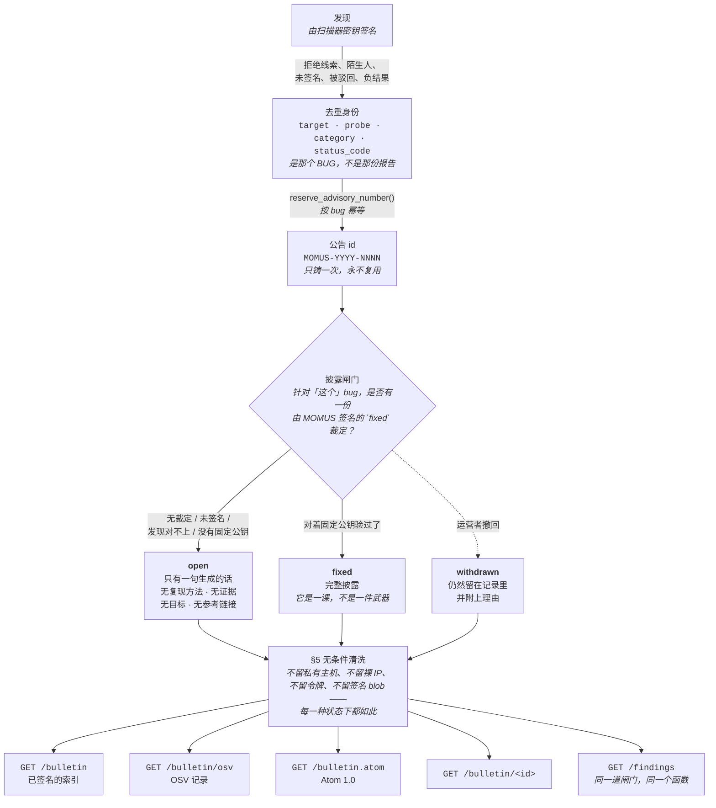

# MOMUS 安全公报 —— 用我们自己消费的那种形态来发布

> 🌐 [English](bulletin.md) · [Русский](bulletin.ru.md) · [Español](bulletin.es.md) · [Français](bulletin.fr.md) · **中文**

MOMUS 消费 CISA KEV、NVD、OSV 和 GHSA（`momus/intel/sources.py`），而在这个功能出现之前，它自己
什么都不发布。这种不对称并不是中立的。一支只*读*别人公告的红队，等于是在要求别人凭着一些它自己
从来不必写的文档来信任它 —— 没有稳定的标识符，没有任何人能拿来约束它的披露政策，也没有任何一份
能挺过一次重扫的记录。公报把这个缺口补上了，而且它导出 **OSV** —— 正是我们自己消费的那套 schema
—— 于是那些读取世界其余部分的工具，也能读到我们。

这份公报是 MOMUS 对**我们自己运营的服务**中那些漏洞的记录。仅这一个事实，就决定了下面几乎每一条
规则：这里的一份公告不是关于别人软件的警告，而是关于我们自己软件的一次承认，并且由那个既发现了
它、又运行着这台主机的一方来发布。



四条只读路由，全部公开，全部端出同一份已脱敏的记录：

| 路由 | 用途 |
|---|---|
| `GET /bulletin` | 已签名的索引 —— `{advisories, timestamp, signature}` |
| `GET /bulletin/osv` | OSV 记录，给那些已经在读 KEV/OSV/GHSA 的工具用 |
| `GET /bulletin.atom` | Atom 1.0，给那些靠轮询的阅读器用 |
| `GET /bulletin/MOMUS-2026-0001` | 单独一份公告，按你引用的那个编号取 |

此外还有 SPA 自己的 `#/bulletin` 页面：它读取这个索引，并且小心地说清楚，自己看到的到底是「这里
没有公报」还是「问不到」这两者中的哪一个 —— 对一个从未选择启用的部署来说，404 就是那个写进文档
的答案，而把它塌缩成一个笼统的错误，等于把一项政策误报成一次故障。

## §1 一个编号对应一个 BUG，而不是一份报告

`MOMUS-YYYY-NNNN`，按 `Finding.dedup_key` 只分配一次。

一个在同一个 bug 被找到第二次时就会变的「稳定 id」，不过是一个格式更好看的报告 id 而已。所以这个
编号是以**去重身份**为键的 —— 也就是这个缺陷的确定性身份 —— 而不是以 `finding_id` 为键，后者每
次扫描都是一个全新的 UUID。下周再一次发现同一个漏洞，它会以同一份公告的身份回来，只是追加一个新
的 `finding_id`，并把 `modified` 往前推。

去重身份只由合约层面的事实构成（`findings.py`）：

| 在身份之内 | 刻意留在身份之外 |
|---|---|
| `target`、`probe`、`category`，以及观测到的 `status_code` | 响应摘要、时间戳、延迟、举报方 |

这项排除不是理论上的整洁。响应摘要*曾经*在计算基础里，而目标的响应体每次调用都带一个新的 nonce，
于是同一个真实 bug 每次重扫都产生一个新的键 —— 这意味着根本没有去重，也意味着一笔赏金可以一次又
一次地被支付。**任何随每次观测而变化的东西，都必须留在身份之外。** 这和重塑了 WARDEN 入口键、以及
Treasury 索赔方键的，是同一个教训。

围绕这一点：

* **按年单调递增**，取自一个高水位计数器（`advisory_counter`），它是用一次原子 upsert 推进的，而
  不是先读后写 —— 两次并发的发布不可能拿到同一个序号。
* **永不复用，空缺永不填补。** 一份被撤回的公告永远保留它的编号。`max(seq)` 会把一条已撤回条目的
  编号交给另一个 bug，而一个同时意味着两件事的编号，比序号里的一个空缺更糟。
* **只在发布时铸号。** 绝大多数发现永远不会变成公告，而事先给它们预分配编号，会泄露我们手上压着
  多少东西。
* **超过四位就加宽，而不是回卷。** 一年里的第 10 000 份公告绝不能和第一份撞号；一个难看的 id 好过
  一个重复的 id。
* **不可变**（`AdvisoryId` 是一个 frozen dataclass），因为一个公告编号是一句承诺。

## §2 协同披露 —— 整个功能所依赖的那条规则

MOMUS 审计的是我们自己部署的服务。所以，一条针对**尚未修复**的组件、且附带可用复现方法的公报条目，
并不是一次披露。它是一段攻击脚本 —— 以我们自己的签名发布，针对一台我们自己运营的主机，面向的读者
里包括任何一个想混进来的人 —— 而且我们是带着一个安全审计方「这招管用」的权威把它发出去的。

| 状态 | 读者拿到什么 |
|---|---|
| **`open`** | id、`published`/`modified`、组件、类别、严重度，以及一句**生成的**、不可据以行动的话。没有复现方法，没有证据摘要，没有探测参数，没有请求/响应片段，没有目标 URL，**完全没有参考链接**。 |
| **`fixed`** | 全部，包括复现方法。它现在是一课，不是一件武器。 |
| **`withdrawn`** | 条目**留下**，并附上它的理由。那些可据以行动的部分被重新扣住。 |

每一份公告都在自己的正文里写明它的状态*以及*它的 `disclosure`。读者绝不应该需要去推断一个漏洞是
不是还开着，而且这份文档必须把它自身的限制一路带过各条路由、截图，以及那些不带任何其他上下文就送
到人手里的副本 —— 这和 WARDEN 分诊队列的免责声明是同一个习惯。

有三个细节看着像过度设计，其实不是：

**`open` 状态下的摘要是生成的，不是扫描器写的标题。** 只由 `(severity, category, component)` 生成，
别无其他。一个由人或 LLM 写的标题 —— *「free tier serves 1000 calls unpaid when n>100」*（「当
n>100 时，免费档会免费提供 1000 次调用」）—— 本身就是一份配方，而且没有任何评审流程能保证：一句
为了把事情说清楚而写的话，不会同时也是可据以行动的。

**漏洞开着的时候不给任何参考链接。** 我们手上的每一个链接，要么指向那个受影响的服务，要么指向内部
工具，所以「哪些链接是安全的」这个问题，目前还没有一个诚实的答案。

**未知的状态一律按 `open` 处理。** 凡是我们无法明确认定为 `fixed` 的，都是一个开着的漏洞。
fail-closed（默认拒绝）。

### 什么才能解锁完整披露

只有一件事：针对这个 bug 的一份**由 MOMUS 签名的 `fixed` 裁定**，并且要对着一把已固定（pin）的
公钥来校验（`gate_says_fixed`）。这是整个模块里最值得伪造的东西，所以一个光秃秃的
`{"fixed": true}` 绝不能把一个开着的漏洞变成一份已发布的利用代码。下面每一种情况，都会让这份公告
停留在 `open`：

| 条件 | 为什么它单独一条就足以致命 |
|---|---|
| 记录上没有裁定 | 每一份公告的默认状态 |
| `fixed` 为 false | 那个探测仍然能复现 |
| 裁定指名的是另一个 `finding_id` | 一份裁定不能在不同的 bug 之间转让 |
| 没有固定任何验证方公钥 | **没有 pin，就没有披露** —— 一个空的 pin 永远无法被满足 |
| 裁定没有签名 | `fixed` 这个词本身不是一份裁定 |
| 签名对着那把已固定的公钥校验不过 | 而不是对着裁定自己声称的那把密钥去校验 |

这和 `economics._fix_verdict_ok` 是同一种 fail-closed（默认拒绝）的形状 —— 后者曾经因为一个未签名
的字典就把真金白银放了出去。对着一把**已固定的公钥**、而不是对着裁定自己声明的那把密钥去校验，才是
全部要点所在：否则，伪造者只要把自己的密钥连同自己的签名一起附上就行了。

### 脱敏是默认行为，而且被检查三次

1. `Advisory.to_dict()` —— **已脱敏**的形式。这条路径被做成默认的，是故意的：一个忘了去考虑披露
   问题的调用方，拿到的是那个安全的答案，而不是那份利用代码。
2. `Advisory.raw_dict()` —— 未脱敏的形式，名字取得别扭，就是为了让「把它端出去」在调用方代码里成为
   一个看得见的决定。它是运营者路径和存储格式，永远不是一个响应体。
3. `_ensure_public()` —— 任何字节被签名之前的最后一道闸门。它在构造上就和 (1) 重复，但仍然保留：
   它防的那种失败不是 `redact_for_disclosure` 里的 bug，而是将来某个调用方，把从别处来的原始字典
   塞给 `signed_index()`。它同时还会拒绝那种声称 `fixed`、却不携带任何修复裁定的条目，因为到那一
   步为止，状态不过是字典里的一个字符串。**一份已签名的利用代码，一旦有人取走过，就再也收不回来
   了。**

`redact_for_disclosure` 刻意做得很无聊：纯函数、幂等、没有配置、没有调用方提供的策略、没有
「verbose」模式。由状态来决定，而且只由状态来决定。

### 无条件清洗（§5），在每一种状态下

即使是一份完整披露的 `fixed` 公告，也绝不会发布任何私有主机、裸 IP、凭据，或者完整的签名 blob。
我们的探测是用 `target.base_url` 来拼出复现方法的，而它在生产环境里是一个集群内部的服务名 —— 所以
原样发布一份复现方法，就等于发布了我们的拓扑。

| 清洗步骤 | 行为 |
|---|---|
| URL | **路径保留下来**（那才是那一课），authority 部分变成 `<target-host>`，除非这个主机在公开名单上 —— 而那份名单是从 `warden_feed._FIRST_PARTY` 派生出来的，不是重新手打的 |
| 裸的 `host:port` | 集群内部地址在正文里出现的样子，URL 那一步看不见它 |
| IPv4 | `[ip-redacted]` |
| `Bearer …`、`token=…`、`api_key: …` | **值本身被这次匹配吃掉** —— 早先的一版只替换了键名，把那个秘密原封不动地留在 `[redacted]` 这个词旁边 |
| 长度 ≥ 80 个字符的 base64 blob | 一个 Ed25519 签名是 88 个字符；一个 sha-256 十六进制摘要是 64 个字符，而摘要*确实*是可以发布的证据。这个阈值是故意卡在两者之间的。 |

顺序是有讲究的：先处理 URL，这样一个以 IP 作主机的 URL，会在裸 IP 那一步看到它之前就先丢掉主机
部分。

有一道疤值得一直摆在明面上：`2026-08-08T19:36:19Z` 曾经被发布成 `<target-host>:19Z`，因为那个主机
模式要求出现一个字母，而 `T` 正好提供了一个。它是在一份真实的 `fixed` 公告里被发现的，把这个模块
自己那行 *「Re-tested by MOMUS on …」*（「MOMUS 于……重新测试」）给毁掉了。只有时钟的那种情况
（`12:30`）一直都是安全的、也一直被测着；有字母的是「日期加时间」那种写法。

### 同一条规则也用在实时账本上，而不只是这里

`GET /findings` 是公开的，而且它过去会把完整的发现文档直接从语料库里端出来 —— 对那些还开着的发现
来说，其中包括 `evidence.reproducer` 和集群内部的目标 URL。**在公报里扣住一份复现方法，却在隔壁
一条路由上把同一份复现方法端出去，这不是协同披露，这是走流程。** 现在这两个面都由同一条规则和同
一个函数（`public_finding`）来回答，并且以同一个去重身份为键：一个在公报里被披露的 bug，在账本里
也是被披露的；除此之外，任何地方都不披露别的东西。

有两个后果值得点名说出来，而不是一笔带过：

* **一个公开发现里如果出现了签名，那它就一定验得过。** 一份被脱敏过的文档，无法在那份覆盖原件的
  签名下通过校验，而端出一份验不过的文档，读起来就像是被篡改了 —— 所以它会被扣住，并附上一条说明。
  比较是在 `signed_body()` 上进行的，它的字段清单是从 `Finding` 这个 dataclass 派生出来的，而不是
  去列一张拒绝名单，因为语料库会加上 `seen_count` / `first_seen_at` / `last_seen_at`，扫描会加上
  `known_before`，路由还会加上 `disclosure`。一个把整份文档减去 `signature` 之后拿去做哈希的调用
  方，每次都得到 `False`；签名本身没问题，缺的是那份说明书。
* **账本保留扫描器写的 `title` 和 `detail`，而公报会把它们换掉。** 这两个面并不是同一个东西：公报
  是一份可供引用的永久记录，账本则是实时的。所以在账本里，一个尚未修复的发现，其正文仍然可以描述
  一个 bug 的*形状*（「在第 n+1 次未付费调用上返回了 200」），这比公报对同一个漏洞所发布的要多。
  它永远不能携带的，是那些能直接复制粘贴的部分 —— 复现方法、载荷，以及该把它们对准的那台主机。

## 已签名的索引，用验证 WARDEN 情报源的那同一份代码来验证

```
GET https://momus.modelmarket.dev/bulletin

{ "advisories": [ {id, status, disclosure, component, severity, …}, … ],
  "timestamp": 1786223680673,      // epoch ms, integer
  "signature": "ab837d7e…"         // hex Ed25519 over the RFC 8785 canonical
                                   // form of {advisories, timestamp}
}
```

这就是 [WARDEN 早已在验证的](warden-channel.zh.md)那个信封，被复用了一次（`bulletin.py` §4）。
`jcs()` 和 `spki_hex()` 是从 `momus/warden_feed.py` **导入**的，从不重新实现：那个规范化器是逐字节
和 ARGUS 的 TypeScript JCS、以及 AWR 参考实现交叉验证过的，而第二份实现，无非就是第二个可以和第一
个不一致的东西。要固定（pin）的那把密钥，就是 MOMUS 的扫描器密钥 —— `/health` 早已把它作为
`scanner_pubkey` 公布出来，`/warden/threat-feed/summary` 则以 SPKI 十六进制的形式作为
`feed_public_key_spki_hex` 公布。只有一把密钥，而不是再给运营者一个可以搞错的第三种格式。

条目在签名之前会**按 id 排序**，所以同一组公告永远产生完全相同的字节：一个签名会随迭代顺序抖动的
索引，既没法缓存，也没法比对差异，更没法拿来检查回放。这条路由**不接受 `limit`** —— 公报本身*就是*
那份记录，而一份按页签名的分页记录，会把两份不同的文档交给两个读者去引用。它被封顶在 500 条，好让
响应不会无限制地长大；而且它**不做缓存**：签名的开销是微秒级的，而 `timestamp` 是一句关于新鲜度的
声明，所以一份被缓存的文档，迟早会发布出一个过期的新鲜度。

用 ARGUS 自己的规范化器和 `node:crypto` 来验证它 —— 也就是 WARDEN 在威胁情报源上所走的那条一模一样
的代码路径：

```js
const { canonicalize } = await import('argus/dist/warden/jcs.js');
const payload = canonicalize({ advisories: doc.advisories, timestamp: doc.timestamp });
const pub = createPublicKey({ key: Buffer.from(spkiHex, 'hex'), format: 'der', type: 'spki' });
verify(null, Buffer.from(payload, 'utf8'), pub, Buffer.from(doc.signature, 'hex'));
```

对着一份在本地生成的索引跑 —— 两份来自真实 `BulletinStore` 的公告、一把真实的扫描器密钥，以及用
`argus/dist/warden/jcs.js` 来产出字节（这是一个用完即弃的测试装置，不是一个提交进仓库的脚本：
`verify_warden_channel.mjs` 只覆盖威胁情报源，而且目前也还没有一份线上的公报可以指给它）：

```
signature accepted by ARGUS's canonicalizer: true
tampered severity accepted:                  false
shifted timestamp accepted:                  false
timestamp is an integer:                     true
signature is 128 hex chars:                  true
```

**两点诚实的保留。** 载荷的键是 `advisories`，不是 `records` —— 信封、规范化器、编码和密钥都是同
一套，但 [`scripts/verify_warden_channel.mjs`](../scripts/verify_warden_channel.mjs) 不加修改是没法
指向 `/bulletin` 的；消费方要规范化的是 `{advisories, timestamp}`。而且，和那个新鲜度窗口确实被
ARGUS 强制执行的威胁情报源不同，**今天没有任何东西在消费这份公报索引**：那个 `timestamp` 是我们自
己做出的一句新鲜度声明，而不是某个已部署的验证方当前真的会去检查的东西。上面那次运行是在本地跑的，
不是 WARDEN 通道所拥有的那种生产环境证明。

## OSV 导出，并且把那处不匹配大声说出来

`GET /bulletin/osv` 返回一个 OSV 消费方所期待的裸数组，每份公告一条记录，并且是从**已脱敏**的形式
构建出来的（`bulletin.py` §3）—— §2 适用于每一种导出。

OSV 描述的是有漏洞的**软件包版本**。而一份 MOMUS 公告描述的是一个**已部署的服务**，它根本没有版本
这条轴。我们本可以把这一点糊弄过去；结果是每一条记录都在 `database_specific.note` 里带着这处不匹配：

| OSV 字段 | 我们往里放了什么 | 诚实地说，问题在哪 |
|---|---|---|
| `affected[].package.ecosystem` | `"AIMarket"` | 是我们自己的，而且**不是一个在 OSV 注册过的 ecosystem** |
| `affected[].package.name` | 服务 id（`hub`、`metis`、……） | 不是任何人能安装的软件包 |
| `affected[].ranges` | **没有这个字段** | OSV 消费方会把缺失的 `ranges` 读成*「所有版本都受影响」*。我们没有检查过任何版本区间，因为根本没有东西可检查。 |
| `severity` | `[]` | 我们手上握的是一个定性的严重度，不是一个 CVSS 向量。为了填满一个看起来必填的字段而编造一个向量，正是坏数据混进情报源的方式；那个定性的值放在 `database_specific.severity` 里。 |
| `withdrawn` | 对一份被撤回的公告，填 `modified` | OSV 自己的字段：一个尊重它的消费方会停止依据这条记录行动，而我们什么都不用删 |
| `references[].type` | 落在 OSV 的枚举之外时，强制改成 `WEB` | 一个未知的类型会让*整条*记录校验失败，而一个拒收了我们文档的消费方，从中什么也学不到 |

`credits` 把 MOMUS 记为 `FINDER`，并且在一份 `fixed` 的公告上还额外记为 `REMEDIATION_VERIFIER` ——
它的「独立」程度，正如这个说法听上去的那样；见*目前还不成立的事*。

## Atom 订阅源

`GET /bulletin.atom` 把同一份记录以 Atom 1.0 的形式端出来，给那些靠轮询、而不是解析 JSON 的阅读器
用。它是用 `ElementTree` 构建的，而不是用 f-string 模板，这是一个安全上的选择，而不是风格上的：一
份公告摘要是从某次探测、或者某位运营者写的撤回理由里出来的文本，所以一个手写的模板会把一个裸的 `&`
或 `<` 直接发布进文档里 —— 最好的情况是这个订阅源对每一个阅读器都不再能解析，最坏的情况是它把标记
注入到任何渲染它的东西里去。

* **控制字符是被剥掉的，不是被转义的。** XML 1.0 对其中大多数字符根本没有转义写法；某段被抓下来的
  响应片段里只要有一个裸的 `0x00`，就会让**整个订阅源**无法解析，而不只是它自己那一条。
* **`<id>` 是稳定的** —— 订阅源自己的是 `{base}/bulletin`，一个条目的是 `{base}/bulletin/{id}`。
  阅读器要靠它来去重，所以一个抖来抖去的 id 会在每次轮询时，把整份公报都当成未读重新推一遍。公告
  编号本来就已经是这个 bug 的永久把手了。
* **`<updated>` 就是公告的 `modified`**，所以一次重新发布、一次修复或者一次撤回，都会以「有更新」
  的形式浮现出来 —— 这也正是这份记录要把 `published` 和 `modified` 分开保存的原因。
* **时间戳按 RFC 3339 校验**，只有在万不得已时才退回用 `now`：Atom 要求必须有 `<updated>`，而一个
  严格的阅读器会拒收一份 `<updated>` 格式不合法的文档。
* summary 和 content 上用的是 **`type="text"`，而不是 `html`**：把正文声明成 HTML，等于是在要求每
  一个阅读器去渲染一段并非由我们撰写的标记。
* 响应是 `application/atom+xml; charset=utf-8` —— 订阅源阅读器是按媒体类型来分派的，而 charset 写明
  出来，是因为这份文档可能带有非 ASCII 的正文。Atom 的 `<link>` 上的 `type` 属性不携带 charset
  （RFC 4287），所以代码里才会有两种写法。

这个渲染器消费的是**已经脱敏过的字典**，永远不是 `Advisory` 对象，所以它连出错都没法把披露范围放
大：一条 `open` 条目的复现方法，早在到达它之前就已经是空字符串了。

## 撤回 —— 条目永远不会消失

`withdraw(advisory_id, reason)` 把状态置为 `withdrawn`，并且保留这一行。理由是**必填的**：一条不给
任何解释就翻成 `withdrawn` 的条目，造成的信息损失和把它删掉是一样的。

悄悄删除，正是一份公开记录不再值得信任的方式。如果一份公告可以消失，那么*剩下的*每一份公告都变得
无法核验 —— 读者没有任何办法把「一份从来就没有过那条记录的公报」和「一份悄悄把它丢掉了的公报」区
分开来，而我们公布的任何数目都会从一个事实降格成一句声称。所以：那个编号保持退役状态，那条条目继
续被列出（`list()` 包含已撤回的条目 —— 记录本身才是重点），而 OSV 消费方会看到标准的 `withdrawn`
字段。

撤回时，那些可据以行动的部分会**再一次**被扣住，哪怕这份公告此前已经是 `fixed`：一份 MOMUS 不再为
之背书的记录，不该在 MOMUS 的签名之下携带一份可用的复现方法。

而且一次撤回能挺过一次重扫。`publish()` 在重新发布同一个 bug 时，无论这次扫描带回来什么，都保留
`withdrawn` 状态和那条理由，因为撤回是运营者对这份记录做出的判断，而一条能悄悄把已撤回条目复活的
自动化路径，会让撤回变得不可靠 —— 不可靠的方式和删除一模一样。重新上架是运营者一个刻意的动作。

另一侧还有一条镜像的规则：一份已经发布为 `fixed` 的公告，**不会**被后来的一次重新发布悄悄退回到
`open`。复现方法已经出去了，所以再把它藏起来保护不了任何人，而一个来回摆动的状态，就是一份没人能
引用的记录。一次回归会以一个新的 `finding_id` 和被推进的 `modified` 呈现出来；如果运营者希望这份
记录说得比这更多，那就写上理由把它撤回。

## 配置

| 变量 | 默认值 | 含义 |
|---|---|---|
| `MOMUS_BULLETIN` | **off**（关闭） | 到底发不发布这份公报。关闭意味着每一条路由都回答 **404，而不是 403** —— 一个没有选择启用的运营者*根本没有*公报，而「forbidden」会告诉读者：有一份公报存在，只是被一道权限挡着。 |
| `MOMUS_PUBLIC_URL` | `http://localhost:9400` | Atom id、链接以及 `summary().bulletin_url` 里用的那个 origin。它必须在重启之间保持稳定，否则每一个阅读器都会重新提醒一遍。 |
| `MOMUS_SIGNING_KEY_PATH` | `data/momus_signing_key` | 扫描器密钥。它给发现签名、给 WARDEN 情报源签名，**也**给公报索引签名 —— 只有一个身份需要去固定（pin）。 |
| `MOMUS_DATA_DIR` | `data` | 语料库。公告和发现存在同一个存储里，放在一张 `advisories` 表中，在 `dedup_key` 上和 `(year, seq)` 上各有一个唯一索引。 |
| `MOMUS_OPERATOR_TOKEN` | — | 和读取公报无关，公报本来就是公开的。它是运营者从 `GET /findings` 拿到**未脱敏**原件所需要的东西。 |

发布是选择加入的，而且默认关闭：成为一个公开的公告发布方，是运营者做出的一个决定，而不是跑起这个
容器的一个副作用。ARGUS 那一侧没有任何配置 —— 目前还没有任何东西在消费这个源。

有两条约束性质是结构上的，而不是配置出来的：

* `BulletinStore` **不持有任何密钥**。给一个索引签名，是一次需要传入签名器的调用，所以一份只会被
  读取的公报，产生不出任何已签名的文档。
* **铸号、发布和撤回，没有任何一个通过 HTTP 暴露出去。** 那四条路由全都是只读的。

## 这**不是**什么

**不是一条指控第三方的通道。** 一份关于别人服务的公告永远不会出现在这里 —— 那是
[WARDEN 威胁情报源](warden-channel.zh.md)的事，它有自己的一套闸门，而且那关系到别人的声誉，而不是
我们自己的记录。这道守卫，字面上就是同一个函数换个方向来读：`warden_feed.check_pattern()` 之所以
拒绝一条拒止模式，*正是因为*它匹配上了我们自己的某一个身份，所以「因为是第一方而被拒绝」恰恰就等
于「这是我们自己的」。情报源只发布**不属于**我们的东西，公报只发布**属于**我们的东西。只有一份名
单，所以这两者永远不可能漂移到互相重叠、或者双双出错。

**不是一个线索队列。** 一条未经验证的 `warden_reports` 线索永远不可能变成一份公告。线索在构造上就
带着 `is_momus_finding: false`、`verified: false` 和一句免责声明 —— 这些标记被贴在数据本身上，恰恰
就是为了让这种拒绝成为可能 —— 而且每一个标记单独一个就足以构成拒绝。把一个陌生人的匿名声称放在我
们的公告编号之下发布，等于把我们的名字署在一项我们没有核查过的指控上。而一个发现本身也还不够：一
个未签名或被篡改过的发现、一个诚实的负结果（`no_finding` —— 它在语料库里有价值，在一个安全情报源
里却是噪音），以及一个被独立验证方**驳回**了的发现，都会被拒绝。

**不是一个营销面。** 一份 `open` 的公告是刻意做成不可引用的：一句生成的话，加一个状态。这里没有严
重度可以注水，也没有「由某某负责任地披露」这种叙事 —— 我们既是审计方*又是*运营者，这个说法比单独
当其中任何一个都要弱。

## 目前还不成立的事

* **这些路由在生产环境里还不可达。** 前端 nginx 的 allowlist（白名单）（`momus/frontend/nginx.conf`）
  代理的是 `/health`、`/providers`、`/findings`、`/intel` 以及那几条 WARDEN 路由；`/bulletin*` 不在
  里面。因此一次同源 fetch 会穿透到 SPA，拿到一个 **200** 的 `index.html` —— 客户端既没法把它当
  JSON 解析，也不会把它报成「已禁用」，因为那条路径是以 404 为判据的。要发布，就意味着在同一次改
  动里，把这四条只读路径加进那份 allowlist。
* **已部署的 compose 里没有设置 `MOMUS_BULLETIN`**，所以线上那套部署没有公报。上面写的一切都是代码
  和测试，不是一次生产环境的观测 —— 这一点和 WARDEN 通道不同，后者是用消费方自己的验证器、对着线上
  主机被证明过的。
* **没有任何东西会自动发布。** 没有路由、没有 CLI，整改闭环里也没有任何一步会调用
  `BulletinStore.publish()` —— 今天，一份公告是由运营者直接调用它铸出来的。披露规则是被强制执行的；
  而那个*编辑上的*决定，周围一件工具都没有。
* **那份 `fixed` 裁定是由 MOMUS 自己的扫描器密钥签名的。** `Retester` 接的是 `runtime.signer`，而公
  报固定（pin）的正是同一把密钥。所以这个 pin 证明的是：这份裁定来自 MOMUS，并且不是某个调用方伪造
  的 —— 这本来就是它的用途 —— 但它**并不**使这个修复成为经过独立验证的。管着赔付的那条「扫描器 ≠
  Treasury」的职责分离，并不适用于这个披露开关；OSV 导出里的 `credits[].REMEDIATION_VERIFIER` 应当
  带着这一点去读。
* **OSV 里的 ecosystem `AIMarket` 并没有在 OSV 注册过。** 那些会拿已公布的清单去校验 ecosystem 的消
  费方，会拒收我们的记录；那条 note 解释了为什么，而这已经是从这里出发我们能做到的、最诚实的程度了。
* **没有任何消费方在轮询这里的任何东西。** 没有任何人对我们强制执行任何新鲜度窗口，而那个 Atom 订阅
  源也没有订阅者。

## 测试

| 测试套件 | 它覆盖了什么 |
|---|---|
| `momus/tests/test_bulletin.py`（42） | 跨重新发现与重启的稳定 id、编号永不复用、§2 逐字段**以及**对整个序列化 blob 的检查、一份被伪造的修复裁定、没有 pin ⇒ 永远不会是 `fixed`、撤回、§5 的各项拒绝、清洗器、索引的确定性与篡改检测、OSV |
| `momus/tests/test_bulletin_disclosure.py`（12） | `GET /findings` 上、以及 `momus.findings@v1` 调用（invoke）路径上的同一条规则，以那个 bug 而不是那份报告为键；运营者路径；「一个公开发现里出现的签名一定验得过」；ISO 时间戳清洗的那次回归 |
| `momus/tests/test_bulletin_routes.py`（9） | 实际走网络的那一层：发布关闭时返回 404、从**实际端出去的**字节重新校验那个信封、一份 `open` 公告在**全部四个**面上都不带复现方法、Atom 能作为 XML 被解析并且能扛住带敌意的公告文本、OSV 的各个字段 |

```
cd momus && PYTHONPATH=.:../skopos ../oracles/.venv/bin/python -m pytest -q \
    tests/test_bulletin.py tests/test_bulletin_disclosure.py tests/test_bulletin_routes.py
63 passed
```

其中承重的那一个是 `test_an_open_advisory_served_over_http_carries_no_reproducer`：它对一份 `open`
公告抓取每一个公报面，并断言复现方法在全部四个响应体里都不存在 —— 其中包括 Atom 订阅源，在那里一次
泄漏会以正文散文的形式出现，而不是以一个字段的形式出现，因此能躲过这份文件里每一条字段级的断言。
