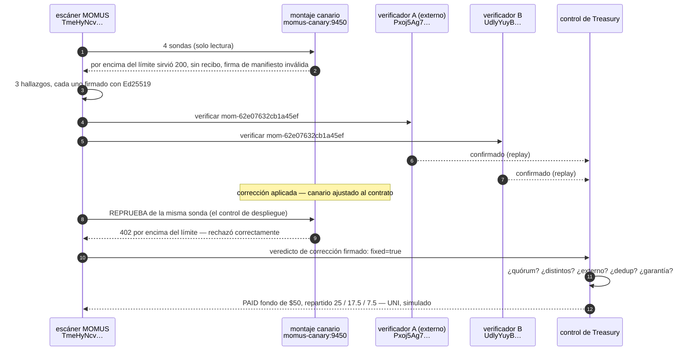

# El primer ciclo completo, en producción

> 🌐 [English](first-cycle.md) · [Русский](first-cycle.ru.md) · **Español** · [Français](first-cycle.fr.md) · [中文](first-cycle.zh.md)

El **2026-08-08 12:49:31 UTC** el despliegue de MOMUS en el host de oráculos ejecutó de principio a
fin un ciclo completo de **hallar → verificar → arreglar → pasar el control → pagar**. Este documento
registra lo que ocurrió realmente, con los identificadores reales, para que las afirmaciones del
resto de esta documentación puedan comprobarse en lugar de creerse.

## ⚠️ Lee esto antes de las cifras

**El hallazgo es auténtico. El objetivo es un montaje de prueba.**

- El **hallazgo es real**: las sondas ordinarias de MOMUS se ejecutaron por la red contra un servicio
  HTTP real, detectaron una violación real del contrato que ese servicio declara por sí mismo y
  firmaron el resultado con la clave real del escáner de producción. Nada del camino de la sonda
  estaba simulado ni tratado como caso especial.
- El **objetivo es el [canario](../canary/README.md)** — un servicio construido a propósito que
  anuncia un contrato y lo incumple a sabiendas, para que se pueda *ver dispararse* el pipeline de
  detección. **No** es un servicio de producción que se encontró roto. Los componentes reales del
  ecosistema (la familia de oráculos, GAIA, el hub) se escanearon el mismo día y pasaron: las firmas
  de sus manifiestos vinculan su contenido, sus recibos verifican y el hub rechaza una invocación
  (invoke) sin pagar.
- Los **verificadores** fueron dos principales con claves independientes que volvieron a ejecutar la
  sonda determinista (el método `replay`). **No eran Metis** — Metis no está desplegado en este host.
- **No se movió dinero.** La liquidación se ejecutó en el nivel **UNI**: cada parte está marcada como
  `simulated: true`.

## Qué ocurrió



## El registro

| Paso | Hecho |
|---|---|
| escaneo | `scan-1786193371-fc40` · 4 sondas · 59 ms · **3 hallazgos** |
| hallazgos | `manifest_signature_integrity` HIGH · `free_tier_ceiling_bypass` HIGH · `receipt_signature_integrity` MEDIUM |
| seguido hasta el final | `mom-62e07632cb1a45ef` (la elusión del límite) |
| clave de deduplicación | `dedup-8c10e54ca30397f535814f10` — la identidad del *bug*, para que pague una sola vez en la vida |
| clave del escáner | `TmeHyNcvEC6/NKo4X8AvZEXF…` (la clave real de producción; sin cambios a lo largo de cuatro redespliegues) |
| firma | `Jn2KQLr4IC6LfFfyMx7c8a5QTB0t1s0Y…` — verificable sin conexión, sin necesidad de red |
| reproductor | `curl -X POST http://momus-canary:9450/ai-market/v2/invoke -d '{"capability_id":"canary.compute@v1",…}'` |
| veredicto A | `confirmed` · `independent-replay` · `Pxoj5Ag70KgfmaBfrPB8…` (externo registrado) |
| veredicto B | `confirmed` · `independent-replay-2` · `UdlyYuyBu0L5DY268J/y…` |
| ticket | ruta `auto`, componente `canary`, atestación de culpa (Blame) firmada |
| corrección | canario ajustado al contrato (hace de «la AI-Factory lo parcheó y se redesplegó») |
| **control de despliegue** | reprueba **12 ms** → `fixed=true`, `no_finding` — *«finding no longer reproduces — fix verified, deploy may proceed»* («el hallazgo ya no se reproduce — corrección verificada, el despliegue puede continuar»), firmado |
| pago | **PAID** · fondo **$50** · liberado **$50** |
| reparto | descubridor **$25** `uni-a9f7fa36ba0aad3d` · reparador **$17.50** `uni-6244880f93c9667e` · orquestador **$7.50** `uni-fa325b15421984e1` |
| liquidación | `mode: uni` · `simulated: true` · `moves_real_value: false` |

## Dos cosas que esta ejecución demostró negándose

El valor de un control está en lo que *bloquea*, así que ambos casos valen más que la ejecución
exitosa.

**1. El control de pago se negó ante su propio autor.** El primer intento aportó un único verificador
(**uno**). La Treasury lo rechazó: `base_state=refused`, `pool_usd=0.0`, motivo *«need 2 distinct
independent confirmation(s), have 1»* («se necesitan 2 confirmaciones independientes distintas, hay
1»). La severidad HIGH (alta) exige dos claves de verificador distintas con al menos un principal
externo registrado — y se sostuvo aunque la persona que ejecutaba el script quería que pagase. La
ejecución de arriba es el segundo intento, con dos claves genuinamente distintas.

**2. La ejecución encontró un bug real en MOMUS mismo.** Al principio el canario era inalcanzable
desde el escáner (se enlazaba a `127.0.0.1` *dentro* de su propio contenedor, así que sus hermanos no
podían llegar a él). MOMUS informó de eso como un hallazgo **HIGH «el manifiesto no está firmado»** —
un falso positivo: el manifiesto no estaba sin firmar, simplemente nunca se sirvió. Peor aún, otras
dos sondas informaron `no_finding` (ningún hallazgo), es decir *«el contrato se cumplió»*, sobre
comprobaciones que nunca se ejecutaron. Ambas direcciones son deshonestas, y un red team que grita
«que viene el lobo» no vale nada.

Arreglado en la misma ejecución: un objetivo inalcanzable ahora produce `INCONCLUSIVE` en todas las
sondas que dependen del manifiesto ([`momus/targets/oracle.py::_unreachable`](../momus/targets/oracle.py),
[`momus/targets/hub.py`](../momus/targets/hub.py)), con una prueba de regresión que afirma que un
objetivo inalcanzable **no** produce **ni** un hallazgo **ni** un certificado de buena salud
(`tests/test_scan_and_intel.py::test_unreachable_target_is_inconclusive_never_a_finding`).

## Reprodúcelo

El canario se reinicia a su estado roto al final de cada ejecución, así que el ciclo puede volver a
ejecutarse:

```bash
docker exec -e CANARY_TOKEN=$CANARY_TOKEN -e CANARY_URL=http://momus-canary:9450 \
  momus-backend python /tmp/first_cycle.py
```

El registro JSON completo (cada firma, cada resumen criptográfico) se escribe en
`/data/first_cycle/record.json` dentro del contenedor `momus-backend`.

## Postura de producción en el momento de la ejecución

| | |
|---|---|
| host | el host de oráculos, publicado en `https://momus.modelmarket.dev` (TLS mediante Let's Encrypt) |
| puertos | MOMUS `9410`, Treasury `9411`, canario `9450`, frontend `5186` — todos enlazados a loopback; nginx es el único borde |
| LLM | DeepSeek V4 Pro, alcanzable |
| postura | `AIFACTORY_PROD=1`, `AIFACTORY_CRYPTO_ENABLED=0`, `MOMUS_SELF_ATTACK=1` |
| rutas de control | protegidas por token de operador (`control_gated: true`) y devueltas como 404 en el borde público |
| corpus | SQLite, persistente entre redespliegues |
| liquidación | UNI (simulada) — Base está desplegado pero **no** habilitado; véase el [aviso](../README.md#settlement--and-a-disclaimer-worth-reading) |
