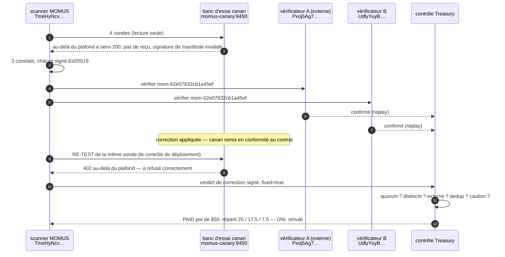

# Le premier cycle complet, en production

> 🌐 [English](first-cycle.md) · [Русский](first-cycle.ru.md) · [Español](first-cycle.es.md) · **Français** · [中文](first-cycle.zh.md)

Le **2026-08-08 12:49:31 UTC**, le déploiement de MOMUS sur l'hôte des oracles a exécuté de bout en
bout un cycle complet **trouver → vérifier → corriger → franchir le contrôle → payer**. Ce document
consigne ce qui s'est réellement passé, avec les identifiants réels, afin que les affirmations faites
ailleurs dans cette documentation puissent être vérifiées plutôt que crues.

## ⚠️ À lire avant les chiffres

**Le constat est authentique. La cible est un banc d'essai.**

- Le **constat est réel** : les sondes ordinaires de MOMUS se sont exécutées sur le réseau contre un
  véritable service HTTP, ont détecté une véritable violation du contrat que ce service déclare
  lui-même, et ont signé le résultat avec la véritable clé du scanner de production. Rien sur le
  chemin de la sonde n'a été bouchonné ni traité comme un cas particulier.
- La **cible est le [canari](../canary/README.md)** — un service construit exprès, qui annonce un
  contrat et l'enfreint sciemment, afin qu'on puisse *voir se déclencher* le pipeline de détection. Ce
  n'est **pas** un service de production trouvé défaillant. Les vrais composants de l'écosystème (la
  famille d'oracles, GAIA, le hub) ont été analysés le même jour et sont passés : les signatures de
  leurs manifestes lient leur contenu, leurs reçus se vérifient, et le hub refuse une invocation
  (invoke) non payée.
- Les **vérificateurs** étaient deux principaux dotés de clés indépendantes qui ont relancé la sonde
  déterministe (la méthode `replay`). Ce **n'était pas Metis** — Metis n'est pas déployé sur cet hôte.
- **Aucun argent n'a bougé.** Le règlement s'est fait au palier **UNI** : chaque part est marquée
  `simulated: true`.

## Ce qui s'est passé



## Le relevé

| Étape | Fait |
|---|---|
| analyse | `scan-1786193371-fc40` · 4 sondes · 59 ms · **3 constats** |
| constats | `manifest_signature_integrity` HIGH · `free_tier_ceiling_bypass` HIGH · `receipt_signature_integrity` MEDIUM |
| suivi jusqu'au bout | `mom-62e07632cb1a45ef` (le contournement de plafond) |
| clé de déduplication | `dedup-8c10e54ca30397f535814f10` — l'identité du *bug* lui-même, pour qu'il ne paie qu'une seule fois à jamais |
| clé du scanner | `TmeHyNcvEC6/NKo4X8AvZEXF…` (la vraie clé de production ; inchangée au travers de quatre redéploiements) |
| signature | `Jn2KQLr4IC6LfFfyMx7c8a5QTB0t1s0Y…` — vérifiable hors ligne, aucun réseau nécessaire |
| reproducteur | `curl -X POST http://momus-canary:9450/ai-market/v2/invoke -d '{"capability_id":"canary.compute@v1",…}'` |
| verdict A | `confirmed` · `independent-replay` · `Pxoj5Ag70KgfmaBfrPB8…` (externe enregistré) |
| verdict B | `confirmed` · `independent-replay-2` · `UdlyYuyBu0L5DY268J/y…` |
| ticket | route `auto`, composant `canary`, attestation de responsabilité (Blame) signée |
| correction | canari remis en conformité au contrat (tient lieu de « l'AI-Factory a corrigé et cela s'est redéployé ») |
| **contrôle de déploiement** | re-test **12 ms** → `fixed=true`, `no_finding` — *« finding no longer reproduces — fix verified, deploy may proceed »* (« le constat ne se reproduit plus — correction vérifiée, le déploiement peut se poursuivre »), signé |
| versement | **PAID** · pot **$50** · libéré **$50** |
| répartition | découvreur **$25** `uni-a9f7fa36ba0aad3d` · correcteur **$17.50** `uni-6244880f93c9667e` · chef d'orchestre **$7.50** `uni-fa325b15421984e1` |
| règlement | `mode: uni` · `simulated: true` · `moves_real_value: false` |

## Deux choses que cette exécution a prouvées en refusant

La valeur d'un contrôle réside dans ce qu'il *bloque* : ces deux cas valent donc plus que l'exécution
réussie.

**1. Le contrôle de versement a refusé son propre auteur.** La première tentative ne fournissait
qu'**un seul** vérificateur. La Treasury l'a refusée : `base_state=refused`, `pool_usd=0.0`, motif
*« need 2 distinct independent confirmation(s), have 1 »* (« il faut 2 confirmations indépendantes
distinctes, il y en a 1 »). La gravité HIGH (élevée) exige deux clés de vérificateur distinctes dont
au moins un principal externe enregistré — et la règle a tenu même si la personne qui lançait le
script voulait que cela paie. L'exécution ci-dessus est la seconde tentative, avec deux clés
véritablement distinctes.

**2. L'exécution a trouvé un vrai bug dans MOMUS lui-même.** Le canari était au départ injoignable
depuis le scanner (il écoutait sur `127.0.0.1` *à l'intérieur* de son propre conteneur, si bien que
ses voisins ne pouvaient pas l'atteindre). MOMUS a rapporté cela comme un constat **HIGH « le
manifeste n'est pas signé »** — un faux positif : le manifeste n'était pas non signé, il n'avait
jamais été servi. Pire, deux autres sondes ont rapporté `no_finding` (aucun constat), c'est-à-dire
*« le contrat a tenu »*, à propos de vérifications qui n'ont jamais eu lieu. Les deux directions sont
malhonnêtes, et une red team qui crie au loup ne vaut rien.

Corrigé dans la même exécution : une cible injoignable donne désormais `INCONCLUSIVE` depuis chaque
sonde dépendant du manifeste ([`momus/targets/oracle.py::_unreachable`](../momus/targets/oracle.py),
[`momus/targets/hub.py`](../momus/targets/hub.py)), avec un test de régression qui affirme qu'une
cible injoignable ne produit **ni** un constat **ni** un certificat de bonne santé
(`tests/test_scan_and_intel.py::test_unreachable_target_is_inconclusive_never_a_finding`).

## Reproduisez-le

Le canari est remis dans son état défaillant à la fin de chaque exécution, de sorte que le cycle peut
être relancé :

```bash
docker exec -e CANARY_TOKEN=$CANARY_TOKEN -e CANARY_URL=http://momus-canary:9450 \
  momus-backend python /tmp/first_cycle.py
```

Le relevé JSON complet (chaque signature, chaque empreinte) est écrit dans
`/data/first_cycle/record.json` à l'intérieur du conteneur `momus-backend`.

## Posture de production au moment de l'exécution

| | |
|---|---|
| hôte | l'hôte des oracles, publié sur `https://momus.modelmarket.dev` (TLS via Let's Encrypt) |
| ports | MOMUS `9410`, Treasury `9411`, canari `9450`, frontend `5186` — tous liés à la loopback ; nginx est le seul bord |
| LLM | DeepSeek V4 Pro, joignable |
| posture | `AIFACTORY_PROD=1`, `AIFACTORY_CRYPTO_ENABLED=0`, `MOMUS_SELF_ATTACK=1` |
| routes de contrôle | protégées par jeton d'opérateur (`control_gated: true`) et renvoyées en 404 au bord public |
| corpus | SQLite, persistant au travers des redéploiements |
| règlement | UNI (simulé) — Base est déployé mais **pas** activé ; voir l'[avertissement](../README.md#settlement--and-a-disclaimer-worth-reading) |
