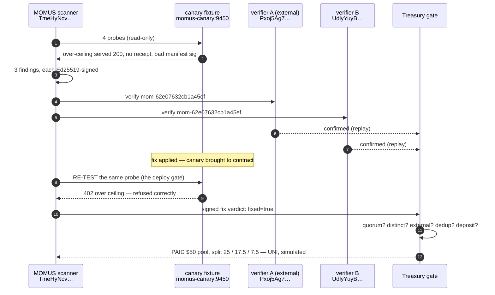

# The first complete cycle, on production

> 🌐 **English** · [Русский](first-cycle.ru.md) · [Español](first-cycle.es.md) · [Français](first-cycle.fr.md) · [中文](first-cycle.zh.md)

On **2026-08-08 12:49:31 UTC** the MOMUS deployment on the oracle host ran a full
**find → verify → fix → gate → pay** cycle end to end. This document records what actually
happened, with the real identifiers, so the claims elsewhere in these docs can be checked rather
than believed.

## ⚠️ Read this before the numbers

**The finding is genuine. The target is a fixture.**

- The **finding is real**: MOMUS's ordinary probes ran against a real HTTP service over the network,
  detected a real violation of that service's own declared contract, and signed the result with the
  real production scanner key. Nothing on the probe path was stubbed or special-cased.
- The **target is the [canary](../canary/README.md)** — a purpose-built service that advertises a
  contract and knowingly breaks it, so the detection pipeline can be *seen to fire*. It is **not** a
  production service that was found broken. The ecosystem's real components (oracle family, GAIA,
  hub) were scanned the same day and passed: their manifest signatures bind their content, their
  receipts verify, and the hub refuses an unpaid invoke.
- The **verifiers** were two independently-keyed principals re-running the deterministic probe
  (the `replay` method). They were **not Metis** — Metis is not deployed on this host.
- **No money moved.** Settlement ran in the **UNI** tier: every share is marked `simulated: true`.

## What happened



## The record

| Step | Fact |
|---|---|
| scan | `scan-1786193371-fc40` · 4 probes · 59 ms · **3 findings** |
| findings | `manifest_signature_integrity` HIGH · `free_tier_ceiling_bypass` HIGH · `receipt_signature_integrity` MEDIUM |
| followed through | `mom-62e07632cb1a45ef` (the ceiling bypass) |
| dedup key | `dedup-8c10e54ca30397f535814f10` — the identity of the *bug*, so it pays once ever |
| scanner key | `TmeHyNcvEC6/NKo4X8AvZEXF…` (the real prod key; unchanged across four redeploys) |
| signature | `Jn2KQLr4IC6LfFfyMx7c8a5QTB0t1s0Y…` — verifiable offline, no network needed |
| reproducer | `curl -X POST http://momus-canary:9450/ai-market/v2/invoke -d '{"capability_id":"canary.compute@v1",…}'` |
| verdict A | `confirmed` · `independent-replay` · `Pxoj5Ag70KgfmaBfrPB8…` (registered external) |
| verdict B | `confirmed` · `independent-replay-2` · `UdlyYuyBu0L5DY268J/y…` |
| ticket | route `auto`, component `canary`, Blame attestation signed |
| fix | canary brought to contract (stands in for "the Factory patched it and it redeployed") |
| **deploy gate** | re-test **12 ms** → `fixed=true`, `no_finding` — *"finding no longer reproduces — fix verified, deploy may proceed"*, signed |
| payout | **PAID** · pool **$50** · released **$50** |
| split | finder **$25** `uni-a9f7fa36ba0aad3d` · fixer **$17.50** `uni-6244880f93c9667e` · conductor **$7.50** `uni-fa325b15421984e1` |
| settlement | `mode: uni` · `simulated: true` · `moves_real_value: false` |

## Two things the run proved by refusing

The value of a gate is what it *blocks*, so both of these are worth more than the successful run.

**1. The payout gate refused its author.** The first attempt supplied only **one** verifier. The
Treasury refused it: `base_state=refused`, `pool_usd=0.0`, reason *"need 2 distinct independent
confirmation(s), have 1"*. HIGH severity requires two distinct verifier keys with at least one
registered external principal — and it held even though the person running the script wanted it to
pay. The run above is the second attempt, with two genuinely distinct keys.

**2. The run found a real bug in MOMUS itself.** The canary was initially unreachable from the
scanner (it bound `127.0.0.1` *inside* its own container, so siblings could not reach it). MOMUS
reported that as a **HIGH "manifest is unsigned"** finding — a false positive: the manifest was not
unsigned, it was never served. Worse, two other probes reported `no_finding`, i.e. *"the contract
held"* about checks that never ran. Both directions are dishonest, and a red team that cries wolf is
worth nothing.

Fixed the same run: an unreachable target now yields `INCONCLUSIVE` from every manifest-dependent
probe ([`momus/targets/oracle.py::_unreachable`](../momus/targets/oracle.py),
[`momus/targets/hub.py`](../momus/targets/hub.py)), with a regression test that asserts an
unreachable target produces **neither** a finding **nor** a clean bill of health
(`tests/test_scan_and_intel.py::test_unreachable_target_is_inconclusive_never_a_finding`).

## Reproduce it

The canary is reset to its broken state at the end of every run, so the cycle can be re-run:

```bash
docker exec -e CANARY_TOKEN=$CANARY_TOKEN -e CANARY_URL=http://momus-canary:9450 \
  momus-backend python /tmp/first_cycle.py
```

The full JSON record (every signature, every digest) is written to
`/data/first_cycle/record.json` inside the `momus-backend` container.

## Production posture at the time of the run

| | |
|---|---|
| host | the oracle host, published at `https://momus.modelmarket.dev` (TLS via Let's Encrypt) |
| ports | MOMUS `9410`, Treasury `9411`, canary `9450`, frontend `5186` — all bound to loopback; nginx is the only edge |
| LLM | DeepSeek V4 Pro, reachable |
| posture | `AIFACTORY_PROD=1`, `AIFACTORY_CRYPTO_ENABLED=0`, `MOMUS_SELF_ATTACK=1` |
| control routes | operator-token gated (`control_gated: true`) and 404'd at the public edge |
| corpus | SQLite, persistent across redeploys |
| settlement | UNI (simulated) — Base is deployed but **not** enabled; see the [disclaimer](../README.md#settlement--and-a-disclaimer-worth-reading) |
