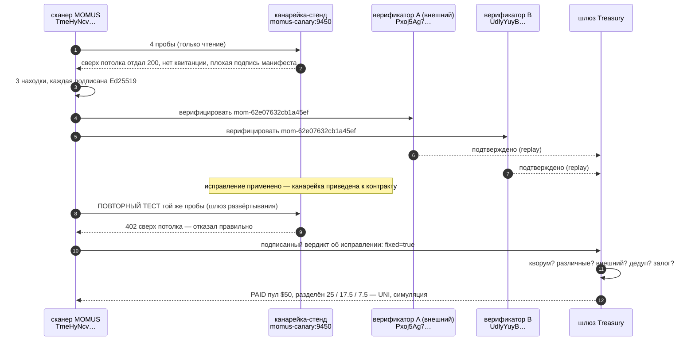

# Первый полный цикл, на проде

> 🌐 [English](first-cycle.md) · **Русский** · [Español](first-cycle.es.md) · [Français](first-cycle.fr.md) · [中文](first-cycle.zh.md)

**2026-08-08 12:49:31 UTC** развёртывание MOMUS на хосте оракулов прошло полный цикл
**найти → верифицировать → исправить → пропустить шлюз → заплатить** от начала до конца. Этот документ
фиксирует, что произошло на самом деле, с реальными идентификаторами, — чтобы утверждения в остальной
документации можно было проверить, а не принимать на веру.

## ⚠️ Прочитайте это, прежде чем смотреть на цифры

**Находка подлинная. Цель — тестовый стенд.**

- **Находка реальна**: обычные пробы MOMUS работали по сети против настоящего HTTP-сервиса, обнаружили
  настоящее нарушение объявленного этим сервисом контракта и подписали результат настоящим
  прод-ключом сканера. Ничто на пути пробы не было заглушено или обработано особым образом.
- **Цель — это [канарейка](../canary/README.md)** — специально построенный сервис, который объявляет
  контракт и сознательно его нарушает, чтобы конвейер обнаружения можно было *увидеть в действии*.
  Это **не** прод-сервис, который оказался сломан. Настоящие компоненты экосистемы (семейство
  оракулов, GAIA, хаб) были просканированы в тот же день и прошли проверку: подписи их манифестов
  привязаны к их содержимому, их квитанции верифицируются, а хаб отказывает в неоплаченном вызове
  (invoke).
- **Верификаторы** — это две стороны с независимыми ключами, заново прогнавшие детерминированную
  пробу (метод `replay`). Это был **не Metis** — Metis на этом хосте не развёрнут.
- **Деньги не двигались.** Расчёт прошёл на уровне **UNI**: каждая доля помечена `simulated: true`.

## Что произошло



## Запись

| Шаг | Факт |
|---|---|
| сканирование | `scan-1786193371-fc40` · 4 пробы · 59 ms · **3 находки** |
| находки | `manifest_signature_integrity` HIGH · `free_tier_ceiling_bypass` HIGH · `receipt_signature_integrity` MEDIUM |
| доведена до конца | `mom-62e07632cb1a45ef` (обход потолка) |
| ключ дедупликации | `dedup-8c10e54ca30397f535814f10` — идентичность самого *бага*, чтобы он оплатился один раз навсегда |
| ключ сканера | `TmeHyNcvEC6/NKo4X8AvZEXF…` (настоящий прод-ключ; не менялся за четыре переразвёртывания) |
| подпись | `Jn2KQLr4IC6LfFfyMx7c8a5QTB0t1s0Y…` — проверяется офлайн, сеть не нужна |
| воспроизведение | `curl -X POST http://momus-canary:9450/ai-market/v2/invoke -d '{"capability_id":"canary.compute@v1",…}'` |
| вердикт A | `confirmed` · `independent-replay` · `Pxoj5Ag70KgfmaBfrPB8…` (зарегистрированный внешний) |
| вердикт B | `confirmed` · `independent-replay-2` · `UdlyYuyBu0L5DY268J/y…` |
| тикет | маршрут `auto`, компонент `canary`, аттестация вины (Blame) подписана |
| исправление | канарейка приведена к контракту (играет роль «AI-Factory пропатчила это, и произошло переразвёртывание») |
| **шлюз развёртывания** | повторный тест **12 ms** → `fixed=true`, `no_finding` — *«finding no longer reproduces — fix verified, deploy may proceed»* («находка больше не воспроизводится — исправление проверено, развёртывание может продолжаться»), подписано |
| выплата | **PAID** · пул **$50** · выдано **$50** |
| разделение | нашедший **$25** `uni-a9f7fa36ba0aad3d` · исправляющий **$17.50** `uni-6244880f93c9667e` · дирижёр **$7.50** `uni-fa325b15421984e1` |
| расчёт | `mode: uni` · `simulated: true` · `moves_real_value: false` |

## Две вещи, которые этот прогон доказал своими отказами

Ценность шлюза — в том, что он *блокирует*, поэтому оба этих случая стоят больше, чем успешный прогон.

**1. Шлюз выплаты отказал собственному автору.** В первой попытке был предоставлен только **один**
верификатор. Treasury отказал: `base_state=refused`, `pool_usd=0.0`, причина — *«need 2 distinct
independent confirmation(s), have 1»* («нужно 2 различных независимых подтверждения, есть 1»).
Серьёзность HIGH (высокая) требует двух различных ключей верификаторов, из которых хотя бы один —
зарегистрированная внешняя сторона, — и это правило выстояло, хотя человек, запускавший скрипт, хотел,
чтобы выплата прошла. Прогон, описанный выше, — это вторая попытка, с двумя действительно различными
ключами.

**2. Прогон нашёл настоящий баг в самом MOMUS.** Канарейка изначально была недостижима для сканера
(она слушала `127.0.0.1` *внутри* собственного контейнера, поэтому соседние контейнеры до неё не
доставали). MOMUS сообщил об этом как о находке **HIGH «манифест не подписан»** — ложное
срабатывание: манифест не был неподписанным, его просто никогда не отдавали. Хуже того, две другие
пробы сообщили `no_finding` (находки нет), то есть *«контракт соблюдён»* — про проверки, которые
вообще не выполнялись. Дурны оба направления, а красная команда, поднимающая ложную тревогу, не
стоит ничего.

Исправлено в том же прогоне: недостижимая цель теперь даёт `INCONCLUSIVE` от каждой пробы, зависящей
от манифеста ([`momus/targets/oracle.py::_unreachable`](../momus/targets/oracle.py),
[`momus/targets/hub.py`](../momus/targets/hub.py)), плюс регрессионный тест, который утверждает, что
недостижимая цель не даёт **ни** находки, **ни** заключения о полном здоровье
(`tests/test_scan_and_intel.py::test_unreachable_target_is_inconclusive_never_a_finding`).

## Воспроизведите это

Канарейка сбрасывается в сломанное состояние в конце каждого прогона, так что цикл можно запускать
заново:

```bash
docker exec -e CANARY_TOKEN=$CANARY_TOKEN -e CANARY_URL=http://momus-canary:9450 \
  momus-backend python /tmp/first_cycle.py
```

Полная запись в JSON (каждая подпись, каждый дайджест) пишется в
`/data/first_cycle/record.json` внутри контейнера `momus-backend`.

## Конфигурация прода на момент прогона

| | |
|---|---|
| хост | хост оракулов, опубликован на `https://momus.modelmarket.dev` (TLS через Let's Encrypt) |
| порты | MOMUS `9410`, Treasury `9411`, канарейка `9450`, фронтенд `5186` — все привязаны к loopback; nginx — единственный край |
| LLM | DeepSeek V4 Pro, доступен |
| постура | `AIFACTORY_PROD=1`, `AIFACTORY_CRYPTO_ENABLED=0`, `MOMUS_SELF_ATTACK=1` |
| контрольные маршруты | закрыты токеном оператора (`control_gated: true`) и отдают 404 на публичном краю |
| корпус | SQLite, сохраняется между переразвёртываниями |
| расчёт | UNI (симуляция) — Base развёрнут, но **не** включён; см. [дисклеймер](../README.md#settlement--and-a-disclaimer-worth-reading) |
