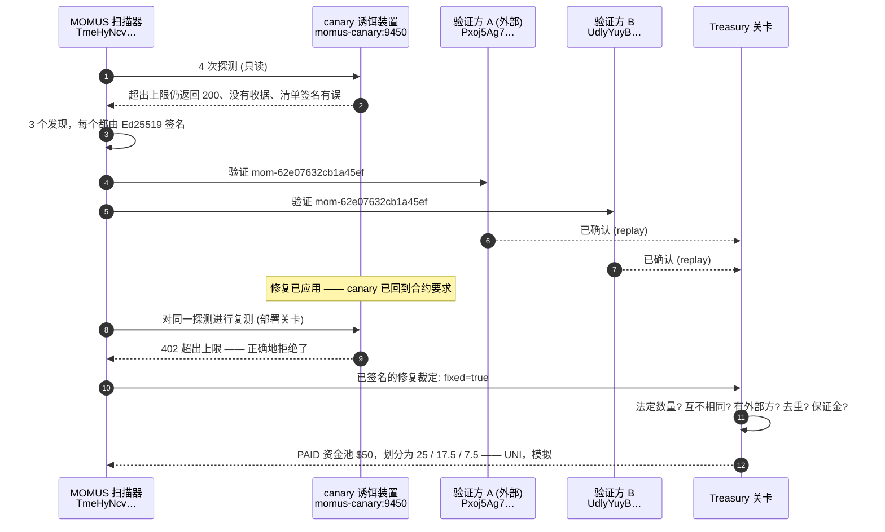

# 第一个完整周期，在生产环境上

> 🌐 [English](first-cycle.md) · [Русский](first-cycle.ru.md) · [Español](first-cycle.es.md) · [Français](first-cycle.fr.md) · **中文**

在 **2026-08-08 12:49:31 UTC**，部署在预言机主机上的 MOMUS 端到端跑完了一个完整的
**发现 → 验证 → 修复 → 过关卡 → 支付** 周期。本文档记录实际发生的事情，并附上真实的标识符，
以便本套文档中别处的说法可以被核查，而不是被相信。

## ⚠️ 在看数字之前请先读这里

**发现是真实的。目标是一个测试装置。**

- **发现是真实的**：MOMUS 的常规探测通过网络运行在一个真实的 HTTP 服务上，检测到该服务对其自身
  声明的合约的一次真实违规，并用真实的生产扫描器密钥为结果签名。探测路径上没有任何东西被打桩或
  被特殊处理。
- **目标是 [canary 诱饵服务](../canary/README.md)** —— 一个专门搭建的服务，它宣告一份合约并且
  故意违反它，以便能够*看到*检测流水线真的触发。它**不是**一个被发现出问题的生产服务。生态系统的
  真实组件（预言机家族、GAIA、Hub）在同一天被扫描并且通过了：它们的清单签名绑定了自身内容，它们的
  收据可以验证，而 Hub 会拒绝一次未付费的调用（invoke）。
- **验证方**是两个拥有各自独立密钥的主体，它们重新运行了那个确定性探测（`replay` 方法）。它们
  **不是 Metis** —— Metis 并未部署在这台主机上。
- **没有任何资金转移。** 结算运行在 **UNI** 层级：每一份份额都被标记为 `simulated: true`。

## 发生了什么



## 记录

| 步骤 | 事实 |
|---|---|
| 扫描 | `scan-1786193371-fc40` · 4 次探测 · 59 ms · **3 个发现** |
| 发现 | `manifest_signature_integrity` HIGH · `free_tier_ceiling_bypass` HIGH · `receipt_signature_integrity` MEDIUM |
| 一路跟到底的那个 | `mom-62e07632cb1a45ef`（上限绕过） |
| 去重键 | `dedup-8c10e54ca30397f535814f10` —— 这个 *bug* 本身的身份，所以它永远只支付一次 |
| 扫描器密钥 | `TmeHyNcvEC6/NKo4X8AvZEXF…`（真实的生产密钥；历经四次重新部署始终未变） |
| 签名 | `Jn2KQLr4IC6LfFfyMx7c8a5QTB0t1s0Y…` —— 可离线验证，无需网络 |
| 复现命令 | `curl -X POST http://momus-canary:9450/ai-market/v2/invoke -d '{"capability_id":"canary.compute@v1",…}'` |
| 裁定 A | `confirmed` · `independent-replay` · `Pxoj5Ag70KgfmaBfrPB8…`（已注册的外部方） |
| 裁定 B | `confirmed` · `independent-replay-2` · `UdlyYuyBu0L5DY268J/y…` |
| 工单 | 路由 `auto`，组件 `canary`，归责证明（Blame）已签名 |
| 修复 | canary 已回到合约要求（在此代表「AI-Factory 打了补丁并完成了重新部署」） |
| **部署关卡** | 复测 **12 ms** → `fixed=true`、`no_finding`（没有发现）—— *「finding no longer reproduces — fix verified, deploy may proceed」*（「该发现不再复现 —— 修复已验证，部署可以继续」），已签名 |
| 赔付 | **PAID** · 资金池 **$50** · 已释放 **$50** |
| 划分 | 发现者 **$25** `uni-a9f7fa36ba0aad3d` · 修复者 **$17.50** `uni-6244880f93c9667e` · 指挥者 **$7.50** `uni-fa325b15421984e1` |
| 结算 | `mode: uni` · `simulated: true` · `moves_real_value: false` |

## 这次运行用两次拒绝证明的两件事

一个关卡的价值在于它*拦下了什么*，因此这两件事都比那次成功的运行更有价值。

**1. 赔付关卡拒绝了它自己的作者。** 第一次尝试只提供了**一个**验证方。Treasury 拒绝了它：
`base_state=refused`、`pool_usd=0.0`，理由是 *「need 2 distinct independent confirmation(s),
have 1」*（「需要 2 个互不相同的独立确认，现有 1 个」）。HIGH（高）严重程度要求两把互不相同的
验证方密钥，且其中至少有一个是已注册的外部主体 —— 即使运行脚本的人希望它付款，这条规则依然守住了。
上面那次运行是第二次尝试，用的是两把真正互不相同的密钥。

**2. 这次运行在 MOMUS 自身中发现了一个真实的 bug。** canary 最初从扫描器那里是不可达的（它在
自己的容器*内部*绑定了 `127.0.0.1`，因此同级容器无法访问它）。MOMUS 把这件事报告成了一个
**HIGH「清单未签名」**的发现 —— 这是一个误报：清单并不是未签名，而是根本没被提供出来。更糟的是，
另外两个探测报告了 `no_finding`（没有发现），也就是*「合约得到了遵守」*，而它们对应的检查其实
从未运行过。两个方向都是不诚实的，而一支谎报狼来了的红队一文不值。

在同一次运行中就修好了：现在，一个不可达的目标会让每一个依赖清单的探测都给出 `INCONCLUSIVE`
（[`momus/targets/oracle.py::_unreachable`](../momus/targets/oracle.py)、
[`momus/targets/hub.py`](../momus/targets/hub.py)），并配有一个回归测试，断言一个不可达的目标
**既不**产生发现、**也不**给出健康无恙的结论
（`tests/test_scan_and_intel.py::test_unreachable_target_is_inconclusive_never_a_finding`）。

## 复现它

canary 会在每次运行结束时被重置回它出问题的状态，因此这个周期可以反复运行：

```bash
docker exec -e CANARY_TOKEN=$CANARY_TOKEN -e CANARY_URL=http://momus-canary:9450 \
  momus-backend python /tmp/first_cycle.py
```

完整的 JSON 记录（每一个签名、每一个摘要）会写入 `momus-backend` 容器内的
`/data/first_cycle/record.json`。

## 运行当时的生产环境态势

| | |
|---|---|
| 主机 | 预言机主机，发布于 `https://momus.modelmarket.dev`（TLS 由 Let's Encrypt 提供） |
| 端口 | MOMUS `9410`、Treasury `9411`、canary `9450`、前端 `5186` —— 全部绑定到 loopback；nginx 是唯一的边缘 |
| LLM | DeepSeek V4 Pro，可达 |
| 态势 | `AIFACTORY_PROD=1`、`AIFACTORY_CRYPTO_ENABLED=0`、`MOMUS_SELF_ATTACK=1` |
| 控制路由 | 由操作员令牌把守（`control_gated: true`），并在公开边缘返回 404 |
| 语料库 | SQLite，跨重新部署持久保存 |
| 结算 | UNI（模拟）—— Base 已部署但**未**启用；见[免责声明](../README.md#settlement--and-a-disclaimer-worth-reading) |
