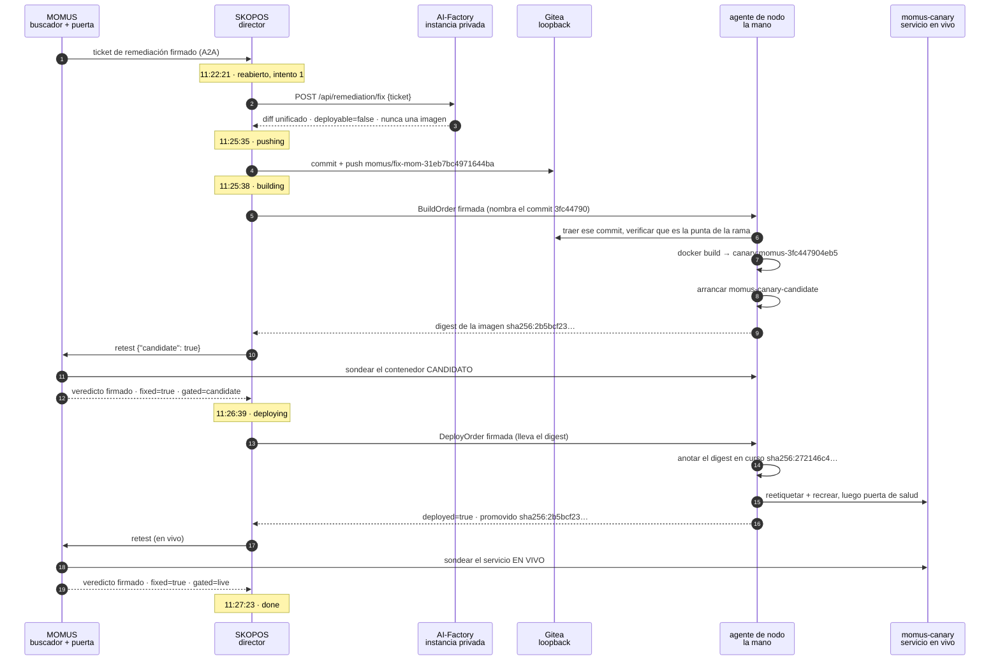
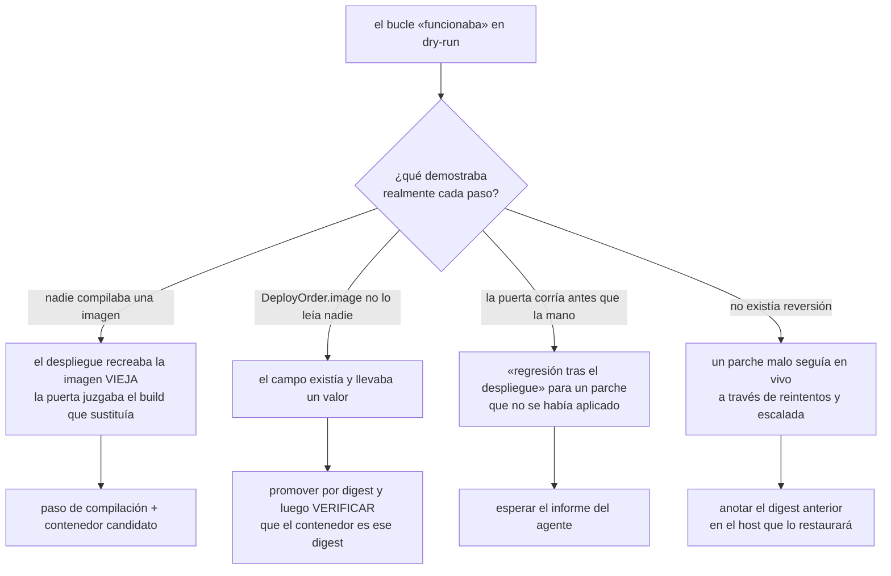

# La primera autorreparación real — 5 minutos 2 segundos, con la verificación

> 🌐 [English](first-self-heal.md) · [Русский](first-self-heal.ru.md) · **Español** · [Français](first-self-heal.fr.md) · [中文](first-self-heal.zh.md)

El **2026-08-27** el ecosistema reparó un defecto real en un servicio en marcha sin humano en el
bucle: MOMUS lo encontró, la AI-Factory escribió el parche, la flota lo compiló, MOMUS pasó la
compilación por su puerta de despliegue, un agente de nodo lo publicó y MOMUS confirmó la corrección
contra el servicio en vivo. Cinco minutos y dos segundos de principio a fin.

Esta página es el registro, y está escrita para poder comprobarse, no para impresionar. Hasta esta
ejecución, [found-and-fixed.es.md](found-and-fixed.es.md) decía sin rodeos que la Factory **nunca**
había escrito un parche que arreglara un bug real y que el paso de «arreglo» era un cambio de
interruptor en el montaje de prueba. Esa frase ya es falsa, y la razón por la que puede retirarse está
aquí: no el `done` del propio bucle, sino siete comprobaciones independientes.

## Qué estaba roto

`momus-canary` es un montaje construido a propósito: un servicio que *debe* violar su propio contrato
declarado para que la detección pueda verse actuando sobre algo real. La sonda
`free_tier_ceiling_bypass` de MOMUS había registrado contra él el hallazgo **`mom-31eb7bc4971644ba`**:
el canario declara un techo de nivel gratuito de 100 y luego atiende una llamada no pagada de
cualquier tamaño.

Antes de la ejecución se le puso deliberadamente en su estado roto, y el defecto se confirmó a mano:

```
POST /ai-market/v2/invoke  {"input": {"n": 500}}   →  200 OK   (debería rechazar)
```

## La ejecución



Dos puertas, examinando dos cosas distintas, y el veredicto firmado dice cuál: `gated=candidate` antes
de la promoción, `gated=live` después. Esa distinción es la diferencia entre una puerta y una
ceremonia — el bucle antiguo preguntaba por el servicio en marcha y publicaba con esa respuesta.

## El parche que escribió la Factory

Un fichero, `momus/canary/canary.py`, nueve líneas añadidas y ocho eliminadas:

```diff
 @app.post("/ai-market/v2/invoke", response_model=None)
 async def invoke(body: dict):
     n = ((body or {}).get("input") or {}).get("n", 0)
-    if STATE["fixed"]:
-        # Conforming behaviour: refuse an unpaid over-ceiling call with 402, as oracle-core does.
-        if isinstance(n, (int, float)) and not isinstance(n, bool) and n > 100:
-            return Response(...402...)
-    # Broken behaviour: serve anything, unpaid, with no signed receipt.
+    # Enforce the free-tier ceiling: refuse an unpaid over-ceiling call with 402, as oracle-core does.
+    if isinstance(n, (int, float)) and not isinstance(n, bool) and n > 100:
+        return Response(...402...)
     return {...}
```

Eliminó el **desvío condicional**, no la entrada de la sonda. Eso es lo que la ruta le pide al
modelo — *arregla la causa raíz; un cambio que solo hace pasar la sonda es peor que ningún parche,
porque se validará como corregido y el bug seguirá ahí* — y el modelo lo cumplió. También dejó
intactos los endpoints de control del montaje, `/canary/fix` y `/canary/break`, así que el cambio es
tan estrecho como el hallazgo.

**Una consecuencia que conviene decir.** `/health` sigue informando `conforming: STATE["fixed"]`, que
ya no guarda relación con lo que hace `invoke`. Un parche genuinamente bueno **desacopló** el
autoinforme del canario de su comportamiento y consumió el interruptor del montaje: después de esta
reparación, `/canary/break` ya no puede reintroducir el bug. Para un servicio real eso es correcto; para
un montaje de prueba es una pérdida real, así que la rama debería revertirse en lugar de fusionarse si
hay que repetir la demostración.

## La verificación

Ninguna de estas es una afirmación del propio bucle.

| Comprobación | Resultado |
|---|---|
| ¿el defecto sigue reproduciéndose? | `n=500` → **402** (era `200`) |
| ¿la corrección rompió el uso normal? | `n=5` → `200`, se sigue atendiendo |
| ¿cambió realmente el contenedor? | reiniciado a las 11:27:02 con un digest nuevo |
| ¿la imagen en marcha es la que se validó? | el `promoted_image` del agente `sha256:2b5bcf23…` **coincide** con el digest del contenedor |
| ¿las dos puertas trataron builds distintos? | `gate_verdict.gated=candidate`, `post_deploy_verdict.gated=live` |
| ¿puede deshacerse? | el agente anotó `previous_image sha256:272146c4…` y la etiqueta de compose |
| ¿hay un artefacto revisable? | rama = 2 commits sobre `main` (`b2d91c57`): la corrección y una cadena de procedencia de 237 líneas |

El fichero de procedencia satisface al validador del lado de la fusión en
[`scripts/pull_momus_fixes.sh`](https://github.com/alexar76/aicom/blob/main/scripts/pull_momus_fixes.sh): los cinco campos obligatorios, un
veredicto `fixed=true` que nombra su clave verificadora, firmas transportadas solo como prefijos y
ninguna IPv4 desnuda en todo el registro.

Salud del bucle tras la ejecución: **1 despliegue, 0 reversiones, tasa de reversión 0.0, 1 del tope de
6 diarios, el cortacircuitos cerrado.**

## Lo que solo una ejecución real pudo encontrar

Al activarlo afloraron siete defectos, y **ninguno** fue detectado antes por una prueba. Se enumeran
porque el patrón vale más que la lista: cada uno era o una salvaguarda que existía y no sostenía, o un
paso que informaba de éxito sin hacer nada.



1. **Nadie compilaba una imagen.** «Desplegar» recreaba el contenedor desde la imagen ya presente.
2. **`DeployOrder.image` no lo leía absolutamente nadie** — el campo existía y llevaba un valor.
3. **La puerta corría antes de que la mano se moviera.** El director publicaba una orden y de
   inmediato reexaminaba «el contenedor en vivo»; los agentes consultan a intervalos, así que toda
   tarea real se habría leído como una regresión posterior al despliegue y habría escalado, culpando a
   un parche que no se había aplicado.
4. **No había reversión en ninguna parte**, así que un parche que arrancaba roto seguía en vivo.
5. **`momus-backend` nunca se recompiló**, así que el MOMUS de producción ignoraba `candidate` y
   devolvía veredictos sin `gated` — y el agente habría rechazado correctamente cada promoción.
6. **Un `DONE` de dry-run se tragó el primer ticket real.** El director lo aceptó, encontró una tarea
   terminada y la devolvió sin una sola llamada de salida. La corrección tuvo que apoyarse en la
   evidencia de la *acción* (`FLAG_DEPLOYED`), no en una marca que alguna versión anterior escribiera.
7. **`job.result = {...}` tras la compilación borraba el registro del push**, así que el fichero de
   procedencia se omitía en silencio: un parche correcto, una rama correcta, un despliegue correcto —
   y ningún rastro de auditoría, por un `=` que debía ser `.update(`.

La forma común: **una salvaguarda escrita pero nunca ejercitada se lee exactamente igual que una que
funciona.** Cinco de las siete eran protecciones acotadas, firmadas y bien comentadas que jamás se
habían encontrado con la realidad.

## Lo que esto no demuestra

* Un componente, un hallazgo, una sonda. La lista del agente en aquella corrida era exactamente `canary`.
  El scope de Factory y las recetas del agente ahora también nombran `hub`, y la lista por defecto es `canary,hub`.
  MOMUS / Treasury no entran.
* El objetivo es un montaje. La violación del contrato es real y el servicio HTTP es real, pero nadie
  depende de él.
* Un veredicto `fixed` demuestra que el hallazgo dejó de reproducirse. No demuestra que el parche sea
  *bueno*, no lee el diff en busca de una puerta trasera y no puede notar que la corrección rompió algo
  que la sonda nunca probó. Por eso existe la rama y por eso fusionar sigue siendo decisión de una
  persona — véase [fix-provenance.es.md](fix-provenance.es.md).
* Los hallazgos contra el núcleo de seguridad (MOMUS, la Treasury, la propia puerta) no toman esta vía
  en absoluto: `escalation_for` los encamina a gobernanza humana más un verificador operado de forma
  independiente.

Operarlo — cada clave, umbral y rechazo — está en
[self-healing-operations.es.md](self-healing-operations.es.md).

---

## La primera ejecución que nadie inició — 2026-08-29

La autorreparación anterior la despachó una persona. Ésta no: un escáner por temporizador encontró
el defecto, una regla decidió que valía la pena arreglarlo, y el tique se abrió sin que nadie lo
pidiera.

**Qué lo hizo posible.** Dos componentes que antes no existían. Un horario de escaneo — cada 15
minutos sobre canary, gaia, hub y oracles — y una regla de despacho declarada por componente:
critical y high en canary y gaia con dos avistamientos, en el hub con tres. La regla
deliberadamente no consulta el `status` del hallazgo: en producción nadie escribe nunca
`confirmed` ahí, así que un despachador condicionado a eso no se dispararía jamás. La evidencia
que usa es `seen_count`, incrementado por clave de deduplicación en cada redescubrimiento.

**La ejecución.**

| hora | qué |
|---|---|
| 08:56:43 | el autopiloto escanea cuatro objetivos, sin que se lo pidan |
| 08:56:43 | dos hallazgos cumplen la regla — `high` en canary, repetidos 6× y 5× |
| 08:56:44 | ambos despachados; un tercero retenido en `medium` por la política |
| 11:22:21 | se le pide un parche a la fábrica |
| 11:25:35 | el parche aterriza en `momus/fix-mom-31eb7bc4971644ba` |
| 11:25:38 | el agente de nodo construye el commit `3fc447904eb5` |
| 11:26:39 | MOMUS repite la sonda contra el candidato — **arreglado** |
| 11:26:39 | se firma y publica una orden de despliegue |
| 11:27:23 | el agente informa; MOMUS reverifica in situ — **pasa** |

**Lo que la ejecución encontró, y tres de las cuatro cosas eran nuestras.**

* La fábrica llevaba horas rechazando todo parche con 503. Su fichero compose lee
  `AIFACTORY_REMEDIATION_KEY` del entorno, y un recreado ajeno lo dejó vacío. Falló cerrada —
  correctamente — y en silencio, porque desde entonces nadie le había pedido un parche.
* El presupuesto de 240s era ajustado: medido, este prompt le toma al modelo 79-119 segundos, y
  expiró dos veces. Subirlo solo habría empeorado las cosas: el cliente del conductor se rinde a
  los 300. La cadena ahora está ordenada: 600 < 900 < 1500.
* Un `200` de MOMUS no es un despacho. Responde 200 con `dispatched: false` cuando el tique va a
  gobernanza humana, y leer sólo el código lo registraba como éxito y gastaba una de las plazas
  del día en un tique que nadie tomó.
* Un trabajo reabierto empujaba su segundo parche a la rama que ya ocupaba el primero y era
  rechazado como non-fast-forward. Forzar está correctamente prohibido, así que cada intento tiene
  ahora su propia rama.

Y una que dejaba todo el bucle inservible sin decirlo jamás: las manos de despliegue no podían
importar `oracle_core`, así que `verify_deploy_chain` devolvía *"no signing backend available"* y
toda orden era rechazada — después de haber pagado el modelo y construido la imagen. La mano ahora
dice al arrancar qué backend falta y cómo suministrarlo.

## Autonomía completa, demostrada de extremo a extremo — 2026-08-29 10:51:29 → 10:53:59

La ejecución anterior se detuvo en la verificación: los parches no arreglaban el hallazgo, así que
nada se desplegó — correcto, pero todavía no un redespliegue. Tres defectos se interponían.

* **Las manos no podían verificar nada.** `oracle_core` no era importable, así que
  `verify_deploy_chain` devolvía *"no signing backend available"* y rechazaba toda orden — tras
  haber pagado el modelo y construido la imagen. Ahora la mano dice al arrancar qué backend falta.
* **Un reintento no podía aterrizar.** Un trabajo reabierto empujaba su segundo parche a la rama
  ya ocupada por el primero y era rechazado como non-fast-forward. Forzar está correctamente
  prohibido, así que cada intento tiene ahora su propia rama.
* **Una remediación desplegada nunca podía reabrirse.** El conductor dejaba en paz un trabajo DONE
  para que un tique duplicado no rehiciera trabajo terminado — pero esa regla no distingue un
  duplicado de una **regresión**, y un bucle que no puede recurar su propia regresión no es
  autorreparador. El tique ahora lleva `last_seen_at` del corpus: si el hallazgo se vio
  reproducirse después de terminar el trabajo, éste se reabre. Que ese campo llegara costó dos
  arreglos más: MOMUS leía el hallazgo por una caché en proceso que nunca tuvo la columna, y el
  `get()` del almacén devolvía sólo el documento del escáner, no las columnas del corpus a su
  lado. Ambos daban vacío y desactivaban la regla en silencio.

**La prueba.** El canario se reconstruyó desde fuente sin parchear, así que el bypass del techo
volvió a reproducirse — una regresión genuina contra una remediación desplegada dos días antes.

| hora | qué | evidencia |
|---|---|---|
| — | antes | contenedor `5bdeae2bf93c`, imagen `73205c15575a` |
| 10:51:29 | se pide un parche a la fábrica | trabajo reabierto como regresión |
| 10:52:11 | parche empujado | rama `momus/fix-mom-31eb7bc4971644ba-1` |
| 10:52:15 | el agente de nodo construye | commit `64a05d389ee7` |
| 10:53:17 | MOMUS verifica el candidato | **arreglado** |
| 10:53:17 | orden de despliegue firmada | `deploy-mom-31eb7bc4971644ba-1788000797` |
| 10:53:59 | el agente despliega; MOMUS reverifica in situ | **hecho** |
| — | después | contenedor `0009b9ae5e77`, creado a las 10:53:37, imagen `c1e3e12a121b` |

**Dos minutos treinta segundos, y ninguna persona dentro.** Verificado con independencia del
propio informe del bucle: el id del contenedor cambió, el nuevo se creó durante la ejecución, el
diario de despliegues de la mano registra la orden con `previous_image` = la construcción rota, y
un escaneo fresco de la sonda devuelve `findings: 0`.

## Lo que esto sigue sin demostrar

Que la verificación atrape un arreglo que pasa la sonda y rompe algo que la sonda no mira. Vuelve
a ejecutar una sonda — la que nombra el hallazgo — antes y después. Todo fuera de su alcance queda
sin examinar, y la ruta de reversión existe precisamente porque algún día importará.
