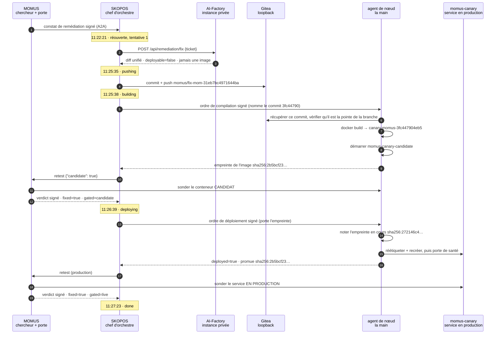
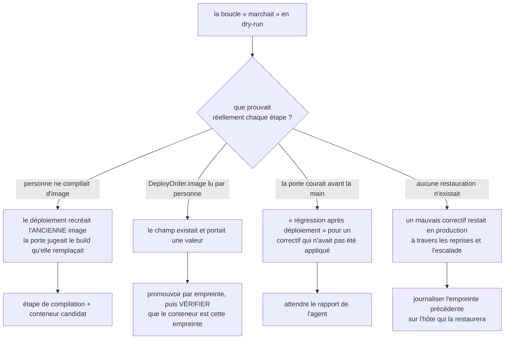

# La première auto-réparation réelle — 5 minutes 2 secondes, avec la vérification

> 🌐 [English](first-self-heal.md) · [Русский](first-self-heal.ru.md) · [Español](first-self-heal.es.md) · **Français** · [中文](first-self-heal.zh.md)

Le **2026-08-27**, l'écosystème a réparé un défaut réel dans un service en fonctionnement sans humain
dans la boucle : MOMUS l'a trouvé, l'AI-Factory a écrit le correctif, la flotte l'a compilé, MOMUS l'a
soumis à sa porte de déploiement, un agent de nœud l'a publié, et MOMUS a confirmé la correction contre
le service en production. Cinq minutes et deux secondes du début à la fin.

Cette page est le compte rendu, et elle est écrite pour être vérifiable plutôt qu'impressionnante.
Jusqu'à cette exécution, [found-and-fixed.fr.md](found-and-fixed.fr.md) disait clairement que la
Factory n'avait **jamais** écrit de correctif ayant réparé un vrai bogue et que l'étape « correction »
était un basculement du banc d'essai. Cette phrase est désormais fausse, et la raison pour laquelle
elle peut être retirée est ici : non pas le `done` de la boucle elle-même, mais sept vérifications
indépendantes.

## Ce qui était cassé

`momus-canary` est un banc d'essai construit exprès : un service qui *doit* violer son propre contrat
déclaré, afin que la détection puisse être vue à l'œuvre sur quelque chose de réel. La sonde
`free_tier_ceiling_bypass` de MOMUS avait enregistré contre lui le constat
**`mom-31eb7bc4971644ba`** : le canari déclare un plafond gratuit de 100 puis sert un appel non payé
de n'importe quelle taille.

Avant l'exécution, il a été délibérément remis dans son état cassé, et le défaut confirmé à la main :

```
POST /ai-market/v2/invoke  {"input": {"n": 500}}   →  200 OK   (devrait refuser)
```

## L'exécution



Deux portes, examinant deux choses différentes, et le verdict signé dit laquelle : `gated=candidate`
avant la promotion, `gated=live` après. Cette distinction est toute la différence entre une porte et
une cérémonie — l'ancienne boucle interrogeait le service en marche puis publiait sur cette réponse.

## Le correctif écrit par la Factory

Un fichier, `momus/canary/canary.py`, neuf lignes ajoutées et huit supprimées :

```diff
 @app.post("/ai-market/v2/invoke", response_model=None)
 async def invoke(body: dict):
     n = ((body or {}).get("input") or {}).get("n", 0)
-    if STATE["fixed"]:
-        # Conforming behaviour: refuse an unpaid over-ceiling call with 402, as oracle-core does.
-        if isinstance(n, (int, float)) and not isinstance(n, bool) and n > 100:
-            return Response(...402...)
-    # Broken behaviour: serve anything, unpaid, with no signed receipt.
+    # Enforce the free-tier ceiling: refuse an unpaid over-ceiling call with 402, as oracle-core does.
+    if isinstance(n, (int, float)) and not isinstance(n, bool) and n > 100:
+        return Response(...402...)
     return {...}
```

Il a supprimé le **contournement conditionnel**, pas l'entrée de la sonde. C'est exactement ce que la
route demande au modèle — *répare la cause racine ; un changement qui ne fait que faire passer la
sonde est pire que pas de correctif, car il sera validé comme corrigé et le bogue sera toujours là* —
et le modèle s'y est tenu. Il a aussi laissé intacts les points de contrôle du banc d'essai,
`/canary/fix` et `/canary/break`, si bien que le changement est aussi étroit que le constat.

**Une conséquence qu'il faut énoncer.** `/health` rapporte toujours `conforming: STATE["fixed"]`, ce
qui n'a plus aucun rapport avec ce que fait `invoke`. Un correctif vraiment bon a **découplé**
l'auto-déclaration du canari de son comportement et a consommé l'interrupteur du banc d'essai : après
cette réparation, `/canary/break` ne peut plus réintroduire le bogue. Pour un vrai service c'est
correct ; pour un banc d'essai c'est une perte réelle, donc la branche devrait être annulée plutôt que
fusionnée s'il faut refaire la démonstration.

## La vérification

Aucune de ces lignes n'est une affirmation de la boucle elle-même.

| Vérification | Résultat |
|---|---|
| le défaut se reproduit-il encore ? | `n=500` → **402** (auparavant `200`) |
| la correction a-t-elle cassé l'usage normal ? | `n=5` → `200`, toujours servi |
| le conteneur a-t-il réellement changé ? | redémarré à 11:27:02 sur une nouvelle empreinte |
| l'image en cours est-elle celle qui a été validée ? | le `promoted_image` de l'agent `sha256:2b5bcf23…` **égale** l'empreinte du conteneur |
| les deux portes ont-elles jugé des builds différents ? | `gate_verdict.gated=candidate`, `post_deploy_verdict.gated=live` |
| peut-on l'annuler ? | l'agent a journalisé `previous_image sha256:272146c4…` et l'étiquette compose |
| existe-t-il un artefact relisible ? | branche = 2 commits sur `main` (`b2d91c57`) : le correctif et une chaîne de provenance de 237 lignes |

Le fichier de provenance satisfait le validateur côté fusion de
[`scripts/pull_momus_fixes.sh`](https://github.com/alexar76/aicom/blob/main/scripts/pull_momus_fixes.sh) : les cinq champs obligatoires, un
verdict `fixed=true` nommant sa clé de vérification, des signatures transportées en préfixes
seulement, et aucune IPv4 nue dans tout l'enregistrement.

Santé de la boucle après l'exécution : **1 déploiement, 0 restauration, taux de restauration 0.0, 1 sur
le plafond de 6 par jour, coupe-circuit fermé.**

## Ce que seule une exécution réelle pouvait trouver

Sept défauts sont apparus lors de l'activation, et **aucun** n'avait été attrapé par un test au
préalable. Ils sont listés parce que le motif vaut mieux que la liste : chacun était soit un garde-fou
qui existait et ne tenait pas, soit une étape qui annonçait un succès sans rien faire.



1. **Personne ne compilait d'image.** « Déployer » recréait le conteneur depuis l'image déjà présente.
2. **`DeployOrder.image` n'était lu par personne** — le champ existait et portait une valeur.
3. **La porte courait avant que la main ne bouge.** Le chef d'orchestre publiait un ordre puis
   réexaminait immédiatement « le conteneur en production » ; les agents interrogent à intervalles, si
   bien que toute tâche réelle se serait lue comme une régression après déploiement et aurait escaladé,
   en accusant un correctif qui n'avait pas été appliqué.
4. **Il n'y avait de restauration nulle part**, donc un correctif démarrant cassé restait en production.
5. **`momus-backend` n'avait jamais été recompilé**, donc le MOMUS de production ignorait `candidate`
   et renvoyait des verdicts sans `gated` — et l'agent aurait alors refusé, à juste titre, chaque
   promotion.
6. **Un `DONE` de dry-run a avalé le premier ticket réel.** Le chef d'orchestre l'a accepté, a trouvé
   une tâche terminée et l'a renvoyée sans un seul appel sortant. Le correctif a dû s'appuyer sur la
   preuve de l'*action* (`FLAG_DEPLOYED`), et non sur un marqueur qu'une version antérieure écrivait.
7. **`job.result = {...}` après la compilation effaçait l'enregistrement du push**, si bien que le
   fichier de provenance était omis en silence : un correctif juste, une branche juste, un déploiement
   juste — et aucune piste d'audit, à cause d'un `=` qui devait être `.update(`.

La forme commune : **un garde-fou écrit mais jamais exercé se lit exactement comme un garde-fou qui
fonctionne.** Cinq des sept étaient des protections bornées, signées et bien commentées qui n'avaient
jamais rencontré la réalité.

## Ce que cela ne prouve pas

* Un composant, un constat, une sonde. La liste de l'agent pour cette course contenait exactement `canary`.
  Le scope Factory et les recettes de l'agent nomment aussi `hub`, et la liste par défaut est `canary,hub`.
  MOMUS / Treasury n'y figurent pas.
* La cible est un banc d'essai. La violation de contrat est réelle et le service HTTP est réel, mais
  personne n'en dépend.
* Un verdict `fixed` prouve que le constat a cessé de se reproduire. Il ne prouve pas que le correctif
  soit *bon*, ne relit pas le diff à la recherche d'une porte dérobée, et ne peut pas remarquer que la
  correction a cassé quelque chose que la sonde n'a jamais testé. C'est pourquoi la branche existe et
  pourquoi la fusion reste la décision d'un humain — voir
  [fix-provenance.fr.md](fix-provenance.fr.md).
* Les constats visant le noyau de sécurité (MOMUS, la Treasury, la porte elle-même) ne prennent pas
  cette voie du tout : `escalation_for` les dirige vers la gouvernance humaine plus un vérificateur
  exploité de façon indépendante.

L'exploitation — chaque clé, seuil et refus — est dans
[self-healing-operations.fr.md](self-healing-operations.fr.md).

---

## La première exécution que personne n'a lancée — 2026-08-29

L'autoréparation ci-dessus a été déclenchée par un humain. Pas celle-ci : un scanner sur minuterie
a trouvé le défaut, une règle a décidé qu'il valait la peine d'être corrigé, et le ticket s'est
ouvert sans que personne ne le demande.

**Ce qui l'a rendue possible.** Deux composants qui n'existaient pas. Un horaire de scan — toutes
les 15 minutes sur canary, gaia, hub et oracles — et une règle de dispatch déclarée par composant :
critical et high sur canary et gaia à deux observations, sur le hub à trois. La règle ne consulte
délibérément pas le `status` d'un constat : rien en production n'y écrit jamais `confirmed`, donc
un dispatcher conditionné là-dessus ne se déclencherait pas une seule fois. La preuve utilisée est
`seen_count`, incrémenté par clé de déduplication à chaque redécouverte.

**L'exécution.**

| heure | quoi |
|---|---|
| 08:56:43 | l'autopilote scanne quatre cibles, sans qu'on le lui demande |
| 08:56:43 | deux constats passent la règle — `high` sur canary, reproduits 6× et 5× |
| 08:56:44 | les deux sont dispatchés ; un troisième est retenu en `medium` |
| 11:22:21 | un correctif est demandé à la fabrique |
| 11:25:35 | le correctif atterrit sur `momus/fix-mom-31eb7bc4971644ba` |
| 11:25:38 | l'agent de nœud construit le commit `3fc447904eb5` |
| 11:26:39 | MOMUS rejoue la sonde contre le candidat — **corrigé** |
| 11:26:39 | un ordre de déploiement est signé et publié |
| 11:27:23 | l'agent rend compte ; MOMUS revérifie sur place — **passe** |

**Ce que l'exécution a trouvé, et trois des quatre étaient les nôtres.**

* La fabrique refusait tout correctif avec un 503 depuis des heures. Son fichier compose lit
  `AIFACTORY_REMEDIATION_KEY` depuis l'environnement, et une recréation sans rapport l'a laissée
  vide. Elle a échoué fermée — correctement — et en silence, car plus rien ne lui demandait de
  correctif depuis.
* Le budget de 240s était juste : mesuré, ce prompt prend au modèle 79-119 secondes, et il a expiré
  deux fois. L'augmenter seul aurait empiré les choses : le client du chef d'orchestre abandonne à
  300. La chaîne est maintenant ordonnée : 600 < 900 < 1500.
* Un `200` de MOMUS n'est pas un dispatch. Il répond 200 avec `dispatched: false` quand un ticket
  part en gouvernance humaine, et ne lire que le code enregistrait cela comme un succès et
  dépensait l'une des places du jour pour un ticket que personne n'a pris.
* Un travail rouvert poussait son second correctif sur la branche déjà occupée par le premier et
  était refusé en non-fast-forward. Forcer est justement refusé, donc chaque tentative a désormais
  sa propre branche.

Et une qui rendait toute la boucle inutilisable sans jamais le dire : les mains de déploiement ne
pouvaient pas importer `oracle_core`, donc `verify_deploy_chain` renvoyait *« no signing backend
available »* et tout ordre était refusé — après que le modèle a été payé et l'image construite. La
main annonce désormais au démarrage quel backend manque et comment le fournir.

## Autonomie complète, prouvée de bout en bout — 2026-08-29 10:51:29 → 10:53:59

L'exécution ci-dessus s'est arrêtée au contrôle : les correctifs ne réparaient pas le constat,
donc rien n'a été livré — correct, mais pas encore un redéploiement. Trois défauts s'interposaient.

* **Les mains ne pouvaient rien vérifier.** `oracle_core` n'était pas importable, donc
  `verify_deploy_chain` renvoyait *« no signing backend available »* et refusait tout ordre —
  après que le modèle a été payé et l'image construite. La main annonce désormais au démarrage
  quel backend manque.
* **Une reprise ne pouvait pas atterrir.** Un travail rouvert poussait son second correctif sur la
  branche déjà occupée par le premier et était refusé en non-fast-forward. Forcer est justement
  refusé, donc chaque tentative a maintenant sa propre branche.
* **Une remédiation livrée ne pouvait jamais rouvrir.** Le chef d'orchestre laissait tranquille un
  travail DONE pour qu'un ticket en double ne refasse pas un travail terminé — mais cette règle ne
  distingue pas un doublon d'une **régression**, et une boucle incapable de soigner sa propre
  régression n'est pas autoréparatrice. Le ticket porte désormais `last_seen_at` issu du corpus :
  si le constat a été revu après la fin du travail, celui-ci rouvre. Faire arriver ce champ a
  coûté deux corrections de plus : MOMUS lisait le constat via un cache en mémoire qui n'a jamais
  eu la colonne, et le `get()` du stockage ne renvoyait que le document du scanner, pas les
  colonnes du corpus à côté. Les deux renvoyaient vide et désactivaient la règle en silence.

**La preuve.** Le canari a été reconstruit depuis une source non corrigée, donc le contournement
du plafond s'est reproduit — une vraie régression contre une remédiation livrée deux jours plus
tôt.

| heure | quoi | preuve |
|---|---|---|
| — | avant | conteneur `5bdeae2bf93c`, image `73205c15575a` |
| 10:51:29 | un correctif est demandé à la fabrique | travail rouvert comme régression |
| 10:52:11 | correctif poussé | branche `momus/fix-mom-31eb7bc4971644ba-1` |
| 10:52:15 | l'agent de nœud construit | commit `64a05d389ee7` |
| 10:53:17 | MOMUS contrôle le candidat | **corrigé** |
| 10:53:17 | ordre de déploiement signé | `deploy-mom-31eb7bc4971644ba-1788000797` |
| 10:53:59 | l'agent déploie ; MOMUS revérifie sur place | **terminé** |
| — | après | conteneur `0009b9ae5e77`, créé à 10:53:37, image `c1e3e12a121b` |

**Deux minutes trente, et aucun humain dedans.** Vérifié indépendamment du rapport de la boucle :
l'id du conteneur a changé, le nouveau a été créé pendant l'exécution, le journal de déploiement
de la main enregistre l'ordre avec `previous_image` = la construction cassée, et un scan frais de
la sonde renvoie `findings: 0`.

## Ce que cela ne prouve toujours pas

Qu'un correctif passant la sonde mais cassant ce que la sonde ne regarde pas serait attrapé. Elle
rejoue une sonde — celle que le constat nomme — avant et après. Tout ce qui est hors de sa portée
reste inexaminé, et le chemin de retour arrière existe précisément parce que cela comptera un jour.
