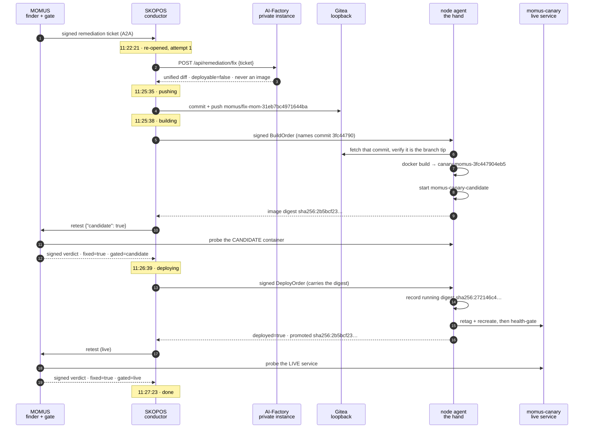
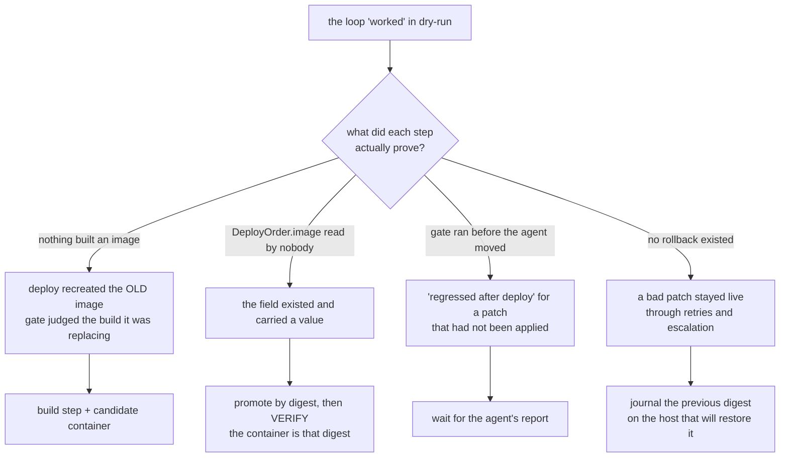

# The first real self-heal — 5 minutes 2 seconds, with the verification

> 🌐 **English** · [Русский](first-self-heal.ru.md) · [Español](first-self-heal.es.md) · [Français](first-self-heal.fr.md) · [中文](first-self-heal.zh.md)

On **2026-08-27** the ecosystem repaired a real defect in a running service without a human in the
loop: MOMUS found it, the AI-Factory wrote the patch, the fleet built it, MOMUS gated the build, a
node agent shipped it, and MOMUS confirmed the fix against the live service. Five minutes and two
seconds, start to finish.

This page is the record, and it is written to be checkable rather than impressive. Until this run,
[found-and-fixed.md](found-and-fixed.md) said plainly that the Factory had **never** authored a patch
that fixed a real bug and that the "fix" step was a fixture flip. That sentence is now false, and the
reason it can be retired is on this page: not the loop's own `done`, but seven independent checks.

## What was broken

`momus-canary` is a purpose-built fixture — a service that is *supposed* to violate its own declared
contract so the detection pipeline can be seen firing against something real. MOMUS's
`free_tier_ceiling_bypass` probe had recorded finding **`mom-31eb7bc4971644ba`** against it: the
canary declares a free-tier ceiling of 100 and then serves an unpaid call of any size.

Before the run it was deliberately put in its broken state, and the defect was confirmed by hand:

```
POST /ai-market/v2/invoke  {"input": {"n": 500}}   →  200 OK   (should refuse)
```

## The run



Two gates, examining two different things, and the signed verdict says which:
`gated=candidate` before promotion, `gated=live` after. That distinction is the difference between a
gate and a ceremony — the old loop asked about the running service and then shipped on the answer.

## The patch the Factory wrote

One file, `momus/canary/canary.py`, nine lines added and eight removed:

```diff
 @app.post("/ai-market/v2/invoke", response_model=None)
 async def invoke(body: dict):
     n = ((body or {}).get("input") or {}).get("n", 0)
-    if STATE["fixed"]:
-        # Conforming behaviour: refuse an unpaid over-ceiling call with 402, as oracle-core does.
-        if isinstance(n, (int, float)) and not isinstance(n, bool) and n > 100:
-            return Response(...402...)
-    # Broken behaviour: serve anything, unpaid, with no signed receipt.
+    # Enforce the free-tier ceiling: refuse an unpaid over-ceiling call with 402, as oracle-core does.
+    if isinstance(n, (int, float)) and not isinstance(n, bool) and n > 100:
+        return Response(...402...)
     return {...}
```

It removed the **conditional bypass**, not the probe's input. That is the instruction the route gives
the model — *fix the root cause; a change that only makes the probe pass is worse than no patch,
because it will be gated as fixed and the bug will still be there* — and the model followed it. It
also left the fixture's `/canary/fix` and `/canary/break` control endpoints alone, so the change is
as narrow as the finding.

**A consequence worth stating.** `/health` still reports `conforming: STATE["fixed"]`, which is now
unrelated to what `invoke` actually does. A genuinely good patch decoupled the canary's self-report
from its behaviour and consumed the fixture's off switch: after this heal, `/canary/break` can no
longer reintroduce the bug. That is correct for a real service and a real cost for a test fixture —
so the branch should be reverted rather than merged if the demonstration needs repeating.

## The verification

Not one of these is the loop's own claim.

| Check | Result |
|---|---|
| does the defect still reproduce? | `n=500` → **402** (was `200`) |
| did the fix break normal use? | `n=5` → `200`, still served |
| did the container actually change? | restarted 11:27:02 on a new digest |
| is the running image the one that was gated? | agent's `promoted_image` `sha256:2b5bcf23…` **equals** the container's digest |
| were the two gates about different builds? | `gate_verdict.gated=candidate`, `post_deploy_verdict.gated=live` |
| can it be undone? | agent journalled `previous_image sha256:272146c4…` + the compose tag |
| is there a reviewable artifact? | branch = 2 commits on `main` (`b2d91c57`): the fix, and a 237-line provenance chain |

The provenance sidecar satisfies the merge-side validator in
[`scripts/pull_momus_fixes.sh`](https://github.com/alexar76/aicom/blob/main/scripts/pull_momus_fixes.sh): all five required fields, a
`fixed=true` gate verdict naming its verifier key, signatures carried as prefixes only, and no bare
IPv4 anywhere in the record.

Loop health after the run: **1 deploy, 0 rollbacks, rollback rate 0.0, 1 of the 6-per-day cap, the
circuit breaker closed.**

## What only a live run could find

Seven defects surfaced while enabling this, and **not one of them was caught by a test beforehand**.
They are listed because the pattern is more useful than the list: each one was a guard that existed
and did not hold, or a step that reported success without doing anything.



1. **Nothing built an image.** "Deploy" recreated the container from the image already on the host.
2. **`DeployOrder.image` was read by nothing at all** — the field existed and carried a value.
3. **The gate ran before the agent had moved.** The conductor published an order and immediately
   re-tested "the live container"; agents poll on an interval, so every live job would have read as a
   post-deploy regression and escalated, blaming a patch that had not been applied.
4. **There was no rollback anywhere**, so a patch that came up broken stayed live.
5. **`momus-backend` was never rebuilt**, so production MOMUS ignored `candidate` and returned
   verdicts with no `gated` — and the agent would then have correctly refused every promotion.
6. **A dry-run `DONE` swallowed the first live ticket.** The conductor accepted it, found a finished
   job, and returned it without a single outbound call. The fix had to key on evidence of the
   *action* (`FLAG_DEPLOYED`), not on a marker some earlier build happened to write.
7. **`job.result = {...}` after the build wiped the push record**, so the provenance sidecar was
   skipped silently: a correct patch, a correct branch, a correct deploy — and no audit trail, from
   one `=` that should have been `.update(`.

The shared shape: **a guard that is written but never exercised reads exactly like a guard that
works.** Five of these were bounded, signed, well-commented safeguards that had never once run
against reality.

## What this does not prove

* One component, one finding, one probe. The agent's allowlist for that run was exactly `canary`.
  Factory scope and agent recipes now also name `hub`, and the default allowlist is `canary,hub`.
  MOMUS / Treasury stay off the list.
* The target is a fixture. It is a real contract violation and a real HTTP service, but nobody
  depends on it.
* A `fixed` verdict proves the finding stopped reproducing. It does not prove the patch is *good*, does
  not read the diff for a backdoor, and cannot notice that the fix broke something the probe never
  tested. That is why the branch exists and why merging stays a human's decision — see
  [fix-provenance.md](fix-provenance.md).
* Findings against the security core (MOMUS, the Treasury, the gate itself) never take this path at
  all: `escalation_for` routes them to human governance plus an independently-operated verifier.

Operating it — every key, threshold and refusal — is in
[self-healing-operations.md](self-healing-operations.md).

---

## The first run nobody started — 2026-08-29

The self-heal above was dispatched by a human. This one was not: a scanner on a timer found the
defect, a policy decided it was worth fixing, and the ticket was opened without anybody asking.

**What made it possible.** Two components that did not exist before. A scan schedule — every 15
minutes across canary, gaia, hub and oracles — and a dispatch rule stated per component: critical
and high on canary and gaia at two sightings, on the hub at three. The rule deliberately does not
consult a finding's `status`: nothing in production ever writes `confirmed` to it, so a
dispatcher gated on that would never fire once. The evidence it uses instead is `seen_count`,
bumped per dedup key on every rediscovery — a bug that reproduced across N scans.

**The run.**

| time | what |
|---|---|
| 08:56:43 | the autopilot scans four targets, unprompted |
| 08:56:43 | two findings qualify — `high` on canary, reproduced 6× and 5× |
| 08:56:44 | both dispatched; a third is held at `medium` by the policy |
| 11:22:21 | the Factory is asked for a patch |
| 11:25:35 | the patch lands on `momus/fix-mom-31eb7bc4971644ba` |
| 11:25:38 | the node agent builds commit `3fc447904eb5` |
| 11:26:39 | MOMUS re-runs the probe against the candidate — **fixed** |
| 11:26:39 | a deploy order is signed and published |
| 11:27:23 | the agent reports the deploy; MOMUS retests in place — **passes** |

**What the run found, and three of the four were ours.**

* The Factory had been refusing every patch with 503 for hours. Its compose file reads
  `AIFACTORY_REMEDIATION_KEY` from the environment, and an unrelated recreate produced an empty
  one. It failed closed — correctly — and silently, because nothing had asked it for a patch since.
* The LLM budget of 240s was marginal: measured, this prompt takes the configured model 79-119
  seconds, and it timed out twice. Raising it alone would have made things worse, because the
  conductor's client gives up at 300. The chain is now ordered: 600 < 900 < 1500.
* A `200` from MOMUS is not a dispatch. It answers 200 with `dispatched: false` when a ticket
  routes to human governance, and reading the status code alone recorded that as a success and
  spent one of the day's slots on a ticket nobody took.
* A re-opened job pushed its second patch to the branch the first already occupied and was refused
  as a non-fast-forward. Forcing is rightly refused, so each attempt now gets its own branch.

And one that had made the whole loop unusable without ever saying so: the deploy hands could not
import `oracle_core`, so `verify_deploy_chain` returned *"no signing backend available"* and every
order was refused — after the model had been paid and the image built. The hand now says which
backend is missing, and how to supply it, at startup rather than at refusal time.

## Full autonomy, proven end to end — 2026-08-29 10:51:29 → 10:53:59

The run above stopped at the gate: the patches did not fix the finding, so nothing shipped —
correct, but not yet a redeploy. Three defects stood between the loop and one.

* **The hands could not verify anything.** `oracle_core` was not importable, so
  `verify_deploy_chain` returned *"no signing backend available"* and refused every order — after
  the model had been paid and the image built. The hand now says which backend is missing, at
  startup, instead of failing at the first order.
* **A retry could not land.** A re-opened job pushed its second patch to the branch the first
  already occupied and was refused as a non-fast-forward. Forcing is rightly refused, so each
  attempt now gets a branch of its own.
* **A shipped remediation could never re-open.** The conductor left a DONE job alone so a
  duplicate ticket would not redo finished work — but that rule cannot tell a duplicate from a
  REGRESSION, and a loop that cannot re-heal its own regression is not self-healing. The ticket
  now carries `last_seen_at` from the corpus; if the finding was seen reproducing after the job
  finished, the job re-opens. Getting that field to arrive took two more fixes: MOMUS read the
  finding through an in-process cache that never had the column, and the store's `get()` returned
  only the scanner's document, not the corpus columns beside it. Both read empty and disabled the
  rule silently.

**The proof.** The canary was rebuilt from unpatched source, so the ceiling bypass reproduced
again — a genuine regression against a remediation that had shipped two days earlier.

| time | what | evidence |
|---|---|---|
| — | before | container `5bdeae2bf93c`, image `73205c15575a` |
| 10:51:29 | the Factory is asked for a patch | job re-opened as a regression |
| 10:52:11 | patch pushed | branch `momus/fix-mom-31eb7bc4971644ba-1` |
| 10:52:15 | the node agent builds | commit `64a05d389ee7` |
| 10:53:17 | MOMUS gates the candidate | **fixed** |
| 10:53:17 | deploy order signed | `deploy-mom-31eb7bc4971644ba-1788000797` |
| 10:53:59 | agent deploys; MOMUS retests in place | **done** |
| — | after | container `0009b9ae5e77`, created 10:53:37, image `c1e3e12a121b` |

**Two minutes thirty seconds, and no human in it.** Verified independently of the loop's own
report: the container id changed, the new one was created during the run, the hand's own deploy
journal records the order with `previous_image` = the broken build, and a fresh scan of the probe
returns `findings: 0`.

## What this still does not prove

That the gate catches a fix which passes the probe and breaks something the probe does not look
at. It re-runs one probe — the one the finding names — before and after. Everything outside that
probe's reach is unexamined, and the rollback path exists precisely because it will one day
matter.
