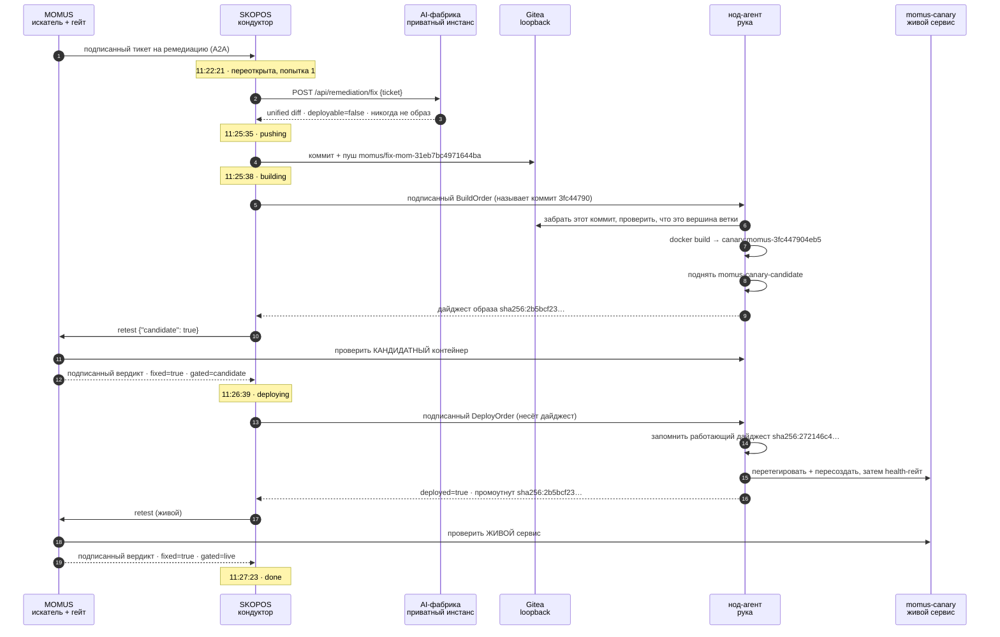
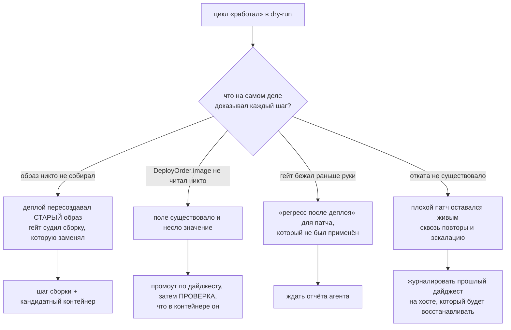

# Первая настоящая самопочинка — 5 минут 2 секунды, с проверкой

> 🌐 [English](first-self-heal.md) · **Русский** · [Español](first-self-heal.es.md) · [Français](first-self-heal.fr.md) · [中文](first-self-heal.zh.md)

**27 августа 2026** экосистема починила настоящий дефект в работающем сервисе без человека в цикле:
MOMUS нашёл его, AI-фабрика написала патч, парк собрал его, MOMUS пропустил сборку через гейт,
нод-агент задеплоил, а MOMUS подтвердил починку на живом сервисе. Пять минут две секунды от начала до
конца.

Эта страница — запись, и написана она так, чтобы её можно было проверить, а не чтобы впечатлять. До
этого прогона в [found-and-fixed.ru.md](found-and-fixed.ru.md) прямо стояло, что фабрика **ни разу** не
написала патч, починивший настоящий баг, и что шаг «фикс» — переключение фикстуры. Это утверждение
теперь ложно, и основание его снять лежит здесь: не собственное `done` цикла, а семь независимых
проверок.

## Что было сломано

`momus-canary` — фикстура специальной постройки: сервис, который *обязан* нарушать свой же заявленный
контракт, чтобы работу детекции можно было увидеть на чём-то настоящем. Проба MOMUS
`free_tier_ceiling_bypass` записала по нему находку **`mom-31eb7bc4971644ba`**: канарейка объявляет
бесплатный порог в 100 и затем обслуживает неоплаченный вызов любого размера.

Перед прогоном её намеренно перевели в сломанное состояние, и дефект подтвердили руками:

```
POST /ai-market/v2/invoke  {"input": {"n": 500}}   →  200 OK   (должен отказать)
```

## Прогон



Два гейта, проверяющие разные вещи, и подписанный вердикт говорит, какую именно: `gated=candidate` до
промоушена и `gated=live` после. Это различие и есть разница между гейтом и церемонией — старый цикл
спрашивал про работающий сервис и на этом ответе отправлял сборку.

## Патч, который написала фабрика

Один файл, `momus/canary/canary.py`, девять строк добавлено, восемь удалено:

```diff
 @app.post("/ai-market/v2/invoke", response_model=None)
 async def invoke(body: dict):
     n = ((body or {}).get("input") or {}).get("n", 0)
-    if STATE["fixed"]:
-        # Conforming behaviour: refuse an unpaid over-ceiling call with 402, as oracle-core does.
-        if isinstance(n, (int, float)) and not isinstance(n, bool) and n > 100:
-            return Response(...402...)
-    # Broken behaviour: serve anything, unpaid, with no signed receipt.
+    # Enforce the free-tier ceiling: refuse an unpaid over-ceiling call with 402, as oracle-core does.
+    if isinstance(n, (int, float)) and not isinstance(n, bool) and n > 100:
+        return Response(...402...)
     return {...}
```

Он убрал **условный обход**, а не входные данные пробы. Именно это роут и требует от модели — *чини
корневую причину; правка, которая лишь заставляет пробу пройти, хуже отсутствия патча, потому что её
пропустят как исправление, а баг останется на месте* — и модель выполнила требование. Управляющие
ручки фикстуры `/canary/fix` и `/canary/break` она не тронула, так что правка ровно такой ширины, как
находка.

**Следствие, которое стоит назвать.** `/health` по-прежнему сообщает `conforming: STATE["fixed"]`, и
это больше никак не связано с тем, что делает `invoke`. По-настоящему хороший патч **расцепил**
самоотчёт канарейки с её поведением и израсходовал выключатель фикстуры: после этой починки
`/canary/break` уже не вернёт баг. Для настоящего сервиса это правильно, а для тестовой фикстуры —
реальная потеря, поэтому ветку лучше откатить, а не мержить, если демонстрацию надо повторять.

## Проверка

Ни один из пунктов не является утверждением самого цикла.

| Проверка | Результат |
|---|---|
| дефект всё ещё воспроизводится? | `n=500` → **402** (было `200`) |
| не сломал ли фикс нормальную работу? | `n=5` → `200`, обслуживается |
| контейнер действительно сменился? | перезапущен 11:27:02 на новом дайджесте |
| работает именно тот образ, что прошёл гейт? | `promoted_image` агента `sha256:2b5bcf23…` **совпадает** с дайджестом контейнера |
| два гейта смотрели на разные сборки? | `gate_verdict.gated=candidate`, `post_deploy_verdict.gated=live` |
| можно ли откатить? | агент записал `previous_image sha256:272146c4…` и compose-тег |
| есть ли артефакт для ревью? | ветка = 2 коммита поверх `main` (`b2d91c57`): фикс и провенанс на 237 строк |

Провенанс-sidecar удовлетворяет валидатору на стороне мержа в
[`scripts/pull_momus_fixes.sh`](https://github.com/alexar76/aicom/blob/main/scripts/pull_momus_fixes.sh): все пять обязательных полей,
вердикт гейта `fixed=true` с названным ключом верификатора, подписи только префиксами и ни одного
голого IPv4 во всей записи.

Здоровье цикла после прогона: **1 деплой, 0 откатов, rollback rate 0.0, 1 из суточного лимита 6,
предохранитель не сработал.**

## Что мог найти только живой прогон

При включении всплыло семь дефектов, и **ни один** из них не был пойман тестом заранее. Они
перечислены потому, что закономерность полезнее списка: каждый — либо guard, который существовал и не
держал, либо шаг, который докладывал успех, ничего не сделав.



1. **Никто не собирал образ.** «Деплой» пересоздавал контейнер из образа, уже лежащего на хосте.
2. **`DeployOrder.image` не читал вообще никто** — поле существовало и несло значение.
3. **Гейт бежал раньше, чем рука двигалась.** Кондуктор публиковал ордер и сразу перепроверял «живой
   контейнер»; агенты опрашивают с интервалом, поэтому любая живая задача читалась бы как регресс
   после деплоя и эскалировала, обвиняя патч, который не был применён.
4. **Откатa не было нигде**, поэтому патч, поднявшийся сломанным, оставался живым.
5. **`momus-backend` ни разу не пересобирали**, поэтому прод-MOMUS игнорировал `candidate` и
   возвращал вердикты без `gated` — а агент затем честно отказал бы каждому промоушену.
6. **Dry-run `DONE` съел первый живой тикет.** Кондуктор принял его, нашёл завершённую задачу и
   вернул, не сделав ни одного исходящего вызова. Фикс пришлось привязать к следу самого *действия*
   (`FLAG_DEPLOYED`), а не к метке, которую какая-то прошлая сборка случайно писала.
7. **`job.result = {...}` после сборки затирал запись о пуше**, поэтому провенанс молча пропускался:
   корректный патч, корректная ветка, корректный деплой — и ни строчки аудита, из-за одного `=`
   вместо `.update(`.

Общая форма: **guard, который написан, но ни разу не отработал, выглядит ровно как guard, который
работает.** Пять из этих семи были ограниченными, подписанными, хорошо закомментированными защитами,
которые ни единого раза не встречались с реальностью.

## Чего это не доказывает

* Один компонент, одна находка, одна проба. Allowlist агента в том прогоне был ровно `canary`.
  Scope фабрики и рецепты агента теперь также называют `hub`, и allowlist по умолчанию — `canary,hub`.
  MOMUS / Treasury в список не входят.
* Цель — фикстура. Нарушение контракта настоящее и HTTP-сервис настоящий, но от него никто не зависит.
* Вердикт `fixed` доказывает, что находка перестала воспроизводиться. Он не доказывает, что патч
  *хороший*, не читает дифф на предмет закладки и не может заметить, что фикс сломал то, чего проба
  никогда не проверяла. Поэтому ветка и существует, а мерж остаётся решением человека — см.
  [fix-provenance.ru.md](fix-provenance.ru.md).
* Находки против ядра безопасности (MOMUS, Treasury, сам гейт) по этому пути не идут вообще:
  `escalation_for` отправляет их человеческому управлению плюс независимо управляемому верификатору.

Эксплуатация — каждый ключ, порог и отказ — в
[self-healing-operations.ru.md](self-healing-operations.ru.md).

---

## Первый прогон, который никто не запускал — 29.08.2026

Самопочинку выше отправил человек. Эту — нет: сканер по таймеру нашёл дефект, правило решило, что
его стоит чинить, и тикет открылся, никого не спросив.

**Что это сделало возможным.** Два компонента, которых раньше не было. Расписание сканов — каждые
15 минут по canary, gaia, hub и oracles — и правило диспетчеризации, заданное по компонентам:
critical и high на канарейке и gaia при двух повторах, на хабе при трёх. Правило намеренно не
смотрит на `status` находки: в проде туда никто и никогда не пишет `confirmed`, так что диспетчер,
ждущий его, не сработал бы ни разу. Вместо него используется `seen_count`, растущий по
dedup-ключу при каждом повторном обнаружении, — баг, воспроизведённый N раз.

**Прогон.**

| время | что |
|---|---|
| 08:56:43 | автопилот сам сканирует четыре цели |
| 08:56:43 | две находки проходят правило — `high` по канарейке, повторы 6× и 5× |
| 08:56:44 | обе отправлены; третья удержана по severity `medium` |
| 11:22:21 | у фабрики запрошен патч |
| 11:25:35 | патч ложится на `momus/fix-mom-31eb7bc4971644ba` |
| 11:25:38 | узловой агент собирает коммит `3fc447904eb5` |
| 11:26:39 | MOMUS перепрогоняет пробу против кандидата — **исправлено** |
| 11:26:39 | ордер на деплой подписан и опубликован |
| 11:27:23 | агент отчитался; MOMUS перепроверяет на месте — **проходит** |

**Что прогон нашёл, и три из четырёх — наши собственные.**

* Фабрика часами отвечала 503 на каждый патч. Её compose читает `AIFACTORY_REMEDIATION_KEY` из
  окружения, а посторонний пересоздающий запуск сделал его пустым. Она отказала закрыто — верно —
  и молча, потому что с тех пор её никто не спрашивал.
* Бюджет модели в 240 с был впритык: замерено, этот запрос занимает у настроенной модели 79–119
  секунд, и он дважды истёк. Поднять только его было бы хуже: клиент дирижёра сдаётся на 300.
  Теперь цепочка упорядочена: 600 < 900 < 1500.
* `200` от MOMUS — не отправка. Он отвечает 200 с `dispatched: false`, когда тикет ушёл людям, а
  чтение одного кода состояния засчитывало это успехом и тратило слот дня на тикет, который никто
  не взял.
* Переоткрытое задание толкало второй патч в ветку первого и получало отказ «non-fast-forward».
  Форсить правильно запрещено, поэтому у каждой попытки теперь своя ветка.

И одно, из-за которого весь контур был неработоспособен, ни разу об этом не сказав: руки деплоя
не могли импортировать `oracle_core`, поэтому `verify_deploy_chain` возвращала *«no signing
backend available»* и любой ордер отвергался — уже после того, как модель оплачена, а образ
собран. Теперь рука на старте называет, какого бэкенда нет и чем его дать.

## Полная автономия, доказанная от начала до конца — 29.08.2026, 10:51:29 → 10:53:59

Прогон выше остановился на шлюзе: патчи не чинили находку, поэтому ничего не уехало — верно, но
это ещё не передеплой. Между контуром и передеплоем стояли три дефекта.

* **Руки не могли ничего проверить.** `oracle_core` не импортировался, поэтому
  `verify_deploy_chain` возвращала *«no signing backend available»* и отвергала любой ордер — уже
  после оплаты модели и сборки образа. Теперь рука на старте называет, какого бэкенда нет.
* **Повтор не мог приземлиться.** Переоткрытое задание толкало второй патч в ветку первого и
  получало отказ «non-fast-forward». Форсить правильно запрещено, поэтому у каждой попытки теперь
  своя ветка.
* **Уехавшая починка не могла переоткрыться.** Дирижёр не трогал задание в состоянии DONE, чтобы
  дубль тикета не переделывал завершённую работу, — но это правило не отличает дубль от
  **регрессии**, а контур, который не умеет чинить вернувшийся дефект, не самочинящийся. Теперь
  тикет несёт `last_seen_at` из корпуса: если находку видели уже после завершения задания, оно
  переоткрывается. Чтобы это поле доехало, понадобились ещё две правки: MOMUS читал находку через
  кэш в памяти, где этой колонки нет, а `get()` хранилища отдавал только документ сканера, не
  колонки корпуса рядом с ним. Оба пути отдавали пусто и молча отключали правило.

**Доказательство.** Канарейку пересобрали из непропатченного исходника, и обход потолка
воспроизвёлся снова — настоящая регрессия против починки, уехавшей двумя днями раньше.

| время | что | свидетельство |
|---|---|---|
| — | до | контейнер `5bdeae2bf93c`, образ `73205c15575a` |
| 10:51:29 | у фабрики запрошен патч | задание переоткрыто как регрессия |
| 10:52:11 | патч отправлен | ветка `momus/fix-mom-31eb7bc4971644ba-1` |
| 10:52:15 | узловой агент собирает | коммит `64a05d389ee7` |
| 10:53:17 | MOMUS проверяет кандидата | **исправлено** |
| 10:53:17 | ордер на деплой подписан | `deploy-mom-31eb7bc4971644ba-1788000797` |
| 10:53:59 | агент деплоит; MOMUS перепроверяет на месте | **готово** |
| — | после | контейнер `0009b9ae5e77`, создан в 10:53:37, образ `c1e3e12a121b` |

**Две минуты тридцать секунд, и ни одного человека внутри.** Проверено независимо от собственного
отчёта контура: идентификатор контейнера сменился, новый создан во время прогона, в журнале самой
руки записан ордер с `previous_image` = сломанная сборка, а свежий скан пробы возвращает
`findings: 0`.

## Чего это по-прежнему не доказывает

Что шлюз поймает починку, которая проходит пробу и ломает то, на что проба не смотрит. Он
перепрогоняет одну пробу — ту, что названа в находке, — до и после. Всё за её пределами не
исследовано, и путь отката существует именно потому, что однажды это будет важно.
