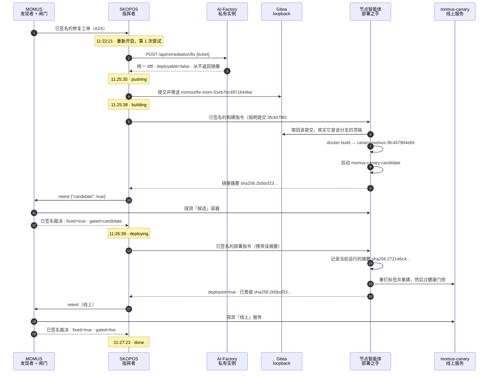
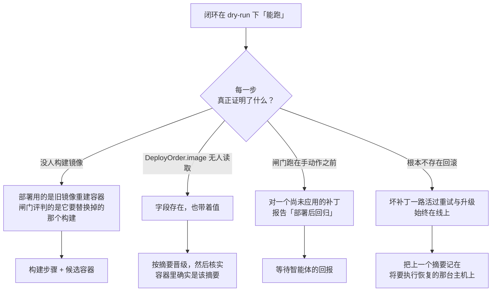

# 第一次真正的自愈 —— 5 分 2 秒，附核验

> 🌐 [English](first-self-heal.md) · [Русский](first-self-heal.ru.md) · [Español](first-self-heal.es.md) · [Français](first-self-heal.fr.md) · **中文**

**2026-08-27**，整个生态在回路中没有人的情况下修好了一个运行中服务的真实缺陷：MOMUS 发现它，
AI-Factory 写出补丁，机群完成构建，MOMUS 通过部署闸门放行，节点智能体上线，MOMUS 再对线上服务
确认修复。从头到尾 5 分 2 秒。

本页是记录，写法以**可核验**为目标，而不是为了好看。在这次运行之前，
[found-and-fixed.zh.md](found-and-fixed.zh.md) 明确写着 Factory **从未**写出过修好真实 bug 的补丁，
而「修复」这一步只是把测试装置的状态切一下。那句话现在已经不成立，而它之所以可以被撤下，依据就在
本页 —— 不是这个闭环自己报的 `done`，而是七项独立核验。

## 坏在哪里

`momus-canary` 是一个专门造出来的测试装置：一个**应当**违反自己声明的合约的服务，好让检测流程能
在真实的东西上被看见起效。MOMUS 的 `free_tier_ceiling_bypass` 探针对它记录了发现
**`mom-31eb7bc4971644ba`**：金丝雀声明免费层上限为 100，然后却为任意大小的未付费调用提供服务。

运行之前，它被刻意置回损坏状态，并且缺陷经手工确认：

```
POST /ai-market/v2/invoke  {"input": {"n": 500}}   →  200 OK   （本应拒绝）
```

## 这次运行



两道闸门，检查的是两个不同的东西，而已签名的裁决会说明是哪一个：晋级前 `gated=candidate`，
之后 `gated=live`。这个区别正是「闸门」与「仪式」的分界 —— 旧的闭环询问的是正在运行的服务，
然后就凭那个答案把东西发了出去。

## Factory 写出的补丁

一个文件，`momus/canary/canary.py`，新增九行、删除八行：

```diff
 @app.post("/ai-market/v2/invoke", response_model=None)
 async def invoke(body: dict):
     n = ((body or {}).get("input") or {}).get("n", 0)
-    if STATE["fixed"]:
-        # Conforming behaviour: refuse an unpaid over-ceiling call with 402, as oracle-core does.
-        if isinstance(n, (int, float)) and not isinstance(n, bool) and n > 100:
-            return Response(...402...)
-    # Broken behaviour: serve anything, unpaid, with no signed receipt.
+    # Enforce the free-tier ceiling: refuse an unpaid over-ceiling call with 402, as oracle-core does.
+    if isinstance(n, (int, float)) and not isinstance(n, bool) and n > 100:
+        return Response(...402...)
     return {...}
```

它移除的是**条件绕行**，而不是探针的输入。这正是该路由对模型下达的要求 ——
*修根因；只让探针通过的改动比不打补丁更糟，因为它会被判定为已修复，而 bug 依然在那里* ——
模型照做了。它也没有动测试装置的控制端点 `/canary/fix` 与 `/canary/break`，
所以这次改动与发现本身一样窄。

**有一个后果必须讲明。** `/health` 仍然汇报 `conforming: STATE["fixed"]`，而这与 `invoke`
实际的行为已经毫无关系。一个真正好的补丁把金丝雀的**自我汇报**与它的行为**解耦**了，
并且消耗掉了这个测试装置的开关：此次修复之后，`/canary/break` 再也无法把 bug 放回去。
对一个真实服务这是正确的，对一个测试装置则是实实在在的损失 ——
所以如果还需要重复演示，这个分支应该被回退，而不是合并。

## 核验

以下每一项都不是这个闭环自己的说法。

| 核验项 | 结果 |
|---|---|
| 缺陷还能复现吗？ | `n=500` → **402**（此前为 `200`） |
| 修复有没有破坏正常使用？ | `n=5` → `200`，照常提供服务 |
| 容器真的换了吗？ | 11:27:02 以新摘要重启 |
| 运行的镜像就是被闸门检查过的那个吗？ | 智能体上报的 `promoted_image` `sha256:2b5bcf23…` 与容器摘要**一致** |
| 两道闸门检查的是不同的构建吗？ | `gate_verdict.gated=candidate`、`post_deploy_verdict.gated=live` |
| 能撤回吗？ | 智能体记录了 `previous_image sha256:272146c4…` 与 compose 标签 |
| 有可供审阅的产物吗？ | 分支 = `main`（`b2d91c57`）之上 2 个提交：修复，以及 237 行的溯源链 |

溯源文件满足 [`scripts/pull_momus_fixes.sh`](https://github.com/alexar76/aicom/blob/main/scripts/pull_momus_fixes.sh) 中合并侧的校验器：
五个必填字段齐备、一份点明验证者密钥的 `fixed=true` 裁决、签名仅以前缀形式携带，
且整条记录中没有任何裸 IPv4。

运行之后的闭环健康度：**1 次部署、0 次回滚、回滚率 0.0、每日上限 6 中的 1，熔断器闭合。**

## 只有真实运行才能发现的东西

启用过程中浮现出七个缺陷，事先**没有任何一个**被测试抓到。把它们列出来，是因为这个规律比清单更
有用：每一个要么是一道存在却不生效的防护，要么是一个什么都没做却上报成功的步骤。



1. **没人构建镜像。** 「部署」只是用主机上已有的镜像重建容器。
2. **`DeployOrder.image` 根本无人读取** —— 字段存在，也带着值。
3. **闸门跑在手动作之前。** 指挥者发布指令后立刻复检「线上容器」；智能体按间隔轮询，
   所以任何真实任务都会被读成部署后回归并升级，把责任推给一个尚未被应用的补丁。
4. **任何地方都没有回滚**，所以一个启动即损坏的补丁会一直留在线上。
5. **`momus-backend` 从未被重新构建**，所以生产环境的 MOMUS 会忽略 `candidate`
   并返回不带 `gated` 的裁决 —— 而智能体随后会正确地拒绝每一次晋级。
6. **一个 dry-run 的 `DONE` 吞掉了第一个真实工单。** 指挥者接下了它，发现任务已完成，
   于是原样返回，一个出向调用都没有发。修正必须以**动作**的证据（`FLAG_DEPLOYED`）为依据，
   而不是某个早先版本恰好写下的标记。
7. **构建之后的 `job.result = {...}` 抹掉了推送记录**，于是溯源文件被静默跳过：
   正确的补丁、正确的分支、正确的部署 —— 却没有任何审计痕迹，
   只因为一个本该是 `.update(` 的 `=`。

共同的形状：**一道写好却从未被真正执行过的防护，读起来与一道有效的防护完全一样。**
这七个里有五个都是有界的、带签名的、注释良好的保护措施，而它们一次都没有与现实照过面。

## 这不能证明什么

* 一个组件、一个发现、一个探针。那次运行里智能体的允许清单恰好只有 `canary`。
  Factory 的 scope 与智能体配方现在也点名 `hub`，默认允许清单是 `canary,hub`。
  MOMUS / Treasury 不在清单上。
* 目标是一个测试装置。合约违规是真的，HTTP 服务也是真的，但没有人依赖它。
* 一份 `fixed` 裁决证明该发现不再复现。它不证明补丁是*好的*，不会去读 diff 查找后门，
  也无法察觉修复破坏了探针从未测试过的东西。这正是那个分支存在的理由，
  也是合并始终由人决定的理由 —— 见 [fix-provenance.zh.md](fix-provenance.zh.md)。
* 针对安全内核（MOMUS、Treasury、闸门自身）的发现完全不走这条路：
  `escalation_for` 会把它们导向人工治理外加一个独立运营的验证方。

运维细节 —— 每一个密钥、阈值与拒绝 —— 见
[self-healing-operations.zh.md](self-healing-operations.zh.md)。

---

## 第一次没有人发起的运行 —— 2026-08-29

上面那次自愈是人按下的按钮。这一次不是：定时扫描器发现了缺陷，一条规则判定它值得修，工单在
没有任何人过问的情况下开出。

**是什么让它成为可能。** 两个此前并不存在的组件。一份扫描排期 —— 每 15 分钟遍历 canary、gaia、
hub 与 oracles —— 以及一条按组件申明的派发规则：canary 与 gaia 上的 critical/high 需两次出现，
hub 上需三次。这条规则刻意不看发现的 `status`：生产中从没有任何代码往那里写过 `confirmed`，
以它为门槛的派发器一次也不会触发。它改用的证据是 `seen_count` —— 每次重新发现都会按去重键累加，
也就是「在 N 次扫描中复现过」。

**这次运行。**

| 时间 | 发生了什么 |
|---|---|
| 08:56:43 | 自动驾驶自行扫描四个目标 |
| 08:56:43 | 两条发现满足规则 —— canary 上的 `high`，复现 6 次与 5 次 |
| 08:56:44 | 两条均已派发；第三条因 `medium` 被策略拦下 |
| 11:22:21 | 向工厂请求补丁 |
| 11:25:35 | 补丁落到 `momus/fix-mom-31eb7bc4971644ba` |
| 11:25:38 | 节点之手构建提交 `3fc447904eb5` |
| 11:26:39 | MOMUS 对候选实例重跑探针 —— **已修复** |
| 11:26:39 | 部署指令被签署并发布 |
| 11:27:23 | 之手回报；MOMUS 就地复验 —— **通过** |

**这次运行发现了什么，其中三件是我们自己的。**

* 工厂已经数小时对每个补丁回 503。它的 compose 文件从环境读取 `AIFACTORY_REMEDIATION_KEY`，
  而一次无关的重建把它变成了空值。它失败关闭 —— 这是对的 —— 而且是静默的，因为此后再没有人
  向它要过补丁。
* 240 秒的模型预算太紧：实测该提示让所配模型花去 79–119 秒，并两次超时。只抬高它会更糟，因为
  指挥者的客户端在 300 秒就放弃。现在整条链是有序的：600 < 900 < 1500。
* MOMUS 的 `200` 不等于派发成功。当工单转入人工治理时它回 200 且 `dispatched: false`，只读状态码
  会把它记成成功，并为无人接手的工单花掉当天的一个名额。
* 被重开的任务把第二个补丁推向第一次已占用的分支，被判为 non-fast-forward 而拒绝。强推理应被
  拒绝，因此现在每次尝试都有自己的分支。

还有一件让整个闭环彻底不可用、却从未言明的事：部署之手无法导入 `oracle_core`，于是
`verify_deploy_chain` 返回 *"no signing backend available"*，任何指令都被拒绝 —— 而这发生在模型
已经付费、镜像已经构建之后。现在之手会在启动时说明缺哪个后端、以及如何提供。

## 端到端证实的完全自治 —— 2026-08-29 10:51:29 → 10:53:59

上面那次运行停在了闸门：补丁没有修好发现，因此什么也没发布 —— 这是对的，但还不是一次重新部署。
横在闭环与重新部署之间的有三个缺陷。

* **之手什么也验证不了。** `oracle_core` 无法导入，于是 `verify_deploy_chain` 返回
  *"no signing backend available"* 并拒绝一切指令 —— 而这发生在模型已付费、镜像已构建之后。
  现在之手会在启动时说明缺哪个后端。
* **重试落不了地。** 被重开的任务把第二个补丁推向第一次已占用的分支，被判为 non-fast-forward。
  强推理应被拒绝，因此现在每次尝试都有自己的分支。
* **已发布的修复永远无法重开。** 指挥者不去动处于 DONE 的任务，以免重复工单重做已完成的工作 ——
  但这条规则无法区分「重复」与**「回归」**，而无法治愈自身回归的闭环不叫自愈。工单现在携带来自
  语料库的 `last_seen_at`：若该发现在任务完成之后又被看到复现，任务即重开。让这个字段真正送达
  还需要另外两处修正：MOMUS 通过一个从来没有该列的进程内缓存读取发现，而存储的 `get()` 只返回
  扫描器的文档，不含紧邻它的语料库列。两者都返回空值，静默地让规则失效。

**证据。** 金丝雀从未打补丁的源码重新构建，于是免费额度绕过再次复现 —— 这是针对两天前已发布
修复的一次真实回归。

| 时间 | 发生了什么 | 证据 |
|---|---|---|
| — | 之前 | 容器 `5bdeae2bf93c`，镜像 `73205c15575a` |
| 10:51:29 | 向工厂请求补丁 | 任务作为回归被重开 |
| 10:52:11 | 补丁已推送 | 分支 `momus/fix-mom-31eb7bc4971644ba-1` |
| 10:52:15 | 节点之手构建 | 提交 `64a05d389ee7` |
| 10:53:17 | MOMUS 检验候选实例 | **已修复** |
| 10:53:17 | 部署指令已签署 | `deploy-mom-31eb7bc4971644ba-1788000797` |
| 10:53:59 | 之手部署；MOMUS 就地复验 | **完成** |
| — | 之后 | 容器 `0009b9ae5e77`，创建于 10:53:37，镜像 `c1e3e12a121b` |

**两分三十秒，其中没有任何人。** 这一结论独立于闭环自己的报告得到验证：容器 id 变了，新容器是在
本次运行期间创建的，之手自己的部署日志记录了该指令且 `previous_image` 正是那个损坏的构建，而对
该探针的一次全新扫描返回 `findings: 0`。

## 这仍然没有证明的事

闸门能否抓住「通过了探针、却弄坏了探针看不到之处」的修复。它在前后各重跑一个探针 —— 发现所指名
的那一个。探针触及不到的一切都未经检验，而回滚路径的存在，正是因为总有一天这会变得重要。
