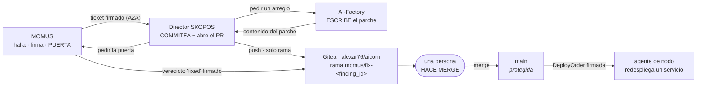

# Dónde queda registrado un arreglo — quién commitea, en qué rama, desde dónde se hace merge

> 🌐 [English](fix-provenance.md) · [Русский](fix-provenance.ru.md) · **Español** · [Français](fix-provenance.fr.md) · [中文](fix-provenance.zh.md)

> **Estado: diseñado, deliberadamente NO habilitado.** Hoy ningún agente posee una credencial de git.
> Activar esto es la única decisión de toda la arquitectura que da a un agente permiso de escritura
> sobre el código fuente, así que espera una decisión explícita del propietario y un token creado por
> él. Todo lo que sigue describe qué ocurre cuando se active, y las restricciones que hacen que
> activarlo sea defendible.

El bucle de remediación hoy demuestra su fontanería de principio a fin mientras que *el parche en sí*
sigue siendo un cambio de fixture — dicho llanamente en
[found-and-fixed.md](found-and-fixed.es.md). Esta página cierra la brecha restante: un parche escrito
de forma autónoma tiene que aterrizar en algún sitio revisable, o el bucle produce cambios que nadie
puede auditar.

## Dónde corre todo

Las tres partes viven en **un solo host** — el host de oráculos, que además sirve
[momus.modelmarket.dev](https://momus.modelmarket.dev/):

| Rol | Servicio | Escucha en |
|---|---|---|
| el auditor y la puerta | `momus-backend` | loopback |
| el pagador | `momus-treasury` | loopback |
| **el director** | `skopos-remediation` | loopback |
| **el remoto git** | Gitea (`alexar76/aicom`) | loopback (`:3000` HTTP, `:2222` SSH) |

Dos consecuencias que conviene enunciar:

* **El push nunca sale de la máquina.** Director → Gitea es una conexión loopback, así que ninguna
  credencial de git viaja por la red y no se abre ningún puerto entrante para ello.
* **SKOPOS son dos despliegues distintos, y aquí solo está uno.** El
  [panel SKOPOS](https://skopos.modelmarket.dev) que mira una persona corre en su propio host. El
  **director de remediación** corre junto a MOMUS, porque ahí es donde vive el bucle. Comparten
  nombre y nada más — no apuntes la configuración de git al host del panel.

## Quién commitea: el director. Nunca MOMUS.



**MOMUS nunca debe poder hacer push.** Es el auditor *y* la puerta de despliegue: si además pudiera
escribir un cambio, podría escribir un parche y luego certificar su propio parche como arreglado. Esa
es exactamente la autocertificación que la economía de recompensas ya prohíbe — un reclamante nunca
verifica su propia reclamación — y la vía git no debe reintroducirla por la puerta de atrás.

El director es el committer correcto porque ya posee una clave de firma, ya conduce la máquina de
estados y ya es la parte cuyas órdenes verifica un agente de nodo. La Factory aporta el *contenido*
del parche y nunca toca el remoto: un reparador capaz de aterrizar su propio trabajo cobraría un 35%
por algo que nadie revisó.

## La rama, y desde dónde hacer merge

| | |
|---|---|
| **Rama a la que empuja el agente** | `momus/fix-<finding_id>` — p. ej. `momus/fix-mom-a1227001b375450d` |
| **Rama base** | `main` — **protegida**: sin push directo, sin force-push, sin borrado |
| **Desde dónde haces merge** | el pull request que el director abre en esa rama, en Gitea `alexar76/aicom` |
| **Quién hace merge** | una persona. Siempre. |
| **Precondición de merge** | un veredicto `fixed` firmado por MOMUS para ese `finding_id` exacto, adjunto al PR |

El prefijo `momus/` no es cosmético: hace que cada rama escrita por un agente sea identificable de un
vistazo, grepeable en el reflog y fácil de proteger como clase. El `finding_id` en el nombre implica
que una rama siempre puede rastrearse hasta el hallazgo firmado que la justificó — una rama que nadie
puede atar a un hallazgo es una rama que nadie debería mergear.

**Nunca `main`, nunca una rama existente, nunca un force-push.** La protección de `main` es lo que
hace sobrevivible un token robado: lo peor que puede hacer un atacante con la credencial es crear una
rama que nadie mergea. Sin protección, el mismo token alcanza la rama que despliega.

## Qué aterriza en el commit

No solo el diff. La cadena entera, como archivo, para que la auditoría se lea solo desde git y no
dependa de que algún panel siga vivo:

```
momus/fix-mom-a1227001b375450d
├── <el parche en sí>
└── .momus/mom-a1227001b375450d.json
    ├── finding            (firmado por la clave de escáner de MOMUS)
    ├── verdicts[]         (firmado por cada verificador independiente)
    ├── fix_verdict        (firmado por MOMUS — la puerta de despliegue)
    ├── deploy_order       (firmado por el director, incrusta fix_verdict)
    └── agent_result       (qué hizo el agente de nodo, o por qué se negó)
```

Cada documento de ese archivo se verifica sin conexión contra una clave pública, así que un revisor
puede comprobar la procedencia de un cambio sin confiar en el servicio que lo produjo — la misma
propiedad sobre la que se apoyan los
[recibos AWR](https://github.com/alexar76/aicom/blob/main/docs/awr-receipts.es.md).

El mensaje del commit nombra el hallazgo y el veredicto de la puerta, y dice sin rodeos que lo
escribió una máquina:

```
fix(canary): enforce the free-tier ceiling

Authored by the AI-Factory for MOMUS finding mom-a1227001b375450d.
Confirmed by 2 independent verifiers; MOMUS gate verdict: fixed=true.
Signed chain: .momus/mom-a1227001b375450d.json

Machine-authored. Requires human review before merge.
```

## La credencial

| | |
|---|---|
| **Tipo** | un **token de despliegue** de Gitea, creado por el propietario en la UI de Gitea |
| **Alcance** | exactamente un repositorio: `alexar76/aicom` |
| **Permisos** | solo push. Sin admin, sin releases, sin webhooks, sin acceso a la organización. |
| **Alcance de red** | solo loopback — el director y Gitea están en el mismo host |
| **Lo que NO debe ser** | el PAT del propietario, ni una clave SSH con acceso a la organización. Una credencial capaz de alcanzar otros repositorios convierte un contenedor comprometido en un problema de toda la organización. |

`main` sigue protegida **con independencia del alcance del token**, porque un alcance es una política
del servidor y la protección de rama es una segunda. Que una de las dos esté mal configurada no debe
bastar.

## Qué falta deliberadamente

* **Ningún automerge, con ninguna confianza.** El merge es donde vive la autoridad, y toda la
  arquitectura descansa en que los agentes no posean autoridad de la que puedan abusar. Un veredicto
  `fixed` firmado prueba que el hallazgo dejó de reproducirse; no prueba que el parche sea *bueno*, no
  lee el diff en busca de una puerta trasera y no puede notar que el arreglo rompió algo que la sonda
  nunca probó.
* **Ningún push desde MOMUS**, por la razón anterior.
* **Ningún push desde un agente de nodo.** Los agentes ejecutan un redespliegue de una lista
  permitida; darles una credencial de git replicaría el privilegio más peligroso del sistema por cada
  host de la flota.
* **Ningún push a GitHub.** GitHub guarda *espejos* de los satélites, publicados por un script
  explícito que ejecuta una persona. Un agente empujando a un espejo público publicaría código escrito
  por una máquina y sin revisar, bajo nuestro nombre.

## Cómo habilitarlo

1. En Gitea, crea un token de despliegue sobre `alexar76/aicom` solo con permiso de push.
2. Activa la protección de rama en `main`: sin push directo, sin force-push, pull request obligatorio.
3. Dale al contenedor del director el token y el remoto loopback, y define
   `SKOPOS_FIX_BRANCH_PREFIX=momus/fix-` y `SKOPOS_GIT_PUSH=1`.
4. Confirma primero el caso negativo: con el token puesto, un `git push` a `main` desde el director
   debe ser **rechazado** por el servidor. Si funciona, la protección no está configurada y el paso 2
   no está hecho — párate ahí.

Hasta que exista el paso 1, el director registra la cadena en su propio diario y el paso de arreglo
sigue siendo un cambio de fixture. Ese es el estado actual, y honesto.
