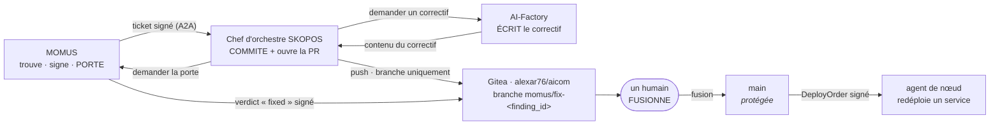

# Où un correctif est enregistré — qui commite, sur quelle branche, depuis où fusionner

> 🌐 [English](fix-provenance.md) · [Русский](fix-provenance.ru.md) · [Español](fix-provenance.es.md) · **Français** · [中文](fix-provenance.zh.md)

> **Statut : conçu, délibérément NON activé.** Aucun agent ne détient d'identifiant git aujourd'hui.
> Activer ceci est la seule décision de toute l'architecture qui donne à un agent un droit d'écriture
> sur le code source ; elle attend donc une décision explicite du propriétaire et un jeton créé par
> lui. Tout ce qui suit décrit ce qui se passe une fois activé, et les contraintes qui rendent cette
> activation défendable.

La boucle de remédiation prouve aujourd'hui sa tuyauterie de bout en bout tandis que *le correctif
lui-même* reste un basculement de fixture — dit clairement dans
[found-and-fixed.md](found-and-fixed.fr.md). Cette page comble l'écart restant : un correctif écrit de
façon autonome doit atterrir quelque part de relisible, sinon la boucle produit des changements que
personne ne peut auditer.

## Où tout cela tourne

Les trois parties vivent sur **un seul hôte** — l'hôte des oracles, qui sert aussi
[momus.modelmarket.dev](https://momus.modelmarket.dev/) :

| Rôle | Service | Écoute sur |
|---|---|---|
| l'auditeur et la porte | `momus-backend` | loopback |
| le payeur | `momus-treasury` | loopback |
| **le chef d'orchestre** | `skopos-remediation` | loopback |
| **le dépôt git distant** | Gitea (`alexar76/aicom`) | loopback (`:3000` HTTP, `:2222` SSH) |

Deux conséquences qui méritent d'être énoncées :

* **Le push ne quitte jamais la machine.** Chef d'orchestre → Gitea est une connexion loopback :
  aucun identifiant git ne transite sur un réseau, et aucun port entrant ne s'ouvre pour cela.
* **SKOPOS, ce sont deux déploiements différents, et un seul est ici.** Le
  [tableau de bord SKOPOS](https://skopos.modelmarket.dev) que regarde un humain tourne sur son
  propre hôte. Le **chef d'orchestre de remédiation** tourne à côté de MOMUS, parce que c'est là que
  vit la boucle. Ils partagent un nom et rien d'autre — ne pointez pas la configuration git vers
  l'hôte du tableau de bord.

## Qui commite : le chef d'orchestre. Jamais MOMUS.



**MOMUS ne doit jamais pouvoir pousser.** Il est l'auditeur *et* la porte de déploiement : s'il
pouvait en plus écrire un changement, il pourrait écrire un correctif puis certifier son propre
correctif comme corrigé. C'est exactement l'auto-certification que l'économie des primes interdit
déjà — un demandeur ne vérifie jamais sa propre demande — et la voie git ne doit pas la réintroduire
en douce.

Le chef d'orchestre est le bon committeur : il détient déjà une clé de signature, pilote déjà la
machine à états, et est déjà la partie dont un agent de nœud vérifie les ordres. La Factory fournit le
*contenu* du correctif et ne touche jamais au dépôt distant : un réparateur capable de livrer son
propre travail serait payé 35 % pour quelque chose que personne n'a relu.

## La branche, et depuis où fusionner

| | |
|---|---|
| **Branche poussée par l'agent** | `momus/fix-<finding_id>` — p. ex. `momus/fix-mom-a1227001b375450d` |
| **Branche de base** | `main` — **protégée** : pas de push direct, pas de force-push, pas de suppression |
| **Depuis où vous fusionnez** | la pull request que le chef d'orchestre ouvre sur cette branche, dans Gitea `alexar76/aicom` |
| **Qui fusionne** | un humain. Toujours. |
| **Précondition de fusion** | un verdict `fixed` signé par MOMUS pour ce `finding_id` exact, joint à la PR |

Le préfixe `momus/` n'est pas cosmétique : il rend chaque branche écrite par un agent identifiable
d'un coup d'œil, grepable dans le reflog et facile à protéger comme classe. Le `finding_id` dans le
nom signifie qu'une branche peut toujours être reliée au signalement signé qui l'a justifiée — une
branche que personne ne peut rattacher à un signalement est une branche que personne ne devrait
fusionner.

**Jamais `main`, jamais une branche existante, jamais un force-push.** La protection de `main` est ce
qui rend un jeton volé survivable : le pire qu'un attaquant muni de l'identifiant puisse faire, c'est
créer une branche que personne ne fusionne. Sans protection, le même jeton atteint la branche qui
déploie.

## Ce qui atterrit dans le commit

Pas seulement le diff. Toute la chaîne, sous forme de fichier, pour que l'audit se lise depuis git
seul et ne dépende pas de la survie d'un tableau de bord :

```
momus/fix-mom-a1227001b375450d
├── <le correctif lui-même>
└── .momus/mom-a1227001b375450d.json
    ├── finding            (signé par la clé de scanner de MOMUS)
    ├── verdicts[]         (signé par chaque vérificateur indépendant)
    ├── fix_verdict        (signé par MOMUS — la porte de déploiement)
    ├── deploy_order       (signé par le chef d'orchestre, contient fix_verdict)
    └── agent_result       (ce qu'a fait l'agent de nœud, ou pourquoi il a refusé)
```

Chaque document de ce fichier se vérifie hors ligne contre une clé publique : un relecteur peut donc
contrôler la provenance d'un changement sans faire confiance au service qui l'a produit — la propriété
même sur laquelle reposent les
[reçus AWR](https://github.com/alexar76/aicom/blob/main/docs/awr-receipts.fr.md).

Le message de commit nomme le signalement et le verdict de la porte, et dit franchement qu'une machine
l'a écrit :

```
fix(canary): enforce the free-tier ceiling

Authored by the AI-Factory for MOMUS finding mom-a1227001b375450d.
Confirmed by 2 independent verifiers; MOMUS gate verdict: fixed=true.
Signed chain: .momus/mom-a1227001b375450d.json

Machine-authored. Requires human review before merge.
```

## L'identifiant

| | |
|---|---|
| **Type** | un **jeton de déploiement** Gitea, créé par le propriétaire dans l'interface Gitea |
| **Portée** | exactement un dépôt : `alexar76/aicom` |
| **Droits** | push uniquement. Pas d'admin, pas de releases, pas de webhooks, pas d'accès à l'organisation. |
| **Portée réseau** | loopback uniquement — le chef d'orchestre et Gitea sont sur le même hôte |
| **Ce qu'il ne doit PAS être** | le PAT du propriétaire, ni une clé SSH avec accès à l'organisation. Un identifiant capable d'atteindre d'autres dépôts transforme un conteneur compromis en problème à l'échelle de l'organisation. |

`main` reste protégée **indépendamment de la portée du jeton**, parce qu'une portée est une politique
côté serveur et la protection de branche en est une seconde. Que l'une des deux soit mal configurée ne
doit pas suffire.

## Ce qui est délibérément absent

* **Aucune fusion automatique, quel que soit le niveau de confiance.** La fusion est là où réside
  l'autorité, et toute l'architecture repose sur le fait que les agents ne détiennent pas d'autorité
  dont ils pourraient abuser. Un verdict `fixed` signé prouve que le signalement a cessé de se
  reproduire ; il ne prouve pas que le correctif est *bon*, ne relit pas le diff à la recherche d'une
  porte dérobée, et ne peut pas remarquer que le correctif a cassé ce que la sonde n'a jamais testé.
* **Aucun push depuis MOMUS**, pour la raison ci-dessus.
* **Aucun push depuis un agent de nœud.** Les agents exécutent un redéploiement d'une liste
  autorisée ; leur donner un identifiant git répliquerait le privilège le plus dangereux du système
  sur chaque hôte de la flotte.
* **Aucun push vers GitHub.** GitHub héberge des *miroirs* de satellites, publiés par un script
  explicite lancé par un humain. Un agent poussant vers un miroir public publierait du code écrit par
  une machine et non relu, sous notre nom.

## Comment l'activer

1. Dans Gitea, créez un jeton de déploiement sur `alexar76/aicom` avec le seul droit de push.
2. Activez la protection de branche sur `main` : pas de push direct, pas de force-push, pull request
   obligatoire.
3. Donnez au conteneur du chef d'orchestre le jeton et le dépôt distant loopback, et définissez
   `SKOPOS_FIX_BRANCH_PREFIX=momus/fix-` et `SKOPOS_GIT_PUSH=1`.
4. Confirmez d'abord le cas négatif : le jeton en place, un `git push` vers `main` depuis le chef
   d'orchestre doit être **refusé** par le serveur. S'il réussit, la protection n'est pas configurée
   et l'étape 2 n'est pas faite — arrêtez-vous là.

Tant que l'étape 1 n'existe pas, le chef d'orchestre consigne la chaîne dans son propre journal et
l'étape de correction reste un basculement de fixture. C'est l'état actuel, et honnête.
