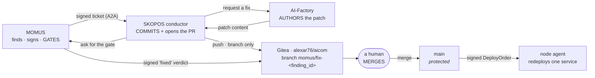

# Where a fix gets recorded — who commits, which branch, where to merge from

> 🌐 **English** · [Русский](fix-provenance.ru.md) · [Español](fix-provenance.es.md) · [Français](fix-provenance.fr.md) · [中文](fix-provenance.zh.md)

> **Status: designed, deliberately NOT enabled.** No agent holds a git credential today. Turning this
> on is the one decision in the whole architecture that gives an agent write access to source code, so
> it waits for an explicit owner decision and an owner-created token. Everything below describes what
> happens when it is switched on, and the constraints that make switching it on defensible.

The remediation loop currently proves its plumbing end to end while the *patch itself* is a fixture
flip — stated plainly in [found-and-fixed.md](found-and-fixed.md). This page closes the remaining gap:
an autonomously authored patch has to land somewhere reviewable, or the loop produces changes nobody
can audit.

## Where everything runs

All three parties are on **one host** — the oracle host, which also serves
[momus.modelmarket.dev](https://momus.modelmarket.dev/):

| Role | Service | Bound to |
|---|---|---|
| the auditor and the gate | `momus-backend` | loopback |
| the payer | `momus-treasury` | loopback |
| **the conductor** | `skopos-remediation` | loopback |
| **the git remote** | Gitea (`alexar76/aicom`) | loopback (`:3000` HTTP, `:2222` SSH) |

Two consequences worth stating:

* **The push never leaves the machine.** Conductor → Gitea is a loopback connection, so no git
  credential is ever transmitted over a network, and no inbound port opens anywhere for it.
* **SKOPOS is two different deployments, and only one of them is here.** The
  [SKOPOS dashboard](https://skopos.modelmarket.dev) a human looks at runs on its own host. The
  **remediation conductor** runs next to MOMUS, because that is where the loop lives. They share a
  name and nothing else — do not point the git configuration at the dashboard host.

## Who commits: the conductor. Never MOMUS.



**MOMUS must never be able to push.** It is the auditor *and* the deploy gate: if it could also author
a change, it could write a patch and then certify its own patch as fixed. That is exactly the
self-certification the bounty economics already forbid — a claimant never verifies its own claim — and
the git path must not quietly reintroduce it.

The conductor is the right committer because it already holds a signing key, already drives the state
machine, and is already the party whose orders a node agent verifies. The Factory supplies patch
*content* and never touches the remote: a fixer that could land its own work would be paid 35% for
something nobody checked.

## The branch, and where to merge from

| | |
|---|---|
| **Branch the agent pushes** | `momus/fix-<finding_id>` — e.g. `momus/fix-mom-a1227001b375450d` |
| **Base branch** | `main` — **protected**: no direct push, no force-push, no deletion |
| **Where you merge from** | the pull request the conductor opens on that branch, in Gitea `alexar76/aicom` |
| **Who merges** | a human. Always. |
| **Merge precondition** | a MOMUS-signed `fixed` verdict for that exact `finding_id`, attached to the PR |

The `momus/` prefix is not cosmetic: it makes every agent-authored branch identifiable at a glance,
greppable in the reflog, and easy to protect as a class. The `finding_id` in the name means a branch
can always be traced back to the signed finding that justified it — a branch nobody can tie to a
finding is a branch nobody should merge.

**Never `main`, never an existing branch, never a force-push.** Branch protection on `main` is what
makes a stolen token survivable: the worst an attacker with the credential can do is create a branch
nobody merges. Without protection, the same token reaches the branch that deploys.

## What lands in the commit

Not just the diff. The whole chain, as a file, so the audit is readable from git alone and does not
depend on any dashboard still being alive:

```
momus/fix-mom-a1227001b375450d
├── <the patch itself>
└── .momus/mom-a1227001b375450d.json
    ├── finding            (signed by MOMUS's scanner key)
    ├── verdicts[]         (signed by each independent verifier)
    ├── fix_verdict        (signed by MOMUS — the deploy gate)
    ├── deploy_order       (signed by the conductor, embeds fix_verdict)
    └── agent_result       (what the node agent did, or why it refused)
```

Every document in that file verifies offline against a public key, so a reviewer can check the
provenance of a change without trusting the service that produced it — the same property the
[AWR receipts](https://github.com/alexar76/aicom/blob/main/docs/awr-receipts.md) rest on.

The commit message names the finding and the gate verdict, and says plainly that a machine wrote it:

```
fix(canary): enforce the free-tier ceiling

Authored by the AI-Factory for MOMUS finding mom-a1227001b375450d.
Confirmed by 2 independent verifiers; MOMUS gate verdict: fixed=true.
Signed chain: .momus/mom-a1227001b375450d.json

Machine-authored. Requires human review before merge.
```

## The credential

| | |
|---|---|
| **Kind** | a Gitea **deploy token**, created by the owner in the Gitea UI |
| **Scope** | exactly one repository: `alexar76/aicom` |
| **Rights** | push only. No admin, no releases, no webhooks, no org access. |
| **Reach** | loopback only — the conductor and Gitea are on the same host |
| **What it must NOT be** | the owner's PAT, or an SSH key with organisation access. A credential that can reach other repositories turns one compromised container into an org-wide problem. |

`main` stays protected **independently of the token's scope**, because a scope is a policy on the
server and branch protection is a second one. One of them being misconfigured should not be enough.

## What is deliberately absent

* **No auto-merge, at any confidence level.** Merging is where authority lives, and the entire
  architecture rests on agents not holding authority they could misuse. A signed `fixed` verdict
  proves the finding stopped reproducing; it does not prove the patch is *good*, does not read the
  diff for a backdoor, and cannot notice that the fix broke something the probe never tested.
* **No push from MOMUS**, for the reason above.
* **No push from a node agent.** Agents execute one allowlisted redeploy; giving them a git credential
  would replicate the most dangerous privilege in the system across every fleet host.
* **No pushes to GitHub.** GitHub holds satellite *mirrors*, published by an explicit human-run
  script. An agent pushing to a public mirror would publish unreviewed machine-authored code under our
  name.

## Enabling it

1. In Gitea, create a deploy token on `alexar76/aicom` with push rights only.
2. Enable branch protection on `main`: no direct push, no force-push, require a pull request.
3. Give the conductor container the token and the loopback remote, and set
   `SKOPOS_FIX_BRANCH_PREFIX=momus/fix-` and `SKOPOS_GIT_PUSH=1`.
4. Confirm the negative case first: with the token in place, `git push` to `main` from the conductor
   must be **refused** by the server. If it succeeds, protection is not configured and step 2 is not
   done — stop there.

Until step 1 exists, the conductor records the chain in its own journal and the fix step stays a
fixture flip. That is the current, honest state.
