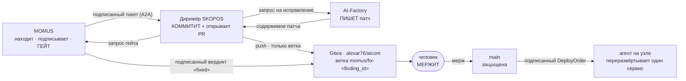

# Где фиксируется исправление — кто коммитит, в какую ветку, откуда мержить

> 🌐 [English](fix-provenance.md) · **Русский** · [Español](fix-provenance.es.md) · [Français](fix-provenance.fr.md) · [中文](fix-provenance.zh.md)

> **Статус: спроектировано и намеренно НЕ включено.** Сегодня ни один агент не держит git-credential.
> Включение этого — единственное решение во всей архитектуре, которое даёт агенту право записи в
> исходный код, поэтому оно ждёт явного решения владельца и созданного владельцем токена. Всё
> описанное ниже — что происходит после включения и какие ограничения делают это включение
> защитимым.

Цикл ремедиации сегодня доказывает свою обвязку от начала до конца, тогда как *сам патч* остаётся
переключением фикстуры — прямо об этом сказано в [found-and-fixed.md](found-and-fixed.ru.md). Эта
страница закрывает оставшийся разрыв: автономно написанный патч обязан куда-то приземлиться так,
чтобы его можно было отревьюить, иначе цикл производит изменения, которые никто не может проверить.

## Где всё это работает

Все три стороны живут на **одном хосте** — oracle-хосте, который также обслуживает
[momus.modelmarket.dev](https://momus.modelmarket.dev/):

| Роль | Сервис | Слушает на |
|---|---|---|
| аудитор и гейт | `momus-backend` | loopback |
| плательщик | `momus-treasury` | loopback |
| **дирижёр** | `skopos-remediation` | loopback |
| **git-remote** | Gitea (`alexar76/aicom`) | loopback (`:3000` HTTP, `:2222` SSH) |

Два следствия, которые стоит проговорить:

* **Push никогда не покидает машину.** Дирижёр → Gitea — это loopback-соединение, поэтому ни один
  git-credential не передаётся по сети и ни один входящий порт для этого не открывается.
* **SKOPOS — это два разных развёртывания, и здесь только одно из них.**
  [Дашборд SKOPOS](https://skopos.modelmarket.dev), на который смотрит человек, работает на своём
  собственном хосте. **Дирижёр ремедиации** работает рядом с MOMUS, потому что цикл живёт именно
  там. У них общее только имя — не направляйте git-конфигурацию на хост дашборда.

## Кто коммитит: дирижёр. Никогда не MOMUS.



**MOMUS не должен иметь возможности пушить.** Он одновременно аудитор *и* деплой-гейт: если бы он
мог ещё и писать изменения, он мог бы написать патч, а затем сам сертифицировать свой патч как
исправленный. Это ровно та самосертификация, которую уже запрещает экономика вознаграждений —
претендент никогда не проверяет собственную заявку, — и git-путь не должен втихую вернуть её обратно.

Дирижёр — правильный коммиттер, потому что он уже держит ключ подписи, уже ведёт машину состояний и
уже является той стороной, чьи приказы проверяет агент на узле. Factory поставляет *содержимое*
патча и никогда не касается remote: фиксер, который мог бы сам залить свою работу, получал бы 35% за
то, что никто не проверял.

## Ветка и откуда мержить

| | |
|---|---|
| **Ветка, в которую пушит агент** | `momus/fix-<finding_id>` — например, `momus/fix-mom-a1227001b375450d` |
| **Базовая ветка** | `main` — **защищена**: без прямого push, без force-push, без удаления |
| **Откуда вы мержите** | из pull request, который дирижёр открывает на этой ветке, в Gitea `alexar76/aicom` |
| **Кто мержит** | человек. Всегда. |
| **Предусловие мержа** | подписанный MOMUS вердикт `fixed` именно для этого `finding_id`, приложенный к PR |

Префикс `momus/` не косметический: он делает каждую написанную агентом ветку опознаваемой с одного
взгляда, грепаемой в reflog и легко защищаемой как класс. `finding_id` в имени означает, что ветку
всегда можно отследить до подписанной находки, которая её оправдала — ветка, которую никто не может
связать с находкой, это ветка, которую никто не должен мержить.

**Никогда `main`, никогда существующая ветка, никогда force-push.** Защита ветки `main` — это то, что
делает украденный токен переживаемым: максимум, что может сделать атакующий с credential, — создать
ветку, которую никто не смержит. Без защиты тот же токен дотягивается до ветки, которая деплоится.

## Что попадает в коммит

Не только дифф. Вся цепочка, файлом, чтобы аудит читался из одного git и не зависел от того, жив ли
ещё какой-нибудь дашборд:

```
momus/fix-mom-a1227001b375450d
├── <сам патч>
└── .momus/mom-a1227001b375450d.json
    ├── finding            (подписано ключом сканера MOMUS)
    ├── verdicts[]         (подписано каждым независимым верификатором)
    ├── fix_verdict        (подписано MOMUS — деплой-гейт)
    ├── deploy_order       (подписано дирижёром, включает fix_verdict)
    └── agent_result       (что сделал агент на узле или почему он отказался)
```

Каждый документ в этом файле проверяется офлайн по публичному ключу, поэтому ревьюер может проверить
происхождение изменения, не доверяя сервису, который его произвёл, — то же свойство, на котором
держатся [AWR-квитанции](https://github.com/alexar76/aicom/blob/main/docs/awr-receipts.ru.md).

Сообщение коммита называет находку и вердикт гейта и прямо говорит, что его написала машина:

```
fix(canary): enforce the free-tier ceiling

Authored by the AI-Factory for MOMUS finding mom-a1227001b375450d.
Confirmed by 2 independent verifiers; MOMUS gate verdict: fixed=true.
Signed chain: .momus/mom-a1227001b375450d.json

Machine-authored. Requires human review before merge.
```

## Credential

| | |
|---|---|
| **Тип** | **deploy-токен** Gitea, созданный владельцем в UI Gitea |
| **Область** | ровно один репозиторий: `alexar76/aicom` |
| **Права** | только push. Без admin, без релизов, без вебхуков, без доступа к организации. |
| **Досягаемость** | только loopback — дирижёр и Gitea на одном хосте |
| **Чем он быть НЕ должен** | PAT владельца или SSH-ключ с доступом к организации. Credential, который дотягивается до других репозиториев, превращает один скомпрометированный контейнер в проблему уровня организации. |

`main` остаётся защищённой **независимо от области токена**, потому что область — это политика на
сервере, а защита ветки — вторая политика. Неправильной настройки одной из них не должно быть
достаточно.

## Чего здесь намеренно нет

* **Никакого автомержа, ни при какой уверенности.** Мерж — это место, где живёт полномочие, а вся
  архитектура держится на том, что агенты не держат полномочий, которыми могли бы злоупотребить.
  Подписанный вердикт `fixed` доказывает, что находка перестала воспроизводиться; он не доказывает,
  что патч *хорош*, не читает дифф на предмет закладки и не может заметить, что исправление сломало
  что-то, чего проба никогда не проверяла.
* **Никакого push от MOMUS** — по причине выше.
* **Никакого push от агента на узле.** Агенты выполняют один разрешённый список переразвёртываний;
  выдача им git-credential размножила бы самую опасную привилегию в системе по всем хостам флота.
* **Никаких push в GitHub.** GitHub держит *зеркала* сателлитов, публикуемые явным скриптом, который
  запускает человек. Агент, пушащий в публичное зеркало, публиковал бы неотревьюенный машинный код
  под нашим именем.

## Как это включить

1. В Gitea создайте deploy-токен на `alexar76/aicom` только с правом push.
2. Включите защиту ветки `main`: без прямого push, без force-push, обязательный pull request.
3. Дайте контейнеру дирижёра токен и loopback-remote и задайте
   `SKOPOS_FIX_BRANCH_PREFIX=momus/fix-` и `SKOPOS_GIT_PUSH=1`.
4. Сначала подтвердите негативный случай: с установленным токеном `git push` в `main` от дирижёра
   должен быть **отклонён** сервером. Если он проходит — защита не настроена и шаг 2 не выполнен;
   остановитесь здесь.

Пока шаг 1 не сделан, дирижёр записывает цепочку в собственный журнал, а шаг исправления остаётся
переключением фикстуры. Это текущее и честное состояние.
