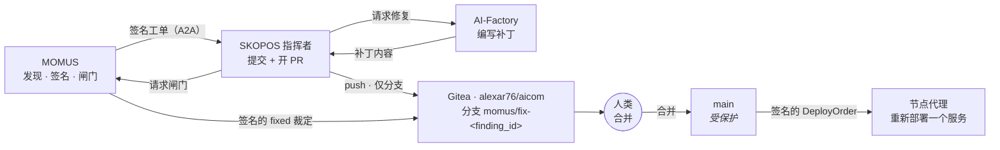

# 修复记录在哪里 —— 谁提交、进哪个分支、从哪里合并

> 🌐 [English](fix-provenance.md) · [Русский](fix-provenance.ru.md) · [Español](fix-provenance.es.md) · [Français](fix-provenance.fr.md) · **中文**

> **状态：已设计，且刻意未启用。** 目前没有任何代理持有 git 凭据。启用它是整个架构中唯一一项
> 赋予代理源码写权限的决定，因此它需要等待所有者的明确决定和由所有者创建的令牌。下文描述的是
> 启用之后会发生什么，以及使这次启用站得住脚的那些约束。

修复闭环目前端到端地验证了自己的管道，而*补丁本身*仍然是一次 fixture 切换 —— 这一点在
[found-and-fixed.md](found-and-fixed.zh.md) 中说得很直白。本页填补剩下的缺口：自主编写的补丁必须
落到某个可评审的地方，否则这个闭环产出的就是没人能审计的变更。

## 这些东西跑在哪里

三方都在**同一台主机**上 —— 即同时服务
[momus.modelmarket.dev](https://momus.modelmarket.dev/) 的 oracle 主机：

| 角色 | 服务 | 监听 |
|---|---|---|
| 审计者与闸门 | `momus-backend` | 回环 |
| 支付方 | `momus-treasury` | 回环 |
| **指挥者** | `skopos-remediation` | 回环 |
| **git 远端** | Gitea（`alexar76/aicom`） | 回环（`:3000` HTTP、`:2222` SSH） |

有两个后果值得说明：

* **push 永远不会离开这台机器。** 指挥者 → Gitea 是回环连接，因此没有任何 git 凭据经过网络，
  也不会为此开放任何入站端口。
* **SKOPOS 是两套不同的部署，这里只有其中一套。** 人类查看的
  [SKOPOS 仪表板](https://skopos.modelmarket.dev)运行在它自己的主机上。**修复指挥者**与 MOMUS
  并置运行，因为闭环就住在那里。它们只共享一个名字 —— 不要把 git 配置指向仪表板主机。

## 谁来提交：指挥者。绝不是 MOMUS。



**MOMUS 绝不能拥有 push 能力。** 它既是审计者*又*是部署闸门：如果它还能写入变更，它就能写一个
补丁、然后把自己的补丁认证为已修复。这正是赏金经济已经禁止的自我认证 —— 索赔者永远不验证自己的
索赔 —— git 这条路径不得悄悄把它带回来。

指挥者是正确的提交者，因为它已经持有签名密钥、已经驱动状态机，并且已经是节点代理会去验证其指令
的那一方。Factory 只提供补丁*内容*，从不接触远端：一个能自行落地其工作的修复者，将为无人复核的
东西拿到 35%。

## 分支，以及从哪里合并

| | |
|---|---|
| **代理推送的分支** | `momus/fix-<finding_id>` —— 例如 `momus/fix-mom-a1227001b375450d` |
| **基础分支** | `main` —— **受保护**：不可直接 push、不可 force-push、不可删除 |
| **你从哪里合并** | 指挥者在该分支上开的 pull request，位于 Gitea `alexar76/aicom` |
| **谁来合并** | 人类。永远如此。 |
| **合并前置条件** | 针对这个确切 `finding_id`、由 MOMUS 签名的 `fixed` 裁定，附在 PR 上 |

`momus/` 前缀不是装饰：它让每个由代理编写的分支一眼可辨、在 reflog 里可 grep，并且易于作为一类
统一保护。名字里的 `finding_id` 意味着一个分支总能追溯到证明它成立的那条签名发现 —— 一个没人能
关联到发现的分支，就是没人该合并的分支。

**绝不进 `main`，绝不进已有分支，绝不 force-push。** `main` 的分支保护正是让被盗令牌可被承受的
原因：持有该凭据的攻击者最多只能创建一个没人合并的分支。没有保护，同一个令牌就够到了那条会部署
的分支。

## 提交里包含什么

不只是 diff。而是整条链，作为一个文件，这样审计只靠 git 就能读完，不依赖任何仪表板是否还活着：

```
momus/fix-mom-a1227001b375450d
├── <补丁本身>
└── .momus/mom-a1227001b375450d.json
    ├── finding            （由 MOMUS 的扫描器密钥签名）
    ├── verdicts[]         （由每个独立验证者签名）
    ├── fix_verdict        （由 MOMUS 签名 —— 部署闸门）
    ├── deploy_order       （由指挥者签名，内嵌 fix_verdict）
    └── agent_result       （节点代理做了什么，或它为何拒绝）
```

该文件中的每份文档都能离线用公钥验证，因此评审者可以在不信任生成它的服务的前提下核对一处变更的
来源 —— 这正是
[AWR 收据](https://github.com/alexar76/aicom/blob/main/docs/awr-receipts.zh.md)所依赖的同一性质。

提交信息点名发现和闸门裁定，并直白说明这是机器所写：

```
fix(canary): enforce the free-tier ceiling

Authored by the AI-Factory for MOMUS finding mom-a1227001b375450d.
Confirmed by 2 independent verifiers; MOMUS gate verdict: fixed=true.
Signed chain: .momus/mom-a1227001b375450d.json

Machine-authored. Requires human review before merge.
```

## 凭据

| | |
|---|---|
| **类型** | Gitea **部署令牌**，由所有者在 Gitea 界面中创建 |
| **范围** | 恰好一个仓库：`alexar76/aicom` |
| **权限** | 仅 push。无 admin、无 release、无 webhook、无组织访问。 |
| **可达范围** | 仅回环 —— 指挥者与 Gitea 在同一主机 |
| **它绝不能是什么** | 所有者的 PAT，或具有组织访问权的 SSH 密钥。能够到其他仓库的凭据，会把一个被攻陷的容器变成组织级别的问题。 |

`main` **与令牌范围无关地**保持受保护，因为范围是服务器上的一条策略，而分支保护是第二条。其中
任何一条配置错误，都不应足以造成后果。

## 刻意没有的东西

* **任何置信度下都没有自动合并。** 合并是权限所在之处，而整个架构建立在代理不持有可被滥用的权限
  之上。一条签名的 `fixed` 裁定证明该发现不再复现；它不证明补丁*好*，不会为找后门去读 diff，
  也无法察觉修复弄坏了探针从未测过的东西。
* **MOMUS 不做 push**，理由同上。
* **节点代理不做 push。** 代理只执行一项在允许列表内的重新部署；给它们 git 凭据，等于把系统中
  最危险的权限复制到每一台机群主机上。
* **不向 GitHub push。** GitHub 保存的是卫星*镜像*，由人类显式运行的脚本发布。代理向公共镜像
  推送，就是以我们的名义发布未经复核的机器代码。

## 如何启用

1. 在 Gitea 上为 `alexar76/aicom` 创建一个只有 push 权限的部署令牌。
2. 对 `main` 启用分支保护：不可直接 push、不可 force-push、必须走 pull request。
3. 把令牌和回环远端交给指挥者容器，并设置
   `SKOPOS_FIX_BRANCH_PREFIX=momus/fix-` 与 `SKOPOS_GIT_PUSH=1`。
4. 先确认反面用例：在令牌就位的情况下，从指挥者向 `main` 执行 `git push` 必须被服务器**拒绝**。
   如果它成功了，说明保护未配置、第 2 步没做 —— 就停在这里。

在第 1 步存在之前，指挥者只把链记录在自己的日志里，修复步骤仍是一次 fixture 切换。这就是当前
的、诚实的状态。
