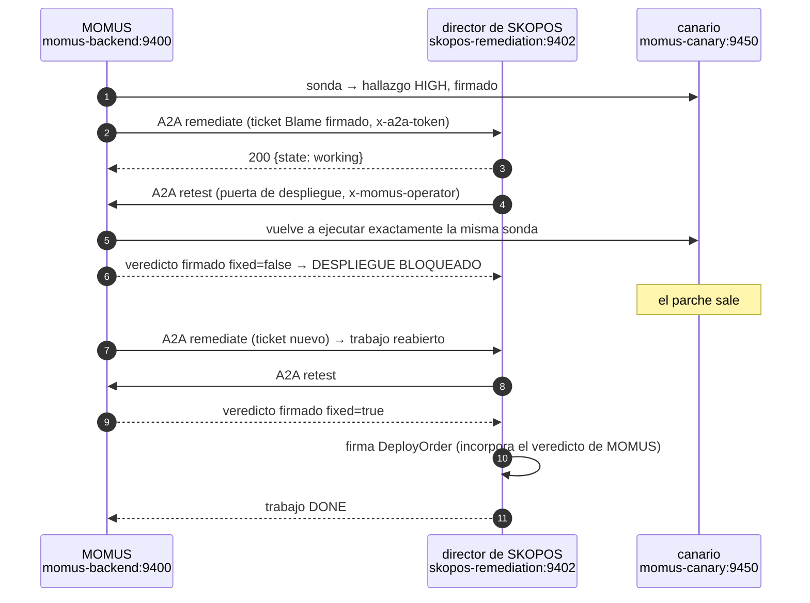
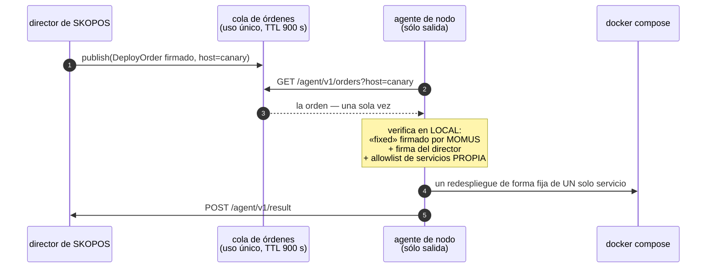

# Bugs que realmente se encontraron y realmente se arreglaron — con la verificación

> 🌐 [English](found-and-fixed.md) · [Русский](found-and-fixed.ru.md) · **Español** · [Français](found-and-fixed.fr.md) · [中文](found-and-fixed.zh.md)

Un equipo rojo que nunca ha pillado nada es una afirmación de marketing. Esta página es el registro
honesto: qué se encontró, con qué se encontró, si la corrección era *necesaria* y si la corrección es
*correcta*. Cada entrada termina con una verificación que se ejecutó, no que se afirmó.

## ⚠️ Hay que ser preciso sobre quién encontró qué

Aquí hubo tres mecanismos distintos que encontraron bugs, y confundirlos exageraría lo que el sistema
es:

| Fuente | Qué encontró | ¿Autónomo? |
|---|---|---|
| **Agentes de auditoría adversaria** (solo lectura, 43 agentes, 39 candidatos → 24 confirmados) | defectos reales en el código de producción de MOMUS/Treasury/SKOPOS | encontrados de forma autónoma, **arreglados por un humano** |
| **Ejecutar la cadena real en producción** | 5 defectos de integración que ningún test cubría | encontrados al ejecutar, arreglados por un humano |
| **Las propias sondas de MOMUS** | violaciones de contrato en el montaje de prueba del [canario](../canary/README.md) | detección totalmente autónoma |

**Esto ya ha ocurrido — 2026-08-27.** La AI-Factory escribió un parche que arregló un defecto real en
un servicio en marcha, la flota lo compiló, MOMUS pasó la compilación por su puerta de despliegue, un
agente de nodo lo publicó y MOMUS confirmó la corrección contra el servicio en vivo: 5 minutos y 2
segundos, sin humano en el bucle. El registro completo, el diff y siete comprobaciones independientes
están en [first-self-heal.es.md](first-self-heal.es.md), incluidos los siete defectos que solo una
ejecución real encontró.

Siguen en pie dos límites, y son la razón por la que la demo no debe leerse como más de lo que es: el
objetivo fue el montaje del [canario](../canary/README.md), y la lista del agente es exactamente ese
único servicio. Un veredicto `fixed` firmado prueba que el hallazgo dejó de reproducirse; no prueba
que el parche sea *bueno*, y por eso existe la rama y la fusión sigue siendo decisión de una persona.
Lo decimos sin rodeos
para que nadie lea en la demo más de lo que ésta se ha ganado.

**MOMUS no encontró ningún bug en los componentes reales del ecosistema.** La familia de oráculos,
GAIA y el hub pasan sus propias comprobaciones de contrato. Los hallazgos vienen del canario, a
propósito.

---

## 1. La puerta del operador se podía eludir por la vía del marketplace

**Encontrado por:** un agente de auditoría, que lo *reprodujo*.

`POST /scan` devolvía correctamente `503` bajo la puerta de producción — mientras que la acción
idéntica sí funcionaba a través de `POST /ai-market/v2/invoke {"capability_id": "momus.scan@v1"}`. Un
manejador de capacidad sólo recibe el diccionario de entrada, nunca la petición, así que la
comprobación a nivel de ruta nunca la veía.

**¿Era necesaria la corrección?** Sí — esto anulaba por completo la puerta de control. Un llamante
anónimo podía hacer que el MOMUS desplegado sondease servicios hermanos en bucle y quemase la clave
compartida de DeepSeek.

**La corrección:** la puerta se movió al límite HTTP, como un middleware que inspecciona el id de la
capacidad y reinyecta el cuerpo de la petición ([`momus/app.py`](../momus/app.py)).

**Verificado en vivo en producción:**

```
POST /scan                                    → 503   (fail-closed, no token)
POST /ai-market/v2/invoke momus.scan@v1       → 503   (was 200 before the fix)
POST /ai-market/v2/invoke momus.findings@v1   → 200   (read-only stays public)
```

---

## 2. Autoescaneo recursivo: una petición se convirtió en ~100 escaneos anidados

**Encontrado por:** un agente de auditoría, reproducido — una sola invocación (invoke) anónima produjo
**101** ejecuciones anidadas de `Scanner.scan` antes de que el limitador de tasa lo cortara, cada una
saliendo por el borde TLS público y escribiendo en SQLite.

**Causa:** el propio manifiesto de MOMUS lista `momus.scan@v1` primero, y las sondas invocan
`tools[0]`. Así que sondear el objetivo que es él mismo hacía que MOMUS escaneara a MOMUS, de forma
recursiva.

**¿Era necesaria la corrección?** Sí — un bucle que se autoamplifica y al que se llega con una única
petición sin autenticar.

**La corrección:** `_safe_tools()` elimina las capacidades de MOMUS que *actúan* de todo lo que una
sonda vaya a invocar ([`momus/targets/oracle.py`](../momus/targets/oracle.py)). Las capacidades
propias de sólo lectura siguen siendo sondeables, así que la autoauditoría continúa funcionando.

**Verificado:** un test de regresión lanza un autoescaneo a través de la aplicación real, con el
objetivo propio apuntando de vuelta a ella, y comprueba que el número de escaneos se queda en **1**
(`tests/test_audit_fixes.py::test_self_scan_does_not_recurse`).

---

## 3. Un veredicto «fixed» sin firma liberaba las partes del reparador y del director

**Encontrado por:** un agente de auditoría.

```python
if key and sig.get("value") and not verify_document_signature(body, sig, key):
    return False, "…"
return True, "MOMUS-signed 'fixed' verdict"
```

La comprobación se saltaba en cuanto *cualquiera* de los dos operandos era falsy. Así que
`{"fixed": true}` sin ninguna firma — o cualquier llamada que omitiera `momus_pubkey` — pagaba al
reparador y al director sin nada detrás.

**¿Era necesaria la corrección?** Sí. Éste es el camino del dinero: el 50 % de cada fondo de
recompensa se podía liberar sin ninguna prueba.

**La corrección:** fail-closed (denegar por defecto) — una clave ausente, una firma ausente o una
verificación fallida retienen la parte, cada una por sí sola
([`momus/economics.py`](../momus/economics.py)).

**Verificado:** `tests/test_audit_fixes.py::test_unsigned_fix_verdict_withholds_the_fixer_share`
comprueba que las tres variantes se niegan.

---

## 4. La clave de deduplicación no era determinista — un mismo bug pagaba en cada reescaneo

**Encontrado por:** un agente de auditoría.

La «identidad del bug» hacía hash del resumen criptográfico (digest) completo de la respuesta, y las
respuestas del objetivo llevan un nonce y una marca de tiempo nuevos en cada llamada. Así que cada
reescaneo producía una clave de deduplicación *nueva* y la guarda contra reenvíos nunca coincidía.
Para colmo, la Treasury se fiaba del `dedup_key` declarado **en el documento que firma el
reclamante** — es decir, la parte a la que se paga elegía su propia identidad de deduplicación.

**¿Era necesaria la corrección?** Sí, por dos motivos a la vez: la guarda no funcionaba, y además se
podía sobrescribir.

**La corrección:** la base son únicamente hechos a nivel de contrato (objetivo, sonda, categoría,
código de estado), y la Treasury la **recalcula** y rechaza cualquier discrepancia con lo declarado.

**Verificado:** `test_dedup_key_is_stable_across_volatile_responses` y
`test_treasury_recomputes_dedup_and_refuses_a_declared_mismatch` — el segundo paga una vez y luego
rechaza tanto un reenvío renombrado como un duplicado honesto.

---

## 5. Las rutas de pago de la Treasury no tenían ninguna autenticación

**Encontrado por:** un agente de auditoría, que *reprodujo* la emisión de una decisión `paid` firmada
por la Treasury desde un proceso sin privilegios en la red Docker compartida.

**¿Era necesaria la corrección?** Sí — éste era el peor de todo el conjunto. Las comprobaciones de
firma demuestran que los documentos son coherentes internamente; no demuestran que el *llamante* tenga
derecho a pedir.

**La corrección:** `/authorize`, `/deposit` y `/explain` exigen un token de cliente (fail-closed en
producción), tienen límite de tasa, y el `scanner_pubkey` del reclamante debe estar en una allowlist
(lista blanca) cuando hay una configurada
([`treasury/treasury/service.py`](https://github.com/alexar76/treasury/blob/main/treasury/service.py)).

**Verificado en vivo:** `GET /health` informa de `write_gated: true` y `registered_scanners: 1` en la
Treasury desplegada.

---

## 6. Un falso positivo: un objetivo inalcanzable se informó como hallazgo HIGH

**Encontrado por:** ejecutar el ciclo real en producción — ningún test lo cubría.

El canario estaba escuchando en `127.0.0.1` *dentro de su propio contenedor*, así que MOMUS no podía
alcanzarlo. MOMUS informó de **HIGH «manifest is unsigned»** — el manifiesto no estaba sin firmar,
nunca se sirvió. Otras dos sondas informaron `no_finding`, es decir «el contrato se cumplió», sobre
comprobaciones que nunca se ejecutaron.

**¿Era necesaria la corrección?** Rotundamente. Las dos direcciones son deshonestas, y un equipo rojo
que da falsas alarmas no vale nada. Ésta es la clase de bug más dañina que MOMUS puede tener.

**La corrección:** `_unreachable()` — toda sonda que dependa del manifiesto devuelve `INCONCLUSIVE`;
un 429 o cualquier código que no sea 2xx tampoco cuenta nunca como aprobado
([oracle.py](../momus/targets/oracle.py), [hub.py](../momus/targets/hub.py),
[injection.py](../momus/targets/injection.py)).

**Verificado:** `test_unreachable_target_is_inconclusive_never_a_finding` comprueba que un objetivo
inalcanzable **no** produce ni un hallazgo **ni** un certificado de buena salud.

---

## 7. Mi propia corrección de seguridad rompió la puerta de despliegue

**Encontrado por:** ejecutar la cadena A2A real en producción.

Poner `/retest` detrás del token de operador (corrección n.º 1) dejó fuera al único llamante que
legítimamente lo necesita: el director de SKOPOS. Cada llamada a la puerta volvía con `403`, el
trabajo lo interpretaba como «inconcluso», reintentaba hasta agotarse y escalaba — por un motivo que
no tenía nada que ver con el código que se estaba probando.

**¿Era necesaria la corrección?** Verificado directamente en producción:

```
POST :9410/retest  without token → 403      ⇒ the conductor genuinely could not use the gate
POST :9410/retest  with token    → 200
```

**La corrección:** el director presenta el token de operador, y `MomusClient` ahora distingue
*denegado* (403/503 — esto lo tiene que arreglar un operador) de *inalcanzable*, así que el mensaje
nombra la causa real en vez de reintentar hasta desembocar en una escalada engañosa.

**¿Es correcta la corrección — debilitó la puerta?** Se comprobó el contrafactual en producción:

```
POST https://momus.modelmarket.dev/retest   → 404   (still refused at the public edge)
POST :9410/retest  anonymous                → 403   (still refused on loopback)
POST :9410/retest  with the operator token  → 200   (only the authorised conductor passes)
```

Sólo pasa el director autenticado. La puerta sigue intacta.

---

## 8. Un trabajo en estado terminal no se podía reabrir nunca después de que aterrizara el parche

**Encontrado por:** ejecutar la cadena A2A real — el trabajo escaló cuando el parche todavía no se
había publicado, y un ticket posterior, *después* de la corrección, no podía reabrirlo.

**¿Era necesaria la corrección?** Sí. Un único fallo transitorio bloqueaba de forma permanente la
posibilidad de remediar ese hallazgo — la misma forma de «problema temporal, daño permanente» que
quemar una identidad de deduplicación en un pago sin liquidar (n.º 4).

**La corrección:** un ticket nuevo para un trabajo en `FAILED`/`ESCALATED` lo reabre con un
presupuesto de intentos nuevo; `DONE` se deja en paz, para que un ticket duplicado nunca repita un
trabajo ya terminado.

**Verificado:** `skopos/tests/test_remediation.py::test_terminal_job_reopens_on_a_new_ticket` y
`::test_done_job_is_not_redone_by_a_duplicate_ticket`.

---

## 9. Un reinicio de MOMUS dejaba todo hallazgo abierto sin poder pasar por la puerta

**Encontrado por:** ejecutar la cadena en vivo a través de un redespliegue.

La puerta de despliegue resolvía los hallazgos a partir de `_findings_by_id` — una caché acotada **en
el propio proceso**. MOMUS tiene un corpus persistente (SQLite, los hallazgos sobreviven a los
reinicios), y la puerta nunca lo consultaba. Así que después de un reinicio — o simplemente cuando
suficientes hallazgos más nuevos expulsaban a uno más antiguo — `/retest` respondía `unknown_finding`
para un bug que seguía abierto.

**¿Era necesaria la corrección?** Sí, y el radio de impacto es mayor de lo que parece: SKOPOS lee una
puerta que no puede responder como «no arreglado», reintenta con la Factory hasta agotar los intentos
y escala. Así que **bastaba con reiniciar MOMUS para bloquear de forma permanente una remediación
real** — la misma forma de «problema transitorio, daño permanente» que en n.º 4 y n.º 8, ahora por
tercera vez. Merece nombrarse como patrón: en cada punto donde este sistema decide algo hay que
preguntarse qué pasa si esa decisión se toma a partir de una caché *vacía*.

**La corrección:** `_recall()` — primero el LRU en memoria, después el corpus persistente, calentando
la caché en el camino de vuelta ([`momus/capabilities.py`](../momus/capabilities.py)). Un error del
corpus devuelve «no encontrado» en lugar de un veredicto.

**Verificado:** `tests/test_audit_fixes.py::test_deploy_gate_survives_a_momus_restart` vacía la
caché — exactamente lo que deja un reinicio — y comprueba que la puerta sigue resolviendo el hallazgo.

---

## 10. Un fallo de fontanería se informó como un veredicto contra el parche

**Encontrado por:** ejecutar la cadena en vivo — esto es lo que sacó a la luz el n.º 9, y es un bug
distinto.

MOMUS responde `200 {"error": "unknown_finding"}`. Ese cuerpo no tiene campo `fixed`, así que el
director lo leyó como falsy y registró:

```
failed | retest not fixed (None):
```

Esa línea tiene tres cosas mal: culpa al parche de un fallo que no es del parche, su resultado es
`None`, y no tiene causa. Después reintentó con la Factory dos veces más — como si escribir más
parches pudiera ayudar a una puerta que no puede ejecutarse — y escaló con ese motivo engañoso.

**¿Era necesaria la corrección?** Sí. Es la misma clase que el n.º 6 (un objetivo inalcanzable
informado como hallazgo): **el sistema afirmando algo que no sabe.** Los informes de un equipo rojo
valen exactamente lo que vale su honestidad.

**La corrección:** dos partes.
- `MomusClient` trata un cuerpo 200 sin un `fixed` booleano como `inconclusive` y nombra la causa real
  ([`clients.py`](https://github.com/alexar76/skopos/blob/main/skopos/remediation/clients.py));
- el director **se detiene** ante una puerta inconclusa en lugar de entrar en bucle: `"deploy gate
  could not run — not a verdict on the fix: …"`. Otro intento de la Factory no puede reparar una
  puerta rota, y quemar el presupuesto de intentos sólo compra una escalada equivocada
  ([`conductor.py`](https://github.com/alexar76/skopos/blob/main/skopos/remediation/conductor.py)).

**Verificado:** `test_gate_error_body_is_inconclusive_not_a_verdict_on_the_fix` y
`test_inconclusive_gate_escalates_immediately_without_burning_attempts` — el segundo comprueba un
intento, una llamada a la puerta, y que ninguna línea del historial diga jamás "not fixed".

---

## El intercambio A2A ocurrió de verdad, por la red

No dentro del mismo proceso, ni con mocks: MOMUS delegó en SKOPOS por HTTP entre dos contenedores, y
el propio observador de SKOPOS registró las dos direcciones.



Las cifras del propio observador en esa ejecución:

```
envelopes: 9   by skill: {remediate: 3, retest: 6}   by peer: {momus: 9}
rejected: 3    avg latency: 29.2 ms

 in  momus  remediate  working    Confirmed high finding on canary — please orchestrate…
out  momus  retest     completed  lat=27ms   gate: fixed=False outcome=finding
out  momus  retest     completed  lat=57ms   gate: fixed=False outcome=finding
```

Y el trabajo que se cerró:

```
DONE | attempts: 1
  · fixing      attempt 1: requesting fix from AI-Factory
  · retesting   asking MOMUS to re-test the patched build
  · deploying   MOMUS confirms fixed; signing deploy order for the node agent
  · verifying   deploy accepted; final in-place MOMUS retest
  · done        fixed, deployed and verified in place
gate fixed: true   deploy order: deploy-mom-5475a33ca38d41fe-1786202196
```

## El agente de nodo reclamó la orden de verdad — y de verdad rechazó una

Los agentes SKOPOS instalados son **solo de push**: se dan de alta, recogen y envían, y ningún host de
la flota expone un puerto entrante. Es una propiedad que vale la pena conservar, así que el director
no llama al agente. **Publica** una orden firmada; el agente la reclama en su siguiente consulta.



Se ejercitaron las dos direcciones en producción, contra las claves reales de producción:

```
=== agent on host 'canary', 'canary' IS on its local allowlist ===
order_id: deploy-mom-a1227001b375450d-1786203354
reason:   chain verified: MOMUS-fixed + conductor-signed + service allowlisted
would_run: docker compose -f …/docker-compose.prod.yml up -d --no-deps --force-recreate canary

=== the same order shape, an agent whose local allowlist is ('hub',) ===
refused: true
reason:  service 'canary' not on this agent's deploy allowlist

=== a second poll for an order already claimed ===
order: null      ⇒ single-use; a replayed poll cannot re-run a deploy
```

El propio observador del director registró al agente como par (peer) en las dos direcciones:

```
by_skill: {deploy-order: 2, deploy-result: 2, remediate: 9, retest: 18}
by_peer:  {agent:canary: 4, momus: 25}

out  agent:canary  deploy-order   order …c43e16fa claimed for canary
 in  agent:canary  deploy-result  refused: service 'canary' not on this agent's deploy allowlist
```

**Lo que el agente deliberadamente no puede hacer.** No puede escribir una corrección, ni elegir otro
servicio, ni inventarse una orden, ni desplegar sin un veredicto `fixed` firmado por MOMUS, para el
que no tiene ninguna clave con la que falsificarlo. La allowlist es **local** — la
guarda el host, no la suministra el llamante — así que un director completamente comprometido sigue
sin poder ampliar aquello que un host tocará, que es exactamente lo que demuestra el rechazo de
arriba. Un *agente* completamente comprometido puede volver a desplegar los servicios de su propia
allowlist y nada más.

La división del trabajo, y por qué el agente es una mano y no un cerebro:

```
AI-Factory escribe  →  MOMUS verifica  →  SKOPOS ordena  →  el agente ejecuta UN comando
```

Un agente capaz de escribir correcciones necesitaría acceso de escritura al código y ejecución
arbitraria en todos los hosts de la flota — el privilegio más peligroso del sistema — y no compraría
nada: un parche escrito in situ no deja ningún artefacto revisable que MOMUS pueda controlar en la
puerta, y N agentes arreglando en local producen N correcciones divergentes sin un único resultado
verificado.

El despliegue en sí es **dry-run** en este host: el agente verificó la cadena e imprimió el comando
exacto en lugar de ejecutarlo. Poner `SKOPOS_AGENT_DRY_RUN=0` es una decisión del operador, no un
valor por defecto — y todavía no hay nada instalado en los hosts de la flota, así que el ejecutor está
demostrado, no desplegado.

## Qué rechaza la entrada A2A

Endurecida antes incluso de desplegarse, porque la auditoría señaló las dos cosas:

- **tareas sin autenticar** → se exige `SKOPOS_A2A_TOKEN`, fail-closed fuera de dry-run;
- **la `route` que un par se declara a sí mismo** → se ignora. La ruta de escalada se vuelve a derivar
  en el servidor a partir del componente, así que un llamante no puede etiquetar como ordinario un
  hallazgo del núcleo de seguridad y colarlo por la vía automática de arreglo→despliegue. Verificado
  por `test_conductor_rederives_route_and_ignores_the_claimed_one`;
- **un ticket no verificable** → la atestación de culpa (Blame) debe verificar con la clave conocida
  de MOMUS, y su `finding_id`/`component` deben coincidir con el ticket;
- **duplicados concurrentes** → un solo trabajo activo por hallazgo, detrás de un cerrojo por
  hallazgo.

## Recuento

| | |
|---|---|
| candidatos de la auditoría → confirmados | 39 → **24** (15 refutados por verificación adversaria) |
| áreas auditadas y halladas sólidas | **30** |
| defectos encontrados ejecutándolo en vivo | **5** (n.º 6, n.º 7, n.º 8, n.º 9, n.º 10) |
| tests | **171** en verde (133 MOMUS + 5 Treasury + 33 SKOPOS) + 15 Foundry |
| tests de regresión escritos para hallazgos de la auditoría | **21** |

La forma que se repite, dicha una sola vez porque costó tres bugs distintos (n.º 4, n.º 8, n.º 9): una
condición **transitoria** — falta de fondos, un intento fallido, una caché vacía después de un
reinicio — nunca debe causar un daño **permanente**. Siempre que este sistema registre que algo está
liquidado, terminado o desconocido, la pregunta que hay que hacerse es qué pasa cuando ese registro se
hace a partir de un estado vacío o momentáneamente equivocado.
