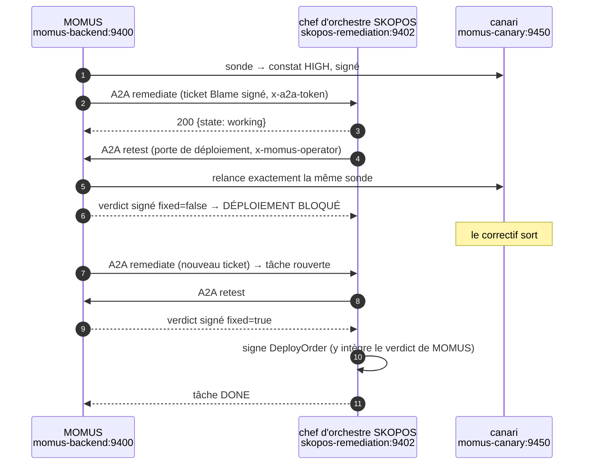
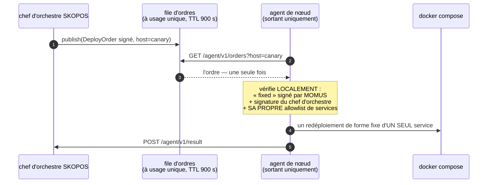

# Des bugs réellement trouvés et réellement corrigés — avec la vérification

> 🌐 [English](found-and-fixed.md) · [Русский](found-and-fixed.ru.md) · [Español](found-and-fixed.es.md) · **Français** · [中文](found-and-fixed.zh.md)

Une équipe rouge qui n'a jamais rien attrapé est une affirmation marketing. Cette page est le registre
honnête : ce qui a été trouvé, par quoi, si la correction était *nécessaire*, et si la correction est
*juste*. Chaque entrée se termine par une vérification qui a été exécutée, et non pas affirmée.

## ⚠️ Soyez précis sur qui a trouvé quoi

Trois mécanismes différents ont trouvé des bugs ici, et les confondre exagérerait ce que fait le
système :

| Source | Ce qu'elle a trouvé | Autonome ? |
|---|---|---|
| **Agents d'audit adversariaux** (lecture seule, 43 agents, 39 candidats → 24 confirmés) | de vrais défauts dans le code de production de MOMUS/Treasury/SKOPOS | trouvés de façon autonome, **corrigés par un humain** |
| **L'exécution de la vraie chaîne en production** | 5 défauts d'intégration qu'aucun test ne couvrait | trouvés par l'exécution, corrigés par un humain |
| **Les sondes propres de MOMUS** | des violations de contrat dans le banc d'essai [canari](../canary/README.md) | détection entièrement autonome |

**Ce qui n'a PAS eu lieu :** l'AI-Factory n'a jamais écrit de façon autonome un correctif qui ait
réparé un vrai bug. Le client de la Factory tourne en dry-run ; l'étape « correction » dans la chaîne
réelle est un basculement du banc d'essai. La *plomberie* de la boucle est réelle et prouvée de bout en
bout — l'*écriture du correctif* n'est pas encore autonome. Dit clairement, pour que personne ne lise
dans la démonstration plus qu'elle ne mérite.

**MOMUS n'a trouvé aucun bug dans les vrais composants de l'écosystème.** La famille d'oracles, GAIA et
le hub passent leurs propres contrôles de contrat. Les constats viennent du canari, à dessein.

---

## 1. La porte d'opérateur était contournable par le chemin de la place de marché

**Trouvé par :** un agent d'audit, qui l'a *reproduit*.

`POST /scan` renvoyait correctement `503` sous la porte de production — alors que l'action identique
réussissait via `POST /ai-market/v2/invoke {"capability_id": "momus.scan@v1"}`. Un gestionnaire de
capacité ne reçoit que le dictionnaire d'entrée, jamais la requête, si bien que le contrôle au niveau
de la route ne l'a jamais vue.

**La correction était-elle nécessaire ?** Oui — cela mettait en échec toute la porte de contrôle. Un
appelant anonyme pouvait faire sonder en boucle les services voisins par le MOMUS déployé et épuiser la
clé DeepSeek partagée.

**La correction :** la porte est passée à la frontière HTTP, sous forme d'un middleware qui inspecte
l'identifiant de capacité et réinjecte le corps de la requête ([`momus/app.py`](../momus/app.py)).

**Vérifié en direct en production :**

```
POST /scan                                    → 503   (fail-closed, sans jeton)
POST /ai-market/v2/invoke momus.scan@v1       → 503   (200 avant la correction)
POST /ai-market/v2/invoke momus.findings@v1   → 200   (la lecture seule reste publique)
```

---

## 2. Auto-analyse récursive : une requête devenait ~100 analyses imbriquées

**Trouvé par :** un agent d'audit, reproduit — une seule invocation anonyme produisait **101**
exécutions imbriquées de `Scanner.scan` avant que le limiteur de débit ne l'interrompe, chacune sortant
par le bord TLS public et écrivant dans SQLite.

**Cause :** le manifeste de MOMUS lui-même liste `momus.scan@v1` en premier, et les sondes invoquent
`tools[0]`. Sonder la cible « soi-même » faisait donc analyser MOMUS par MOMUS, récursivement.

**La correction était-elle nécessaire ?** Oui — une boucle auto-amplifiante atteignable depuis une
seule requête non authentifiée.

**La correction :** `_safe_tools()` retire les capacités « agissantes » de MOMUS de tout ce qu'une sonde
va invoquer ([`momus/targets/oracle.py`](../momus/targets/oracle.py)). Les capacités en lecture seule
restent sondables, de sorte que l'auto-audit fonctionne toujours.

**Vérifié :** un test de régression lance une auto-analyse à travers la véritable application, la cible
« soi-même » pointant vers elle, et affirme que le compte d'analyses reste à **1**
(`tests/test_audit_fixes.py::test_self_scan_does_not_recurse`).

---

## 3. Un verdict « fixed » non signé libérait les parts du réparateur et du chef d'orchestre

**Trouvé par :** un agent d'audit.

```python
if key and sig.get("value") and not verify_document_signature(body, sig, key):
    return False, "…"
return True, "MOMUS-signed 'fixed' verdict"
```

Le contrôle était sauté dès que *l'un ou l'autre* des opérandes était faux. Ainsi `{"fixed": true}`
sans aucune signature — ou tout appel qui omettait `momus_pubkey` — payait le réparateur et le chef
d'orchestre sur rien.

**La correction était-elle nécessaire ?** Oui. C'est le chemin de l'argent : 50 % de chaque cagnotte
était libérable sans preuve.

**La correction :** fail-closed (refus par défaut) — une clé manquante, une signature manquante ou une
vérification échouée retiennent chacune la part ([`momus/economics.py`](../momus/economics.py)).

**Vérifié :** `tests/test_audit_fixes.py::test_unsigned_fix_verdict_withholds_the_fixer_share` affirme
que les trois variantes refusent.

---

## 4. La clé de déduplication n'était pas déterministe — un seul bug payait à chaque nouvelle analyse

**Trouvé par :** un agent d'audit.

L'« identité du bug » hachait l'empreinte (digest) complète de la réponse, et les réponses de la cible
portent un nonce et un horodatage neufs à chaque appel. Chaque nouvelle analyse produisait donc une
*nouvelle* clé de déduplication et la garde anti-rejeu ne correspondait jamais. Pour aggraver les
choses, la Treasury faisait confiance au `dedup_key` déclaré **sur le document que signe le
réclamant** — la partie payée choisissait donc elle-même son identité de déduplication.

**La correction était-elle nécessaire ?** Oui, doublement : la garde ne fonctionnait pas, et elle était
en outre contournable.

**La correction :** la base ne contient que des faits de niveau contrat (cible, sonde, catégorie, code
de statut), et la Treasury la **recalcule** et refuse tout écart déclaré.

**Vérifié :** `test_dedup_key_is_stable_across_volatile_responses` et
`test_treasury_recomputes_dedup_and_refuses_a_declared_mismatch` — le second paie une fois, puis refuse
à la fois une resoumission renommée et un doublon honnête.

---

## 5. Les routes de versement de la Treasury n'avaient aucune authentification

**Trouvé par :** un agent d'audit, qui a *reproduit* la fabrication d'une décision `paid` signée par la
trésorerie depuis un processus non privilégié sur le réseau Docker partagé.

**La correction était-elle nécessaire ?** Oui — c'était le pire du lot. Les contrôles de signature
prouvent que les documents sont cohérents entre eux ; ils ne prouvent pas que l'*appelant* a le droit de
demander.

**La correction :** `/authorize`, `/deposit` et `/explain` exigent un jeton client (fail-closed en
production), sont soumises à une limite de débit, et le `scanner_pubkey` du réclamant doit figurer sur
une allowlist (liste blanche) lorsqu'une allowlist est configurée
([`treasury/treasury/service.py`](../../treasury/treasury/service.py)).

**Vérifié en direct :** `GET /health` rapporte `write_gated: true` et `registered_scanners: 1` sur la
Treasury déployée.

---

## 6. Un faux positif : une cible injoignable rapportée comme constat HIGH

**Trouvé par :** l'exécution du vrai cycle en production — aucun test ne le couvrait.

Le canari était lié à `127.0.0.1` *à l'intérieur de son propre conteneur*, si bien que MOMUS ne pouvait
pas l'atteindre. MOMUS a rapporté **HIGH « le manifeste n'est pas signé »** — le manifeste n'était pas
non signé, il n'a jamais été servi. Deux autres sondes ont rapporté `no_finding`, c'est-à-dire « le
contrat a tenu », à propos de vérifications qui n'ont jamais eu lieu.

**La correction était-elle nécessaire ?** Catégoriquement. Les deux directions sont malhonnêtes, et une
équipe rouge qui crie au loup ne vaut rien. C'est la classe de bug la plus dommageable que MOMUS puisse
avoir.

**La correction :** `_unreachable()` — chaque sonde dépendant du manifeste renvoie `INCONCLUSIVE` ; un
429 ou tout non-2xx n'est de la même façon jamais un succès ([oracle.py](../momus/targets/oracle.py),
[hub.py](../momus/targets/hub.py), [injection.py](../momus/targets/injection.py)).

**Vérifié :** `test_unreachable_target_is_inconclusive_never_a_finding` affirme qu'une cible injoignable
ne produit **ni** un constat **ni** un certificat de bonne santé.

---

## 7. Ma propre correction de sécurité a cassé la porte de déploiement

**Trouvé par :** l'exécution de la vraie chaîne A2A en production.

Placer `/retest` derrière le jeton d'opérateur (correction n° 1) a exclu le seul appelant qui en a
légitimement besoin : le chef d'orchestre de SKOPOS. Chaque appel à la porte revenait en `403`, la tâche
le lisait comme « non concluant », épuisait ses tentatives et escaladait — pour une raison qui n'avait
rien à voir avec le code testé.

**La correction était-elle nécessaire ?** Vérifié directement en production :

```
POST :9410/retest  sans jeton → 403      ⇒ le chef d'orchestre ne pouvait vraiment pas se servir de la porte
POST :9410/retest  avec jeton → 200
```

**La correction :** le chef d'orchestre présente le jeton d'opérateur, et `MomusClient` distingue
désormais *refus* (403/503 — c'est à un opérateur de le corriger) et *injoignable*, de sorte que le
message nomme la vraie cause au lieu de réessayer jusqu'à une escalade trompeuse.

**La correction est-elle juste — a-t-elle affaibli la porte ?** Le contrefactuel a été vérifié en
production :

```
POST https://momus.modelmarket.dev/retest    → 404   (toujours refusé au bord public)
POST :9410/retest  anonyme                   → 403   (toujours refusé sur la loopback)
POST :9410/retest  avec le jeton d'opérateur → 200   (seul le chef d'orchestre autorisé passe)
```

Seul le chef d'orchestre authentifié passe. La porte est intacte.

---

## 8. Une tâche terminale ne pouvait plus être rouverte après l'arrivée du correctif

**Trouvé par :** l'exécution de la vraie chaîne A2A — la tâche a escaladé alors que le correctif n'était
pas encore sorti, et un ticket ultérieur, *après* la correction, ne pouvait pas la rouvrir.

**La correction était-elle nécessaire ?** Oui. Un seul échec transitoire bloquait définitivement toute
remédiation de ce constat — la même forme « problème temporaire, dommage permanent » que le fait de
brûler une identité de déduplication sur un versement non réglé (n° 4).

**La correction :** un nouveau ticket pour une tâche `FAILED`/`ESCALATED` la rouvre avec un budget de
tentatives neuf ; `DONE` n'est pas touché, pour qu'un ticket en doublon ne refasse jamais un travail
achevé.

**Vérifié :** `skopos/tests/test_remediation.py::test_terminal_job_reopens_on_a_new_ticket` et
`::test_done_job_is_not_redone_by_a_duplicate_ticket`.

---

## 9. Un redémarrage de MOMUS rendait tout constat ouvert impossible à soumettre à la porte

**Trouvé par :** l'exécution de la chaîne réelle au travers d'un redéploiement.

La porte de déploiement résolvait les constats depuis `_findings_by_id` — un cache **intra-processus**
borné. MOMUS possède un corpus persistant (SQLite, les constats survivent aux redémarrages), et la porte
ne l'a jamais consulté. Ainsi, après un redémarrage — ou simplement dès qu'assez de constats plus
récents en avaient évincé un plus ancien — `/retest` répondait `unknown_finding` pour un bug qui était
toujours ouvert.

**La correction était-elle nécessaire ?** Oui, et le rayon d'impact est plus large qu'il n'y paraît :
SKOPOS lit une porte incapable de répondre comme un « non corrigé », épuise les tentatives auprès de la
Factory, et escalade. Autrement dit, **redémarrer MOMUS suffisait à bloquer définitivement une véritable
remédiation** — la même forme « problème transitoire, dommage permanent » qu'aux n° 4 et n° 8, pour la
troisième fois maintenant. Cela mérite d'être nommé comme un motif récurrent : partout où ce système
décide quelque chose, il faut se demander ce qui se passe si cette décision est prise depuis un cache
*vide*.

**La correction :** `_recall()` — d'abord le LRU en mémoire, puis le corpus persistant, en réchauffant le
cache au retour ([`momus/capabilities.py`](../momus/capabilities.py)). Une erreur du corpus renvoie
« non trouvé » plutôt qu'un verdict.

**Vérifié :** `tests/test_audit_fixes.py::test_deploy_gate_survives_a_momus_restart` vide le cache —
exactement ce qu'un redémarrage laisse derrière lui — et affirme que la porte résout tout de même le
constat.

---

## 10. Une panne de plomberie rapportée comme un verdict contre le correctif

**Trouvé par :** l'exécution de la chaîne réelle — c'est ce qui a fait remonter le n° 9, et c'est un bug
distinct.

MOMUS répond `200 {"error": "unknown_finding"}`. Ce corps n'a pas de champ `fixed`, si bien que le chef
d'orchestre l'a lu comme faux et a journalisé :

```
failed | retest not fixed (None):
```

Trois choses sont fausses dans cette ligne : elle impute au correctif un échec qui n'est pas le sien,
son outcome vaut `None`, et elle n'indique aucune cause. Ensuite il a relancé la Factory deux fois de
plus — comme si écrire d'autres correctifs pouvait aider une porte incapable de s'exécuter — et a
escaladé sur ce motif trompeur.

**La correction était-elle nécessaire ?** Oui. C'est la même classe que le n° 6 (une cible injoignable
rapportée comme un constat) : **le système affirme quelque chose qu'il ne sait pas.** Les rapports d'une
équipe rouge valent exactement ce que vaut son honnêteté.

**La correction :** en deux parties.
- `MomusClient` traite un corps 200 sans booléen `fixed` comme `inconclusive` et nomme la vraie cause
  ([`clients.py`](../../skopos/skopos/remediation/clients.py)) ;
- le chef d'orchestre **s'arrête** sur une porte non concluante au lieu de boucler : `"deploy gate could
  not run — not a verdict on the fix: …"` (« la porte de déploiement n'a pas pu s'exécuter — ce n'est pas
  un verdict sur la correction : … »). Une tentative de plus auprès de la Factory ne réparera pas une
  porte cassée, et brûler le budget de tentatives n'achète qu'une escalade erronée
  ([`conductor.py`](../../skopos/skopos/remediation/conductor.py)).

**Vérifié :** `test_gate_error_body_is_inconclusive_not_a_verdict_on_the_fix` et
`test_inconclusive_gate_escalates_immediately_without_burning_attempts` — le second affirme une seule
tentative, un seul appel à la porte, et qu'aucune ligne d'historique ne dit jamais « not fixed ».

---

## L'échange A2A a réellement eu lieu, sur le réseau

Pas dans le même processus, pas en simulacre : MOMUS a délégué à SKOPOS par HTTP entre deux conteneurs,
et l'observateur propre à SKOPOS a enregistré les deux directions.



Les chiffres propres de l'observateur pour cette exécution :

```
envelopes: 9   by skill: {remediate: 3, retest: 6}   by peer: {momus: 9}
rejected: 3    avg latency: 29.2 ms

 in  momus  remediate  working    Confirmed high finding on canary — please orchestrate…
out  momus  retest     completed  lat=27ms   gate: fixed=False outcome=finding
out  momus  retest     completed  lat=57ms   gate: fixed=False outcome=finding
```

Et la tâche qui s'est refermée :

```
DONE | attempts: 1
  · fixing      attempt 1: requesting fix from AI-Factory
  · retesting   asking MOMUS to re-test the patched build
  · deploying   MOMUS confirms fixed; signing deploy order for the node agent
  · verifying   deploy accepted; final in-place MOMUS retest
  · done        fixed, deployed and verified in place
gate fixed: true   deploy order: deploy-mom-5475a33ca38d41fe-1786202196
```

## L'agent de nœud a réellement réclamé l'ordre — et en a réellement refusé un

Les agents SKOPOS installés fonctionnent **en push uniquement** : ils s'enrôlent, collectent et
poussent, et aucun hôte de la flotte n'expose de port entrant. C'est une propriété qui vaut d'être
conservée, donc le chef d'orchestre n'appelle pas l'agent. Il **publie** un ordre signé ; l'agent le
réclame lors de sa prochaine interrogation (poll).



Les deux directions ont été exercées en production, contre les véritables clés de production :

```
=== agent on host 'canary', 'canary' IS on its local allowlist ===
order_id: deploy-mom-a1227001b375450d-1786203354
reason:   chain verified: MOMUS-fixed + conductor-signed + service allowlisted
would_run: docker compose -f …/docker-compose.prod.yml up -d --no-deps --force-recreate canary

=== the same order shape, an agent whose local allowlist is ('hub',) ===
refused: true
reason:  service 'canary' not on this agent's deploy allowlist

=== a second poll for an order already claimed ===
order: null      ⇒ à usage unique ; une interrogation rejouée ne peut pas relancer un déploiement
```

L'observateur propre au chef d'orchestre a enregistré l'agent comme pair dans les deux directions :

```
by_skill: {deploy-order: 2, deploy-result: 2, remediate: 9, retest: 18}
by_peer:  {agent:canary: 4, momus: 25}

out  agent:canary  deploy-order   order …c43e16fa claimed for canary
 in  agent:canary  deploy-result  refused: service 'canary' not on this agent's deploy allowlist
```

**Ce que l'agent ne peut délibérément pas faire.** Il ne peut pas écrire une correction, choisir un
autre service, inventer un ordre, ni déployer sans un verdict `fixed` signé par MOMUS, qu'il n'a aucune
clé pour falsifier. L'allowlist (liste blanche) est **locale** — détenue par l'hôte, non fournie par
l'appelant — de sorte qu'un chef d'orchestre entièrement compromis ne peut toujours pas élargir ce à
quoi un hôte touchera, ce que le refus ci-dessus démontre exactement. Un *agent* entièrement compromis
peut redéployer ses propres services autorisés, et rien d'autre.

La division du travail, et pourquoi l'agent est une main plutôt qu'un cerveau :

```
l'AI-Factory écrit  →  MOMUS vérifie  →  SKOPOS ordonne  →  l'agent exécute UNE SEULE commande
```

Un agent capable d'écrire des correctifs aurait besoin d'un accès en écriture au code et d'une exécution
arbitraire sur chaque hôte de la flotte — le privilège le plus dangereux du système — et cela
n'apporterait rien : un correctif écrit sur place ne laisse aucun artefact relisible que MOMUS pourrait
soumettre à la porte, et N agents qui corrigent localement produisent N corrections divergentes sans
aucun résultat vérifié unique.

Le déploiement lui-même est en **dry-run** sur cet hôte : l'agent a vérifié la chaîne et a affiché la
commande exacte au lieu de l'exécuter. Basculer `SKOPOS_AGENT_DRY_RUN=0` est une décision d'opérateur,
pas une valeur par défaut — et rien n'est encore installé sur les hôtes de la flotte : l'exécuteur
restreint est donc prouvé, mais pas livré.

## Ce que l'entrée A2A refuse

Durci avant même d'avoir été déployé, parce que l'audit a signalé les deux :

- **les tâches non authentifiées** → `SKOPOS_A2A_TOKEN` obligatoire, fail-closed hors dry-run ;
- **le `route` auto-déclaré par un pair** → ignoré. La route d'escalade est redérivée côté serveur à
  partir du composant, si bien qu'un appelant ne peut pas étiqueter comme ordinaire un constat portant
  sur le cœur de sécurité et le faire entrer dans le chemin automatique correction→déploiement. Vérifié
  par `test_conductor_rederives_route_and_ignores_the_claimed_one` ;
- **un ticket invérifiable** → l'attestation de responsabilité (Blame) doit se vérifier avec la clé
  connue de MOMUS, et ses `finding_id`/`component` doivent concorder avec le ticket ;
- **les doublons concurrents** → une seule tâche vivante par constat, derrière un verrou par constat.

## Score

| | |
|---|---|
| candidats d'audit → confirmés | 39 → **24** (15 réfutés par la vérification adversariale) |
| domaines audités et jugés sains | **30** |
| défauts trouvés en l'exécutant pour de vrai | **5** (n° 6, n° 7, n° 8, n° 9, n° 10) |
| tests | **171** au vert (133 MOMUS + 5 Treasury + 33 SKOPOS) + 15 Foundry |
| tests de régression écrits pour les constats d'audit | **21** |

La forme récurrente, énoncée une fois parce qu'elle a coûté trois bugs distincts (n° 4, n° 8, n° 9) :
une condition **transitoire** — un manque de fonds, une seule tentative échouée, un cache vide après un
redémarrage — ne doit jamais causer de dommage **permanent**. Chaque fois que ce système enregistre que
quelque chose est réglé, achevé ou inconnu, la question à se poser est : que se passe-t-il si cet
enregistrement est fait depuis un état vide ou momentanément faux ?
