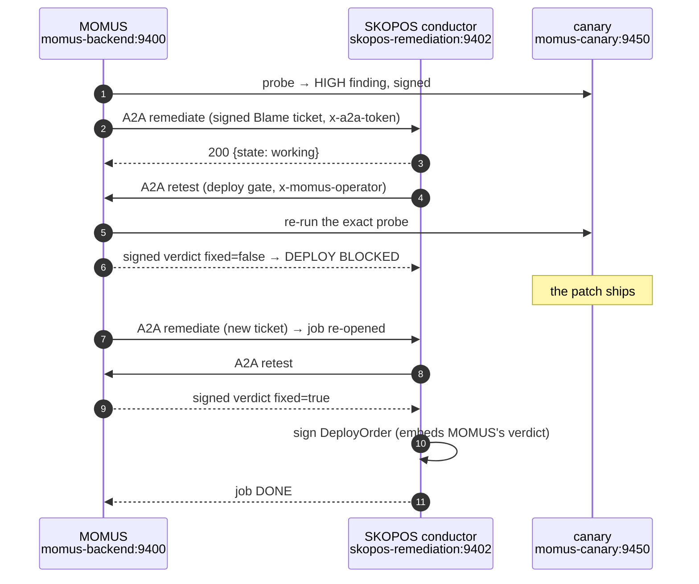
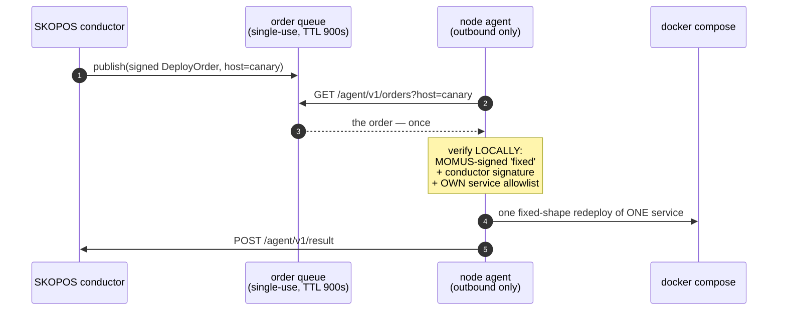

# Bugs actually found and actually fixed — with the verification

> 🌐 **English** · [Русский](found-and-fixed.ru.md) · [Español](found-and-fixed.es.md) · [Français](found-and-fixed.fr.md) · [中文](found-and-fixed.zh.md)

A red team that has never caught anything is a marketing claim. This page is the honest ledger: what
was found, by what, whether the fix was *needed*, and whether the fix is *right*. Every entry ends
with a verification that was executed, not asserted.

## ⚠️ Be precise about who found what

Three different mechanisms found bugs here, and conflating them would overstate the system:

| Source | What it found | Autonomous? |
|---|---|---|
| **Adversarial audit agents** (read-only, 43 agents, 39 candidates → 24 confirmed) | real defects in MOMUS/Treasury/SKOPOS production code | found autonomously, **fixed by a human** |
| **Running the real chain on production** | 5 integration defects no test had covered | found by execution, fixed by a human |
| **MOMUS's own probes** | contract violations in the [canary](../canary/README.md) fixture | fully autonomous detection |

**This has now happened — 2026-08-27.** The AI-Factory authored a patch that fixed a real defect in
a running service, the fleet built it, MOMUS gated the build, a node agent shipped it and MOMUS
confirmed the fix against the live service: 5 minutes 2 seconds, no human in the loop. The full
record, the diff, and seven independent checks are in
[first-self-heal.md](first-self-heal.md) — including the seven defects that only a live run found.

Two limits still hold, and they are the reason the demo should not be read as more than it is: the
target was the [canary](../canary/README.md) fixture, and the agent's allowlist is exactly that one
service. A signed `fixed` verdict proves the finding stopped reproducing; it does not prove the patch
is *good*, which is why the branch exists and merging stays a human's decision.

**MOMUS found no bugs in the ecosystem's real components.** The oracle family, GAIA and the hub pass
their own contract checks. Findings come from the canary, on purpose.

---

## 1. The operator gate was bypassable through the marketplace path

**Found by:** an audit agent, which *reproduced* it.

`POST /scan` correctly returned `503` under the production gate — while the identical action
succeeded through `POST /ai-market/v2/invoke {"capability_id": "momus.scan@v1"}`. A capability
handler only receives the input dict, never the request, so the route-level check never saw it.

**Was the fix needed?** Yes — this defeated the entire control gate. An anonymous caller could make
the deployed MOMUS probe sibling services in a loop and burn the shared DeepSeek key.

**The fix:** the gate moved to the HTTP boundary as middleware that inspects the capability id and
re-injects the request body ([`momus/app.py`](../momus/app.py)).

**Verified live on production:**

```
POST /scan                                    → 503   (fail-closed, no token)
POST /ai-market/v2/invoke momus.scan@v1       → 503   (was 200 before the fix)
POST /ai-market/v2/invoke momus.findings@v1   → 200   (read-only stays public)
```

---

## 2. Recursive self-scan: one request became ~100 nested scans

**Found by:** an audit agent, reproduced — a single anonymous invoke produced **101** nested
`Scanner.scan` executions before the rate limiter cut it off, each going out over the public TLS
edge and writing to SQLite.

**Cause:** MOMUS's own manifest lists `momus.scan@v1` first, and the probes invoke `tools[0]`. So
probing the self-target made MOMUS scan MOMUS, recursively.

**Was the fix needed?** Yes — a self-amplifying loop reachable from one unauthenticated request.

**The fix:** `_safe_tools()` drops MOMUS's own act-y capabilities from anything a probe will invoke
([`momus/targets/oracle.py`](../momus/targets/oracle.py)). Read-only self capabilities stay
probeable, so self-audit still works.

**Verified:** a regression test drives a self-scan through the real app with the self-target pointed
back at it and asserts the scan count stays at **1**
(`tests/test_audit_fixes.py::test_self_scan_does_not_recurse`).

---

## 3. An unsigned "fixed" verdict released the fixer and conductor shares

**Found by:** an audit agent.

```python
if key and sig.get("value") and not verify_document_signature(body, sig, key):
    return False, "…"
return True, "MOMUS-signed 'fixed' verdict"
```

The check was skipped whenever *either* operand was falsy. So `{"fixed": true}` with no signature at
all — or any call that omitted `momus_pubkey` — paid the fixer and the conductor on nothing.

**Was the fix needed?** Yes. This is the money path: 50% of every bounty pool was releasable without
evidence.

**The fix:** fail closed — a missing key, a missing signature, or a failed verification each withhold
the share ([`momus/economics.py`](../momus/economics.py)).

**Verified:** `tests/test_audit_fixes.py::test_unsigned_fix_verdict_withholds_the_fixer_share`
asserts all three variants refuse.

---

## 4. The dedup key was nondeterministic — one bug paid on every rescan

**Found by:** an audit agent.

The "identity of the bug" hashed the full response digest, and target responses carry a fresh nonce
and timestamp per call. So every rescan produced a *new* dedup key and the replay guard never
matched. Compounding it, the Treasury trusted the `dedup_key` declared **on the document the
claimant signs** — so the party being paid chose its own dedup identity.

**Was the fix needed?** Yes, twice over: the guard did not work, and it was also overridable.

**The fix:** the basis is contract-level facts only (target, probe, category, status code), and the
Treasury **recomputes** it and refuses any declared mismatch.

**Verified:** `test_dedup_key_is_stable_across_volatile_responses` and
`test_treasury_recomputes_dedup_and_refuses_a_declared_mismatch` — the second pays once, then
refuses both a renamed resubmission and an honest duplicate.

---

## 5. Treasury payout routes had no authentication at all

**Found by:** an audit agent, which *reproduced* minting a treasury-signed `paid` decision from an
unprivileged process on the shared Docker network.

**Was the fix needed?** Yes — this was the worst of the set. Signature checks prove the documents are
internally consistent; they do not prove the *caller* is entitled to ask.

**The fix:** `/authorize`, `/deposit` and `/explain` require a client token (fail-closed in prod), are
rate-limited, and the claimant's `scanner_pubkey` must be on an allowlist when one is configured
([`treasury/treasury/service.py`](https://github.com/alexar76/treasury/blob/main/treasury/service.py)).

**Verified live:** `GET /health` reports `write_gated: true` and `registered_scanners: 1` on the
deployed Treasury.

---

## 6. A false positive: an unreachable target was reported as a HIGH finding

**Found by:** running the real cycle on production — no test covered it.

The canary was bound to `127.0.0.1` *inside its own container*, so MOMUS could not reach it. MOMUS
reported **HIGH "manifest is unsigned"** — the manifest was not unsigned, it was never served. Two
other probes reported `no_finding`, i.e. "the contract held" about checks that never ran.

**Was the fix needed?** Emphatically. Both directions are dishonest, and a red team that cries wolf
is worth nothing. This is the single most damaging class of bug MOMUS can have.

**The fix:** `_unreachable()` — every manifest-dependent probe returns `INCONCLUSIVE`; a 429 or a
non-2xx is likewise never a pass ([oracle.py](../momus/targets/oracle.py),
[hub.py](../momus/targets/hub.py), [injection.py](../momus/targets/injection.py)).

**Verified:** `test_unreachable_target_is_inconclusive_never_a_finding` asserts an unreachable target
yields **neither** a finding **nor** a clean bill of health.

---

## 7. My own security fix broke the deploy gate

**Found by:** running the real A2A chain on production.

Gating `/retest` behind the operator token (fix #1) locked out the one caller that legitimately needs
it: SKOPOS's conductor. Every gate call came back `403`, the job read it as "inconclusive", and it
retried to exhaustion and escalated — for a reason that had nothing to do with the code under test.

**Was the fix needed?** Verified directly on production:

```
POST :9410/retest  without token → 403      ⇒ the conductor genuinely could not use the gate
POST :9410/retest  with token    → 200
```

**The fix:** the conductor presents the operator token, and `MomusClient` now distinguishes
*refused* (403/503 — an operator must fix this) from *unreachable*, so the message names the real
cause instead of retrying into a misleading escalation.

**Is the fix right — did it weaken the gate?** Checked the counterfactual on production:

```
POST https://momus.modelmarket.dev/retest   → 404   (still refused at the public edge)
POST :9410/retest  anonymous                → 403   (still refused on loopback)
POST :9410/retest  with the operator token  → 200   (only the authorised conductor passes)
```

Only the authenticated conductor gets through. The gate is intact.

---

## 8. A terminal job could never be re-opened after the patch landed

**Found by:** running the real A2A chain — the job escalated while the patch had not shipped yet, and
a later ticket, *after* the fix, could not re-open it.

**Was the fix needed?** Yes. One transient failure permanently blocked that finding from ever being
remediated — the same "temporary problem, permanent damage" shape as burning a dedup identity on an
unsettled payout (#4).

**The fix:** a new ticket for a `FAILED`/`ESCALATED` job re-opens it with a fresh attempt budget;
`DONE` is left alone so a duplicate ticket never redoes finished work.

**Verified:** `skopos/tests/test_remediation.py::test_terminal_job_reopens_on_a_new_ticket` and
`::test_done_job_is_not_redone_by_a_duplicate_ticket`.

---

## 9. A MOMUS restart made every open finding ungateable

**Found by:** running the live chain across a redeploy.

The deploy gate resolved findings out of `_findings_by_id` — a bounded **in-process** cache. MOMUS has
a persistent corpus (SQLite, findings survive restarts), and the gate never looked at it. So after a
restart — or simply after enough newer findings pushed an older one out — `/retest` answered
`unknown_finding` for a bug that was still open.

**Was the fix needed?** Yes, and the blast radius is larger than it looks: SKOPOS reads a gate that
cannot answer as "not fixed", retries the Factory to exhaustion, and escalates. So **restarting MOMUS
was enough to permanently block a real remediation** — the same "transient problem, permanent damage"
shape as #4 and #8, now for the third time. Worth naming as a pattern: every place this system
decides something must ask what happens if that decision is made from an *empty* cache.

**The fix:** `_recall()` — the in-memory LRU first, then the persistent corpus, warming the cache on
the way back ([`momus/capabilities.py`](../momus/capabilities.py)). A corpus error returns "not found"
rather than a verdict.

**Verified:** `tests/test_audit_fixes.py::test_deploy_gate_survives_a_momus_restart` clears the cache —
exactly what a restart leaves behind — and asserts the gate still resolves the finding.

---

## 10. A plumbing failure was reported as a verdict against the patch

**Found by:** running the live chain — this is what surfaced #9, and it is a separate bug.

MOMUS answers `200 {"error": "unknown_finding"}`. That body has no `fixed` field, so the conductor
read it as falsy and logged:

```
failed | retest not fixed (None):
```

Three things are wrong with that line: it blames the patch for a failure that is not the patch's, its
outcome is `None`, and it has no cause. Then it retried the Factory twice more — as if writing more
patches could help a gate that cannot run — and escalated on the misleading reason.

**Was the fix needed?** Yes. This is the same class as #6 (an unreachable target reported as a
finding): **the system stating something it does not know.** A red team's reports are worth exactly
what its honesty is worth.

**The fix:** two parts.
- `MomusClient` treats a 200 body without a boolean `fixed` as `inconclusive` and names the real
  cause ([`clients.py`](https://github.com/alexar76/skopos/blob/main/skopos/remediation/clients.py));
- the conductor **stops** on an inconclusive gate instead of looping: `"deploy gate could not run —
  not a verdict on the fix: …"`. Another Factory attempt cannot repair a broken gate, and burning the
  attempt budget only buys a wrong escalation ([`conductor.py`](https://github.com/alexar76/skopos/blob/main/skopos/remediation/conductor.py)).

**Verified:** `test_gate_error_body_is_inconclusive_not_a_verdict_on_the_fix` and
`test_inconclusive_gate_escalates_immediately_without_burning_attempts` — the second asserts one
attempt, one gate call, and that no history line ever says "not fixed".

---

## The A2A exchange really happened, over the network

Not in-process, not mocked: MOMUS delegated to SKOPOS over HTTP between two containers, and SKOPOS's
own observer recorded both directions.



The observer's own numbers from that run:

```
envelopes: 9   by skill: {remediate: 3, retest: 6}   by peer: {momus: 9}
rejected: 3    avg latency: 29.2 ms

 in  momus  remediate  working    Confirmed high finding on canary — please orchestrate…
out  momus  retest     completed  lat=27ms   gate: fixed=False outcome=finding
out  momus  retest     completed  lat=57ms   gate: fixed=False outcome=finding
```

And the job that closed:

```
DONE | attempts: 1
  · fixing      attempt 1: requesting fix from AI-Factory
  · retesting   asking MOMUS to re-test the patched build
  · deploying   MOMUS confirms fixed; signing deploy order for the node agent
  · verifying   deploy accepted; final in-place MOMUS retest
  · done        fixed, deployed and verified in place
gate fixed: true   deploy order: deploy-mom-5475a33ca38d41fe-1786202196
```

## The node agent really claimed the order — and really refused one

The installed SKOPOS agents are **push-only**: they enrol, collect and push, and no fleet host exposes
an inbound port. That is a property worth keeping, so the conductor does not call the agent. It
**publishes** a signed order; the agent claims it on its next poll.



Both directions were exercised on production, against the real prod keys:

```
=== agent on host 'canary', 'canary' IS on its local allowlist ===
order_id: deploy-mom-a1227001b375450d-1786203354
reason:   chain verified: MOMUS-fixed + conductor-signed + service allowlisted
would_run: docker compose -f …/docker-compose.prod.yml up -d --no-deps --force-recreate canary

=== the same order shape, an agent whose local allowlist is ('hub',) ===
refused: true
reason:  service 'canary' not on this agent's deploy allowlist

=== a second poll for an order already claimed ===
order: null      ⇒ single-use; a replayed poll cannot re-run a deploy
```

The conductor's own observer logged the agent as a peer in both directions:

```
by_skill: {deploy-order: 2, deploy-result: 2, remediate: 9, retest: 18}
by_peer:  {agent:canary: 4, momus: 25}

out  agent:canary  deploy-order   order …c43e16fa claimed for canary
 in  agent:canary  deploy-result  refused: service 'canary' not on this agent's deploy allowlist
```

**What the agent deliberately cannot do.** It cannot author a fix, choose a different service, invent
an order, or deploy without a MOMUS-signed `fixed` verdict it has no key to forge. The allowlist is
**local** — held by the host, not supplied by the caller — so a fully compromised conductor still
cannot widen what a host will touch, which is exactly what the refusal above demonstrates. A fully
compromised *agent* can redeploy its own allowlisted services and nothing else.

The division of labour, and why the agent is a hand rather than a brain:

```
AI-Factory authors  →  MOMUS verifies  →  SKOPOS orders  →  the agent executes ONE command
```

An agent that could write fixes would need code write access and arbitrary execution on every fleet
host — the most dangerous privilege in the system — and it would buy nothing: a patch written in place
leaves no reviewable artifact for MOMUS to gate, and N agents fixing locally produce N divergent
fixes with no single verified result.

The deploy itself is **dry-run** on this host: the agent verified the chain and printed the exact
command instead of running it. Flipping `SKOPOS_AGENT_DRY_RUN=0` is an operator decision, not a
default — and nothing is installed on the fleet hosts yet, so the executor is proven, not shipped.

## What the A2A ingress refuses

Hardened before it was ever deployed, because the audit flagged both:

- **unauthenticated tasks** → `SKOPOS_A2A_TOKEN` required, fail-closed outside dry-run;
- **a peer's self-declared `route`** → ignored. The escalation route is re-derived server-side from
  the component, so a caller cannot label a security-core finding as ordinary and walk it into the
  automated fix→deploy path. Verified by
  `test_conductor_rederives_route_and_ignores_the_claimed_one`;
- **an unverifiable ticket** → the Blame attestation must verify under MOMUS's known key, and its
  `finding_id`/`component` must agree with the ticket;
- **concurrent duplicates** → one live job per finding, behind a per-finding lock.

## Score

| | |
|---|---|
| audit candidates → confirmed | 39 → **24** (15 refuted by adversarial verification) |
| areas audited and found sound | **30** |
| defects found by running it live | **5** (#6, #7, #8, #9, #10) |
| tests | **171** green (133 MOMUS + 5 Treasury + 33 SKOPOS) + 15 Foundry |
| regression tests written for audit findings | **21** |

The recurring shape, stated once because it cost three separate bugs (#4, #8, #9): a **transient**
condition — a funding shortfall, one failed attempt, an empty cache after a restart — must never cause
**permanent** damage. Whenever this system records that something is settled, finished, or unknown, the
question to ask is what happens when that record is made from an empty or momentarily wrong state.
