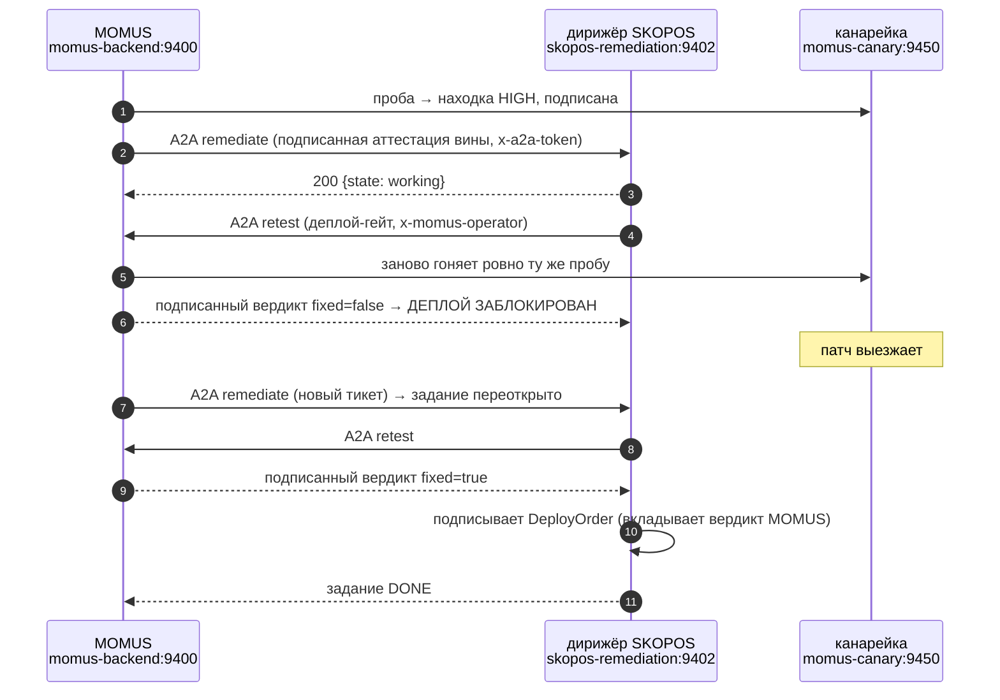
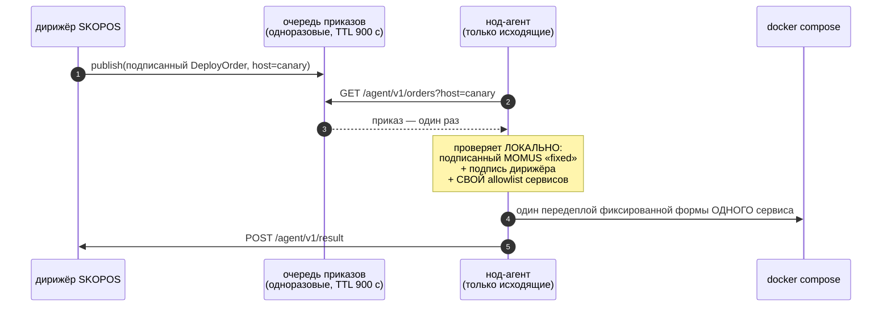

# Баги, которые реально нашли и реально починили — с проверкой

> 🌐 [English](found-and-fixed.md) · **Русский** · [Español](found-and-fixed.es.md) · [Français](found-and-fixed.fr.md) · [中文](found-and-fixed.zh.md)

Красная команда, которая никогда никого не поймала, — это маркетинговое заявление. Эта страница —
честный реестр: что нашли, чем нашли, была ли правка *нужна* и *верна* ли она. Каждая запись
заканчивается проверкой, которую выполнили, а не объявили.

## ⚠️ Точно о том, кто что нашёл

Баги здесь нашли три разных механизма, и смешивать их значило бы приукрасить систему:

| Источник | Что нашёл | Автономно? |
|---|---|---|
| **Агенты состязательного аудита** (только чтение, 43 агента, 39 кандидатов → 24 подтверждено) | настоящие дефекты в продовом коде MOMUS/Treasury/SKOPOS | нашли автономно, **починил человек** |
| **Прогон настоящей цепочки на проде** | 5 интеграционных дефектов, не покрытых ни одним тестом | найдены исполнением, починены человеком |
| **Собственные пробы MOMUS** | нарушения контракта в фикстуре-[канарейке](../canary/README.md) | полностью автономное обнаружение |

**Теперь это произошло — 27.08.2026.** AI-фабрика написала патч, который починил настоящий дефект в
работающем сервисе, парк собрал его, MOMUS пропустил сборку через гейт, нод-агент её задеплоил, а
MOMUS подтвердил починку на живом сервисе: 5 минут 2 секунды, без человека в цикле. Полный разбор,
дифф и семь независимых проверок — в [first-self-heal.ru.md](first-self-heal.ru.md), включая семь
дефектов, которые нашёл только живой прогон.

Два ограничения остаются в силе, и именно из-за них демо не стоит читать шире, чем оно есть: целью
была фикстура [канарейки](../canary/README.md), а allowlist агента — ровно этот один сервис.
Подписанный вердикт `fixed` доказывает, что находка перестала воспроизводиться; он не доказывает, что
патч *хороший* — поэтому ветка и существует, а мерж остаётся решением человека.

**В настоящих компонентах экосистемы MOMUS багов не нашёл.** Семейство оракулов, GAIA и хаб проходят
свои контрактные проверки. Находки приходят с канарейки — так и задумано.

---

## 1. Операторский гейт обходился через маркетплейсный путь

**Кто нашёл:** агент аудита, который его *воспроизвёл*.

`POST /scan` под продовым гейтом корректно отдавал `503` — а идентичное действие проходило через
`POST /ai-market/v2/invoke {"capability_id": "momus.scan@v1"}`. Обработчик capability получает только
входной словарь и никогда сам запрос, поэтому проверка на уровне маршрута его не видела.

**Была ли правка нужна?** Да — это сводило на нет весь контрольный гейт. Анонимный вызывающий мог
заставить развёрнутый MOMUS в цикле щупать соседние сервисы и сжигать общий ключ DeepSeek.

**Правка:** гейт переехал на HTTP-границу как middleware, которое смотрит на id capability и заново
подсовывает тело запроса ([`momus/app.py`](../momus/app.py)).

**Проверено живьём на проде:**

```
POST /scan                                    → 503   (fail-closed, без токена)
POST /ai-market/v2/invoke momus.scan@v1       → 503   (до правки было 200)
POST /ai-market/v2/invoke momus.findings@v1   → 200   (только чтение остаётся публичным)
```

---

## 2. Рекурсивный самоскан: один запрос превращался в ~100 вложенных сканов

**Кто нашёл:** агент аудита, воспроизведено — один анонимный invoke породил **101** вложенное
исполнение `Scanner.scan` прежде, чем его срезал рейт-лимитер; каждое уходило через публичный
TLS-край и писало в SQLite.

**Причина:** в собственном манифесте MOMUS первым идёт `momus.scan@v1`, а пробы вызывают `tools[0]`.
Так что проба по self-цели заставляла MOMUS сканировать MOMUS, рекурсивно.

**Была ли правка нужна?** Да — самоусиливающийся цикл, достижимый одним неаутентифицированным
запросом.

**Правка:** `_safe_tools()` выбрасывает собственные «действующие» capability MOMUS из всего, что будет
вызывать проба ([`momus/targets/oracle.py`](../momus/targets/oracle.py)). Read-only self-capability
остаются щупаемыми, поэтому самоаудит по-прежнему работает.

**Проверено:** регрессионный тест гоняет самоскан через настоящее приложение с self-целью,
направленной на него же, и утверждает, что счётчик сканов остаётся **1**
(`tests/test_audit_fixes.py::test_self_scan_does_not_recurse`).

---

## 3. Неподписанный вердикт «fixed» освобождал доли фиксера и дирижёра

**Кто нашёл:** агент аудита.

```python
if key and sig.get("value") and not verify_document_signature(body, sig, key):
    return False, "…"
return True, "MOMUS-signed 'fixed' verdict"
```

Проверка пропускалась всякий раз, когда *любой* из операндов был ложным. То есть `{"fixed": true}`
вообще без подписи — или любой вызов, опустивший `momus_pubkey`, — платил фиксеру и дирижёру ни за
что.

**Была ли правка нужна?** Да. Это денежный путь: 50% каждого призового пула освобождались без
доказательств.

**Правка:** fail-closed (отказ по умолчанию) — отсутствующий ключ, отсутствующая подпись или провалившаяся проверка
по отдельности удерживают долю ([`momus/economics.py`](../momus/economics.py)).

**Проверено:** `tests/test_audit_fixes.py::test_unsigned_fix_verdict_withholds_the_fixer_share`
утверждает, что все три варианта получают отказ.

---

## 4. Ключ дедупликации был недетерминирован — за один баг платили при каждом перескане

**Кто нашёл:** агент аудита.

«Личность бага» хешировала полный дайджест ответа, а ответы целей несут свежий nonce и метку времени
на каждый вызов. Поэтому каждый перескан давал *новый* dedup-ключ, и защита от повторов никогда не
срабатывала. Хуже того, Treasury доверял `dedup_key`, объявленному **в документе, который подписывает
заявитель**, — то есть сторона, которой платят, выбирала себе dedup-личность сама.

**Была ли правка нужна?** Да, дважды: защита не работала и её же можно было переопределить.

**Правка:** основа ключа — только факты уровня контракта (цель, проба, категория, код статуса), а
Treasury **пересчитывает** его и отказывает при расхождении с объявленным.

**Проверено:** `test_dedup_key_is_stable_across_volatile_responses` и
`test_treasury_recomputes_dedup_and_refuses_a_declared_mismatch` — второй платит один раз, а затем
отказывает и переименованной повторной заявке, и честному дублю.

---

## 5. У платёжных маршрутов Treasury вообще не было аутентификации

**Кто нашёл:** агент аудита, который *воспроизвёл* выпуск подписанного Treasury решения `paid` из
непривилегированного процесса в общей docker-сети.

**Была ли правка нужна?** Да — худшее из набора. Проверки подписей доказывают, что документы
внутренне согласованы; они не доказывают, что *вызывающий* вправе просить.

**Правка:** `/authorize`, `/deposit` и `/explain` требуют клиентский токен (fail-closed на проде),
ограничены по частоте, а `scanner_pubkey` заявителя должен быть в allowlist, когда тот настроен
([`treasury/treasury/service.py`](https://github.com/alexar76/treasury/blob/main/treasury/service.py)).

**Проверено живьём:** `GET /health` на развёрнутом Treasury сообщает `write_gated: true` и
`registered_scanners: 1`.

---

## 6. Ложное срабатывание: недостижимая цель отчиталась как находка HIGH

**Кто нашёл:** прогон настоящего цикла на проде — ни один тест этого не покрывал.

Канарейка была привязана к `127.0.0.1` *внутри собственного контейнера*, поэтому MOMUS не мог до неё
дотянуться. MOMUS отчитался **HIGH «манифест не подписан»** — манифест не был неподписанным, его
вообще никогда не отдали. Ещё две пробы отчитались `no_finding`, то есть «контракт держался» про
проверки, которые не выполнялись.

**Была ли правка нужна?** Категорически. Оба направления — ложь, а красная команда, которая кричит
«волки», не стоит ничего. Это самый разрушительный класс багов, какой у MOMUS может быть.

**Правка:** `_unreachable()` — каждая зависящая от манифеста проба возвращает `INCONCLUSIVE` (неопределённо — ни находка, ни прохождение); 429 или
любой не-2xx точно так же никогда не считается прохождением ([oracle.py](../momus/targets/oracle.py),
[hub.py](../momus/targets/hub.py), [injection.py](../momus/targets/injection.py)).

**Проверено:** `test_unreachable_target_is_inconclusive_never_a_finding` утверждает, что недостижимая
цель не даёт **ни** находки, **ни** справки о здоровье.

---

## 7. Моя собственная правка безопасности сломала деплой-гейт

**Кто нашёл:** прогон настоящей A2A-цепочки на проде.

Закрытие `/retest` операторским токеном (правка №1) отрезало единственного вызывающего, которому он
законно нужен: дирижёра SKOPOS. Каждый вызов гейта возвращал `403`, задание читало это как
«неопределённо», исчерпывало попытки и эскалировало — по причине, никак не связанной с проверяемым
кодом.

**Была ли правка нужна?** Проверено прямо на проде:

```
POST :9410/retest  без токена → 403      ⇒ дирижёр действительно не мог пользоваться гейтом
POST :9410/retest  с токеном  → 200
```

**Правка:** дирижёр предъявляет операторский токен, а `MomusClient` теперь различает *отказ*
(403/503 — это должен исправить оператор) и *недостижимость*, так что сообщение называет настоящую
причину вместо повторов до обманчивой эскалации.

**Верна ли правка — не ослабила ли она гейт?** Контрфакт проверен на проде:

```
POST https://momus.modelmarket.dev/retest   → 404   (по-прежнему отказ на публичном краю)
POST :9410/retest  анонимно                 → 403   (по-прежнему отказ на loopback)
POST :9410/retest  с операторским токеном   → 200   (проходит только уполномоченный дирижёр)
```

Проходит только аутентифицированный дирижёр. Гейт целостен.

---

## 8. Терминальное задание нельзя было переоткрыть после того, как патч приехал

**Кто нашёл:** прогон настоящей A2A-цепочки — задание эскалировало, когда патч ещё не выехал, а более
поздний тикет, уже *после* правки, не мог его переоткрыть.

**Была ли правка нужна?** Да. Один транзиентный сбой навсегда блокировал эту находку от исправления —
та же форма «временная проблема, постоянный ущерб», что и сжигание dedup-личности на неоплаченной
выплате (№4).

**Правка:** новый тикет для задания в состоянии `FAILED`/`ESCALATED` переоткрывает его со свежим
бюджетом попыток; `DONE` не трогается, чтобы дублирующий тикет не переделывал завершённую работу.

**Проверено:** `skopos/tests/test_remediation.py::test_terminal_job_reopens_on_a_new_ticket` и
`::test_done_job_is_not_redone_by_a_duplicate_ticket`.

---

## 9. Перезапуск MOMUS делал любую открытую находку негейтируемой

**Кто нашёл:** прогон живой цепочки через передеплой.

Деплой-гейт находил находки в `_findings_by_id` — ограниченном **внутрипроцессном** кэше. У MOMUS есть
персистентный корпус (SQLite, находки переживают перезапуск), и гейт в него никогда не смотрел.
Поэтому после перезапуска — или просто когда достаточное количество более новых находок вытеснит
старую — `/retest` отвечал `unknown_finding` про баг, который всё ещё открыт.

**Была ли правка нужна?** Да, и радиус поражения больше, чем кажется: SKOPOS читает неспособный
ответить гейт как «не пофикшено», исчерпывает попытки фабрики и эскалирует. То есть **перезапуска
MOMUS было достаточно, чтобы навсегда заблокировать настоящее исправление** — та же форма
«транзиентная проблема, постоянный ущерб», что и в №4 и №8, уже в третий раз. Стоит назвать это
закономерностью: в каждом месте, где система что-то решает, надо спрашивать, что будет, если решение
принимается из *пустого* кэша.

**Правка:** `_recall()` — сначала LRU в памяти, потом персистентный корпус, с прогревом кэша по пути
обратно ([`momus/capabilities.py`](../momus/capabilities.py)). Ошибка корпуса возвращает «не найдено»,
а не вердикт.

**Проверено:** `tests/test_audit_fixes.py::test_deploy_gate_survives_a_momus_restart` очищает кэш —
ровно то, что оставляет после себя перезапуск — и утверждает, что гейт всё равно находит находку.

---

## 10. Сбой обвязки отчитывался как вердикт против патча

**Кто нашёл:** прогон живой цепочки — именно это вскрыло №9, и это отдельный баг.

MOMUS отвечает `200 {"error": "unknown_finding"}`. В этом теле нет поля `fixed`, поэтому дирижёр читал
его как ложное и писал в журнал:

```
failed | retest not fixed (None):
```

В этой строке неверно три вещи: она винит патч в сбое, к которому патч не имеет отношения, её outcome
равен `None`, и в ней нет причины. Дальше дирижёр ещё дважды дёргал фабрику — как будто написание
новых патчей может помочь гейту, который не в состоянии запуститься, — и эскалировал по обманчивой
причине.

**Была ли правка нужна?** Да. Это тот же класс, что и №6 (недостижимая цель, отчитанная как находка):
**система утверждает то, чего не знает.** Отчёты красной команды стоят ровно столько, сколько стоит
её честность.

**Правка:** две части.
- `MomusClient` считает тело 200 без булева `fixed` результатом `inconclusive` и называет настоящую
  причину ([`clients.py`](https://github.com/alexar76/skopos/blob/main/skopos/remediation/clients.py));
- дирижёр **останавливается** на неопределённом гейте вместо цикла: `«деплой-гейт не смог
  запуститься — это не вердикт о правке: …»`. Ещё одна попытка фабрики не отремонтирует сломанный
  гейт, а сожжённый бюджет попыток покупает только неверную эскалацию
  ([`conductor.py`](https://github.com/alexar76/skopos/blob/main/skopos/remediation/conductor.py)).

**Проверено:** `test_gate_error_body_is_inconclusive_not_a_verdict_on_the_fix` и
`test_inconclusive_gate_escalates_immediately_without_burning_attempts` — второй утверждает одну
попытку, один вызов гейта и что ни одна строка истории никогда не говорит «not fixed».

---

## Обмен по A2A действительно состоялся, по сети

Не внутри процесса и не в моках: MOMUS делегировал SKOPOS по HTTP между двумя контейнерами, и
собственный наблюдатель SKOPOS записал оба направления.



Собственные числа наблюдателя из того прогона:

```
envelopes: 9   by skill: {remediate: 3, retest: 6}   by peer: {momus: 9}
rejected: 3    avg latency: 29.2 ms

 in  momus  remediate  working    Confirmed high finding on canary — please orchestrate…
out  momus  retest     completed  lat=27ms   gate: fixed=False outcome=finding
out  momus  retest     completed  lat=57ms   gate: fixed=False outcome=finding
```

И закрывшееся задание:

```
DONE | attempts: 1
  · fixing      attempt 1: requesting fix from AI-Factory
  · retesting   asking MOMUS to re-test the patched build
  · deploying   MOMUS confirms fixed; signing deploy order for the node agent
  · verifying   deploy accepted; final in-place MOMUS retest
  · done        fixed, deployed and verified in place
gate fixed: true   deploy order: deploy-mom-5475a33ca38d41fe-1786202196
```

## Нод-агент действительно забрал приказ — и действительно от одного отказался

Установленные агенты SKOPOS работают **только на push**: они регистрируются, собирают и отправляют, и
ни один хост парка не открывает входящий порт. Это свойство стоит сохранить, поэтому дирижёр не
вызывает агента. Он **публикует** подписанный приказ на деплой, а агент забирает его при очередном опросе.



Оба направления прогнаны на проде, против настоящих продовых ключей:

```
=== агент на хосте 'canary', 'canary' ЕСТЬ в его локальном allowlist ===
order_id: deploy-mom-a1227001b375450d-1786203354
reason:   chain verified: MOMUS-fixed + conductor-signed + service allowlisted
would_run: docker compose -f …/docker-compose.prod.yml up -d --no-deps --force-recreate canary

=== та же форма приказа, агент с локальным allowlist ('hub',) ===
refused: true
reason:  service 'canary' not on this agent's deploy allowlist

=== второй опрос по уже забранному приказу ===
order: null      ⇒ одноразовость; повторный опрос не может заново запустить деплой
```

Собственный наблюдатель дирижёра записал агента как пира в обоих направлениях:

```
by_skill: {deploy-order: 2, deploy-result: 2, remediate: 9, retest: 18}
by_peer:  {agent:canary: 4, momus: 25}

out  agent:canary  deploy-order   order …c43e16fa claimed for canary
 in  agent:canary  deploy-result  refused: service 'canary' not on this agent's deploy allowlist
```

**Чего агент намеренно не умеет.** Он не может написать правку, выбрать другой сервис, выдумать приказ
или задеплоить без подписанного MOMUS вердикта `fixed`, подделать который у него нет ключа. Allowlist (белый список сервисов)
**локальный** — им владеет хост, а не вызывающий, — поэтому полностью скомпрометированный дирижёр
всё равно не расширит то, к чему хост прикоснётся, что как раз и показывает отказ выше. Полностью
скомпрометированный *агент* может передеплоить свои разрешённые сервисы и больше ничего.

Разделение труда — и почему агент рука, а не голова:

```
AI-фабрика пишет  →  MOMUS проверяет  →  SKOPOS приказывает  →  агент выполняет ОДНУ команду
```

Агент, умеющий писать правки, потребовал бы доступа на запись к коду и произвольного исполнения на
каждом хосте парка — самой опасной привилегии в системе — и не купил бы ничего: патч, написанный на
месте, не оставляет артефакта для ревью, который MOMUS мог бы загейтить, а N агентов, чинящих
локально, дают N расходящихся правок без единого проверенного результата.

Сам деплой на этом хосте — **dry-run**: агент проверил цепочку и напечатал точную команду вместо её
запуска. Переключение `SKOPOS_AGENT_DRY_RUN=0` — решение оператора, а не значение по умолчанию, и на
хосты парка ничего не установлено, так что исполнитель доказан, но не развёрнут.

## От чего отказывается A2A-вход

Укреплён до того, как был развёрнут, потому что аудит отметил оба пункта:

- **неаутентифицированные задачи** → требуется `SKOPOS_A2A_TOKEN`, fail-closed вне dry-run;
- **самообъявленный пиром `route`** → игнорируется. Маршрут эскалации заново выводится на сервере из
  компонента, поэтому вызывающий не может пометить находку в security-ядре как обычную и завести её
  в автоматический путь фикс→деплой. Проверено
  `test_conductor_rederives_route_and_ignores_the_claimed_one`;
- **непроверяемый тикет** → аттестация вины (`BlameAttestation`) должна верифицироваться известным ключом MOMUS, а её
  `finding_id`/`component` — совпадать с тикетом;
- **параллельные дубли** → одно живое задание на находку, под пофайндинговым локом.

## Счёт

| | |
|---|---|
| кандидаты аудита → подтверждено | 39 → **24** (15 опровергнуты состязательной верификацией) |
| областей проверено и признано здоровыми | **30** |
| дефектов найдено живым прогоном | **5** (№6, №7, №8, №9, №10) |
| тесты | **171** зелёных (133 MOMUS + 5 Treasury + 33 SKOPOS) + 15 Foundry |
| регрессионных тестов на находки аудита | **21** |

Повторяющаяся форма, названная один раз, потому что стоила трёх отдельных багов (№4, №8, №9):
**транзиентное** состояние — нехватка средств, одна провалившаяся попытка, пустой кэш после
перезапуска — не должно приводить к **постоянному** ущербу. Всякий раз, когда система записывает, что
что-то оплачено, завершено или неизвестно, надо спрашивать: что будет, если эта запись делается из
пустого или сиюминутно неверного состояния.
