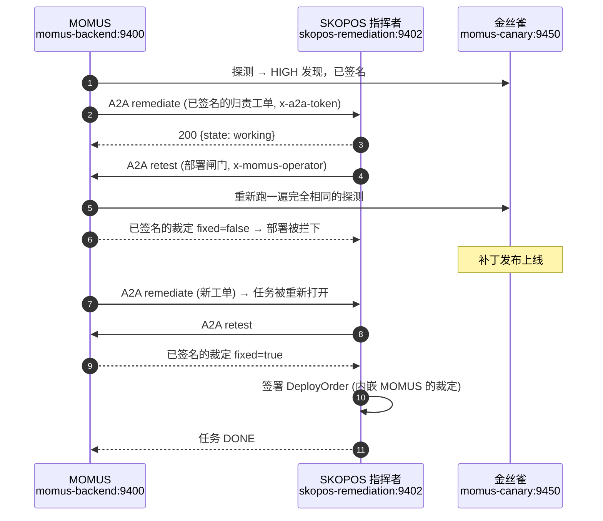
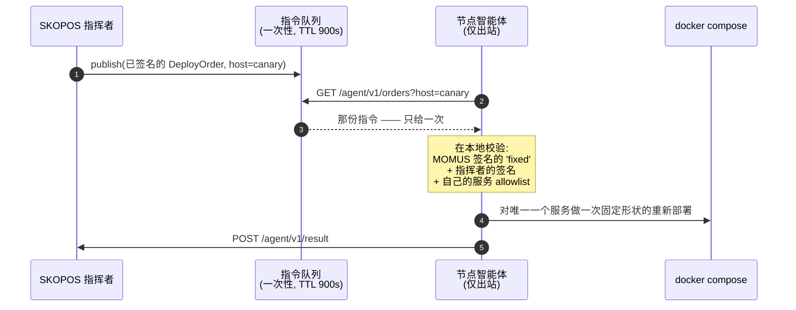

# 真的被发现、也真的被修好的 bug —— 附上验证过程

> 🌐 [English](found-and-fixed.md) · [Русский](found-and-fixed.ru.md) · [Español](found-and-fixed.es.md) · [Français](found-and-fixed.fr.md) · **中文**

一支从来没抓到过任何东西的红队，只是一句营销话术。本页是那份诚实的账本：发现了什么、由什么发现的、
这个修复是否*必要*、以及这个修复是否*正确*。每一条都以一次真正被执行过的验证收尾，而不是嘴上声称
的验证。

## ⚠️ 关于谁发现了什么，必须说准确

这里有三种不同的机制各自发现了 bug；把它们混为一谈就会夸大这个系统的能力：

| 来源 | 它发现了什么 | 是否自主？ |
|---|---|---|
| **对抗式审计智能体**（只读，43 个智能体，39 个候选 → 24 个确认） | MOMUS/Treasury/SKOPOS 生产代码中的真实缺陷 | 自主发现，**由人类修复** |
| **在生产环境上跑真实的链路** | 5 个没有任何测试覆盖过的集成缺陷 | 由执行发现，由人类修复 |
| **MOMUS 自己的探测** | [金丝雀](../canary/README.md)测试装置中的合约违规 | 完全自主的检测 |

**没有发生过的事：** AI-Factory 从来没有自主写出过一个真正修好了某个真实 bug 的补丁。Factory
客户端运行在 dry-run 模式下；真实链路里的「修复」这一步是把测试装置的状态切一下。这个闭环的
*管道*是真实的，而且已经端到端被证明 —— 而*补丁的编写*还不是自主的。把这一点直说出来，好让没有人
从这个演示里读出比它实际配得上的更多东西。

**MOMUS 在生态系统的真实组件里没有发现任何 bug。** 预言机家族、GAIA 和 Hub 都通过了它们各自的
合约检查。这些发现来自金丝雀，这是故意的。

---

## 1. 操作员闸门可以通过交易市场路径绕过

**由谁发现：** 一个审计智能体，而且它把问题*复现*出来了。

`POST /scan` 在生产闸门下正确地返回了 `503` —— 而完全相同的动作通过
`POST /ai-market/v2/invoke {"capability_id": "momus.scan@v1"}` 却成功了。一个能力处理器只会拿到
输入字典，永远拿不到请求本身，所以路由层面的检查根本没看到它。

**这个修复必要吗？** 必要 —— 它让整个控制闸门形同虚设。一个匿名调用方可以让已部署的 MOMUS 循环
探测同级服务，把共用的 DeepSeek 密钥额度烧光。

**修复：** 闸门被移到 HTTP 边界上，变成一个中间件：它检查 capability id 并把请求体重新注入回去
（[`momus/app.py`](../momus/app.py)）。

**已在生产环境上实测验证：**

```
POST /scan                                    → 503   (fail-closed, no token)
POST /ai-market/v2/invoke momus.scan@v1       → 503   (was 200 before the fix)
POST /ai-market/v2/invoke momus.findings@v1   → 200   (read-only stays public)
```

---

## 2. 递归自扫描：一个请求变成了约 100 次嵌套扫描

**由谁发现：** 一个审计智能体，并且复现了 —— 一次匿名调用（invoke）在限流器把它掐断之前，产生了
**101** 次嵌套的 `Scanner.scan` 执行，每一次都经由公开的 TLS 边缘发出，并写入 SQLite。

**原因：** MOMUS 自己的清单把 `momus.scan@v1` 列在第一位，而探测调用的是 `tools[0]`。于是探测
自身这个目标，就让 MOMUS 去扫描 MOMUS，递归下去。

**这个修复必要吗？** 必要 —— 一个未经认证的请求就能触达的自我放大循环。

**修复：** `_safe_tools()` 会把 MOMUS 自身那些「会动手做事」的能力，从任何探测将要调用的对象里
剔除掉（[`momus/targets/oracle.py`](../momus/targets/oracle.py)）。只读的自身能力仍然可以被探测，
所以自审计照样有效。

**验证：** 一个回归测试把自身目标指回应用本身，通过真实的应用驱动一次自扫描，并断言扫描计数保持
为 **1**（`tests/test_audit_fixes.py::test_self_scan_does_not_recurse`）。

---

## 3. 一个未签名的「fixed」裁定就放出了修复者和指挥者的份额

**由谁发现：** 一个审计智能体。

```python
if key and sig.get("value") and not verify_document_signature(body, sig, key):
    return False, "…"
return True, "MOMUS-signed 'fixed' verdict"
```

只要*任意一个*操作数是假值，这个检查就被跳过了。于是一个完全没有签名的 `{"fixed": true}` ——
或者任何省略了 `momus_pubkey` 的调用 —— 都会在毫无依据的情况下向修复者和指挥者付款。

**这个修复必要吗？** 必要。这是资金路径：每一个赏金池的 50% 都可以在没有任何证据的情况下被放出。

**修复：** fail-closed（默认拒绝）—— 缺少密钥、缺少签名、或者验证失败，这三种情况各自都会扣住
份额（[`momus/economics.py`](../momus/economics.py)）。

**验证：** `tests/test_audit_fixes.py::test_unsigned_fix_verdict_withholds_the_fixer_share`
断言这三种变体都会被拒绝。

---

## 4. 去重键是非确定性的 —— 同一个 bug 每次重扫都会付一次钱

**由谁发现：** 一个审计智能体。

「这个 bug 的身份」哈希了完整的响应摘要，而目标的响应每次调用都会带上新的 nonce 和时间戳。于是
每一次重扫都产生一个*新的*去重键，重放防护从来没有命中过。更糟的是，Treasury 信任的是
**索赔方自己签名的那份文档上**声明的 `dedup_key` —— 也就是说，收钱的那一方自己挑选自己的去重身份。

**这个修复必要吗？** 必要，而且是双重必要：这道防护根本不起作用，同时它还可以被覆盖掉。

**修复：** 计算基础只取合约层面的事实（目标、探测、类别、状态码），并且 Treasury 会**自己重新
计算**它，并拒绝任何与声明值不一致的情况。

**验证：** `test_dedup_key_is_stable_across_volatile_responses` 和
`test_treasury_recomputes_dedup_and_refuses_a_declared_mismatch` —— 后者先付款一次，然后既拒绝
一次改了名的重复提交，也拒绝一次诚实的重复提交。

---

## 5. Treasury 的赔付路由完全没有任何认证

**由谁发现：** 一个审计智能体，而且它*复现*了：从共享 Docker 网络上的一个无特权进程，铸造出一份
由 Treasury 签名的 `paid` 决定。

**这个修复必要吗？** 必要 —— 这是这一批里最严重的一个。签名检查只能证明这些文档在内部是自洽的；
它证明不了*调用方*有资格提出这个请求。

**修复：** `/authorize`、`/deposit` 和 `/explain` 需要客户端令牌（在生产环境中 fail-closed），
并且有限流；在配置了 allowlist（白名单）的情况下，索赔方的 `scanner_pubkey` 必须在其中
（[`treasury/treasury/service.py`](https://github.com/alexar76/treasury/blob/main/treasury/service.py)）。

**已实测验证：** 在已部署的 Treasury 上，`GET /health` 报告 `write_gated: true` 和
`registered_scanners: 1`。

---

## 6. 一次误报：一个不可达的目标被报成了 HIGH 级别的发现

**由谁发现：** 在生产环境上跑真实的周期 —— 没有任何测试覆盖到它。

金丝雀在*它自己的容器内部*绑定了 `127.0.0.1`，所以 MOMUS 根本连不上它。MOMUS 报告了一个
**HIGH「清单未签名」** —— 清单并不是未签名，而是根本没有被提供出来。另外两个探测报告了
`no_finding`，也就是对从来没有运行过的检查宣称「合约得到了遵守」。

**这个修复必要吗？** 极其必要。两个方向都是不诚实的，而一支谎报狼来了的红队一文不值。这是 MOMUS
可能拥有的破坏性最强的一类 bug。

**修复：** `_unreachable()` —— 每一个依赖清单的探测都返回 `INCONCLUSIVE`（不确定）；同样，一个
429 或任何非 2xx 也永远不算通过（[oracle.py](../momus/targets/oracle.py)、
[hub.py](../momus/targets/hub.py)、[injection.py](../momus/targets/injection.py)）。

**验证：** `test_unreachable_target_is_inconclusive_never_a_finding` 断言一个不可达的目标
**既不**产生发现、**也不**给出健康无恙的结论。

---

## 7. 我自己的那个安全修复弄坏了部署闸门

**由谁发现：** 在生产环境上跑真实的 A2A 链路。

把 `/retest` 关到操作员令牌后面（第 1 号修复）挡掉了唯一一个正当需要它的调用方：SKOPOS 的指挥者。
每一次闸门调用都返回 `403`，任务把它读成「不确定」，于是一路重试到次数耗尽并上报 —— 而这个原因跟
被测代码毫无关系。

**这个修复必要吗？** 直接在生产环境上验证过：

```
POST :9410/retest  不带令牌 → 403      ⇒ 指挥者确实没法使用这个闸门
POST :9410/retest  带令牌   → 200
```

**修复：** 指挥者出示操作员令牌，而 `MomusClient` 现在会区分*被拒绝*（403/503 —— 这需要操作员
去修）和*不可达*，这样消息里说出的就是真正的原因，而不是一路重试进一次误导性的上报。

**这个修复正确吗 —— 它有没有削弱这个闸门？** 在生产环境上检查了反事实情形：

```
POST https://momus.modelmarket.dev/retest   → 404   (在公开边缘上仍然被拒绝)
POST :9410/retest  匿名                     → 403   (在 loopback 上仍然被拒绝)
POST :9410/retest  带操作员令牌             → 200   (只有获得授权的指挥者能通过)
```

只有经过认证的指挥者能过去。闸门是完好的。

---

## 8. 补丁落地之后，一个已进入终态的任务再也无法被重新打开

**由谁发现：** 跑真实的 A2A 链路 —— 补丁还没发布出去，任务就上报了；而后来那张在修复*之后*到达的
工单，无法把它重新打开。

**这个修复必要吗？** 必要。一次暂时性的失败，就永久性地堵死了那个发现被修复的可能 —— 这和在一笔
尚未结算的赔付上烧掉一个去重身份（#4）是同一种「临时的问题，永久的损害」的形状。

**修复：** 针对一个 `FAILED`/`ESCALATED` 任务的新工单会把它重新打开，并给它一份全新的尝试次数
预算；`DONE` 则不去碰，这样一张重复的工单永远不会把已经完成的工作再做一遍。

**验证：** `skopos/tests/test_remediation.py::test_terminal_job_reopens_on_a_new_ticket` 和
`::test_done_job_is_not_redone_by_a_duplicate_ticket`。

---

## 9. MOMUS 一次重启，就让每一个未关闭的发现都无法过闸门

**由谁发现：** 跨一次重新部署跑真实链路。

部署闸门是从 `_findings_by_id` 里查出发现的 —— 那是一个有容量上限的**进程内**缓存。MOMUS 本身
有一个持久化语料库（SQLite，发现能在重启后存活下来），而闸门从来没有去看过它。于是在一次重启
之后 —— 或者仅仅是在足够多的新发现把一个旧的挤出去之后 —— `/retest` 会对一个仍然未关闭的 bug
回答 `unknown_finding`。

**这个修复必要吗？** 必要，而且波及范围比看上去更大：SKOPOS 把一个无法作答的闸门读成「没有修好」，
把 Factory 重试到次数耗尽，然后上报。所以**只要重启一次 MOMUS，就足以永久性地堵死一次真实的修复**
—— 这和 #4、#8 是同一种「暂时的问题，永久的损害」的形状，这已经是第三次了。值得把它作为一个模式
点明出来：这个系统里每一处会做出判断的地方，都必须问一句，如果这个判断是从一个*空的*缓存上做出来
的，会发生什么。

**修复：** `_recall()` —— 先查内存里的 LRU，再查持久化语料库，并在返回的路上把缓存预热
（[`momus/capabilities.py`](../momus/capabilities.py)）。语料库出错时返回「找不到」，而不是返回
一个裁定。

**验证：** `tests/test_audit_fixes.py::test_deploy_gate_survives_a_momus_restart` 会清空缓存 ——
这正是一次重启之后留下的状态 —— 并断言闸门依然能解析出那个发现。

---

## 10. 一次管道故障被报成了针对补丁的裁定

**由谁发现：** 跑真实链路 —— #9 就是这样浮出水面的，而这是一个独立的 bug。

MOMUS 回答的是 `200 {"error": "unknown_finding"}`。这个响应体里没有 `fixed` 字段，于是指挥者把
它读成了假值，并记下了这样一行日志：

```
failed | retest not fixed (None):
```

这一行有三处是错的：它把一个不属于补丁的失败归咎到补丁身上；它的结果是 `None`；而且它没有给出
原因。接着它又重试了 Factory 两次 —— 好像多写几个补丁就能救一个根本跑不起来的闸门 —— 并以那个
误导性的理由上报了。

**这个修复必要吗？** 必要。这和 #6（一个不可达的目标被报成了发现）属于同一类：**系统在陈述它并不
知道的事情。** 一支红队的报告值多少，完全取决于它的诚实值多少。

**修复：** 分两部分。
- `MomusClient` 把一个没有布尔型 `fixed` 字段的 200 响应体当作 `inconclusive`（不确定），并说出
  真正的原因（[`clients.py`](https://github.com/alexar76/skopos/blob/main/skopos/remediation/clients.py)）；
- 指挥者在闸门给出不确定结果时**停下来**，而不是继续循环：`"deploy gate could not run —
  not a verdict on the fix: …"`（「部署闸门无法运行 —— 这不是对修复的裁定」）。再来一次 Factory
  尝试也修不好一个坏掉的闸门，而烧掉尝试次数预算只会换来一次错误的上报
  （[`conductor.py`](https://github.com/alexar76/skopos/blob/main/skopos/remediation/conductor.py)）。

**验证：** `test_gate_error_body_is_inconclusive_not_a_verdict_on_the_fix` 和
`test_inconclusive_gate_escalates_immediately_without_burning_attempts` —— 后者断言只有一次
尝试、一次闸门调用，并且历史记录里从来没有哪一行说过 "not fixed"。

---

## 这次 A2A 交换真的发生了，而且是走网络的

不是进程内，也不是打桩：MOMUS 通过 HTTP 在两个容器之间把工作委派给了 SKOPOS，而 SKOPOS 自己的
观察器记录下了两个方向。



那次运行中，观察器自己的数字：

```
envelopes: 9   by skill: {remediate: 3, retest: 6}   by peer: {momus: 9}
rejected: 3    avg latency: 29.2 ms

 in  momus  remediate  working    Confirmed high finding on canary — please orchestrate…
out  momus  retest     completed  lat=27ms   gate: fixed=False outcome=finding
out  momus  retest     completed  lat=57ms   gate: fixed=False outcome=finding
```

以及那个已经关闭的任务：

```
DONE | attempts: 1
  · fixing      attempt 1: requesting fix from AI-Factory
  · retesting   asking MOMUS to re-test the patched build
  · deploying   MOMUS confirms fixed; signing deploy order for the node agent
  · verifying   deploy accepted; final in-place MOMUS retest
  · done        fixed, deployed and verified in place
gate fixed: true   deploy order: deploy-mom-5475a33ca38d41fe-1786202196
```

## 节点智能体真的领走了那份指令 —— 也真的拒绝了一份

已安装的 SKOPOS 智能体是**只推送**的：它们完成注册、采集并推送，而机队里没有任何主机对外暴露入站
端口。这个性质值得保留，所以指挥者并不去调用智能体。它**发布**一份已签名的指令；智能体在下一次
轮询时把它领走。



两个方向都在生产环境上、针对真实的生产密钥跑过了：

```
=== 主机 'canary' 上的智能体，'canary' 确实在它的本地 allowlist 上 ===
order_id: deploy-mom-a1227001b375450d-1786203354
reason:   chain verified: MOMUS-fixed + conductor-signed + service allowlisted
would_run: docker compose -f …/docker-compose.prod.yml up -d --no-deps --force-recreate canary

=== 同样形状的指令，但这个智能体的本地 allowlist 是 ('hub',) ===
refused: true
reason:  service 'canary' not on this agent's deploy allowlist

=== 对一份已经被领走的指令做第二次轮询 ===
order: null      ⇒ 一次性；一次重放的轮询无法把部署再跑一遍
```

指挥者自己的观察器在两个方向上都把这个智能体记成了一个对端：

```
by_skill: {deploy-order: 2, deploy-result: 2, remediate: 9, retest: 18}
by_peer:  {agent:canary: 4, momus: 25}

out  agent:canary  deploy-order   order …c43e16fa claimed for canary
 in  agent:canary  deploy-result  refused: service 'canary' not on this agent's deploy allowlist
```

**这个智能体被故意设计成做不到的事。** 它不能编写一个修复、不能挑另一个服务、不能凭空造出一份
指令，也不能在没有一份 MOMUS 签名的 `fixed` 裁定的情况下部署 —— 而它没有密钥去伪造那份裁定。
allowlist 是**本地的** —— 由主机持有，而不是由调用方提供 —— 所以一个被完全攻陷的指挥者，依然无法
拓宽一台主机会去动的范围，上面那次拒绝正好演示了这一点。一个被完全攻陷的*智能体*，能做的只是重新
部署它自己 allowlist 上的那些服务，别的什么都做不了。

分工是这样的，以及为什么这个智能体是一只手，而不是一个大脑：

```
AI-Factory 编写  →  MOMUS 验证  →  SKOPOS 下发指令  →  智能体只执行一条命令
```

一个能写修复的智能体，会需要对代码的写权限，以及在机队每一台主机上任意执行的能力 —— 这是系统里
最危险的特权 —— 而且它什么也换不来：就地写出来的补丁不会留下任何可评审的产物供 MOMUS 把关，而
N 个各自在本地修复的智能体会产出 N 份互相分叉的修复，却没有一个统一的、经过验证的结果。

在这台主机上，部署本身是 **dry-run**：智能体验证了整条链路，然后把那条精确的命令打印出来，而不是
执行它。把 `SKOPOS_AGENT_DRY_RUN=0` 翻过去是操作员的决定，不是默认值 —— 而且机队主机上目前还
什么都没装，所以这个执行者是被证明过了，但还没有真正交付上线。

## A2A 入口会拒绝什么

它在被部署之前就已经加固过了，因为审计把这两点都标了出来：

- **未经认证的任务** → 必须有 `SKOPOS_A2A_TOKEN`，在 dry-run 之外 fail-closed（默认拒绝）；
- **对端自己声明的 `route`** → 被忽略。上报路由是在服务端根据组件重新推导出来的，所以一个调用方
  没法把一个安全核心的发现标成普通的，再把它一路带进自动的「修复→部署」路径。由
  `test_conductor_rederives_route_and_ignores_the_claimed_one` 验证；
- **无法验证的工单** → 归责证明必须能用 MOMUS 的已知密钥验证通过，而且它的
  `finding_id`/`component` 必须与工单一致；
- **并发的重复请求** → 每个发现只允许一个活动任务，由一把按发现划分的锁把守。

## 计分板

| | |
|---|---|
| 审计候选 → 确认 | 39 → **24**（15 个在对抗式验证中被驳回） |
| 已审计并判定健康的领域 | **30** |
| 靠真实运行发现的缺陷 | **5** 个（#6、#7、#8、#9、#10） |
| 测试 | **171** 个通过（133 MOMUS + 5 Treasury + 33 SKOPOS）+ 15 个 Foundry |
| 为审计发现编写的回归测试 | **21** |

那个反复出现的形状 —— 只说一次，因为它已经付出了三个各自独立的 bug 的代价（#4、#8、#9）：一个
**暂时性**的状况 —— 资金不足、一次失败的尝试、重启之后空掉的缓存 —— 绝不应该造成**永久性**的
损害。每当这个系统记录下某件事已经结算、已经完成、或者未知时，该问的问题是：如果这条记录是在一个
空的、或者一时错误的状态下写下来的，会发生什么。
