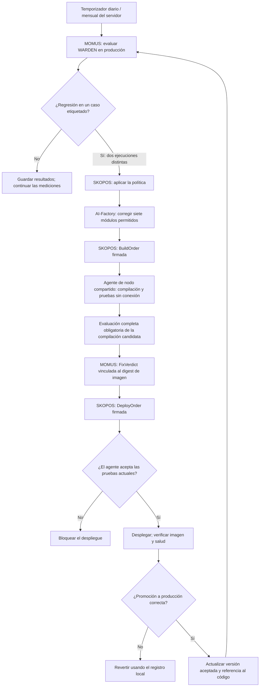
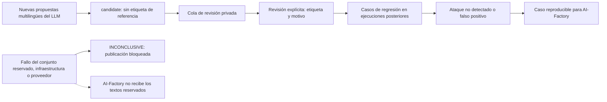

# Ciclo de control de calidad de WARDEN

> 🌐 [English](quality-cycle.md) · [Русский](quality-cycle.ru.md) · **Español** · [Français](quality-cycle.fr.md) · [中文](quality-cycle.zh.md)

Terminología: [glosario canónico EN/RU/ES/FR/ZH](../../docs/localization-glossary.md).
Los productos, rutas, campos y tipos de documentos firmados conservan su escritura original.

## Proceso y responsabilidades

El ciclo del servidor es MOMUS → AI-Factory → SKOPOS → agente de nodo compartido existente → despliegue.
SKOPOS coordina la petición a AI-Factory y las órdenes firmadas. AI-Factory escribe el correctivo,
MOMUS mide su resultado y el agente de nodo compartido compila y despliega. No hay un agente
adicional de WARDEN, una tarea programada de Codex ni dependencia de GitHub CI.

## Mediciones e idiomas

`admin-vps` ejecuta `momus-quality.service` a diario y `momus-quality-full.service` cada mes.
La ejecución diaria evalúa una muestra rotatoria de 256 casos, todo el conjunto reservado cerrado,
todas las regresiones confirmadas y nuevas propuestas del LLM. También prueba la lectura de señuelos
en cada una de las tres fases del ciclo de vida del paquete, verificando los digests del observador
y de los escenarios. La ejecución mensual usa los 8 606 casos del corpus y 72 escenarios de comportamiento
en gVisor. La API `/campaign-case` exige autenticación y un certificado fijado. Solo admite una semilla
acotada y un índice de plantilla incorporada; comparte bloqueos de capacidad y señuelos con el sandbox.
No permite introducir código ni URL arbitrarios.

El primer conjunto reservado cerrado contiene 48 casos sintéticos: 24 ataques y 24 tareas normales,
en inglés, francés, portugués, italiano, indonesio y polaco. Se congeló antes de medir, no comparte
definiciones de herramientas idénticas con el corpus de desarrollo y permanece en el host evaluador.
Su SHA-256 es `e975df064e57ae195a0ab33967d7d70ab83fc1fdf555d5c837f15411a321089a`.
El generador de ataques nunca lo recibe. Es un control sintético, no una muestra independiente
de tráfico real ni una revisión por hablantes nativos. No se deben ajustar reglas a su contenido.
Si es necesario revelar casos para investigarlos, se trasladan a desarrollo y se prepara otro conjunto cerrado.

## Evidencias y puerta de publicación

El estado reside en `/var/lib/momus-quality`; la configuración y la clave Ed25519 independiente,
en `/etc/momus-quality`, accesible solo por root. Las claves existentes de DeepSeek y del sandbox
se leen desde los contenedores de producción a la memoria del proceso, sin archivos de claves nuevos.
La evaluación Node se ejecuta como `momus-quality`, sin clave de firma ni token del sandbox.
Terminar una medición no actualiza por sí solo la versión base aceptada.

El recibo de calidad firmado está en
`https://histor.modelmarket.dev/security-quality/latest.json`.
Incluye recuentos, fechas e identidades; un fallo puede añadir hasta ocho casos sintéticos acotados
de desarrollo/regresión para reparar, con un total máximo de 24 KB. Los textos del conjunto reservado,
las credenciales y las respuestas sin procesar del proveedor permanecen privados.
`check:quality`, npm `prepublishOnly` y el script de despliegue de HISTOR verifican la clave pública
fijada, el digest de esa compilación JS, una evaluación completa aprobada de como máximo 35 días,
una diaria de como máximo 48 horas, ambas clases del conjunto reservado, la generación correcta
y las pruebas completas de gVisor. Al publicar `running`, se sustituye el recibo positivo anterior
y la publicación queda bloqueada hasta el éxito. Un fallo de evaluación publica `failed`.
Si el lanzador falla antes de publicar, no genera un recibo nuevo; el existente conserva únicamente
su vigencia original, como máximo 48 horas.
Datos ausentes, firmas incorrectas, caducidad o inspecciones incompletas bloquean la publicación:
fail-closed (denegar por defecto). Los resultados del clasificador no se atribuyen al escáner estático solo.

## Hallazgo → regresión → corrección → aceptación

Los fallos en casos etiquetados se guardan en `regressions/` y en el directorio `remediation/`
de cada ejecución; las siguientes pruebas los repiten. Las nuevas propuestas del LLM, con texto
y decisión semántica, entran en `review-queue/` como `candidate`. Se revisan con
`coverage_campaign review`, especificando fingerprint, etiqueta y motivo para
`/var/lib/momus-quality/discovery`. Las propuestas revisadas entran en posteriores pruebas de regresión.
El modelo no convierte su propia decisión en una etiqueta de referencia ni en una regla global de bloqueo.

MOMUS conserva un caso reproducible por regresión confirmada. AI-Factory corrige el detector;
no debe reducir umbrales, borrar casos, cambiar etiquetas para aprobar ni consultar el conjunto
reservado para ajustar el correctivo. `QualityTarget` verifica la firma del host y la fase.
Consultar repetidamente una ejecución no aumenta `seen_count`: la política requiere dos mediciones distintas.
Los fallos de infraestructura, proveedor o conjunto reservado producen `INCONCLUSIVE` y bloquean
la publicación sin entregar textos reservados a AI-Factory. WARDEN está incluido en la política
y en la rotación de escaneo del piloto automático.

AI-Factory solo puede modificar siete módulos del detector. No puede cambiar el evaluador, las pruebas,
las claves, la receta de compilación, el director SKOPOS ni el agente de nodo. El agente de nodo
compartido utiliza `warden/deploy/Dockerfile.histor`, las pruebas Node sin conexión y el hook
obligatorio propiedad de root `/usr/local/sbin/skopos-warden-quality candidate IMAGE_SHA`.
Este extrae la imagen inmutable sin arrancarla y ejecuta la campaña completa con estado separado.
El recibo candidato se publica en `/security-quality/candidate.json`, separado del recibo de producción.
No se copia una compilación nueva sobre la evaluación activa: SKOPOS controla la promoción.

MOMUS firma el digest de la imagen candidata en `FixVerdict`. Justo antes del despliegue, el agente
vuelve a verificar el recibo candidato vigente: un veredicto positivo antiguo no supera una evaluación
fallida posterior. Exige la misma imagen y una entrada en su propio registro de compilación.
Tras verificar la salud y la imagen real, el hook `live` vincula el informe al contenedor en ejecución
y actualiza la versión base aceptada. Un fallo provoca la reversión; el mismo hook restaura la versión
anterior y la referencia al código. Los informes firmados y las copias privadas quedan disponibles para auditoría.

El siguiente correctivo parte del commit aceptado en `/warden-state/source.json`, de solo lectura,
para conservar correcciones todavía no fusionadas con la rama principal protegida.
Solo tras una promoción verificada se actualizan esa referencia y la copia de código que lee AI-Factory.
Esto no concede acceso a la rama principal protegida.

## Operación

| Frecuencia | Hora de Moscú (UTC+3) | Temporizador |
|---|---|---|
| Diaria | 06:23–06:33 | `momus-quality.timer` |
| Mensual, día 1 | 08:00–08:10 | `momus-quality-full.timer` |

Las unidades usan UTC, hasta diez minutos de retraso aleatorio y `Persistent=true` para recuperar
ejecuciones omitidas durante una parada. Cada despliegue candidato requiere además una evaluación completa.
Consultar `systemctl list-timers 'momus-quality*'` y `journalctl -u momus-quality.service`.
Los informes detallados y respuestas del proveedor son privados en `runs/RUN_ID`; no se registran secretos.
Tras una interrupción del proveedor, se conserva la evidencia parcial y se repite el servicio al recuperarse.
Las filas parciales no cuentan como medición aprobada. Límites: ocho peticiones simultáneas del clasificador,
ocho herramientas por lote, una petición de generación de hasta ocho propuestas por ronda diaria
y ocho horas como máximo por ejecución del servicio.

**Una medición, un pago.** Una medición anterior completa de entradas idénticas byte a byte se
reutiliza en vez de comprarse otra vez: los mismos casos, la misma compilación de WARDEN (que
lleva el prompt del clasificador) y —comparados campo a campo por `coverage_semantic.mjs` con su
propia identidad— el mismo modelo, endpoint y protocolo. Solo durante doce horas: la ejecución
diaria programada va con un día de diferencia, así que siempre mide de nuevo y detecta a un
proveedor que cambió el modelo bajo el mismo nombre, mientras que una repetición el mismo día (un
reintento, un candidato cuyo WARDEN no cambió) no cuesta nada. Una medición parcial nunca se
reutiliza, una fila sin terminar se mide otra vez, y un informe que reutiliza una medición caduca
48 horas después de la original, no después de reutilizarla. Como referencia: una ejecución del
corpus completo son unas 1 076 llamadas al clasificador (≈ 3,8 M de tokens de entrada y 0,5 M de
salida); una diaria, unas 45.

**Un despliegue de HISTOR con el mismo WARDEN.** `scripts/deploy_histor.sh` termina con
`skopos-warden-quality rebind IMAGE`. Si el WARDEN incluido en la nueva imagen de HISTOR es idéntico
byte a byte al de la vinculación en vivo y el recibo en vivo de esa compilación está vigente y
aprobado, la vinculación, el puntero al código aceptado y el calendario diario pasan a la nueva
imagen sin medición alguna. Un WARDEN cambiado conserva la vinculación anterior —la siguiente
ejecución diaria se niega hasta que pase la evaluación completa del candidato— y el despliegue lo
avisa.

`deploy/install-quality.py` recibe una copia fiable de la parte necesaria del repositorio, el corpus
congelado y un conjunto reservado suministrado por separado; conserva claves, corpus y versiones aceptadas.
Nginx expone exclusivamente las rutas exactas de los recibos, nunca todo el estado.
Primero se realiza la aceptación completa y después se activan ambos temporizadores. Al desactivarlos,
se detienen las mediciones, caduca el recibo y se bloquean publicaciones; el escaneo de producción continúa.
Para revertir el observador, se restaura el script guardado y se reinicia `histor-sandbox`.
La puerta de comportamiento permanece cerrada hasta reconciliar deliberadamente el digest configurado.

El servicio existente `skopos-deploy-hand.service` atiende `canary,warden`;
`SKOPOS_COMPONENT_HOSTS` dirige ambos a `admin-vps`. La antigua instancia individual de Canary está
desactivada; no se activa `@warden`. Se conserva el registro de compilación y reversión. WARDEN es una
receta y una entrada en la lista permitida; los demás agentes mantienen su configuración.
El contenedor del director incluye entradas passwd/group para uid/gid 10001, necesarias para OpenSSH.
La aceptación comprueba tanto la lectura del commit aceptado como el envío de una rama `momus/fix-`.

El agente de nodo compartido usa `/opt/skopos-deploy-hand/venv` con `dilithium-py==1.4.0`, como MOMUS.
Verifica Ed25519 y la firma ML-DSA presente. Si falta el backend PQ, bloquea el despliegue: no se eliminan
campos de firma ni se relaja la verificación. Se reinicia el agente tras instalarlo, porque el módulo
de firma detecta su disponibilidad durante la importación.

## Aceptación en producción, 2026-10-10

El agente compartido compiló, evaluó y desplegó la imagen mediante el protocolo firmado.
Pasaron 8 606 casos de desarrollo, 48 reservados y 72 escenarios de comportamiento, sin ataques
no detectados, falsos positivos ni inspecciones incompletas. La primera ejecución diaria de systemd
también pasó y ambos temporizadores están activos. El [artefacto de aceptación](native-quality-acceptance-20261010.json)
contiene resultados, identidades de imagen y el recibo diario firmado.

Se ejercitaron compilación real, firmas, puerta de publicación, promoción y salud del contenedor.
No se inventó una regresión de producción ni se afirmó que AI-Factory redactara un correctivo del detector
durante esta aceptación. La reparación automática comienza ante una regresión confirmada que cumpla la política.

Son resultados del clasificador con umbral `high` y `deepseek-flash` sobre casos sintéticos,
no una garantía para cualquier idioma o ataque real. La inspección semántica evita necesitar un
diccionario por idioma; los controles congelados y propuestas multilingües revisadas miden sus límites.
Véanse el [canal de amenazas MOMUS → WARDEN](warden-channel.es.md) y las
[protecciones de reparación autónoma](autonomous-repair-guards.es.md).
