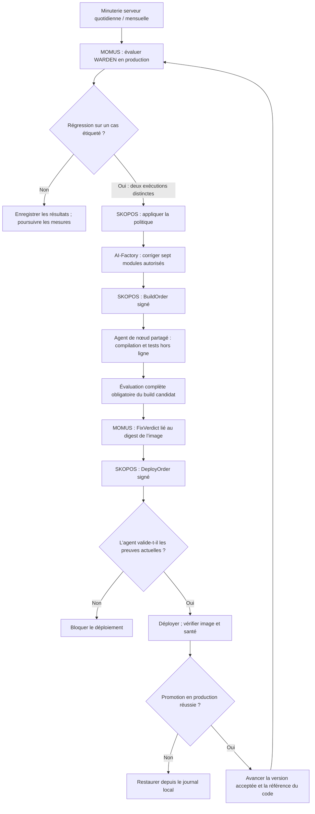
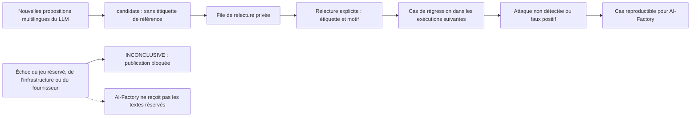

# Cycle de contrôle qualité de WARDEN

> 🌐 [English](quality-cycle.md) · [Русский](quality-cycle.ru.md) · [Español](quality-cycle.es.md) · **Français** · [中文](quality-cycle.zh.md)

Terminologie : [glossaire canonique EN/RU/ES/FR/ZH](../../docs/localization-glossary.md).
Les noms de produits, chemins, champs et types de documents signés gardent leur graphie originale.

## Processus et responsabilités

Le cycle serveur est MOMUS → AI-Factory → SKOPOS → agent de nœud partagé existant → déploiement.
SKOPOS orchestre la demande à AI-Factory et les ordres signés. AI-Factory écrit le correctif,
MOMUS mesure le résultat, l’agent de nœud partagé compile et déploie. Il n’y a ni agent WARDEN
supplémentaire, ni tâche Codex planifiée, ni dépendance à GitHub CI.

## Mesures et langues

`admin-vps` exécute `momus-quality.service` chaque jour et `momus-quality-full.service` chaque mois.
L’exécution quotidienne évalue un échantillon tournant de 256 cas, tout le jeu réservé fermé,
toutes les régressions confirmées et de nouvelles propositions du LLM. Elle teste aussi la lecture
de leurres à chacune des trois étapes du cycle de vie du paquet, en vérifiant les digests de
l’observateur et des scénarios. L’exécution mensuelle utilise les 8 606 cas du corpus et 72 scénarios
de comportement dans gVisor. L’API `/campaign-case` exige authentification et certificat épinglé.
Elle n’accepte qu’une graine bornée et l’indice d’un modèle intégré, partage les verrous de capacité
et les leurres du sandbox, et ne permet pas de soumettre du code ou des URL arbitraires.

Le premier jeu réservé fermé contient 48 cas synthétiques : 24 attaques et 24 tâches ordinaires,
en anglais, français, portugais, italien, indonésien et polonais. Figé avant les mesures, il ne
partage aucune définition d’outil identique avec le corpus de développement et reste sur l’hôte
d’évaluation. Son SHA-256 est
`e975df064e57ae195a0ab33967d7d70ab83fc1fdf555d5c837f15411a321089a`.
Le générateur d’attaques ne le reçoit jamais. C’est un contrôle synthétique, pas un échantillon
indépendant de trafic réel ni un audit par des locuteurs natifs. Il ne faut pas ajuster les règles
à son contenu. Si une enquête impose de révéler des cas, ils passent dans le corpus de développement
et un nouveau jeu fermé est constitué.

## Preuves et porte de publication

L’état est conservé dans `/var/lib/momus-quality`; la configuration et la clé Ed25519 indépendante
sont dans `/etc/momus-quality`, accessible uniquement à root. Les clés DeepSeek et sandbox existantes
sont lues depuis les conteneurs de production dans la mémoire du processus, sans nouveaux fichiers
de clés. L’évaluation Node s’exécute sous `momus-quality`, sans clé de signature ni jeton du sandbox.
La fin d’une mesure ne fait pas avancer à elle seule la version de référence acceptée.

Le reçu de qualité signé est disponible à
`https://histor.modelmarket.dev/security-quality/latest.json`.
Il contient compteurs, dates et identités ; un échec peut aussi exposer au plus huit cas synthétiques
bornés de développement/régression à corriger, pour un total maximal de 24 Ko. Les textes du jeu
réservé, les secrets et les réponses brutes du fournisseur restent privés.
`check:quality`, npm `prepublishOnly` et le script de déploiement HISTOR vérifient la clé publique
épinglée, le digest exact du build JS, une évaluation complète réussie datant d’au plus 35 jours,
une quotidienne d’au plus 48 heures, les deux classes du jeu réservé, la génération réussie et
la campagne gVisor complète. La publication de `running` remplace le reçu positif précédent
et bloque la publication jusqu’au succès. Une erreur d’évaluation publie `failed`. Si le lanceur
échoue avant cette publication, aucun nouveau reçu n’est créé ; le reçu existant garde uniquement
sa validité initiale, au maximum 48 heures.
L’absence de données, une signature incorrecte, l’expiration ou une inspection incomplète bloquent
la publication : fail-closed (refus par défaut). Les résultats du classificateur ne sont pas attribués
au seul scanner statique.

## Constat → régression → correction → acceptation

Les erreurs sur cas étiquetés sont conservées dans `regressions/` et dans le répertoire `remediation/`
de chaque exécution ; les évaluations suivantes les rejouent. Les nouvelles propositions du LLM,
texte et décision sémantique compris, entrent dans `review-queue/` avec l’étiquette `candidate`.
La relecture utilise `coverage_campaign review`, avec fingerprint, étiquette et motif, pour
`/var/lib/momus-quality/discovery`. Les propositions relues intègrent les évaluations de régression
suivantes. Le modèle ne transforme pas sa propre décision en vérité de référence ou en règle globale de blocage.

MOMUS conserve un cas reproductible pour chaque régression confirmée. AI-Factory corrige le détecteur,
sans abaisser les seuils, supprimer des cas, changer les étiquettes pour passer les tests ou consulter
le jeu réservé pour ajuster le correctif. `QualityTarget` vérifie signature de l’hôte et phase.
Interroger plusieurs fois la même exécution n’augmente pas `seen_count` : deux mesures distinctes
sont nécessaires. Les défaillances de l’infrastructure, du fournisseur ou du jeu réservé produisent
`INCONCLUSIVE` et bloquent la publication sans livrer les textes réservés à AI-Factory.
WARDEN figure dans la politique et dans la rotation de scan du pilote automatique.

AI-Factory ne peut modifier que sept modules du détecteur, jamais l’évaluateur, les tests, les clés,
la recette de compilation, le chef d’orchestre SKOPOS ou l’agent de nœud. L’agent de nœud partagé
utilise `warden/deploy/Dockerfile.histor`, les tests Node hors ligne et le hook obligatoire appartenant
à root `/usr/local/sbin/skopos-warden-quality candidate IMAGE_SHA`. Celui-ci extrait l’image immuable
sans la démarrer et exécute la campagne complète dans un état séparé. Le reçu candidat est publié
séparément à `/security-quality/candidate.json`. Ne pas écraser le répertoire d’évaluation actif
avec un nouveau build : SKOPOS contrôle la promotion.

MOMUS signe le digest de l’image candidate dans `FixVerdict`. Juste avant le déploiement, l’agent
vérifie à nouveau le reçu candidat courant : un ancien verdict positif ne contourne pas une évaluation
ultérieure échouée. Il exige la même image et une entrée dans son propre journal de compilation.
Après vérification de la santé et de l’image réelle, le hook `live` lie le rapport au conteneur actif
et avance la version de référence acceptée. Un échec déclenche une restauration ; le même hook
rétablit le build précédent et la référence du code. Les rapports signés et sauvegardes privées
restent disponibles pour l’audit.

Le correctif suivant part du commit accepté dans `/warden-state/source.json`, accessible en lecture
seule, afin de conserver les corrections qui ne sont pas encore fusionnées dans la branche principale
protégée. Le hook ne met à jour cette référence et la copie de code lue par AI-Factory qu’après
une promotion vérifiée. Il n’accorde pas d’accès à la branche principale protégée.

## Exploitation

| Fréquence | Heure de Moscou (UTC+3) | Minuterie |
|---|---|---|
| Quotidienne | 06:23–06:33 | `momus-quality.timer` |
| Mensuelle, le premier jour | 08:00–08:10 | `momus-quality-full.timer` |

Les unités utilisent UTC, un retard aléatoire maximal de dix minutes et `Persistent=true` pour
rattraper une exécution manquée pendant un arrêt. Chaque déploiement candidat exige aussi une évaluation complète.
Consulter `systemctl list-timers 'momus-quality*'` et `journalctl -u momus-quality.service`.
Les rapports détaillés et réponses du fournisseur sont privés dans `runs/RUN_ID`; les secrets ne sont
pas journalisés. Une panne du fournisseur conserve les éléments partiels et un reçu en échec.
Relancer le service après rétablissement, sans compter des lignes partielles comme une mesure réussie.
Limites : huit requêtes simultanées du classificateur, huit outils par lot, une requête de génération
d’au plus huit propositions par tour quotidien et huit heures au maximum par exécution du service.

**Une mesure, un paiement.** Une mesure antérieure complète d’entrées identiques octet pour octet
est réutilisée au lieu d’être achetée de nouveau : les mêmes cas, la même version de WARDEN (qui
porte le prompt du classificateur) et — comparés champ par champ par `coverage_semantic.mjs` à sa
propre identité — le même modèle, le même point d’accès et le même protocole. Pendant douze heures
seulement : l’exécution quotidienne planifiée a lieu un jour plus tard, elle mesure donc toujours à
nouveau et remarque un fournisseur qui a changé le modèle sous le même nom, tandis qu’une répétition
le même jour (une relance, un candidat dont le WARDEN n’a pas changé) ne coûte rien. Une mesure
partielle n’est jamais réutilisée, une ligne inachevée est mesurée de nouveau, et un rapport qui
réutilise une mesure expire 48 heures après l’originale, pas après la réutilisation. Pour l’ordre de
grandeur : une exécution du corpus complet représente environ 1 076 appels au classificateur
(≈ 3,8 M de jetons en entrée et 0,5 M en sortie), une exécution quotidienne environ 45.

**Un déploiement d’HISTOR avec le même WARDEN.** `scripts/deploy_histor.sh` se termine par
`skopos-warden-quality rebind IMAGE`. Si le WARDEN embarqué dans la nouvelle image d’HISTOR est
identique octet pour octet à celui de la liaison en production et que le reçu en production pour
cette version est récent et réussi, la liaison, le pointeur vers la source acceptée et le calendrier
quotidien passent à la nouvelle image sans aucune mesure. Un WARDEN modifié garde l’ancienne
liaison — l’exécution quotidienne suivante refuse jusqu’à ce que l’évaluation complète du candidat
réussisse — et le déploiement le signale.

`deploy/install-quality.py` reçoit une copie fiable de la partie utile du dépôt, le corpus figé et
un jeu réservé fourni séparément ; il conserve clés, corpus et versions acceptées. Nginx ne publie
que les chemins exacts des reçus, jamais tout l’état. Effectuer l’acceptation complète avant d’activer
les deux minuteries. Leur désactivation suspend les mesures ; le reçu expire et la publication reste
bloquée, tandis que le scan de production continue. Pour restaurer l’observateur, remettre son script
sauvegardé puis redémarrer `histor-sandbox`. La porte de comportement reste fermée jusqu’à ce que
le digest configuré de l’observateur soit délibérément réconcilié.

Le service existant `skopos-deploy-hand.service` dessert `canary,warden`.
`SKOPOS_COMPONENT_HOSTS` dirige les deux vers `admin-vps`. L’ancienne instance séparée Canary est
désactivée ; aucun `@warden` n’est activé. Le journal de compilation/restauration est conservé.
WARDEN est une recette et une entrée de liste autorisée ; les autres agents gardent leur configuration.
Le conteneur du chef d’orchestre possède les entrées passwd/group uid/gid 10001 nécessaires à OpenSSH.
L’acceptation vérifie la lecture du commit accepté et l’envoi d’une branche `momus/fix-`.

L’agent de nœud partagé utilise `/opt/skopos-deploy-hand/venv` avec `dilithium-py==1.4.0`, comme MOMUS.
Il vérifie Ed25519 et la signature ML-DSA présente. Sans backend PQ, le déploiement échoue : aucun champ
de signature n’est retiré et aucune vérification n’est assouplie. Redémarrer l’agent après installation,
car le module de signature détecte le backend à l’importation.

## Acceptation en production, 2026-10-10

L’agent partagé a compilé, évalué et déployé l’image via le protocole signé. Les 8 606 cas de
développement, les 48 cas réservés et les 72 scénarios de comportement ont réussi sans attaque
non détectée, faux positif ou inspection incomplète. La première exécution quotidienne systemd a
également réussi ; les deux minuteries sont activées. L’[artefact d’acceptation](native-quality-acceptance-20261010.json)
contient résultats, identités des images et reçu quotidien signé.

Cette acceptation a exercé compilation réelle, signatures, porte de publication, promotion et santé
du conteneur. Elle n’a pas inventé de régression en production et ne prétend pas qu’AI-Factory ait
déjà rédigé un correctif du détecteur. La réparation automatique démarre lorsqu’une régression
confirmée satisfait la politique.

Ces résultats du classificateur au seuil `high`, avec `deepseek-flash`, portent sur des cas synthétiques ;
ils ne garantissent pas la détection dans toute langue ni de toute attaque réelle. L’analyse sémantique
évite un dictionnaire par langue ; les contrôles figés et propositions multilingues relues mesurent ses limites.
Voir aussi le [canal de menaces MOMUS → WARDEN](warden-channel.fr.md) et les
[garde-fous de réparation autonome](autonomous-repair-guards.fr.md).
