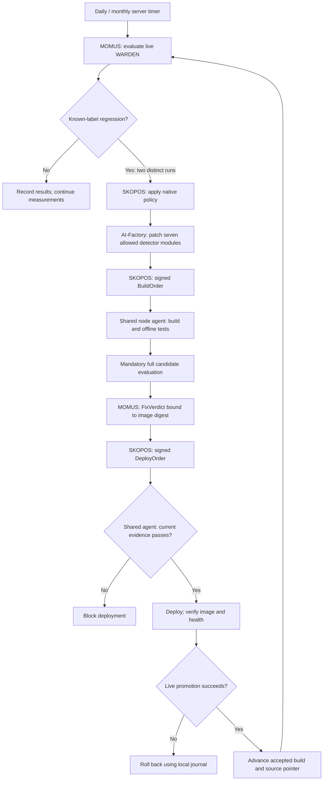
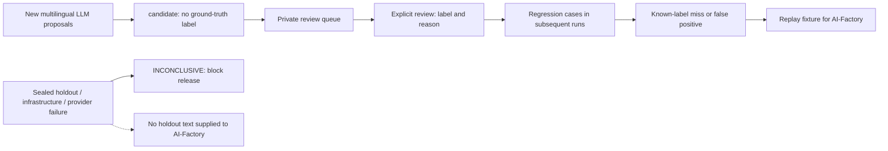

# Live WARDEN quality cycle

> 🌐 **English** · [Русский](quality-cycle.ru.md) · [Español](quality-cycle.es.md) · [Français](quality-cycle.fr.md) · [中文](quality-cycle.zh.md)

Terminology: [canonical EN/RU/ES/FR/ZH glossary](../../docs/localization-glossary.md).
Product names, paths, fields and signed protocol types retain their original spelling.

## Process and responsibilities

The native cycle is MOMUS → AI-Factory → SKOPOS → the existing shared node agent → deployment.
SKOPOS orchestrates the AI-Factory request as well as the signed orders; the AI-Factory authors the patch,
MOMUS measures it, and the shared agent builds and deploys it. There is no separate WARDEN agent,
Codex scheduled task or dependency on GitHub CI.

## Measurements and language coverage

The server performs measurements independently of a developer laptop. `admin-vps`
runs `momus-quality.service` daily and `momus-quality-full.service` monthly.
The daily run evaluates a rotating 256-case development sample, every sealed holdout
case, all confirmed regression cases and fresh LLM proposals. It also executes a
live decoy-read smoke test in each of the three package lifecycle phases, checking
the current observer and fixture digests. The monthly run replaces
the sample with the entire 8,606-case development corpus and executes all 72 behaviour
fixtures through the production observer's pinned, authenticated `/campaign-case` API.
The API accepts only a bounded seed and an index into built-in templates, shares the
normal sandbox slot locks and existing traps, and cannot accept arbitrary source or URLs.

The first holdout contains 48 newly authored synthetic examples (24 attacks and 24
ordinary tasks), frozen before measurement. Languages: English, French, Portuguese,
Italian, Indonesian and Polish. Its SHA-256 is
`e975df064e57ae195a0ab33967d7d70ab83fc1fdf555d5c837f15411a321089a`.
It shares no exact tool payload with the development corpus. It is kept only on the
trusted evaluator host, never supplied to the attack generator. This is a sequestered
synthetic test, not an independently collected natural-traffic benchmark or a native
speaker audit. Do not tune rules against its contents. If it must be investigated,
retire the exposed cases into development and commission a fresh sealed holdout.

## Evidence and release enforcement

State is under `/var/lib/momus-quality`. Configuration and the independent Ed25519
signing key are in `/etc/momus-quality` (root only). Existing DeepSeek and sandbox keys
are read from production containers into process memory; the worker writes no key files.
Node evaluation runs as `momus-quality`, without the signing key or sandbox token.
The accepted build and its measurements never advance merely because a new run finished.

The public signed quality receipt is
`https://histor.modelmarket.dev/security-quality/latest.json`.
It contains counts, timestamps and identities; a failure may additionally expose at most
eight bounded synthetic development/regression repair cases (24 KB total).
Sealed holdout text, credentials and raw provider responses remain private. WARDEN's `check:quality`, npm
`prepublishOnly` and HISTOR's deployment script verify the pinned public key,
exact JS build digest, a complete full evaluation within 35 days, a fresh daily
evaluation within 48 hours, both holdout labels, successful adversarial generation
and a complete successful gVisor campaign. Once the evaluator publishes `running`, the previous
green receipt is replaced and release stays blocked until success. Evaluation failures publish
`failed`. A launcher failure before publication creates no fresh receipt; an existing receipt
retains only its original validity, at most 48 hours. Missing data, signature failures, expiry and incomplete inspections
block release (fail-closed); none count as successful detections. The release gate does not claim
that static-only WARDEN achieves the semantic detector's results.

## Finding → regression → correction → acceptance

Known-label misses and false positives create replayable files in `regressions/` and
a per-run `remediation/` bundle. Every subsequent daily/full run includes these files.
New LLM proposals go to `review-queue/` with both their text and semantic decision;
they stay `candidate` until their meaning is explicitly reviewed. To review one,
use the existing `coverage_campaign review` command with its fingerprint, label and
an explanatory note, targeting `/var/lib/momus-quality/discovery`. Reviewed proposals
automatically enter subsequent live regression runs. Model guesses never supply
their own ground-truth label or silently become global deny rules.

MOMUS records a permanent replay fixture for each confirmed development regression.
The AI-Factory reads these fixtures and fixes the underlying detector behaviour. It must
not lower thresholds, remove cases, change labels to clear the gate or inspect the
sealed holdout to tune a fix. The deploy hand stages and evaluates its own image through the mandatory hook.
Do not copy a new build over the live evaluation directory: the candidate has a
separate state and signed receipt, and promotion happens only through SKOPOS.

No candidate or generated rule is automatically promoted by the measurement daemon.
The native MOMUS → AI-Factory → SKOPOS conductor → node agent → deployment loop owns
remediation. There is no Codex automation and no desktop dependency. Ambiguous LLM
proposals remain in the review queue; they do not create self-certified findings.

`QualityTarget` verifies the host signature and phase, and creates findings only
for established development cases. A repeated poll of one run does not increase
`seen_count`; the autopilot requires two independent evaluations. Infrastructure,
provider and sealed-holdout failures block release without exposing holdout text
to the AI-Factory. WARDEN is explicitly added to the host autopilot policy and scan rota.

The AI-Factory may edit only seven detector modules. It cannot edit the judge,
holdout, tests, keys, build recipe, conductor, or node agent. The existing shared host agent runs the WARDEN recipe
`warden/deploy/Dockerfile.histor`, the offline Node suite, then its mandatory
root-owned `/usr/local/sbin/skopos-warden-quality candidate IMAGE_SHA` hook. That
hook extracts the immutable image without starting it and runs the full campaign
in a separate state directory. Candidate evidence is served only at the exact
`/security-quality/candidate.json` location; live evidence stays separate.

MOMUS signs the candidate image digest into its FixVerdict. Immediately before
promotion, the shared agent also verifies the latest candidate receipt, preventing
replay of an older successful verdict after a newer failed evaluation. The deploy hand refuses
any other digest, and still requires its own build journal entry. After health
and image verification it runs the live hook, binds the report to the actual
running container and advances the accepted baseline. Failure triggers rollback;
the same hook restores the prior build and source pointer. Signed reports and
private promotion backups remain available for audit.

The next patch starts at the accepted commit from the host's read-only
`/warden-state/source.json`, rather than losing fixes that have not been merged
into the protected default branch. The hook updates the AI-Factory's read-only
source checkout and this pointer only after a verified live promotion. This does
not grant the conductor access to the protected default branch.

## Operations

| Schedule | Moscow time (UTC+3) | Unit |
|---|---|---|
| Daily | 06:23–06:33 | `momus-quality.timer` |
| Monthly, first day | 08:00–08:10 | `momus-quality-full.timer` |

The units specify UTC, add up to ten minutes of randomized delay and use `Persistent=true`
to catch up after downtime. Every candidate deployment also requires a full evaluation.

Use `systemctl list-timers 'momus-quality*'` and `journalctl -u momus-quality.service`.
Detailed reports and provider responses are private under `runs/RUN_ID`; provider
secrets are not logged. A provider outage leaves a failed receipt and all partial
evidence intact. Re-run the service after recovery; do not reuse partial rows as a
successful measurement. Calls are bounded: eight concurrent classifier requests,
eight tools per batch, one generation call requesting up to eight proposals per
daily round, and a maximum eight-hour service runtime.

**Paying once for one measurement.** A complete earlier measurement of byte-identical inputs is
reused instead of bought again: the same cases, the same WARDEN build (which carries the
classifier prompt) and — compared field for field by `coverage_semantic.mjs` against its own
identity — the same model, endpoint and protocol. Only for twelve hours: the scheduled daily run
is a day apart, so it always measures afresh and still notices a provider that changed the model
behind the same name, while a same-day repeat (a retry, a candidate whose WARDEN did not change)
costs nothing. A partial measurement is never reused, a row that did not finish is measured again,
and a report that reuses a measurement expires 48 hours after the original, not after the reuse.
For scale: a full corpus run is about 1,076 classifier calls (≈ 3.8 M input and 0.5 M output
tokens), a daily run about 45.

**A HISTOR deploy with the same WARDEN.** `scripts/deploy_histor.sh` ends with
`skopos-warden-quality rebind IMAGE`. When the new HISTOR image's vendored WARDEN is
byte-identical to the live binding and the live receipt for that build is fresh and passing, the
binding, the accepted source pointer and the daily schedule move to the new image with no
measurement at all. A changed WARDEN keeps the old binding — the next daily run refuses until the
full candidate evaluation has passed — and the deploy says so.

Installation: `deploy/install-quality.py` consumes a trusted extracted repository
slice, the frozen development corpus and a separately supplied holdout. It preserves
existing keys, corpora and accepted builds. Install the nginx exact-file location
from HISTOR's nginx configuration; never expose the entire state directory. First
run full acceptance, then enable both timers. To pause measurements, disable the
timers; the receipt expires and release remains blocked. Production scanning is a
separate service and continues. To roll back the observer endpoint, restore the
saved observer script and restart `histor-sandbox`; behaviour acceptance then fails
closed until the configured observer digest is deliberately reconciled.

The server uses the existing `skopos-deploy-hand.service` for `canary,warden`,
with `SKOPOS_COMPONENT_HOSTS` routing both components to `admin-vps`. The former
canary instance is disabled after migration; no `@warden` service is enabled.
Its existing build/rollback journal is retained. WARDEN is a host-local recipe
and allowlist entry, not a separate daemon. Other enrolled agents keep their
existing routing and configuration.

The conductor container has a passwd/group entry for uid/gid 10001: OpenSSH
requires a resolvable user before it can use its existing repository deploy key.
A successful import/health check alone does not prove Git transport; acceptance
checks both reading the accepted commit and pushing a branch under `momus/fix-`.

The shared host agent uses its existing virtual environment at
`/opt/skopos-deploy-hand/venv`; `dilithium-py==1.4.0` must be installed there
(the same version as MOMUS). Both Ed25519 and the present ML-DSA signature are
verified. A missing PQ backend is a deployment failure, never a reason to strip
the PQ fields or relax verification. Restart the agent after installing the
backend because the signing module detects it at import time.

## Production acceptance, 2026-10-10

The existing shared agent built, evaluated and deployed the enrolled WARDEN image
through the signed native protocol. The complete development corpus (8,606 cases),
sealed holdout (48 cases) and sandbox campaign (72 cases) passed without misses,
false positives or incomplete inspections. The first subsequent systemd daily run
also passed, and both timers are enabled. Evidence, image identities and the signed
daily receipt are in `native-quality-acceptance-20261010.json`.

This enrollment exercised real build, signature verification, release enforcement,
promotion and container health checks. It did not invent a production regression
or claim that the AI-Factory authored a detector fix during enrollment. Automatic
repair is configured to begin when a confirmed regression meets the native policy.

These are semantic-classifier results at `high`, with `deepseek-flash`, on synthetic
cases; they do not establish protection for every language or every real attack.
Meaning-based inspection avoids requiring a dictionary for each language, while frozen
control cases and reviewed multilingual proposals measure its limitations.

See the [acceptance artifact](native-quality-acceptance-20261010.json), the separate
[MOMUS → WARDEN threat-feed channel](warden-channel.md), and
[autonomous repair guards](autonomous-repair-guards.md).
