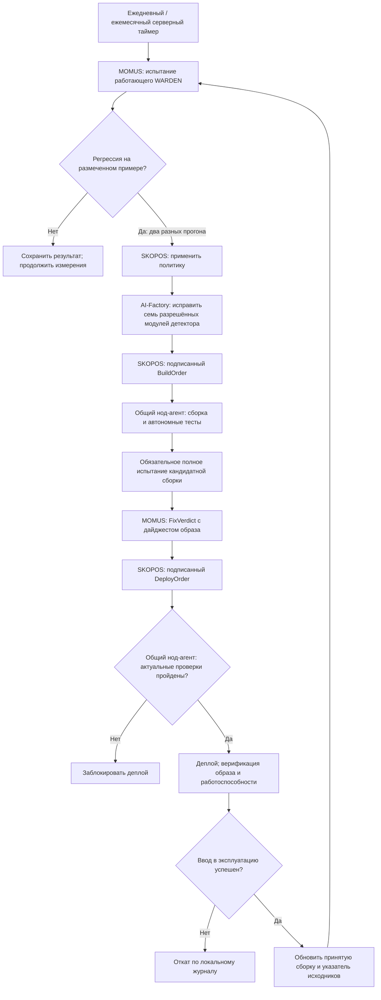
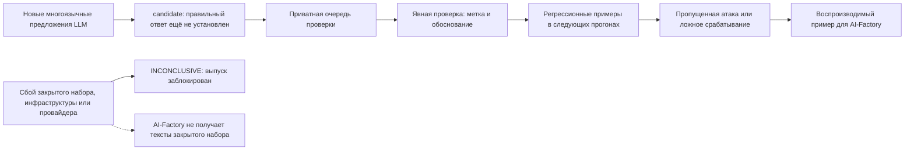

# Цикл контроля качества WARDEN

> 🌐 [English](quality-cycle.md) · **Русский** · [Español](quality-cycle.es.md) · [Français](quality-cycle.fr.md) · [中文](quality-cycle.zh.md)

Термины сверены с [общим глоссарием EN/RU/ES/FR/ZH](../../docs/localization-glossary.md).
Названия продуктов, пути, поля и типы подписанных документов сохраняют исходное написание.

## Процесс и ответственность

Цикл работает на сервере: MOMUS → AI-Factory → SKOPOS → существующий общий нод-агент → деплой.
SKOPOS организует обращение к AI-Factory и выдаёт подписанные приказы. AI-Factory пишет исправление,
MOMUS измеряет результат, общий нод-агент собирает и выполняет деплой. Отдельного агента WARDEN,
задачи Codex по расписанию и зависимости от GitHub CI нет.

## Измерения и языки

На `admin-vps` ежедневно запускается `momus-quality.service`, ежемесячно — `momus-quality-full.service`.
Ежедневный прогон включает сменяемую выборку из 256 примеров, весь закрытый отложенный набор,
все подтверждённые регрессии и новые предложения LLM. Он также проверяет чтение приманок
на каждой из трёх стадий жизненного цикла пакета и сверяет дайджесты наблюдателя и тестовых сценариев.
Ежемесячный прогон использует весь корпус из 8 606 примеров и 72 сценария поведения в gVisor.
API наблюдателя `/campaign-case` требует аутентификацию и закреплённый сертификат; принимает
ограниченный seed и индекс встроенного шаблона, использует общие блокировки слотов песочницы
и приманки. Передать произвольный код или URL через этот API нельзя.

Первый закрытый отложенный набор содержит 48 синтетических примеров: 24 атаки и 24 обычные задачи
на английском, французском, португальском, итальянском, индонезийском и польском. Он зафиксирован
до измерения, не содержит точных копий определений инструментов из рабочего корпуса и хранится
только на хосте оценки. Его SHA-256:
`e975df064e57ae195a0ab33967d7d70ab83fc1fdf555d5c837f15411a321089a`.
Генератор атак не получает этот набор. Это синтетический контроль, а не независимая выборка
реального трафика или аудит носителями языков. Подгонять правила под его содержимое нельзя.
Если примеры пришлось раскрыть для разбора, их переводят в рабочий корпус и готовят новый закрытый набор.

## Доказательства и гейт выпуска

Состояние хранится в `/var/lib/momus-quality`, конфигурация и отдельный ключ Ed25519 —
в `/etc/momus-quality`, доступном только root. Действующие ключи DeepSeek и песочницы читаются
из production-контейнеров в память процесса, без записи в файлы. Node-процесс оценки работает
от `momus-quality`, без ключа подписи и токена песочницы. Завершение измерения само по себе
не меняет принятую базовую версию.

Подписанная квитанция качества доступна по
`https://histor.modelmarket.dev/security-quality/latest.json`.
Она содержит счётчики, время и идентификаторы; при сбое может включать до восьми ограниченных
синтетических примеров исправления из рабочего корпуса или регрессий, суммарно до 24 КБ.
Тексты закрытого набора, секреты и сырые ответы провайдера остаются приватными.
`check:quality`, npm `prepublishOnly` и скрипт деплоя HISTOR верифицируют закреплённый публичный ключ,
дайджест конкретной JS-сборки, полный успешный прогон не старше 35 дней, ежедневный — не старше
48 часов, оба класса закрытого набора, успешную генерацию и полные проверки gVisor.
После публикации `running` прежняя успешная квитанция заменяется, и выпуск заблокирован до успеха.
Ошибка оценки публикует `failed`. Сбой запуска до публикации не создаёт новой квитанции;
прежняя сохраняет только исходный срок действия, максимум 48 часов. Отсутствие данных, неверная подпись,
истечение срока и незавершённые проверки блокируют выпуск: fail-closed (отказ по умолчанию).
Результаты классификатора не приписываются одному лишь статическому сканеру.

## Находка → регрессия → исправление → приёмка

Ошибки на размеченных примерах сохраняются в `regressions/` и в каталоге `remediation/` каждого
прогона; следующие испытания повторяют эти примеры. Новые предложения LLM с текстами и решениями
классификатора попадают в `review-queue/` и остаются `candidate`. Для явной проверки используется
`coverage_campaign review` с fingerprint, меткой и обоснованием для
`/var/lib/momus-quality/discovery`. Проверенные предложения включаются в следующие регрессионные
прогоны. Решение модели не становится собственной эталонной меткой или глобальным запретом.

MOMUS сохраняет воспроизводимый пример каждой подтверждённой регрессии. AI-Factory исправляет
детектор, но не снижает пороги, не удаляет примеры, не меняет метки ради прохождения проверок
и не читает закрытый набор для подгонки исправления. `QualityTarget` верифицирует подпись хоста
и фазу. Повторный опрос одного прогона не увеличивает `seen_count`: нужны два разных измерения.
Сбои инфраструктуры, провайдера и закрытого набора дают `INCONCLUSIVE`, блокируя выпуск
без передачи закрытых текстов в AI-Factory. WARDEN включён в политику и очередь сканирования автопилота.

AI-Factory может менять только семь модулей детектора, но не механизм оценки, тесты, ключи,
рецепт сборки, дирижёра SKOPOS или нод-агента. Общий нод-агент использует
`warden/deploy/Dockerfile.histor`, автономные Node-тесты и обязательный root-owned обработчик
`/usr/local/sbin/skopos-warden-quality candidate IMAGE_SHA`. Обработчик извлекает неизменяемый
образ без запуска и выполняет полное испытание в отдельном каталоге состояния.
Квитанция кандидатной сборки публикуется отдельно: `/security-quality/candidate.json`.
Копировать новую сборку поверх каталога действующей оценки нельзя; вводом в эксплуатацию управляет SKOPOS.

MOMUS подписывает дайджест кандидатного образа в `FixVerdict`. Непосредственно перед деплоем
общий нод-агент повторно верифицирует актуальную квитанцию: старый успешный вердикт не позволяет
обойти более новое неуспешное испытание. Требуются совпадение образа и запись в собственном
журнале сборки. После верификации работоспособности и фактического образа обработчик `live`
привязывает отчёт к работающему контейнеру и обновляет принятую базовую версию. Сбой вызывает откат;
тот же обработчик восстанавливает прежнюю сборку и указатель исходников. Подписанные отчёты
и приватные резервные копии сохраняются для аудита.

Следующее исправление начинается с принятого коммита из доступного только для чтения
`/warden-state/source.json`, сохраняя предыдущие исправления, ещё не слитые в основную ветку.
После успешного ввода обработчик обновляет указатель и доступную AI-Factory копию исходников.
Доступа к защищённой основной ветке это не даёт.

## Эксплуатация

| Расписание | Время Москвы (UTC+3) | Таймер |
|---|---|---|
| Ежедневно | 06:23–06:33 | `momus-quality.timer` |
| Ежемесячно, первого числа | 08:00–08:10 | `momus-quality-full.timer` |

В unit-файлах задан UTC и случайная задержка до десяти минут. `Persistent=true` обеспечивает
запуск пропущенного задания после простоя. Каждая кандидатная сборка перед деплоем также проходит полный прогон.
Состояние: `systemctl list-timers 'momus-quality*'`; журнал: `journalctl -u momus-quality.service`.
Подробные отчёты и ответы провайдера приватны в `runs/RUN_ID`; секреты не записываются в журнал.
После восстановления провайдера сервис запускают повторно, сохраняя результаты прерванного
испытания. Частичные результаты не считаются успешным измерением. Ограничения: восемь параллельных
запросов классификатора, восемь инструментов в пакете, один запрос генерации до восьми предложений
за ежедневный раунд и максимум восемь часов работы сервиса.

**Один замер — одна оплата.** Полный более ранний замер байт-в-байт тех же входов используется
повторно, а не покупается заново: те же случаи, та же сборка WARDEN (в ней же промпт
классификатора) и — это сверяет `coverage_semantic.mjs` со своей идентичностью поле за полем —
та же модель, адрес и протокол. Только двенадцать часов: плановый ежедневный прогон идёт через
сутки, поэтому всегда меряет заново и замечает поставщика, сменившего модель под тем же именем, а
повтор в тот же день (перезапуск, кандидат с неизменным WARDEN) ничего не стоит. Частичный замер
повторно не используется, незавершённая строка меряется снова, а отчёт на повторном замере истекает
через 48 часов после исходного замера, а не после повторного использования. Для масштаба: полный
прогон корпуса — около 1 076 вызовов классификатора (≈ 3,8 млн входных и 0,5 млн выходных токенов),
ежедневный — около 45.

**Деплой HISTOR с тем же WARDEN.** `scripts/deploy_histor.sh` заканчивается вызовом
`skopos-warden-quality rebind IMAGE`. Если WARDEN внутри нового образа HISTOR байт-в-байт совпадает
с живой привязкой, а живая квитанция для этой сборки свежая и успешная, привязка, указатель на
принятый исходник и ежедневное расписание переходят на новый образ вообще без замера. Изменённый
WARDEN оставляет старую привязку — следующий ежедневный прогон откажет, пока не пройдёт полная
кандидатная оценка, — и деплой об этом предупреждает.

`deploy/install-quality.py` принимает доверенную копию нужной части репозитория, зафиксированный
рабочий корпус и отдельно предоставленный закрытый набор; сохраняет существующие ключи, корпуса
и принятые сборки. В nginx публикуются только точные пути квитанций, а не весь каталог состояния.
Сначала выполняют полную приёмку, затем включают таймеры. Отключение таймеров приостанавливает
измерения; квитанция истечёт, выпуск будет заблокирован, а сканирование в production продолжится.
Для отката наблюдателя восстанавливают его сохранённый скрипт и перезапускают `histor-sandbox`;
гейт поведения остаётся закрытым до осознанного согласования дайджеста наблюдателя в конфигурации.

Существующий `skopos-deploy-hand.service` обслуживает `canary,warden`.
`SKOPOS_COMPONENT_HOSTS` направляет оба компонента на `admin-vps`. Прежний отдельный экземпляр
Canary отключён, `@warden` не включён. Журнал сборки и отката сохранён; WARDEN добавлен как рецепт
и элемент разрешённого списка. Маршрутизация остальных агентов не меняется.
В контейнере дирижёра есть записи passwd/group для uid/gid 10001, необходимые OpenSSH.
Приёмка проверяет чтение принятого коммита и отправку ветки `momus/fix-`, а не только health-check.

Общий нод-агент использует `/opt/skopos-deploy-hand/venv` с `dilithium-py==1.4.0`, как у MOMUS.
Верифицируются Ed25519 и присутствующая подпись ML-DSA. Отсутствие PQ-библиотеки блокирует деплой;
удалять поля подписи или ослаблять верификацию нельзя. После установки библиотеки агент перезапускают:
модуль подписи определяет её наличие при импорте.

## Приёмка на production, 2026-10-10

Общий нод-агент собрал, испытал и выполнил деплой образа по подписанному протоколу.
Рабочий корпус — 8 606 примеров, закрытый набор — 48, поведение — 72 сценария: без пропущенных
атак, ложных срабатываний и незавершённых проверок. Первый ежедневный systemd-прогон тоже
прошёл; оба таймера включены. [Артефакт приёмки](native-quality-acceptance-20261010.json)
содержит результаты, идентификаторы образов и подписанную ежедневную квитанцию.

Проверены реальные сборка, верификация подписей, гейт выпуска, деплой и работоспособность.
Регрессию на production не придумывали, и эта приёмка не доказывает, что AI-Factory уже написала
исправление детектора. Автоисправление подключено и начнётся при подтверждённой регрессии,
соответствующей политике.

Это результаты классификатора при `high` с `deepseek-flash` на синтетических примерах,
а не гарантия для любого языка или реальной атаки. Анализ смысла не требует словаря для каждого
языка; зафиксированные контрольные примеры и проверенные многоязычные предложения измеряют его ограничения.
См. также отдельный [канал угроз MOMUS → WARDEN](warden-channel.ru.md)
и [ограничения автоматического исправления](autonomous-repair-guards.ru.md).
