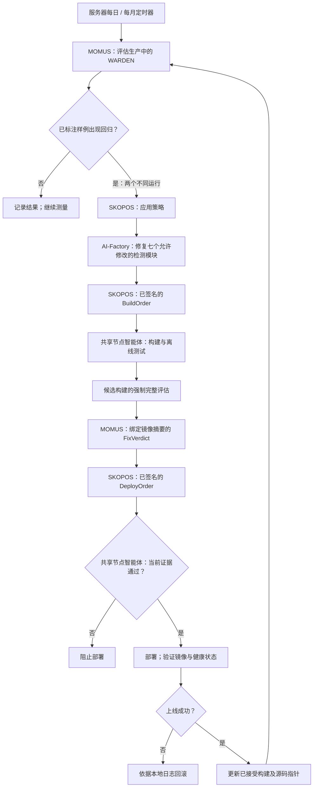
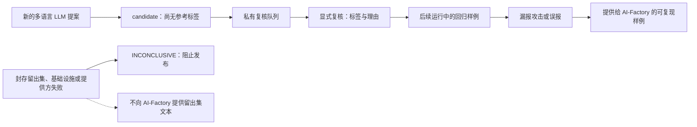

# WARDEN 质量检查周期

> 🌐 [English](quality-cycle.md) · [Русский](quality-cycle.ru.md) · [Español](quality-cycle.es.md) · [Français](quality-cycle.fr.md) · **中文**

术语遵循[统一 EN/RU/ES/FR/ZH 术语表](../../docs/localization-glossary.md)。产品名称、路径、字段和签名文档类型保留原文。

## 流程与职责

服务器上的流程为 MOMUS → AI-Factory → SKOPOS → 现有共享节点智能体 → 部署。
SKOPOS 负责协调 AI-Factory 请求和签名指令；AI-Factory 编写修复，MOMUS 测量结果，共享节点智能体负责构建和部署。
没有单独的 WARDEN 智能体，也没有 Codex 定时任务或对 GitHub CI 的依赖。

## 测量与语言覆盖

`admin-vps` 每日运行 `momus-quality.service`，每月运行 `momus-quality-full.service`。
每日评估包含轮换抽取的 256 个开发样例、整个封存留出集、全部已确认的回归以及新的 LLM 提案。
此外，还在软件包生命周期的三个阶段分别执行诱饵读取检查，并核对观测程序与测试场景的摘要。
每月评估使用全部 8 606 个开发样例，并通过 gVisor 执行 72 个行为场景。
观测 API `/campaign-case` 要求身份验证和固定证书，只接受有界种子与内置模板索引，
共用沙盒容量锁和诱饵，不接受任意源码或 URL。

首个封存留出集包含 48 个新编写的合成样例：24 个攻击和 24 个正常任务，涉及英语、法语、葡萄牙语、
意大利语、印度尼西亚语和波兰语。它在测量前冻结，与开发语料没有完全相同的工具定义，并仅存放在评估主机。
SHA-256 为 `e975df064e57ae195a0ab33967d7d70ab83fc1fdf555d5c837f15411a321089a`。
攻击生成器不会获得该集合。这是合成控制集，不是独立采集的真实流量基准或母语者审计。
禁止根据其内容调整规则。如果调查必须公开某些样例，应将这些样例转入开发语料，并准备新的封存留出集。

## 证据与发布闸门

状态保存在 `/var/lib/momus-quality`；配置与独立 Ed25519 签名密钥位于仅 root 可访问的 `/etc/momus-quality`。
现有 DeepSeek 和沙盒密钥从生产容器读取到进程内存，不写入新的密钥文件。
Node 评估进程以 `momus-quality` 用户运行，不持有签名密钥或沙盒令牌。一次测量结束并不会自动更新已接受的基线。

已签名的质量收据位于 `https://histor.modelmarket.dev/security-quality/latest.json`。
它包含计数、时间和身份标识；失败时还可能公开最多八个受限的合成开发或回归修复样例，总计不超过 24 KB。
封存留出集文本、凭据和提供方原始响应保持私有。
`check:quality`、npm `prepublishOnly` 和 HISTOR 部署脚本验证固定公钥、具体 JS 构建摘要、
35 天内成功完成的完整评估、48 小时内成功完成的每日评估、留出集的两类标签、成功的攻击生成以及完整的 gVisor 检查。
评估器发布 `running` 后会替换先前的成功收据，在评估成功前阻止发布；评估失败则发布 `failed`。
如果启动器在发布前失败，不会生成新收据；现有收据仅保留原有效期，最长 48 小时。缺少数据、签名错误、过期和检查未完成均会阻止发布：fail-closed（默认拒绝）。
分类器的结果不能归于仅使用静态扫描器的模式。

## 发现 → 回归 → 修复 → 验收

已标注样例的漏报或误报保存在 `regressions/` 以及各次运行的 `remediation/` 中，后续评估会重复执行。
新的 LLM 提案连同文本和分类器决定进入 `review-queue/`，标签保持为 `candidate`。
显式复核使用 `coverage_campaign review`，针对 `/var/lib/momus-quality/discovery` 提供 fingerprint、标签和理由。
经复核的提案会进入后续回归评估。模型的判断不会自行变成参考答案或全局阻止规则。

MOMUS 为每个已确认的回归保存可复现样例。AI-Factory 修复检测器，不得降低阈值、删除样例、
为通过测试而修改标签，或读取封存留出集来调整修复。`QualityTarget` 验证主机签名与阶段。
重复轮询同一次运行不会增加 `seen_count`，策略要求两次不同的测量。
基础设施、提供方或封存留出集失败产生 `INCONCLUSIVE`，阻止发布，但不会向 AI-Factory 泄露留出集文本。
WARDEN 已加入自动驾驶策略及扫描轮换列表。

AI-Factory 只能修改七个检测模块，不能修改评估机制、测试、密钥、构建配方、SKOPOS 指挥者或节点智能体。
共享节点智能体使用 `warden/deploy/Dockerfile.histor`、离线 Node 测试以及 root 所有的强制钩子
`/usr/local/sbin/skopos-warden-quality candidate IMAGE_SHA`。
该钩子从不可变镜像提取内容而不启动镜像，在独立状态目录中运行完整评估。
候选收据通过 `/security-quality/candidate.json` 单独发布，与生产收据分离。
禁止用新构建覆盖正在使用的评估目录；上线由 SKOPOS 控制。

MOMUS 将候选镜像摘要签入 `FixVerdict`。部署前，共享节点智能体再次验证当前候选收据，
防止在较新评估失败后重放较旧的成功结论。镜像必须一致，且必须存在本地构建日志记录。
验证实际镜像和健康状态后，`live` 钩子将报告绑定到运行中的容器，并更新已接受的基线。
失败会触发回滚；同一钩子恢复先前构建和源码指针。签名报告及私有备份保留用于审计。

下一次修复从只读 `/warden-state/source.json` 中的已接受提交开始，避免丢失尚未合并到受保护主分支的修复。
只有在上线验证成功后，钩子才更新该指针以及 AI-Factory 读取的源码副本；这不会授予受保护主分支的访问权限。

## 运维

| 频率 | 莫斯科时间（UTC+3） | 定时器 |
|---|---|---|
| 每日 | 06:23–06:33 | `momus-quality.timer` |
| 每月第一天 | 08:00–08:10 | `momus-quality-full.timer` |

unit 文件使用 UTC，附加最长十分钟的随机延迟，并通过 `Persistent=true` 在停机后补跑错过的任务。
每个候选部署还必须进行完整评估。
查看状态使用 `systemctl list-timers 'momus-quality*'`，查看日志使用 `journalctl -u momus-quality.service`。
详细报告和提供方响应私有保存在 `runs/RUN_ID`；日志不记录秘密。
提供方中断时保留失败收据和部分证据，恢复后重新运行服务；部分结果不能算作成功测量。
限制为八个并发分类请求、每批八个工具、每个每日轮次一次最多八个提案的生成请求，以及每次服务运行最长八小时。

**一次测量，只付一次费。** 对逐字节相同输入的完整早期测量会被复用，而不是再买一次：相同的用例、相同的 WARDEN 构建（其中包含分类器提示词），以及——由 `coverage_semantic.mjs` 与其自身身份逐字段比对——相同的模型、端点和协议。复用仅限十二小时：计划的每日运行相隔一天，因此总会重新测量，仍能发现提供方在同一名称下更换了模型；而同一天内的重复（重试、WARDEN 未变的候选）不产生费用。部分测量绝不复用，未完成的行会重新测量；复用测量的报告在原始测量后 48 小时过期，而不是在复用后。参考量级：一次完整语料运行约 1 076 次分类器调用（约 380 万输入令牌、50 万输出令牌），一次每日运行约 45 次。

**WARDEN 未变的 HISTOR 部署。** `scripts/deploy_histor.sh` 最后执行 `skopos-warden-quality rebind IMAGE`。如果新 HISTOR 镜像内置的 WARDEN 与线上绑定逐字节相同，且该构建的线上收据新鲜且通过，则绑定、已接受源码指针和每日计划会直接转到新镜像，不做任何测量。WARDEN 有变化时保留旧绑定——在完整候选评估通过之前，下一次每日运行会拒绝——部署也会给出提示。

`deploy/install-quality.py` 接收可信的必要仓库副本、冻结开发语料及单独提供的封存留出集，保留现有密钥、语料和已接受构建。
Nginx 只公开收据的精确路径，不公开整个状态目录。先完成完整验收，再启用两个定时器。
停用定时器会暂停测量；收据过期后发布仍被阻止，生产扫描继续运行。
回滚观测程序时，恢复其备份脚本并重启 `histor-sandbox`；在明确协调配置中的观测程序摘要之前，行为闸门保持关闭。

现有 `skopos-deploy-hand.service` 服务于 `canary,warden`；`SKOPOS_COMPONENT_HOSTS` 将两者路由至 `admin-vps`。
旧的独立 Canary 实例已停用，未启用 `@warden`。原构建和回滚日志得到保留。
WARDEN 是主机上的配方和允许列表条目；其他智能体的配置保持不变。
指挥者容器有 uid/gid 10001 的 passwd/group 条目，这是 OpenSSH 使用现有仓库部署密钥的前提。
验收会同时检查读取已接受提交以及推送 `momus/fix-` 分支，而不仅是健康检查。

共享节点智能体使用 `/opt/skopos-deploy-hand/venv`，安装与 MOMUS 相同的 `dilithium-py==1.4.0`。
Ed25519 和已有的 ML-DSA 签名都要验证。缺少 PQ 后端会导致部署失败，不能通过删除签名字段或放宽验证来绕过。
安装后必须重启智能体，因为签名模块在导入时检测后端。

## 生产验收：2026-10-10

共享智能体通过签名协议完成实际构建、评估和部署。8 606 个开发样例、48 个留出样例和 72 个行为场景均通过，
没有漏报攻击、误报或未完成检查。随后首次每日 systemd 运行也通过，两个定时器均已启用。
[验收文件](native-quality-acceptance-20261010.json)保存结果、镜像身份和已签名的每日收据。

此次验收实际执行了构建、签名验证、发布闸门、上线及容器健康检查，没有虚构生产回归，
也没有声称 AI-Factory 已在此次验收中编写检测器修复。自动修复将在已确认的回归满足策略时启动。

这些是分类器在 `high` 阈值、`deepseek-flash` 模型和合成样例上的结果，不代表能覆盖所有语言或所有真实攻击。
语义分析无需为每种语言维护词典；冻结控制样例和经复核的多语言提案用于测量其局限。
另见独立的 [MOMUS → WARDEN 威胁通道](warden-channel.zh.md)及[自主修复保护措施](autonomous-repair-guards.zh.md)。
