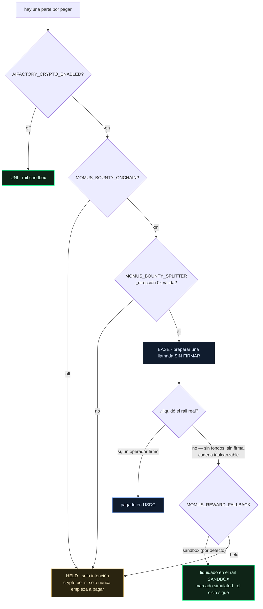

# El rail de recompensa — cómo se le paga a MOMUS, y por qué nunca deja de trabajar cuando no se le paga

> 🌐 [English](reward-rail.md) · [Русский](reward-rail.ru.md) · **Español** · [Français](reward-rail.fr.md) · [中文](reward-rail.zh.md)

MOMUS es un equipo rojo que audita la ecosistema de forma continua: encuentra, verificadores
independientes confirman, la Factory corrige, SKOPOS redespliega, y MOMUS vuelve a ejecutar su
propio hallazgo como puerta de despliegue. En algún punto de ese ciclo debe cobrar — buscador 50 %,
reparador 35 %, director 15 %.

Este documento responde una pregunta y defiende una regla.

**La pregunta:** ¿de dónde sale realmente ese pago — USDC en Base, u otra cosa?

**La regla:** *un sistema con crypto apagado nunca debe volverse menos seguro que uno con crypto
encendido.*

---

## La escalera

| Peldaño | Lo selecciona | Qué hace | `simulated` | Mueve valor |
|---|---|---|---|---|
| **UNI** (por defecto) | nada configurado, o `MOMUS_SETTLEMENT=uni` | Registra la parte contra la bóveda simulada y escribe una línea de diario | `true` | no |
| **HELD** | `MOMUS_SETTLEMENT=held`, o una config incompleta del rail real | Registra la parte **solo como intención** | `false` | no |
| **BASE** | crypto ON **y** opt-in de recompensa **y** una dirección de splitter bien formada | **Prepara** una llamada `releaseShare` sin firmar para el operador de la Treasury | `false` | solo cuando un humano firma |
| **SOLANA** | igual, con `MOMUS_BOUNTY_CHAIN=solana` | Entrega un descriptor al depósito en garantía de Solana existente | `false` | solo vía el operador |

Alcanzar un peldaño real exige tres interruptores separados, y **habilitar crypto deliberadamente no
basta**:



El segundo interruptor existe a propósito. Encender crypto para la ecosistema — canales, depósito en
garantía, la liquidación del propio hub — no debe empezar a pagar en silencio recompensas de equipo
rojo. Son decisiones distintas con riesgos distintos, así que tienen interruptores distintos.

## El respaldo: `MOMUS_REWARD_FALLBACK`

Un rail real se niega a liquidar por razones totalmente ordinarias: el fondo no tiene USDC, el
operador aún no ha firmado, el RPC está caído, la dirección se escribió mal. Antes de esta opción,
cada uno de esos casos dejaba la parte en **HELD** — y un operador mirando el diario veía un auditor
de seguridad que había dejado de cobrar en silencio.

`MOMUS_REWARD_FALLBACK=sandbox` — **el valor por defecto** — dice: cuando el rail real no puede
liquidar, liquida la parte en el rail sandbox. El registro es explícito sobre lo ocurrido:

```json
{
  "mode": "base",              // el peldaño que configuró el operador
  "rail": "sandbox",           // el rail que realmente la llevó
  "fallback_from": "base",     // por qué acabó ahí
  "settled": true,
  "simulated": true,
  "prepared_call": { "note": "UNSIGNED — the Treasury operator must sign and broadcast this call" }
}
```

La llamada sin firmar **sobrevive al respaldo**. A un operador que sí quiera pagar en USDC se le
sigue entregando exactamente la llamada que debe firmar; la parte sandbox no le quita esa opción.

`MOMUS_REWARD_FALLBACK=held` restaura la postura anterior para quien prefiera ver una parte detenida
antes que una simulada.

### Es un sustituto, no una deuda

La parte sandbox **no** es un pagaré canjeable por USDC más adelante, y nunca finge serlo. Nada en el
diario la trata como una obligación pendiente, y ninguna reconciliación la pagará dos veces.

Es una decisión deliberada, no un descuido. Una recompensa existe para que la economía de seguridad
*funcione, se observe y se audite*. Convertir un rail sin fondos en una deuda acumulable inventaría
un pasivo contra una tesorería que nadie financió, y pondría a MOMUS a llevar la contabilidad de
reclamaciones en lugar de encontrar fallos. Si un operador quiere pagos reales, el camino honesto es
habilitar el rail real **y financiarlo** — y entonces MOMUS prepara la llamada y un humano la firma.

## Por qué no es un Anvil

El instinto razonable es: *que los pagos de MOMUS corran en un Anvil local, y así nunca dependerá de
tokens reales.* MOMUS deliberadamente no hace eso, y la razón importa.

MOMUS **no tiene ningún cliente de cadena** — todo su conjunto de dependencias es
`aimarket-oracle-core` y `httpx`. No hay `web3`, ni `eth_account`, ni Foundry, ni un solo RPC en el
satélite. Darle un Anvil sería darle un proceso de cadena que tiene que estar *en marcha* — una
dependencia bloqueante completamente nueva, justo en el componente cuyo trabajo es seguir
funcionando cuando lo demás está roto. El instinto es correcto; el mecanismo lo derrotaría.

Así que el rail sandbox de MOMUS es un **libro de cuentas**, no una cadena: un saldo financiable,
consumible y capaz de negarse en `vault.py`, con un diario de solo-añadir donde cada línea explica su
significado. No necesita que nada esté levantado, y no puede volverse inalcanzable.

(Su hermano [DOLOS](https://github.com/alexar76/dolos) *sí* maneja un Anvil — porque DOLOS ataca
contratos EVM y necesita una EVM real que atacar. Otro trabajo, otra dependencia.)

## El invariante

> **Un sistema con crypto apagado nunca debe volverse menos seguro que uno con crypto encendido.**

No es una promesa, es una propiedad estructural, y se impone de dos formas.

**Estructuralmente.** La liquidación está estrictamente *aguas abajo* de la corrección, en otro
proceso. MOMUS — el escáner y la puerta de despliegue — no tiene bóveda, ni clave de la Treasury, ni
cliente de cadena. Los módulos de la ruta de seguridad (`a2a.py`, `security.py`, `findings.py`,
`engine/scanner.py`, `engine/verify.py`, `engine/cross_check.py`, `engine/remediation.py`,
`targets/*`) **no pueden importar** `settlement.py`, `vault.py`, `bounty.py` ni `budget.py`. Un
módulo que no puede importar un saldo no puede ser condicionado por uno.

**Conductualmente.** El mismo hallazgo se juzga igual en todos los rails. Un hallazgo bien verificado
pasa las puertas con crypto apagado, encendido-y-sin-fondos o encendido-y-financiado; uno mal
verificado se rechaza en todos. El dinero cambia *cómo* se paga una parte, nunca *si* pasaron las
puertas.

Ambas mitades están fijadas por `tests/test_settlement_rails.py` y fallarán si alguien las rompe.

### Por qué «dejar de auditar hasta que se pague» sería peligroso

Vale la pena enunciar la alternativa con claridad, porque suena responsable y no lo es.

Si un MOMUS sin pagar dejara de auditar, entonces **vaciar la tesorería se convertiría en un
ataque**. Cualquiera capaz de drenar, congelar o simplemente no recargar el fondo de recompensas
apagaría con ello el equipo rojo de la ecosistema — y el momento en que el presupuesto de seguridad
se agotara sería exactamente el momento en que el sistema dejaría de notar que lo están atacando.
Peor: ese fallo es silencioso. Nada está roto, nada alerta, los hallazgos simplemente dejan de
llegar, y un operador lee el silencio como «no hay problemas».

La postura de seguridad no debe tener una etiqueta de precio. Pagar en el rail sandbox mantiene el
ciclo en marcha, mantiene el registro honesto sobre lo que realmente se movió, y mantiene un problema
de financiación como un problema de financiación — en vez de dejar que se convierta en un incidente
de seguridad.

## Ajustes

| Variable | Por defecto | Valores | Qué hace |
|---|---|---|---|
| `AIFACTORY_CRYPTO_ENABLED` | `0` | `0` / `1` | Interruptor maestro de crypto de toda la ecosistema. Peldaño uno. |
| `MOMUS_BOUNTY_ONCHAIN` | `0` | `0` / `1` | Opt-in separado **solo** para los pagos de recompensas. Peldaño dos. |
| `MOMUS_SETTLEMENT` | *(sin definir)* | `uni` / `held` / `base` / `solana` / `onchain` | El peldaño solicitado. Nunca puede saltarse la escalera. |
| `MOMUS_BOUNTY_CHAIN` | `base` | `base` / `solana` | Qué cadena real, cuando se alcanza una. |
| `MOMUS_BOUNTY_SPLITTER` | *(sin definir)* | `0x…` (20 bytes) | El BountySplitter desplegado. Un valor mal formado ahora **falla cerrado** en vez de resolver a BASE. |
| `MOMUS_BOUNTY_TOKEN` | *(sin definir)* | `0x…` | El token de pago (USDC en Base). |
| **`MOMUS_REWARD_FALLBACK`** | **`sandbox`** | `sandbox` / `held` | Qué ocurre cuando un rail real no puede liquidar. |
| `MOMUS_UNI_VAULT_PATH` | *(sin definir)* | ruta | Opt-in a contabilidad real de saldo en el rail sandbox. |
| `MOMUS_UNI_LEDGER_PATH` | `$MOMUS_DATA_DIR/uni_settlements.jsonl` | ruta | Dónde se registran las liquidaciones sandbox. |

El endpoint de estado informa del rail resuelto para que nada de esto haya que inferirlo del código:

```json
{ "mode": "uni", "reward_fallback": "sandbox", "vault_attached": false,
  "moves_real_value": false, "gates_security": false }
```

`gates_security` es `false` y aparece en el payload a propósito: es el invariante, declarado donde un
operador puede verlo.

## Dos cosas que esto deliberadamente no hace

1. **Nunca difunde.** Incluso en un rail BASE completamente configurado, MOMUS prepara una llamada
   sin firmar y se detiene. Un agente capaz de difundir sus propios pagos derrotaría la separación de
   funciones que el despliegue de tres contenedores existe para imponer.
2. **No adjunta una bóveda por defecto.** Una bóveda nueva tiene $0.00 y niega toda liberación, así
   que adjuntarla sin condiciones convertiría «el ciclo siempre corre» en «nunca se paga nada» — el
   mismo bloqueo que este diseño existe para evitar. Define `MOMUS_UNI_VAULT_PATH` para activarla.

## Una trampa que conviene conocer

`BountySplitter` guarda claves `bytes32` **opacas** — no hashea nada por sí mismo, así que `fundPool`
y `releaseShare` solo coinciden si ambos lados derivan las claves igual. Su NatSpec documenta
`roleId` como `keccak256("finder")`, pero MOMUS deriva ambas claves con **sha256** (no tener keccak es
parte de no tener dependencia de cadena). Un operador que financiara el fondo según el NatSpec lo
indexaría bajo keccak, y la liberación revertiría con *«pool not funded»*.

La llamada preparada ahora lleva su propia derivación para que esto no muerda en silencio:

```json
"key_derivation": {
  "algorithm": "sha256",
  "findingId_preimage": "mom-1a639e402537…",
  "roleId_preimage": "finder",
  "note": "fundPool MUST use these exact keys; the contract stores opaque bytes32"
}
```

## Véase también

- [`uni-chain.es.md`](uni-chain.es.md) — toda la economía simulada, transacción por transacción
- [`autonomous-repair-guards.es.md`](autonomous-repair-guards.es.md) — qué *puede* detener una reparación (nada financiero)
- [`self-healing-operations.es.md`](self-healing-operations.es.md) — el ciclo MOMUS → SKOPOS → Factory
