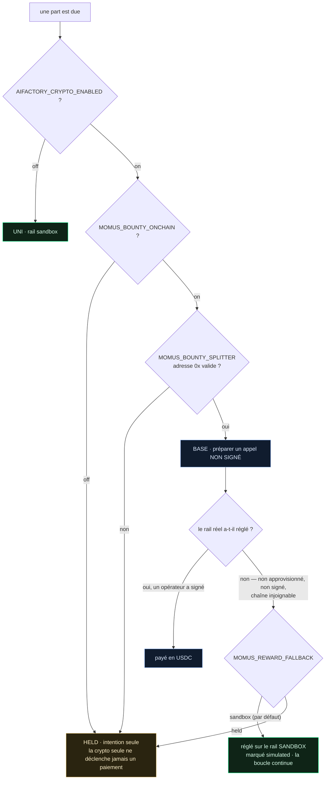

# Le rail de récompense — comment MOMUS est payé, et pourquoi il ne s'arrête jamais quand il ne l'est pas

> 🌐 [English](reward-rail.md) · [Русский](reward-rail.ru.md) · [Español](reward-rail.es.md) · **Français** · [中文](reward-rail.zh.md)

MOMUS est une équipe rouge qui audite l'écosystème en continu : il trouve, des vérificateurs
indépendants confirment, la Factory corrige, SKOPOS redéploie, et MOMUS rejoue son propre constat
comme porte de déploiement. Quelque part dans cette boucle, il est censé être payé — chercheur 50 %,
réparateur 35 %, chef d'orchestre 15 %.

Ce document répond à une question et défend une règle.

**La question :** d'où vient réellement ce paiement — de l'USDC sur Base, ou d'autre chose ?

**La règle :** *un système avec la crypto désactivée ne doit jamais devenir moins sûr qu'un système
avec la crypto activée.*

---

## L'échelle

| Échelon | Sélectionné par | Ce qu'il fait | `simulated` | Déplace de la valeur |
|---|---|---|---|---|
| **UNI** (par défaut) | rien de configuré, ou `MOMUS_SETTLEMENT=uni` | Inscrit la part contre le coffre simulé et écrit une ligne de journal | `true` | non |
| **HELD** | `MOMUS_SETTLEMENT=held`, ou une config de rail réel incomplète | Inscrit la part **comme simple intention** | `false` | non |
| **BASE** | crypto ON **et** opt-in prime **et** une adresse de splitter bien formée | **Prépare** un appel `releaseShare` non signé pour l'opérateur de la Treasury | `false` | seulement après signature humaine |
| **SOLANA** | idem avec `MOMUS_BOUNTY_CHAIN=solana` | Transmet un descripteur au séquestre Solana existant | `false` | seulement via l'opérateur |

Atteindre un échelon réel exige trois interrupteurs distincts, et **activer la crypto ne suffit
délibérément pas** :



Le second interrupteur existe exprès. Activer la crypto pour l'écosystème — canaux, séquestre, le
règlement du hub lui-même — ne doit pas se mettre silencieusement à payer aussi les primes de
l'équipe rouge. Ce sont des décisions distinctes aux risques distincts, donc des interrupteurs
distincts.

## Le repli : `MOMUS_REWARD_FALLBACK`

Un rail réel refuse de régler pour des raisons parfaitement ordinaires : la cagnotte ne contient pas
d'USDC, l'opérateur n'a pas encore signé, le RPC est tombé, l'adresse comporte une faute de frappe.
Avant ce réglage, chacun de ces cas laissait la part en **HELD** — et un opérateur consultant le
journal voyait un auditeur de sécurité qui avait discrètement cessé d'être payé.

`MOMUS_REWARD_FALLBACK=sandbox` — **la valeur par défaut** — dit : quand le rail réel ne peut pas
régler, règle la part sur le rail sandbox. L'enregistrement dit explicitement ce qui s'est passé :

```json
{
  "mode": "base",              // l'échelon configuré par l'opérateur
  "rail": "sandbox",           // le rail qui l'a réellement portée
  "fallback_from": "base",     // pourquoi elle a fini là
  "settled": true,
  "simulated": true,
  "prepared_call": { "note": "UNSIGNED — the Treasury operator must sign and broadcast this call" }
}
```

L'appel non signé **survit au repli**. Un opérateur qui veut vraiment payer en USDC reçoit toujours
exactement l'appel à signer ; la part sandbox ne lui retire pas cette possibilité.

`MOMUS_REWARD_FALLBACK=held` rétablit l'ancienne posture pour qui préfère voir une part bloquée
plutôt que simulée.

### C'est un substitut, pas une dette

La part sandbox **n'est pas** une reconnaissance de dette convertible en USDC plus tard, et elle ne
prétend jamais l'être. Rien dans le journal ne la traite comme une obligation en cours, et aucune
réconciliation ne la paiera deux fois.

C'est un choix délibéré, pas un oubli. Une prime existe pour que l'économie de la sécurité
*fonctionne, soit observable et auditable*. Transformer un rail non approvisionné en dette
accumulable inventerait un passif contre une trésorerie que personne n'a financée, et mettrait MOMUS
à tenir une comptabilité de créances au lieu de trouver des bugs. Si un opérateur veut de vrais
paiements, la voie honnête est d'activer le rail réel **et de l'approvisionner** — MOMUS prépare
alors l'appel et un humain le signe.

## Pourquoi ce n'est pas un Anvil

L'instinct raisonnable est : *faisons tourner les paiements de MOMUS sur un Anvil local, ainsi il ne
dépendra jamais de vrais jetons.* MOMUS ne le fait délibérément pas, et la raison compte.

MOMUS **n'a aucun client de chaîne** — tout son jeu de dépendances est `aimarket-oracle-core` et
`httpx`. Ni `web3`, ni `eth_account`, ni Foundry, ni un seul RPC dans le satellite. Lui donner un
Anvil, ce serait lui donner un processus de chaîne qui doit être *démarré* — une toute nouvelle
dépendance bloquante, précisément dans le composant dont le métier est de continuer à fonctionner
quand le reste est cassé. L'instinct est juste ; le mécanisme le trahirait.

Le rail sandbox de MOMUS est donc un **livre de comptes**, pas une chaîne : un solde
approvisionnable, ponctionnable et capable de refuser dans `vault.py`, avec un journal en
ajout-seul où chaque ligne explique son sens. Il n'a besoin de rien pour être en service, et il ne
peut pas devenir injoignable.

(Son frère [DOLOS](https://github.com/alexar76/dolos) pilote *bel et bien* un Anvil — parce que
DOLOS attaque des contrats EVM et lui faut une vraie EVM à attaquer. Autre métier, autre dépendance.)

## L'invariant

> **Un système avec la crypto désactivée ne doit jamais devenir moins sûr qu'un système avec la
> crypto activée.**

Ce n'est pas une promesse, c'est une propriété structurelle, et elle est garantie de deux façons.

**Structurellement.** Le règlement est strictement *en aval* de la correction, dans un autre
processus. MOMUS — le scanner et la porte de déploiement — ne détient ni coffre, ni clé de la
Treasury, ni client de chaîne. Les modules du chemin de sécurité (`a2a.py`, `security.py`,
`findings.py`, `engine/scanner.py`, `engine/verify.py`, `engine/cross_check.py`,
`engine/remediation.py`, `targets/*`) **ne peuvent pas importer** `settlement.py`, `vault.py`,
`bounty.py` ni `budget.py`. Un module qui ne peut pas importer un solde ne peut pas être conditionné
par un solde.

**Comportementalement.** Le même constat est jugé identiquement sur tous les rails. Un constat bien
vérifié franchit les portes que la crypto soit désactivée, activée-sans-fonds ou
activée-et-approvisionnée ; un constat mal vérifié est refusé sur tous. L'argent change *comment* une
part est payée, jamais *si* les portes ont été franchies.

Les deux moitiés sont figées par `tests/test_settlement_rails.py` et échoueront en cas de régression.

### Pourquoi « arrêter d'auditer jusqu'au paiement » serait dangereux

Il vaut la peine d'énoncer clairement l'alternative, car elle sonne responsable et ne l'est pas.

Si un MOMUS non payé cessait d'auditer, alors **vider la trésorerie deviendrait une attaque**.
Quiconque pourrait siphonner, geler ou simplement ne pas recharger la cagnotte éteindrait par là même
l'équipe rouge de l'écosystème — et le moment où le budget de sécurité s'épuiserait serait exactement
le moment où le système cesserait de remarquer qu'il est attaqué. Pire : cette défaillance est
silencieuse. Rien n'est cassé, rien n'alerte, les constats cessent simplement d'arriver, et un
opérateur lit ce silence comme « aucun problème ».

La posture de sécurité ne doit pas avoir d'étiquette de prix. Payer sur le rail sandbox garde la
boucle en marche, garde l'enregistrement honnête sur ce qui a réellement bougé, et garde un problème
de financement comme un problème de financement — au lieu de le laisser devenir un incident de
sécurité.

## Réglages

| Variable | Défaut | Valeurs | Rôle |
|---|---|---|---|
| `AIFACTORY_CRYPTO_ENABLED` | `0` | `0` / `1` | Interrupteur maître crypto de tout l'écosystème. Échelon un. |
| `MOMUS_BOUNTY_ONCHAIN` | `0` | `0` / `1` | Opt-in séparé **uniquement** pour les paiements de primes. Échelon deux. |
| `MOMUS_SETTLEMENT` | *(non défini)* | `uni` / `held` / `base` / `solana` / `onchain` | L'échelon demandé. Ne peut jamais franchir l'échelle. |
| `MOMUS_BOUNTY_CHAIN` | `base` | `base` / `solana` | Quelle chaîne réelle, lorsqu'on en atteint une. |
| `MOMUS_BOUNTY_SPLITTER` | *(non défini)* | `0x…` (20 octets) | Le BountySplitter déployé. Une valeur mal formée **échoue désormais fermé** au lieu de résoudre vers BASE. |
| `MOMUS_BOUNTY_TOKEN` | *(non défini)* | `0x…` | Le jeton de paiement (USDC sur Base). |
| **`MOMUS_REWARD_FALLBACK`** | **`sandbox`** | `sandbox` / `held` | Ce qui se passe quand un rail réel ne peut pas régler. |
| `MOMUS_UNI_VAULT_PATH` | *(non défini)* | chemin | Opt-in à une véritable comptabilité de solde sur le rail sandbox. |
| `MOMUS_UNI_LEDGER_PATH` | `$MOMUS_DATA_DIR/uni_settlements.jsonl` | chemin | Où les règlements sandbox sont journalisés. |

Le point de statut rapporte le rail résolu, pour que rien de tout cela n'ait à être déduit du code :

```json
{ "mode": "uni", "reward_fallback": "sandbox", "vault_attached": false,
  "moves_real_value": false, "gates_security": false }
```

`gates_security` vaut `false` et figure dans la charge utile exprès : c'est l'invariant, énoncé là où
un opérateur peut le voir.

## Deux choses que ceci ne fait délibérément pas

1. **Il ne diffuse jamais.** Même sur un rail BASE entièrement configuré, MOMUS prépare un appel non
   signé et s'arrête. Un agent capable de diffuser ses propres paiements ruinerait la séparation des
   tâches que le déploiement en trois conteneurs existe pour imposer.
2. **Il n'attache pas de coffre par défaut.** Un coffre neuf contient 0,00 $ et refuse toute
   libération ; l'attacher inconditionnellement transformerait « la boucle tourne toujours » en
   « rien n'est jamais payé » — précisément le blocage que ce design existe pour éviter. Définissez
   `MOMUS_UNI_VAULT_PATH` pour l'activer.

## Un piège à connaître

`BountySplitter` stocke des clés `bytes32` **opaques** — il ne hache rien lui-même, donc `fundPool`
et `releaseShare` ne concordent que si les deux côtés dérivent les clés de la même façon. Son NatSpec
documente `roleId` comme `keccak256("finder")`, mais MOMUS dérive les deux clés avec **sha256** (ne
pas avoir keccak fait partie du fait de ne pas avoir de dépendance de chaîne). Un opérateur
approvisionnant la cagnotte selon le NatSpec l'indexerait sous keccak, et la libération échouerait
avec *« pool not funded »*.

L'appel préparé porte désormais sa propre dérivation pour que cela ne morde pas en silence :

```json
"key_derivation": {
  "algorithm": "sha256",
  "findingId_preimage": "mom-1a639e402537…",
  "roleId_preimage": "finder",
  "note": "fundPool MUST use these exact keys; the contract stores opaque bytes32"
}
```

## Voir aussi

- [`uni-chain.fr.md`](uni-chain.fr.md) — toute l'économie simulée, transaction par transaction
- [`autonomous-repair-guards.fr.md`](autonomous-repair-guards.fr.md) — ce qui *peut* arrêter une réparation (rien de financier)
- [`self-healing-operations.fr.md`](self-healing-operations.fr.md) — la boucle MOMUS → SKOPOS → Factory
