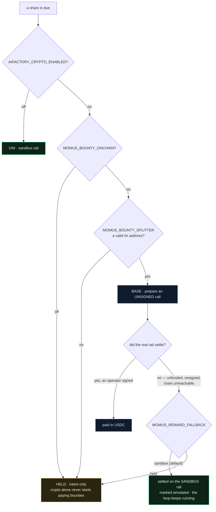

# The reward rail — how MOMUS gets paid, and why it never stops working when it isn't

> 🌐 **English** · [Русский](reward-rail.ru.md) · [Español](reward-rail.es.md) · [Français](reward-rail.fr.md) · [中文](reward-rail.zh.md)

MOMUS is a red team that audits the ecosystem continuously: it finds, independent verifiers confirm,
the Factory fixes, SKOPOS redeploys, and MOMUS re-tests its own finding as the deploy gate. Somewhere
in that loop it is supposed to be paid — finder 50%, fixer 35%, conductor 15%.

This document answers one question and defends one rule.

**The question:** where does that payment actually come from — USDC on Base, or something else?

**The rule:** *a system with crypto off must never become less secure than a system with crypto on.*

---

## The ladder

| Rung | Selected by | What it does | `simulated` | Moves value |
|---|---|---|---|---|
| **UNI** (default) | nothing configured, or `MOMUS_SETTLEMENT=uni` | Records the share against the simulated vault and writes a journal line | `true` | no |
| **HELD** | `MOMUS_SETTLEMENT=held`, or an incomplete real-rail config | Records the share as an **intent** only | `false` | no |
| **BASE** | crypto ON **and** bounty opt-in **and** a well-formed splitter address | **Prepares** an unsigned `releaseShare` call for the Treasury operator to sign | `false` | only once a human signs |
| **SOLANA** | as above with `MOMUS_BOUNTY_CHAIN=solana` | Hands off a descriptor to the existing Solana escrow | `false` | only via the operator |

Reaching a real rung takes three separate switches, and **enabling crypto is deliberately not
enough**:



The second switch exists on purpose. Turning crypto on for the ecosystem — channels, escrow, the
hub's own settlement — must not silently also start paying red-team bounties. Those are separate
decisions with separate risk, so they get separate switches.

## The fallback: `MOMUS_REWARD_FALLBACK`

A real rail declines to settle for entirely ordinary reasons: the pool holds no USDC, the operator
has not signed yet, the RPC is down, the address was mistyped. Before this setting existed, every
one of those left the share at **HELD** — and an operator watching the ledger saw a security auditor
that had quietly stopped being paid.

`MOMUS_REWARD_FALLBACK=sandbox` — **the default** — says: when the real rail cannot settle, settle
the share on the sandbox rail instead. The record is explicit about what happened:

```json
{
  "mode": "base",              // the tier the operator configured
  "rail": "sandbox",           // the rail that actually carried it
  "fallback_from": "base",     // why it ended up there
  "settled": true,
  "simulated": true,
  "prepared_call": { "note": "UNSIGNED — the Treasury operator must sign and broadcast this call" }
}
```

The unsigned call **survives the fallback**. An operator who does want to pay in USDC is still
handed exactly the call to sign; the sandbox share does not take that option away.

`MOMUS_REWARD_FALLBACK=held` restores the older stance for an operator who would rather see a share
stall than see a simulated one.

### It is a substitute, not a debt

The sandbox share is **not** an IOU redeemable in USDC later, and it never pretends to be. Nothing
in the ledger treats it as an outstanding obligation, and no reconciliation will pay it twice.

That is a deliberate choice, not an oversight. A bounty exists to make the security economy *run,
be observed and be audited*. Turning an unfunded rail into an accruing debt would invent a
liability against a treasury nobody funded, and would put MOMUS in the business of book-keeping
claims instead of finding bugs. If an operator wants real payouts, the honest path is to enable the
real rail **and fund it** — at which point MOMUS prepares the call and a human signs it.

## Why it is not an Anvil

A reasonable instinct is: *run MOMUS's payouts on a local Anvil, then it never depends on real
tokens.* MOMUS deliberately does not do this, and the reason matters.

MOMUS has **no chain client at all** — its entire dependency set is `aimarket-oracle-core` and
`httpx`. There is no `web3`, no `eth_account`, no Foundry, no RPC anywhere in the satellite. Giving
it an Anvil would mean giving it a chain process that has to be *running* — a brand-new blocking
dependency, in the one component whose whole job is to keep working when other things are broken.
The instinct is right; the mechanism would defeat it.

So MOMUS's sandbox rail is a **ledger**, not a chain: a funded, drawable, refusable balance in
`vault.py` with an append-only journal where every line says what it means. It needs nothing to be
up, and it cannot be unreachable.

(Its sibling [DOLOS](https://github.com/alexar76/dolos) *does* drive an Anvil — because DOLOS
attacks EVM contracts and needs a real EVM to attack. Different job, different dependency.)

## The invariant

> **A system with crypto off must never become less secure than one with crypto on.**

This is not a promise, it is a structural property, and it is enforced two ways.

**Structurally.** Settlement is strictly *downstream* of the fix, in a different process. MOMUS —
the scanner and the deploy gate — holds no vault, no treasury key and no chain client. The modules
on the security path (`a2a.py`, `security.py`, `findings.py`, `engine/scanner.py`, `engine/verify.py`,
`engine/cross_check.py`, `engine/remediation.py`, `targets/*`) **cannot import** `settlement.py`,
`vault.py`, `bounty.py` or `budget.py`. A module that cannot import a balance cannot be gated by one.

**Behaviourally.** The same finding is judged identically on every rail. A well-verified finding
clears the gates whether crypto is off, on-and-unfunded, or on-and-funded; an under-verified one is
refused on all of them. Money changes how a share is *paid*, never whether the gates *passed*.

Both halves are pinned by `tests/test_settlement_rails.py` and will fail if anyone regresses them.

### Why "stop auditing until paid" would be dangerous

It is worth stating the alternative plainly, because it sounds responsible and is not.

If an unpaid MOMUS stopped auditing, then **emptying the treasury would become an attack**. Anyone
who could drain, freeze or simply fail to top up the bounty pool would thereby switch off the
ecosystem's red team — and the moment the security budget ran dry would be the exact moment the
system stopped noticing it was being attacked. Worse, that failure is silent: nothing is broken,
nothing alerts, findings just stop arriving, and an operator reads the quiet as "no problems".

Security posture must not have a price tag attached to it. Paying on the sandbox rail keeps the
loop running, keeps the record honest about what actually moved, and keeps a funding problem a
funding problem — instead of letting it become a security incident.

## Settings

| Variable | Default | Values | What it does |
|---|---|---|---|
| `AIFACTORY_CRYPTO_ENABLED` | `0` | `0` / `1` | Ecosystem-wide crypto master switch. Rung one. |
| `MOMUS_BOUNTY_ONCHAIN` | `0` | `0` / `1` | Separate opt-in **just** for bounty payouts. Rung two. |
| `MOMUS_SETTLEMENT` | *(unset)* | `uni` / `held` / `base` / `solana` / `onchain` | The requested tier. Can never escalate past the ladder. |
| `MOMUS_BOUNTY_CHAIN` | `base` | `base` / `solana` | Which real chain, when one is reached. |
| `MOMUS_BOUNTY_SPLITTER` | *(unset)* | `0x…` (20 bytes) | The deployed BountySplitter. A malformed value now **fails closed** instead of resolving to BASE. |
| `MOMUS_BOUNTY_TOKEN` | *(unset)* | `0x…` | The payout token (USDC on Base). |
| **`MOMUS_REWARD_FALLBACK`** | **`sandbox`** | `sandbox` / `held` | What happens when a real rail cannot settle. |
| `MOMUS_UNI_VAULT_PATH` | *(unset)* | path | Opt into real balance accounting on the sandbox rail. |
| `MOMUS_UNI_LEDGER_PATH` | `$MOMUS_DATA_DIR/uni_settlements.jsonl` | path | Where sandbox settlements are journalled. |

The status endpoint reports the resolved rail so none of this has to be inferred from the source:

```json
{ "mode": "uni", "reward_fallback": "sandbox", "vault_attached": false,
  "moves_real_value": false, "gates_security": false }
```

`gates_security` is `false` and is stated in the payload on purpose: it is the invariant, asserted
where an operator can see it.

## Two things this deliberately does not do

1. **It never broadcasts.** Even on a fully configured BASE rail, MOMUS prepares an unsigned call
   and stops. An agent that could broadcast its own payouts would defeat the separation of duties
   the three-container deployment exists to enforce.
2. **It does not attach a vault by default.** A fresh vault holds $0.00 and refuses every release,
   so wiring one in unconditionally would turn "the loop always runs" into "nothing is ever paid" —
   the very stall this design exists to prevent. Set `MOMUS_UNI_VAULT_PATH` to opt in.

## A footgun worth knowing about

`BountySplitter` stores **opaque** `bytes32` keys — it hashes nothing itself, so `fundPool` and
`releaseShare` only agree if both sides derive the keys the same way. Its NatSpec documents
`roleId` as `keccak256("finder")`, but MOMUS derives both keys with **sha256** (holding no keccak is
part of having no chain dependency). An operator funding a pool by the NatSpec would key it under
keccak, and the release would revert with *"pool not funded"*.

The prepared call now carries its own derivation so this cannot bite silently:

```json
"key_derivation": {
  "algorithm": "sha256",
  "findingId_preimage": "mom-1a639e402537…",
  "roleId_preimage": "finder",
  "note": "fundPool MUST use these exact keys; the contract stores opaque bytes32"
}
```

## See also

- [`uni-chain.md`](uni-chain.md) — the full simulated economy, transaction by transaction
- [`autonomous-repair-guards.md`](autonomous-repair-guards.md) — what *can* stop a repair (none of it financial)
- [`self-healing-operations.md`](self-healing-operations.md) — the MOMUS → SKOPOS → Factory loop
