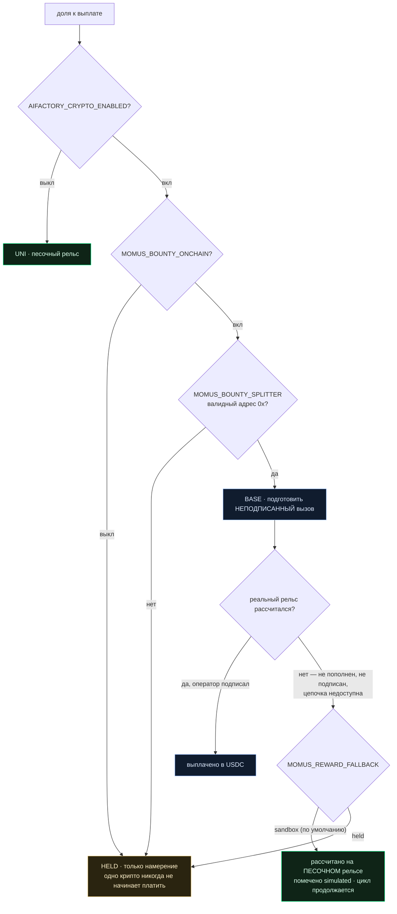

# Рельс вознаграждения — как MOMUS получает оплату и почему он не останавливается, когда её нет

> 🌐 [English](reward-rail.md) · **Русский** · [Español](reward-rail.es.md) · [Français](reward-rail.fr.md) · [中文](reward-rail.zh.md)

MOMUS — красная команда, которая непрерывно аудирует экосистему: он находит, независимые
верификаторы подтверждают, Factory исправляет, SKOPOS передеплоивает, а MOMUS повторно прогоняет
собственную находку в роли деплой-гейта. Где-то в этом цикле ему положено вознаграждение —
искатель 50 %, фиксер 35 %, дирижёр 15 %.

Этот документ отвечает на один вопрос и защищает одно правило.

**Вопрос:** откуда на самом деле берётся эта оплата — USDC на Base или что-то другое?

**Правило:** *система с выключенным крипто никогда не должна становиться менее безопасной, чем
система с включённым.*

---

## Лестница

| Ступень | Чем выбирается | Что делает | `simulated` | Двигает ценность |
|---|---|---|---|---|
| **UNI** (по умолчанию) | ничего не настроено или `MOMUS_SETTLEMENT=uni` | Записывает долю в симулированное хранилище и пишет строку журнала | `true` | нет |
| **HELD** | `MOMUS_SETTLEMENT=held` или неполная конфигурация реального рельса | Записывает долю **только как намерение** | `false` | нет |
| **BASE** | крипто ВКЛ **и** отдельный опт-ин **и** корректный адрес сплиттера | **Готовит** неподписанный вызов `releaseShare` для оператора Treasury | `false` | только после подписи человека |
| **SOLANA** | то же с `MOMUS_BOUNTY_CHAIN=solana` | Передаёт дескриптор существующему эскроу Solana | `false` | только через оператора |

Чтобы добраться до реальной ступени, нужны три отдельных переключателя, и **включения крипто
намеренно недостаточно**:



Второй переключатель существует не случайно. Включение крипто для экосистемы — каналы, эскроу,
собственный расчёт хаба — не должно молча начать выплачивать вознаграждения красной команде. Это
разные решения с разным риском, поэтому у них разные переключатели.

## Фолбэк: `MOMUS_REWARD_FALLBACK`

Реальный рельс отказывается рассчитаться по совершенно обыденным причинам: в пуле нет USDC,
оператор ещё не подписал, RPC недоступен, адрес набран с опечаткой. До появления этой настройки
каждый такой случай оставлял долю в **HELD** — и оператор, глядя в журнал, видел аудитора
безопасности, который тихо перестал получать оплату.

`MOMUS_REWARD_FALLBACK=sandbox` — **значение по умолчанию** — говорит: если реальный рельс не может
рассчитаться, рассчитай долю на песочном рельсе. Запись прямо говорит, что произошло:

```json
{
  "mode": "base",              // ступень, которую настроил оператор
  "rail": "sandbox",           // рельс, который её реально понёс
  "fallback_from": "base",     // почему она там оказалась
  "settled": true,
  "simulated": true,
  "prepared_call": { "note": "UNSIGNED — the Treasury operator must sign and broadcast this call" }
}
```

Неподписанный вызов **переживает фолбэк**. Оператору, который всё же хочет заплатить в USDC,
по-прежнему отдают ровно тот вызов, который надо подписать; песочная доля этой возможности не
отнимает.

`MOMUS_REWARD_FALLBACK=held` возвращает прежнее поведение для оператора, который предпочтёт увидеть
застрявшую долю, а не симулированную.

### Это замена, а не долг

Песочная доля — **не** расписка, которую потом можно обменять на USDC, и она этого не изображает.
Ничто в журнале не считает её непогашенным обязательством, и никакая сверка не выплатит её дважды.

Это осознанный выбор, а не недоработка. Вознаграждение существует, чтобы экономика безопасности
*работала, была наблюдаемой и поддавалась аудиту*. Превратить непополненный рельс в накапливающийся
долг означало бы выдумать обязательство против казначейства, которое никто не пополнял, и посадить
MOMUS за учёт требований вместо поиска багов. Если оператору нужны реальные выплаты — честный путь
включить реальный рельс **и пополнить его**, после чего MOMUS готовит вызов, а человек подписывает.

## Почему это не анвил

Разумный первый порыв: *пусть выплаты MOMUS идут на локальном анвиле, тогда он не зависит от
реальных токенов.* MOMUS намеренно так не делает, и причина важна.

У MOMUS **вообще нет клиента цепочки** — весь набор зависимостей это `aimarket-oracle-core` и
`httpx`. Ни `web3`, ни `eth_account`, ни Foundry, ни единого RPC во всём сателлите. Дать ему анвил
означало бы дать ему процесс цепочки, который должен быть *запущен* — совершенно новую блокирующую
зависимость, ровно в том компоненте, чья работа — продолжать работать, когда всё остальное сломано.
Порыв верный; механизм его же и разрушил бы.

Поэтому песочный рельс MOMUS — это **книга учёта**, а не цепочка: пополняемый, расходуемый,
способный отказать баланс в `vault.py` с append-only журналом, где каждая строка объясняет свой
смысл. Ему ничего не нужно, чтобы быть поднятым, и он не может стать недоступным.

(Его сосед [DOLOS](https://github.com/alexar76/dolos) анвилом *управляет* — потому что DOLOS
атакует EVM-контракты и ему нужна настоящая EVM для атаки. Другая работа, другая зависимость.)

## Инвариант

> **Система с выключенным крипто никогда не должна становиться менее безопасной, чем с включённым.**

Это не обещание, а структурное свойство, и оно обеспечивается двумя способами.

**Структурно.** Расчёт находится строго *ниже* исправления, в другом процессе. MOMUS — сканер и
деплой-гейт — не держит ни хранилища, ни ключа казначейства, ни клиента цепочки. Модули на пути
безопасности (`a2a.py`, `security.py`, `findings.py`, `engine/scanner.py`, `engine/verify.py`,
`engine/cross_check.py`, `engine/remediation.py`, `targets/*`) **не могут импортировать**
`settlement.py`, `vault.py`, `bounty.py` или `budget.py`. Модуль, который не может импортировать
баланс, не может быть им ограничен.

**Поведенчески.** Одна и та же находка судится одинаково на любом рельсе. Хорошо подтверждённая
находка проходит гейты, выключено крипто, включено-но-без-денег или включено-и-с-деньгами;
недостаточно подтверждённая отвергается на всех. Деньги меняют то, *как* доля оплачена, но никогда
то, *прошли* ли гейты.

Обе половины закреплены в `tests/test_settlement_rails.py` и упадут, если кто-то это сломает.

### Почему «перестать аудировать до оплаты» было бы опасно

Стоит проговорить альтернативу прямо, потому что она звучит ответственно, а таковой не является.

Если неоплаченный MOMUS перестанет аудировать, то **опустошение казначейства станет атакой**. Любой,
кто сможет вывести, заморозить или просто не пополнить призовой пул, тем самым выключит красную
команду экосистемы — и момент, когда бюджет безопасности иссякнет, будет ровно тем моментом, когда
система перестанет замечать, что её атакуют. Хуже того, этот отказ бесшумный: ничего не сломано,
ничто не алертит, находки просто перестают приходить, и оператор читает тишину как «проблем нет».

У уровня безопасности не должно быть ценника. Оплата на песочном рельсе сохраняет цикл рабочим,
сохраняет запись честной относительно того, что реально двигалось, и оставляет проблему пополнения
проблемой пополнения — вместо того чтобы позволить ей стать инцидентом безопасности.

## Настройки

| Переменная | По умолчанию | Значения | Что делает |
|---|---|---|---|
| `AIFACTORY_CRYPTO_ENABLED` | `0` | `0` / `1` | Общий для экосистемы главный переключатель крипто. Ступень один. |
| `MOMUS_BOUNTY_ONCHAIN` | `0` | `0` / `1` | Отдельный опт-ин **только** для выплат вознаграждений. Ступень два. |
| `MOMUS_SETTLEMENT` | *(не задано)* | `uni` / `held` / `base` / `solana` / `onchain` | Запрошенная ступень. Никогда не может перескочить лестницу. |
| `MOMUS_BOUNTY_CHAIN` | `base` | `base` / `solana` | Какая реальная цепочка, если до неё дошли. |
| `MOMUS_BOUNTY_SPLITTER` | *(не задано)* | `0x…` (20 байт) | Задеплоенный BountySplitter. Некорректное значение теперь **fail-closed**, а не резолвится в BASE. |
| `MOMUS_BOUNTY_TOKEN` | *(не задано)* | `0x…` | Токен выплаты (USDC на Base). |
| **`MOMUS_REWARD_FALLBACK`** | **`sandbox`** | `sandbox` / `held` | Что происходит, когда реальный рельс не может рассчитаться. |
| `MOMUS_UNI_VAULT_PATH` | *(не задано)* | путь | Опт-ин на реальный учёт баланса на песочном рельсе. |
| `MOMUS_UNI_LEDGER_PATH` | `$MOMUS_DATA_DIR/uni_settlements.jsonl` | путь | Куда журналируются песочные расчёты. |

Эндпоинт статуса сообщает разрешённый рельс, чтобы это не приходилось выводить из исходников:

```json
{ "mode": "uni", "reward_fallback": "sandbox", "vault_attached": false,
  "moves_real_value": false, "gates_security": false }
```

`gates_security` равен `false` и вынесен в payload намеренно: это тот самый инвариант, заявленный
там, где оператор может его увидеть.

## Две вещи, которых это намеренно не делает

1. **Никогда не бродкастит.** Даже на полностью настроенном рельсе BASE MOMUS готовит неподписанный
   вызов и останавливается. Агент, способный бродкастить собственные выплаты, разрушил бы то
   разделение обязанностей, ради которого существует деплой из трёх контейнеров.
2. **Не подключает хранилище по умолчанию.** Свежее хранилище содержит $0.00 и отказывает в каждой
   выплате, поэтому безусловное подключение превратило бы «цикл всегда работает» в «ничего никогда
   не платится» — ровно тот ступор, который этот дизайн и предотвращает. Задайте
   `MOMUS_UNI_VAULT_PATH`, чтобы включить учёт.

## Футган, о котором стоит знать

`BountySplitter` хранит **непрозрачные** ключи `bytes32` — сам он ничего не хеширует, поэтому
`fundPool` и `releaseShare` совпадут только если обе стороны выводят ключи одинаково. Его NatSpec
документирует `roleId` как `keccak256("finder")`, но MOMUS выводит оба ключа через **sha256**
(отсутствие keccak — часть отсутствия зависимости от цепочки). Оператор, пополнивший пул по NatSpec,
ключевал бы его через keccak, и выплата ревертнулась бы с *«pool not funded»*.

Подготовленный вызов теперь несёт собственный способ вывода ключей, чтобы это не сработало молча:

```json
"key_derivation": {
  "algorithm": "sha256",
  "findingId_preimage": "mom-1a639e402537…",
  "roleId_preimage": "finder",
  "note": "fundPool MUST use these exact keys; the contract stores opaque bytes32"
}
```

## Смотрите также

- [`uni-chain.ru.md`](uni-chain.ru.md) — вся симулированная экономика, транзакция за транзакцией
- [`autonomous-repair-guards.ru.md`](autonomous-repair-guards.ru.md) — что *может* остановить починку (ничего финансового)
- [`self-healing-operations.ru.md`](self-healing-operations.ru.md) — цикл MOMUS → SKOPOS → Factory
