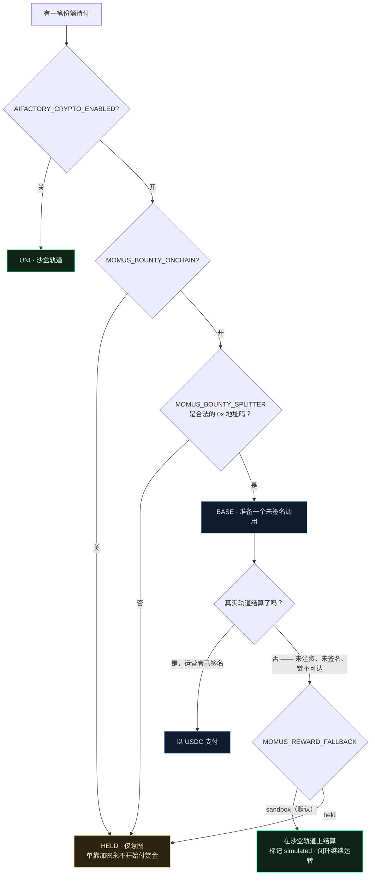

# 奖励轨道 —— MOMUS 如何拿到报酬，以及为什么拿不到时它也绝不停工

> 🌐 [English](reward-rail.md) · [Русский](reward-rail.ru.md) · [Español](reward-rail.es.md) · [Français](reward-rail.fr.md) · **中文**

MOMUS 是持续审计生态的红队：它发现问题，独立验证方予以证实，Factory 修复，SKOPOS 重新部署，而
MOMUS 再把自己那条发现重新跑一遍，充当部署闸门。在这个闭环里的某处，它应当获得报酬 —— 发现者
50%、修复者 35%、指挥者 15%。

本文回答一个问题，并捍卫一条规则。

**问题：** 这笔钱究竟从哪来 —— Base 上的 USDC，还是别的东西？

**规则：** *关闭加密的系统，绝不能比开启加密的系统更不安全。*

---

## 阶梯

| 台阶 | 由什么选中 | 做什么 | `simulated` | 是否转移价值 |
|---|---|---|---|---|
| **UNI**（默认） | 什么都没配置，或 `MOMUS_SETTLEMENT=uni` | 把份额记在模拟资金库上，并写入一行日志 | `true` | 否 |
| **HELD** | `MOMUS_SETTLEMENT=held`，或真实轨道配置不完整 | 把份额**仅记为意图** | `false` | 否 |
| **BASE** | 加密开启**且**赏金单独选入**且**splitter 地址格式正确 | 为 Treasury 运营者**准备**一个未签名的 `releaseShare` 调用 | `false` | 仅在人工签名后 |
| **SOLANA** | 同上，配 `MOMUS_BOUNTY_CHAIN=solana` | 把描述符交给已有的 Solana 托管 | `false` | 仅通过运营者 |

要抵达真实台阶需要三个彼此独立的开关，而且**仅仅开启加密是刻意不够的**：



第二个开关是有意为之。为生态开启加密 —— 通道、托管、枢纽自身的结算 —— 绝不应顺带悄悄开始支付红队
赏金。它们是风险不同的两个决定，因此各有自己的开关。

## 回退：`MOMUS_REWARD_FALLBACK`

真实轨道会因完全平常的原因拒绝结算：池子里没有 USDC、运营者还没签名、RPC 挂了、地址打错了。在这项
设置存在之前，上述每一种情况都会把份额留在 **HELD** —— 而查看日志的运营者，看到的是一个悄无声息地
不再拿到报酬的安全审计者。

`MOMUS_REWARD_FALLBACK=sandbox` —— **默认值** —— 的含义是：当真实轨道无法结算时，就把这笔份额结算
在沙盒轨道上。记录会明确说出发生了什么：

```json
{
  "mode": "base",              // 运营者配置的台阶
  "rail": "sandbox",           // 实际承载它的轨道
  "fallback_from": "base",     // 它为何落在这里
  "settled": true,
  "simulated": true,
  "prepared_call": { "note": "UNSIGNED — the Treasury operator must sign and broadcast this call" }
}
```

未签名的调用**在回退中存活下来**。真的想用 USDC 付款的运营者，仍然会拿到那个需要签名的调用；沙盒份额
并不剥夺这个选项。

`MOMUS_REWARD_FALLBACK=held` 为宁可看到份额停住、也不愿看到模拟份额的运营者恢复旧有立场。

### 这是替代，不是欠款

沙盒份额**不是**日后可兑换成 USDC 的欠条，它也从不假装是。日志中没有任何东西把它当作未清偿义务，也
没有任何对账会把它付第二遍。

这是刻意的选择，不是疏漏。赏金存在的意义，是让安全经济**运转起来、可被观察、可被审计**。把一条未注资
的轨道变成会累积的债务，等于对着一个无人注资的金库凭空发明一笔负债，并让 MOMUS 去做债权记账而不是找
漏洞。如果运营者想要真实支付，诚实的路径是启用真实轨道**并为它注资** —— 届时 MOMUS 准备调用，由人签名。

## 为什么它不是 Anvil

一个合理的直觉是：*让 MOMUS 的支付跑在本地 Anvil 上，这样它就永远不依赖真实代币。* MOMUS 刻意不这么
做，而原因很重要。

MOMUS **根本没有任何链客户端** —— 它的全部依赖就是 `aimarket-oracle-core` 和 `httpx`。整个卫星里没有
`web3`，没有 `eth_account`，没有 Foundry，也没有任何一个 RPC。给它一个 Anvil，就等于给它一个**必须处于
运行状态**的链进程 —— 一项全新的阻塞性依赖，而且恰好加在那个以「别人都坏了它还得继续干活」为职责的组件
上。直觉是对的；这个机制会把直觉本身摧毁。

所以 MOMUS 的沙盒轨道是一本**账**，而不是一条链：`vault.py` 里一个可注资、可支取、会拒付的余额，配一
份只追加的日志，每一行都解释自己的含义。它不需要任何东西处于运行状态，也不可能变得不可达。

（它的兄弟 [DOLOS](https://github.com/alexar76/dolos) **确实**驱动 Anvil —— 因为 DOLOS 攻击 EVM 合约，
需要一条真实的 EVM 来攻击。工作不同，依赖也不同。）

## 不变量

> **关闭加密的系统，绝不能比开启加密的系统更不安全。**

这不是一句承诺，而是一条结构性属性，并由两种方式共同保证。

**结构上。** 结算严格位于修复的**下游**，而且在另一个进程里。MOMUS —— 扫描器与部署闸门 —— 不持有资金
库、不持有 Treasury 密钥、不持有链客户端。安全路径上的模块（`a2a.py`、`security.py`、`findings.py`、
`engine/scanner.py`、`engine/verify.py`、`engine/cross_check.py`、`engine/remediation.py`、
`targets/*`）**无法 import** `settlement.py`、`vault.py`、`bounty.py` 或 `budget.py`。一个无法导入余额
的模块，也就无法被余额所门控。

**行为上。** 同一条发现在任何轨道上都被同样地裁定。一条充分验证过的发现，无论加密是关闭、开启但未注资、
还是开启且已注资，都能通过各道闸门；验证不足的那条，在所有轨道上都被拒绝。钱只改变份额**如何**被支付，
从不改变闸门**是否**通过。

两半都由 `tests/test_settlement_rails.py` 钉住，一旦有人回退就会失败。

### 为什么「不付钱就停止审计」会很危险

值得把这个替代方案直说出来，因为它听着负责，实则并非如此。

如果没拿到钱的 MOMUS 停止审计，那么**掏空金库就会变成一种攻击手段**。任何能够抽走、冻结，甚至只是不再
续拨赏金池的人，都会因此关掉生态的红队 —— 而安全预算枯竭的那一刻，恰恰就是系统不再察觉自己正被攻击的
那一刻。更糟的是，这种失效是无声的：什么都没坏，什么都不告警，发现只是不再送达，而运营者会把这份寂静读
成「没有问题」。

安全水位不应挂着价签。在沙盒轨道上支付，能让闭环继续运转，能让记录对「实际发生了什么位移」保持诚实，也
能让资金问题保持为资金问题 —— 而不是任其变成一次安全事故。

## 设置

| 变量 | 默认值 | 取值 | 作用 |
|---|---|---|---|
| `AIFACTORY_CRYPTO_ENABLED` | `0` | `0` / `1` | 全生态的加密总开关。第一级台阶。 |
| `MOMUS_BOUNTY_ONCHAIN` | `0` | `0` / `1` | **仅**针对赏金支付的单独选入。第二级台阶。 |
| `MOMUS_SETTLEMENT` | *(未设置)* | `uni` / `held` / `base` / `solana` / `onchain` | 请求的台阶。永远无法越过阶梯。 |
| `MOMUS_BOUNTY_CHAIN` | `base` | `base` / `solana` | 抵达真实轨道时用哪条链。 |
| `MOMUS_BOUNTY_SPLITTER` | *(未设置)* | `0x…`（20 字节） | 已部署的 BountySplitter。格式错误的值现在**默认拒绝**，而不再解析为 BASE。 |
| `MOMUS_BOUNTY_TOKEN` | *(未设置)* | `0x…` | 支付代币（Base 上的 USDC）。 |
| **`MOMUS_REWARD_FALLBACK`** | **`sandbox`** | `sandbox` / `held` | 真实轨道无法结算时会怎样。 |
| `MOMUS_UNI_VAULT_PATH` | *(未设置)* | 路径 | 选入沙盒轨道上的真实余额记账。 |
| `MOMUS_UNI_LEDGER_PATH` | `$MOMUS_DATA_DIR/uni_settlements.jsonl` | 路径 | 沙盒结算写入何处。 |

状态端点会报告解析出的轨道，这样这一切都不必从源码里去推断：

```json
{ "mode": "uni", "reward_fallback": "sandbox", "vault_attached": false,
  "moves_real_value": false, "gates_security": false }
```

`gates_security` 为 `false`，而且刻意出现在载荷里：这就是那条不变量，被写在运营者看得见的地方。

## 本设计刻意不做的两件事

1. **它从不广播。** 即便在一条完全配置好的 BASE 轨道上，MOMUS 也只准备一个未签名调用然后停下。一个能
   广播自己报酬的智能体，会摧毁三容器部署所要强制的职责分离。
2. **它不默认挂载资金库。** 新建的资金库余额为 $0.00，会拒绝每一笔放款；无条件挂上去会把「闭环始终运转」
   变成「永远没人拿到钱」—— 恰恰是本设计要避免的停滞。设置 `MOMUS_UNI_VAULT_PATH` 来选入。

## 一个值得知道的坑

`BountySplitter` 存储的是**不透明的** `bytes32` 键 —— 它自己什么都不哈希，所以只有两边以完全相同的方式
推导键，`fundPool` 与 `releaseShare` 才会对上。它的 NatSpec 把 `roleId` 记作 `keccak256("finder")`，但
MOMUS 用 **sha256** 推导两个键（不带 keccak，正是「不依赖链」的一部分）。若运营者按 NatSpec 去注资池子，
就会把它键在 keccak 之下，于是放款会以 *"pool not funded"* 回滚。

准备好的调用现在自带推导方式，好让这个坑无法无声地咬人：

```json
"key_derivation": {
  "algorithm": "sha256",
  "findingId_preimage": "mom-1a639e402537…",
  "roleId_preimage": "finder",
  "note": "fundPool MUST use these exact keys; the contract stores opaque bytes32"
}
```

## 参见

- [`uni-chain.zh.md`](uni-chain.zh.md) —— 完整的模拟经济，逐笔交易
- [`autonomous-repair-guards.zh.md`](autonomous-repair-guards.zh.md) —— 什么*确实*能拦住一次修复（没有一项是财务的）
- [`self-healing-operations.zh.md`](self-healing-operations.zh.md) —— MOMUS → SKOPOS → Factory 闭环
