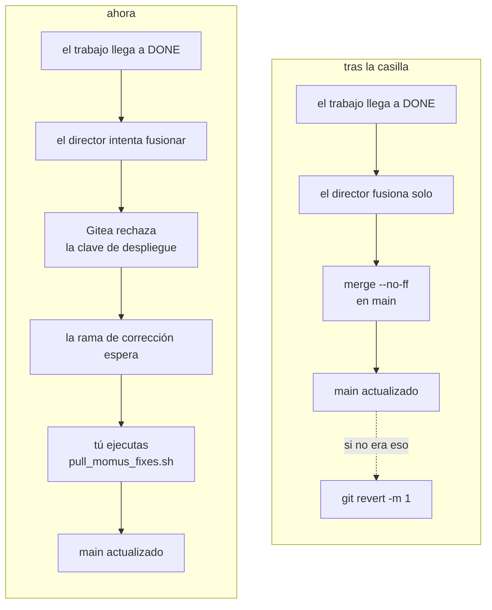
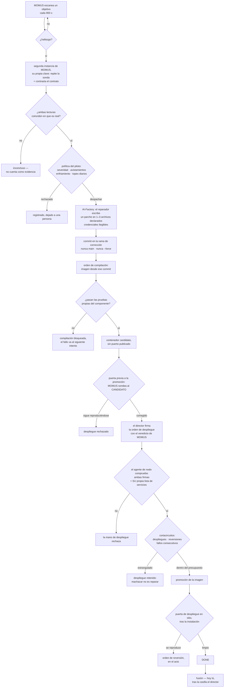

# Cambiar el bucle para que fusione en `main` por sí mismo

> 🌐 [English](switch-to-auto-merge.md) · [Русский](switch-to-auto-merge.ru.md) · **Español** · [Français](switch-to-auto-merge.fr.md) · [中文](switch-to-auto-merge.zh.md)

El código está hecho y activado. **Solo queda una casilla en Gitea.**

## Qué hacer

1. Gitea → el repositorio **`aicom`** → **Settings → Branches**
2. Abrir la regla de protección de **`main`**
3. Marcar **Whitelist Deploy Keys**
4. Guardar

La clave que quedará permitida —la del director, y solo ella:

```
SHA256:aiTxt4Fy0PAtQXx6f8eCt38EUswyeQmVbPHP2Y9DwJU
skopos-remediation-conductor@oracle-host
```

Ya está puesto en el director, ahí no hay nada que cambiar:

```
SKOPOS_EXPERIMENTAL_AUTO_MERGE=1
SKOPOS_DEFAULT_BRANCH=main
```

### Comprobar que surtió efecto

```bash
docker exec skopos-remediation python3 -c "
from skopos.remediation.git_push import GitPusher
p = GitPusher()
r = p.merge_to_main(finding_id='<un hallazgo que llegó a DONE>',
                    branch='momus/fix-<id>-<n>', component='praxis')
print(r.ok, r.error or r.details)"
```

`ok: True` significa que el cambio está vivo. `Not allowed to push to protected branch main`
significa que Gitea aún no se ha modificado.

## Qué cambia



Solo eso. Todo lo demás queda igual: la fusión sigue siendo `--no-ff`, sigue abortando ante un
conflicto, sigue sin forzar nunca, y solo corre para un trabajo que alcanzó `DONE`.

## Qué cuesta y cómo deshacerlo

| | |
|---|---|
| **Hoy** una clave robada del director puede | crear una rama de corrección que nadie fusiona |
| **Después** podrá | escribir en `main` — **solo de este repositorio** (una clave de despliegue es por repositorio) |
| **No uses** en su lugar un token de cuenta | los tokens de Gitea son de usuario: alcanzan todos los repositorios de esa cuenta |

Tres vías independientes de vuelta, basta cualquiera:

* desmarcar la casilla en Gitea;
* `SKOPOS_EXPERIMENTAL_AUTO_MERGE=0` en el director;
* `git revert -m 1 <commit>` —el comando está escrito en el propio mensaje del commit de fusión.

## Por qué esto es un interruptor aparte

El código del director rechaza `main` en todos los caminos menos uno, y ese rechazo es lo que
mantiene una credencial robada como una molestia y no como un incidente. La protección de rama de
Gitea es una **segunda política, independiente**, sobre lo mismo. Habilitar la fusión significa
decidir levantar la segunda —por eso es una casilla que marcas tú, no una variable que el bucle
pueda ponerse a sí mismo.

## Cómo funciona la reparación misma

Cada rombo es un punto de rechazo. Un paso que no puede responder se detiene y deja el trabajo a
una persona; nunca supone.



Dos hechos útiles mientras corre:

* **Los intentos 1 y 2 usan el reparador; el intento 3 usa el consejo de METIS** —la última
  barrera antes de que el trabajo pase a una persona
  (`AIFACTORY_REMEDIATION_COUNCIL_FROM_ATTEMPT=3`). Una deliberación cuesta unas 16 veces un
  intento normal; por eso va tercera y no primera.
* **Una reconstrucción desde `main` revierte la corrección en silencio** mientras la rama de
  corrección siga sin fusionar. Esa es la razón práctica para tomarse la casilla en serio en vez
  de dejar la rama en cola.

## Cerca de aquí

* [self-healing-operations.es.md](self-healing-operations.es.md) — claves, ajustes, qué se redespliega
* [autonomous-repair-guards.es.md](autonomous-repair-guards.es.md) — cada barrera y el incidente detrás
* [proving-the-loop.es.md](proving-the-loop.es.md) — el objetivo de práctica y los tres ejercicios verificados
