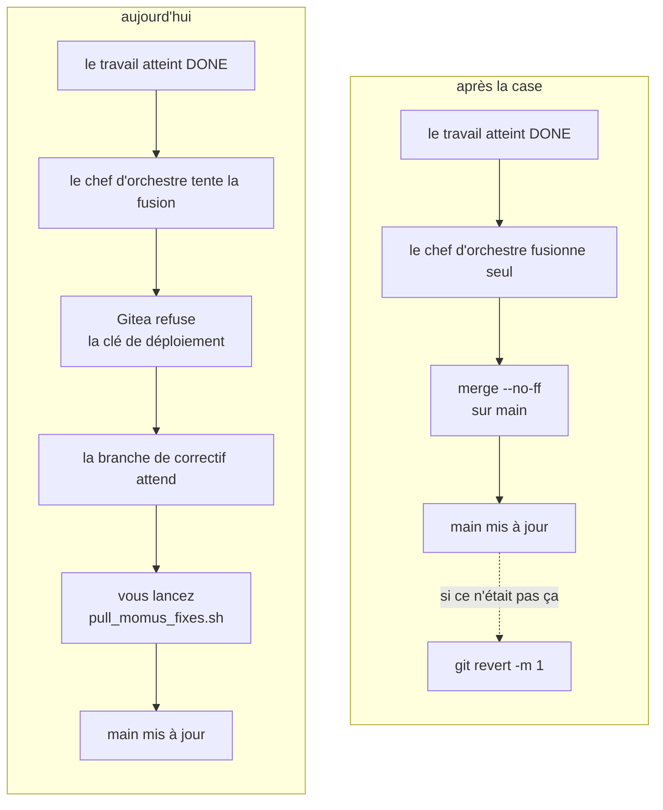
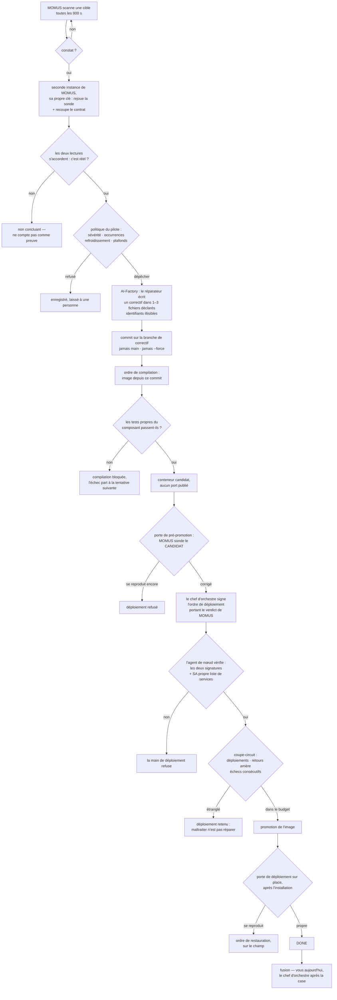

# Faire fusionner la boucle dans `main` d'elle-même

> 🌐 [English](switch-to-auto-merge.md) · [Русский](switch-to-auto-merge.ru.md) · [Español](switch-to-auto-merge.es.md) · **Français** · [中文](switch-to-auto-merge.zh.md)

Le code est fait et activé. **Il ne reste qu'une case à cocher dans Gitea.**

## Ce qu'il faut faire

1. Gitea → le dépôt **`aicom`** → **Settings → Branches**
2. Ouvrir la règle de protection de **`main`**
3. Cocher **Whitelist Deploy Keys**
4. Enregistrer

La clé qui sera alors autorisée — celle du chef d'orchestre, et elle seule :

```
SHA256:aiTxt4Fy0PAtQXx6f8eCt38EUswyeQmVbPHP2Y9DwJU
skopos-remediation-conductor@oracle-host
```

Déjà en place sur le chef d'orchestre, rien à changer là :

```
SKOPOS_EXPERIMENTAL_AUTO_MERGE=1
SKOPOS_DEFAULT_BRANCH=main
```

### Vérifier que cela a pris

```bash
docker exec skopos-remediation python3 -c "
from skopos.remediation.git_push import GitPusher
p = GitPusher()
r = p.merge_to_main(finding_id='<un constat parvenu à DONE>',
                    branch='momus/fix-<id>-<n>', component='praxis')
print(r.ok, r.error or r.details)"
```

`ok: True` signifie que le basculement est vivant. `Not allowed to push to protected branch main`
signifie que Gitea n'a pas encore été modifié.

## Ce qui change



Cela seulement. Tout le reste demeure : la fusion reste `--no-ff`, abandonne toujours en cas de
conflit, ne force jamais, et ne tourne que pour un travail parvenu à `DONE`.

## Ce que cela coûte, et comment le défaire

| | |
|---|---|
| **Aujourd'hui**, une clé volée du chef d'orchestre peut | créer une branche de correctif que personne ne fusionne |
| **Ensuite**, elle pourra | écrire sur `main` — **de ce dépôt uniquement** (une clé de déploiement est par dépôt) |
| **N'utilisez pas** un jeton de compte à la place | les jetons Gitea sont liés à l'utilisateur : ils atteignent tous les dépôts de ce compte |

Trois retours indépendants, n'importe lequel suffit :

* décocher la case dans Gitea ;
* `SKOPOS_EXPERIMENTAL_AUTO_MERGE=0` sur le chef d'orchestre ;
* `git revert -m 1 <commit>` — la commande est écrite dans le message du commit de fusion lui-même.

## Pourquoi c'est un interrupteur à part

Le code du chef d'orchestre refuse `main` sur tous les chemins sauf un, et ce refus est ce qui
maintient une crédential volée au rang de désagrément plutôt que d'incident. La protection de
branche de Gitea est une **seconde politique, indépendante**, sur la même chose. Autoriser la
fusion, c'est décider de lever la seconde — d'où une case que vous cochez, et non une variable que
la boucle pourrait se donner elle-même.

## Comment la réparation elle-même fonctionne

Chaque losange est un point de refus. Une étape qui ne peut pas répondre s'arrête et laisse le
travail à une personne ; elle ne devine jamais.



Deux faits utiles pendant que cela tourne :

* **Les tentatives 1 et 2 emploient le réparateur ; la tentative 3 emploie le conseil de METIS** —
  le dernier rempart avant que le travail passe à une personne
  (`AIFACTORY_REMEDIATION_COUNCIL_FROM_ATTEMPT=3`). Une délibération coûte environ 16 fois une
  tentative ordinaire, d'où sa troisième place et non la première.
* **Une reconstruction depuis `main` annule la correction en silence** tant que la branche de
  correctif n'est pas fusionnée. C'est la raison pratique de prendre la case au sérieux plutôt que
  de laisser la branche en file.

## À côté

* [self-healing-operations.fr.md](self-healing-operations.fr.md) — clés, réglages, ce qu'on redéploie
* [autonomous-repair-guards.fr.md](autonomous-repair-guards.fr.md) — chaque barrière et l'incident derrière
* [proving-the-loop.fr.md](proving-the-loop.fr.md) — la cible d'entraînement et les trois exercices vérifiés
