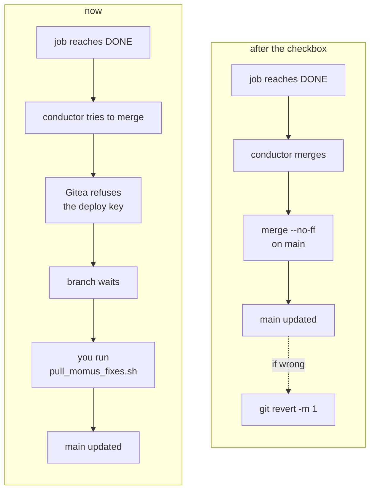
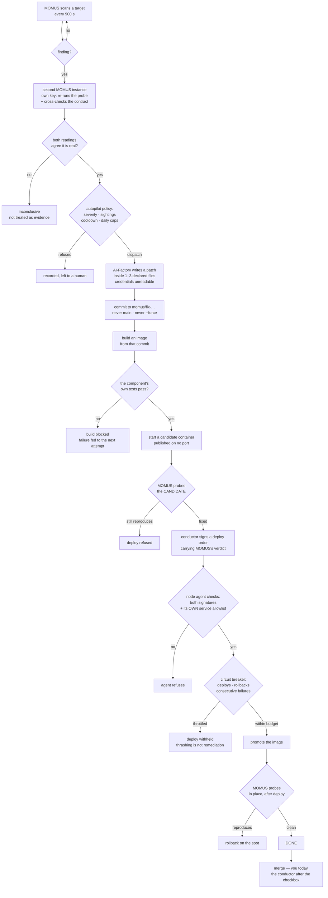

# Switching the loop to merge into `main` by itself

> 🌐 **English** · [Русский](switch-to-auto-merge.ru.md) · [Español](switch-to-auto-merge.es.md) · [Français](switch-to-auto-merge.fr.md) · [中文](switch-to-auto-merge.zh.md)

The code is done and enabled. **One checkbox in Gitea is all that is left.**

## What to do

1. Gitea → the **`aicom`** repository → **Settings → Branches**
2. Open the protection rule for **`main`**
3. Tick **Whitelist Deploy Keys**
4. Save

The key that will then be allowed — the conductor's, and only it:

```
SHA256:aiTxt4Fy0PAtQXx6f8eCt38EUswyeQmVbPHP2Y9DwJU
skopos-remediation-conductor@oracle-host
```

Already set on the conductor, nothing to change there:

```
SKOPOS_EXPERIMENTAL_AUTO_MERGE=1
SKOPOS_DEFAULT_BRANCH=main
```

### Check it took

```bash
docker exec skopos-remediation python3 -c "
from skopos.remediation.git_push import GitPusher
p = GitPusher()
r = p.merge_to_main(finding_id='<a finding that reached DONE>',
                    branch='momus/fix-<id>-<n>', component='praxis')
print(r.ok, r.error or r.details)"
```

`ok: True` means the switch is live. `Not allowed to push to protected branch main` means Gitea
has not been changed yet.

## What changes



Only that. Everything else stays: the merge is still `--no-ff`, still aborts on conflict, still
never forces, and still runs **only** for a job that reached `DONE`.

## What it costs, and how to undo it

| | |
|---|---|
| **Today** a stolen conductor key can | create a branch nobody merges |
| **After** it can | write to `main` — of **this repository only** (a deploy key is per-repository) |
| **Do not** use an account token instead | Gitea tokens are user-scoped: they reach every repository that account owns |

Three independent ways back, any one of them enough:

* untick the box in Gitea;
* `SKOPOS_EXPERIMENTAL_AUTO_MERGE=0` on the conductor;
* `git revert -m 1 <commit>` — the command is written into the merge commit's own message.

## Why this is a separate switch at all

The conductor's code refuses `main` on every path but one, and that refusal is what keeps a
stolen credential a nuisance rather than an incident. Gitea's branch protection is a **second,
independent** policy over the same thing. Enabling the merge means deciding to lift the second
one — so it is a checkbox you tick, not a variable the loop can set for itself.

## How the repair itself works

Every diamond is a refusal point. A step that cannot answer stops and leaves the job for a
person; it never guesses.



Two things worth knowing while it runs:

* **Attempts 1 and 2 use the plain fixer; attempt 3 uses the METIS council** — the last step
  before the job goes to a human (`AIFACTORY_REMEDIATION_COUNCIL_FROM_ATTEMPT=3`). A council
  deliberation costs about 16× a plain attempt, which is why it is third and not first.
* **A rebuild from `main` silently reverts a fix** for as long as the branch is unmerged. That is
  the practical reason to take the checkbox seriously rather than leaving the branch queued.

## Related

* [self-healing-operations.md](self-healing-operations.md) — keys, settings, what redeploys what
* [autonomous-repair-guards.md](autonomous-repair-guards.md) — every guard, and the incident behind it
* [proving-the-loop.md](proving-the-loop.md) — the practice target and the three verified drills
