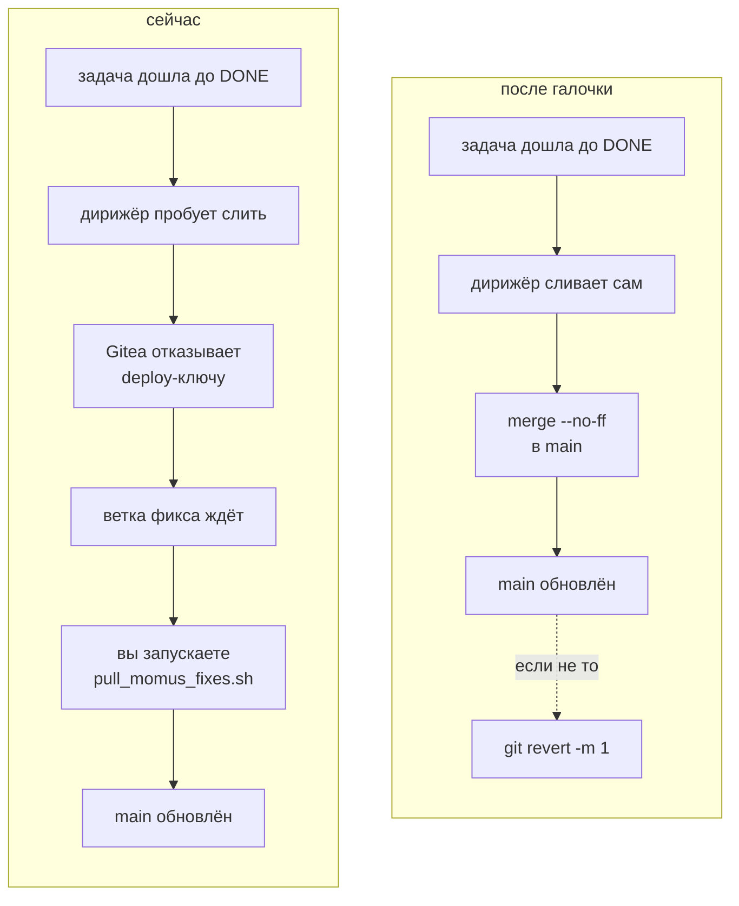
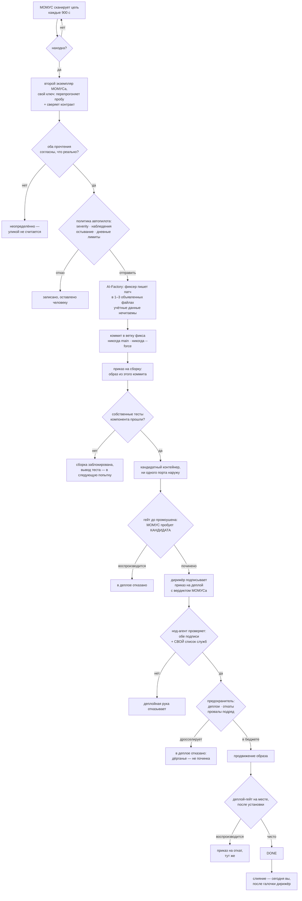

# Как переключить цикл на самостоятельное слияние в `main`

> 🌐 [English](switch-to-auto-merge.md) · **Русский** · [Español](switch-to-auto-merge.es.md) · [Français](switch-to-auto-merge.fr.md) · [中文](switch-to-auto-merge.zh.md)

Код готов и включён. **Осталась одна галочка в Gitea.**

## Что сделать

1. Gitea → репозиторий **`aicom`** → **Settings → Branches**
2. Открыть правило защиты для **`main`**
3. Поставить **Whitelist Deploy Keys**
4. Сохранить

Ключ, который после этого будет допущен, — дирижёра, и только он:

```
SHA256:aiTxt4Fy0PAtQXx6f8eCt38EUswyeQmVbPHP2Y9DwJU
skopos-remediation-conductor@oracle-host
```

На дирижёре уже стоит, менять там нечего:

```
SKOPOS_EXPERIMENTAL_AUTO_MERGE=1
SKOPOS_DEFAULT_BRANCH=main
```

### Проверить, что подействовало

```bash
docker exec skopos-remediation python3 -c "
from skopos.remediation.git_push import GitPusher
p = GitPusher()
r = p.merge_to_main(finding_id='<находка, дошедшая до DONE>',
                    branch='momus/fix-<id>-<n>', component='praxis')
print(r.ok, r.error or r.details)"
```

`ok: True` — переключение работает. `Not allowed to push to protected branch main` — Gitea ещё не
изменён.

## Что изменится



И только это. Всё остальное остаётся: слияние по-прежнему `--no-ff`, по-прежнему прерывается при
конфликте, по-прежнему никогда не форсирует и запускается **только** для задачи, дошедшей до
`DONE`.

## Чем это платится и как отменить

| | |
|---|---|
| **Сегодня** украденный ключ дирижёра может | создать ветку фикса, которую никто не сольёт |
| **После** сможет | писать в `main` — **только этого репозитория** (deploy-ключ действует на один) |
| **Не берите** вместо этого токен учётной записи | токены Gitea пользовательские: достают до всех репозиториев этой учётки |

Три независимых способа вернуть назад, достаточно любого:

* снять галочку в Gitea;
* `SKOPOS_EXPERIMENTAL_AUTO_MERGE=0` на дирижёре;
* `git revert -m 1 <коммит>` — команда записана в самом сообщении коммита слияния.

## Почему это отдельный переключатель

Код дирижёра отказывает `main` на всех путях, кроме одного, и именно этот отказ делает украденный
доступ неприятностью, а не инцидентом. Защита ветки в Gitea — **вторая, независимая** политика о
том же самом. Включить слияние — значит решить снять вторую, поэтому это галочка, которую ставите
вы, а не переменная, которую цикл может выставить себе сам.

## Как работает сама починка

Каждый ромб — точка отказа. Шаг, который не может ответить, останавливается и оставляет задачу
человеку; он никогда не догадывается.



Два факта, полезных по ходу:

* **Попытки 1 и 2 — фиксер, попытка 3 — совет МЕТИСа**: последний рубеж перед тем, как задача
  уйдёт человеку (`AIFACTORY_REMEDIATION_COUNCIL_FROM_ATTEMPT=3`). Одно совещание стоит примерно в
  16 раз дороже обычной попытки — поэтому он третий, а не первый.
* **Пересборка из `main` молча откатывает починку**, пока ветка фикса не слита. Это и есть
  практическая причина отнестись к галочке серьёзно, а не оставлять ветку в очереди.

## Рядом

* [self-healing-operations.ru.md](self-healing-operations.ru.md) — ключи, настройки, что передеплоивать
* [autonomous-repair-guards.ru.md](autonomous-repair-guards.ru.md) — все барьеры и инцидент за каждым
* [proving-the-loop.ru.md](proving-the-loop.ru.md) — тренировочная цель и три проверенных учения
