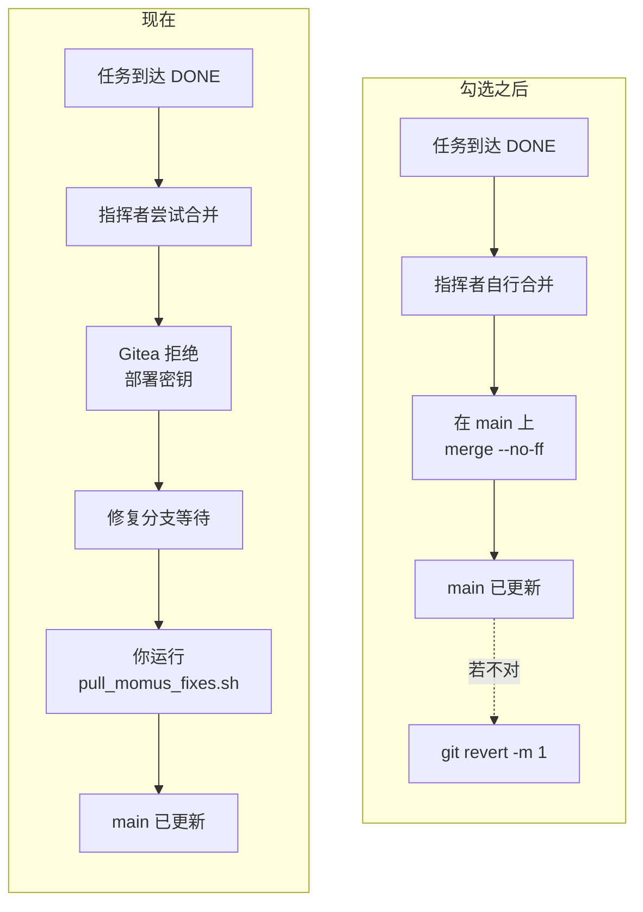
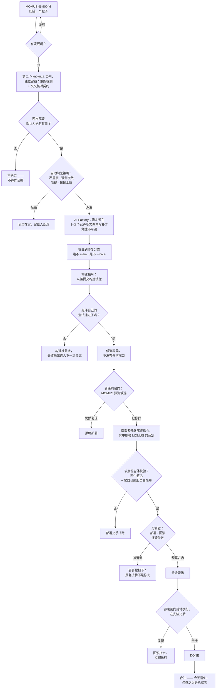

# 让闭环自己合并进 `main`

> 🌐 [English](switch-to-auto-merge.md) · [Русский](switch-to-auto-merge.ru.md) · [Español](switch-to-auto-merge.es.md) · [Français](switch-to-auto-merge.fr.md) · **中文**

代码已完成并已启用。**剩下的只有 Gitea 里的一个复选框。**

## 要做什么

1. Gitea → **`aicom`** 仓库 → **Settings → Branches**
2. 打开 **`main`** 的保护规则
3. 勾选 **Whitelist Deploy Keys**
4. 保存

之后被允许的那把密钥——指挥者的，且仅它一把：

```
SHA256:aiTxt4Fy0PAtQXx6f8eCt38EUswyeQmVbPHP2Y9DwJU
skopos-remediation-conductor@oracle-host
```

指挥者上已经配好，那边无需改动：

```
SKOPOS_EXPERIMENTAL_AUTO_MERGE=1
SKOPOS_DEFAULT_BRANCH=main
```

### 确认是否生效

```bash
docker exec skopos-remediation python3 -c "
from skopos.remediation.git_push import GitPusher
p = GitPusher()
r = p.merge_to_main(finding_id='<一个到达 DONE 的发现>',
                    branch='momus/fix-<id>-<n>', component='praxis')
print(r.ok, r.error or r.details)"
```

`ok: True` 表示切换已生效。`Not allowed to push to protected branch main` 表示 Gitea 还没改。

## 会改变什么



仅此而已。其余一切不变：合并仍是 `--no-ff`，遇冲突仍中止，仍绝不强推，且**只**对到达 `DONE` 的任务运行。

## 代价是什么，以及如何撤销

| | |
|---|---|
| **今天**被盗的指挥者密钥只能 | 创建一个没人合并的修复分支 |
| **之后**它就能 | 写入 `main`——**仅限本仓库**（部署密钥按仓库生效） |
| **不要**改用账户令牌 | Gitea 令牌是用户级的：会触及该账户拥有的所有仓库 |

三条彼此独立的退路，任一即可：

* 在 Gitea 里取消勾选；
* 指挥者上设 `SKOPOS_EXPERIMENTAL_AUTO_MERGE=0`；
* `git revert -m 1 <提交>` —— 该命令就写在合并提交自己的消息里。

## 为什么这是一个独立开关

指挥者的代码在除一条之外的所有路径上都拒绝 `main`，正是这道拒绝让被盗凭据成为麻烦而不是事故。
Gitea 的分支保护是针对同一件事的**第二道、独立的**策略。启用合并意味着决定解除第二道——因此它是
你去勾的复选框，而不是闭环能给自己设的变量。

## 修复本身如何运作

每个菱形都是一个拒绝点。无法作答的一步会停下并把任务留给人；它绝不猜测。



运行期间值得知道的两件事：

* **第 1、2 次尝试用修复者，第 3 次用 METIS 议会** —— 任务转交给人之前的最后一道
  （`AIFACTORY_REMEDIATION_COUNCIL_FROM_ATTEMPT=3`）。一次议会审议的花费约为一次普通尝试的 16 倍，
  所以它排第三而不是第一。
* **只要修复分支未合并，从 `main` 的重新构建就会静默回退修复。** 这正是应当认真对待那个复选框、
  而不是把分支留在队列里的实际原因。

## 相关

* [self-healing-operations.zh.md](self-healing-operations.zh.md) —— 密钥、配置、要重新部署什么
* [autonomous-repair-guards.zh.md](autonomous-repair-guards.zh.md) —— 每一道关卡及其背后的事故
* [proving-the-loop.zh.md](proving-the-loop.zh.md) —— 训练靶子与三次经过验证的演练
